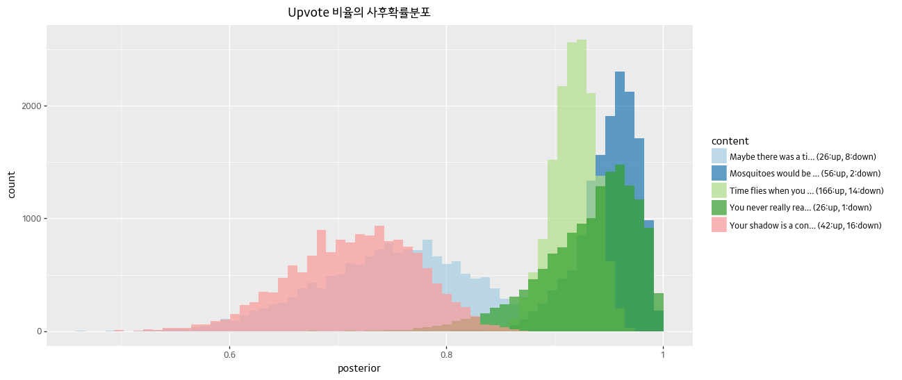

# ch4 예제: Reddit 코멘트 정렬하기 / 추려내기

**큰 수의 법칙**은 우리의 무의식적인 의사결정에 내재되어 있다. 온라인에서 제품을 평가할 때를 생각해보자. 만일 리뷰어가 한 명뿐인데 평점이 별 다섯 개라면 이를 얼마나 신뢰할 수 있을까? 우리는 리뷰어 수가 적으면 평점이 제품의 진정한 가치를 제대로 반영하지 못한다는 점을 암묵적으로 알고 있다.

이로 인해 우리가 각 항목들을 비교하는 방식에 결점이 생긴다. 책, 영화, 인터넷 상의 댓글 등을 보면 평점만으로 무엇인가를 분류하면 결과가 좋지않다는 것을 알 수 있다. 첫 페이지에 나타나는 항목들이 높은 평점을 받고 있지만, 실제로 높은 퀄리티를 가진 퀄리티는 그에 맞는 평점을 받지 못하고 묻히는 경우가 많다. 이러한 현상을 어떻게 바로잡을 수 있을까?

유명한 사이트인 레딧을 생각해보자. 레딧은 기본적으로 최고의 코멘트를 기준으로 정렬한다. 어떠한 기준으로 분류할 수 있을까?

1. 인기
   - upvote가 많을수록 좋은 코멘트로 평가한다
   - 하지만 upvote가 많은 경우 downvote도 많을 수 있다
2. 차이
   - upvote와 downvote의 차이를 이용한다
   - 가장 오래된 코멘트가 최고의 코멘트라고 편향되어 보여주게 된다
3. 시간 보정
   - 차이에 각 코멘트가 올라온 시점을 반영한다
4. 비율
   - 전체 투표수 중 upvote의 비율로 평가한다

우리가 최종적으로 원하는 것은 진짜 upvote 비율을 추정하는 것이다. 진짜 upvote 비율은 관측된 값과 다르며, 숨겨져 있다. 999 upvote vs 1 downvote 인 코멘트는 1에 가까운 진짜 upvote 비율을 가질 것이다. 우리는 큰 수의 법칙을 통해 전체 투표수가 많아질수록 확신할 수 있다.

upvote 비율에 대한 사전확률을 알아내기 위해 과거 upvote 비율의 분포를 확인해볼 수 있다. 다만 이 방법에는 몇 가지 문제점이 있다

1. Skewed Data
    - 대다수 코멘트는 투표수가 매우 적다. 따라서 극단적인 비율의 코멘트가 많을 것이다
    - 임의의 기준보다 많은 투표수를 가진 코멘트만 대상으로 할 수 있다. 이 경우 사용할 수 있는 데이터는 줄어든다
2. Biased Data
    - 레딧은 서브레딧이라고 부르는 여러 하위 페이지로 구성되어 있다. 각 서브레딧의 사용자 특성이 서로 다를 수 있다.
    
이러한 점을 고려하여 사전확률분포로는 균등분포를 사용하는 것이 낫다고 생각한다. 사전확률분포를 가지고 진짜 upvote 비율의 사후확률을 알아보자

## 데이터 가져오기

레딧에서 코멘트 일부를 크롤링하여 살펴보자


```python
# pip install praw
import praw
import numpy as np
```


```python
reddit = praw.Reddit(client_id='[client_id]',
                    client_secret='[client_secret]',
                    username='[username]',
                    user_agent='[user_agent]')
```


```python
subreddit  = reddit.subreddit("showerthoughts")
top_submissions = subreddit.hot(limit=100)
```


```python
i = 0
n_sub = 50

while i < n_sub:
    top_submission = next(top_submissions)
    i+=1

top_post = top_submission.title

upvotes = []
downvotes = []
contents = []

for sub in top_submissions:
    try:
        ratio = sub.upvote_ratio
        ups = int(round((ratio*sub.score)/(2*ratio - 1)) if ratio != 0.5 else round(sub.score/2))
        upvotes.append(sub.ups)
        downvotes.append(ups - sub.score)
        contents.append(sub.title)
    except Exception as e:
        raise e
        
votes = np.array( [ upvotes, downvotes] ).T
```


```python
votes[:5]
# array([[ 56,   2],
#        [166,  14],
#        [ 26,   1],
#        [ 42,  16],
#        [ 26,   8]])
```

```python
for i in range(0,5):
    print('"' + contents[i] + '"')
    print("upvotes/downvotes: ",votes[i,:], "\n")

# "Mosquitoes would be really impressed with themselves if they knew how much grief they actually cause our species."
#   upvotes/downvotes:  [56  2] 
    
#    "Time flies when you are having fun. But if you are frog, time is fun when you are having flies"
#    upvotes/downvotes:  [166  14] 
    
#    "You never really realize how much you appreciate silence until a baby starts crying"
#    upvotes/downvotes:  [26  1] 
    
#    "Your shadow is a confirmation that light has traveled nearly 93 million miles unobstructed, only to be deprived of reaching the ground in the final few feet thanks to you."
#    upvotes/downvotes:  [42 16] 
    
#    "Maybe there was a time we could talk to animals, but as our egos grew, they were like, naw, let’s just troll the humans by pretending not to understand."
#    upvotes/downvotes:  [26  8] 
```

    
    
## 진짜 upvote 비율의 사후확률

진짜 upvote 비율 p와 총 투표수 N이 주어졌을 때, upvote 수는 모수가 p, N인 이항분포처럼 보일 것이다. 

p에 대한 베이지안 추정을 수행하는 함수를 만들어보자


```python
import pymc3 as pm
import pandas as pd
from plotnine import *
```


```python
def posterior_upvote_ratio(upvotes, downvotes, samples=20000):
    '''
    - upvotes, downvotes: 특정 submission의 upvote, downvote 수
    - samples: 반환할 posterior sample의 개수
    
    이 함수는 Uniform Prior를 가정한다
    '''
    N = upvotes + downvotes
    with pm.Model() as model:
        upvote_ratio = pm.Uniform('upvote_ratio', 0, 1)
        observations = pm.Binomial('obs', N, upvote_ratio, observed=upvotes)
        
        trace = pm.sample(samples, step=pm.Metropolis())
    burned_trace = trace[int(samples/4):]
    return burned_trace['upvote_ratio']
```


```python
posteriors = []
for i in range(0, 5):
    result = dict(
        content = contents[i],
        posterior = posterior_upvote_ratio(votes[i,0], votes[i,1])
    )
    posteriors.append(result)
```


```python
list_df = []
for i, d in enumerate(posteriors):
    content = '{0}... ({1}:up, {2}:down)'.format(posteriors[i]['content'][:20], votes[i,0], votes[i,1])
    posterior = posteriors[i]['posterior']
    
    list_df.append(pd.DataFrame({'content': content, 'posterior': posterior}))

upvote_posterior_ratio = pd.concat(list_df)
```


```python
upvote_posterior_ratio.head()
```


<div>
<table border="1" class="dataframe">
  <thead>
    <tr style="text-align: right;">
      <th></th>
      <th>content</th>
      <th>posterior</th>
    </tr>
  </thead>
  <tbody>
    <tr>
      <th>0</th>
      <td>Mosquitoes would be ... (56:up, 2:down)</td>
      <td>0.974285</td>
    </tr>
    <tr>
      <th>1</th>
      <td>Mosquitoes would be ... (56:up, 2:down)</td>
      <td>0.974285</td>
    </tr>
    <tr>
      <th>2</th>
      <td>Mosquitoes would be ... (56:up, 2:down)</td>
      <td>0.974285</td>
    </tr>
    <tr>
      <th>3</th>
      <td>Mosquitoes would be ... (56:up, 2:down)</td>
      <td>0.949432</td>
    </tr>
    <tr>
      <th>4</th>
      <td>Mosquitoes would be ... (56:up, 2:down)</td>
      <td>0.952952</td>
    </tr>
  </tbody>
</table>
</div>


```python
(ggplot(upvote_posterior_ratio, aes(x='posterior', fill='content')) + 
    geom_histogram(alpha=0.7, position='identity') +
    scale_fill_brewer(type='qual', palette='Paired') +
    ggtitle('Upvote 비율의 사후확률분포') +
    theme_gray(base_family='Kakao') +
    theme(figure_size=(12, 6))
)
```




어떤 분포는 상대적으로 더 뾰족하고, 어떤 분포는 긴 꼬리를 가지고 있다. 이것은 진짜 upvote 비율에 대한 불확실성을 나타낸다.

## 코멘트 정렬하기

어떻게 코멘트를 최고에서 최악까지 정렬시킬 수 있을까? 분포를 가지고 정렬할 수는 없기 때문에, 우리는 스칼라값을 추출해야 한다. 분포를 스칼라값으로 변환하는 방법은 여러 가지가 있다. 평균을 통해 변환하는 것도 한 가지 방법이다. 하지만 평균은 분포의 불확실성을 고려하지 않는다.

여기서는 95% 최소가능값 (least plausible value)을 사용할 것을 제안한다. 95% 신용구간의 하한선을 생각해보자


```python
sorted_comment = (upvote_posterior_ratio
  .groupby('content', as_index=False)
  .agg({'posterior': lambda d: np.percentile(d, 5)})
  .rename(columns={'posterior': 'lpv'})
  .sort_values(by='lpv', ascending=False)
)
```


```python
sorted_comment
```


<div>
<table border="1" class="dataframe">
  <thead>
    <tr style="text-align: right;">
      <th></th>
      <th>content</th>
      <th>lpv</th>
    </tr>
  </thead>
  <tbody>
    <tr>
      <th>1</th>
      <td>Mosquitoes would be ... (56:up, 2:down)</td>
      <td>0.896364</td>
    </tr>
    <tr>
      <th>2</th>
      <td>Time flies when you ... (166:up, 14:down)</td>
      <td>0.881138</td>
    </tr>
    <tr>
      <th>3</th>
      <td>You never really rea... (26:up, 1:down)</td>
      <td>0.842098</td>
    </tr>
    <tr>
      <th>0</th>
      <td>Maybe there was a ti... (26:up, 8:down)</td>
      <td>0.625619</td>
    </tr>
    <tr>
      <th>4</th>
      <td>Your shadow is a con... (42:up, 16:down)</td>
      <td>0.616615</td>
    </tr>
  </tbody>
</table>
</div>


이 방법에 따르면 최고의 코멘트는 *높은 비율의 upvote를 기록할 가능성이 있는 코멘트*이다. 95%의 값을 근거로 추려내는 것이 왜 좋은 아이디어일까? 기준을 보수적으로 잡았기 때문에 가장 최악의 경우에도 여전히 최고의 코멘트일 것이라고 확신할 수 있다. 이러한 기준 하에 우리는 다음과 같은 자연적인 속성을 정의할 수 있다.

- 관측된 두 코멘트의 upvote 비율이 같다면, 투표수가 더 많은 코멘트를 더 좋다고 평가할 것이다
- 두 코멘트의 투표수가 같다면, upvote가 더 많은 코멘트를 더 좋다고 평가할 것이다
