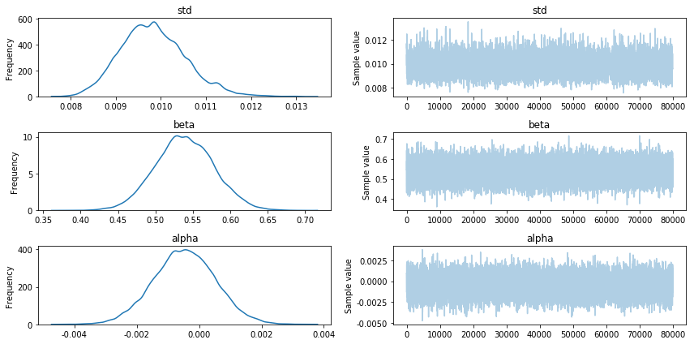

# 베이지안 방법을 통한 기계학습

빈도주의 방법이 가능한 모든 파라미터 중에서 가장 정확한 것을 얻으려고 한다면, 머신러닝은 가능한 모든 파라미터 중에서 가장 예측력이 좋은 결과를 얻으려고 한다. 때로는 우리가 예측해야 하는 것과 빈도주의 방법이 최적화하는 것이 서로 다를 수 있다.

예를 들면, 최소제곱 선형회귀 (least-square linear regression) 에서 회귀계수를 결정하는 손실함수는 제곱오차손실 (squared-error loss) 이다. 반면에 우리가 예측하려는 손실함수는 오차제곱이 아닐 경우, 최적의 예측 결과를 얻을 수 없게 된다.

베이즈 추정치를 찾는 것은 모수의 정확도를 높이는 파라미터를 찾는 것이 아니다. 성과를 측정하기 위한 임의의 지표가 있을 때, 이 지표를 최적화하고자 한다.

## 예제1: 금융예측

주식 가격의 미래수익률이 매우 작아서, 0.01 (1%) 정도라고 가정해보자. 제곱오차손실을 활용해 예측할 경우 부호를 무시하기 때문에, -0.01로 예측하는 것과 0.03으로 예측하는 것이 동일하게 나쁜 것으로 계산된다. 예측한 값과 실제 값의 부호를 고려한 손실함수를 구성할 수 없을까??


```python
from plotnine import *
import numpy as np
import pandas as pd

import matplotlib
# 음수(-) 표기시 폰트가 깨지는 문제 해결
matplotlib.rcParams['axes.unicode_minus'] = False
```


```python
def stock_loss(true_return, yhat, alpha=100):
    if true_return * yhat < 0:
        # true_return이 좋지 않으면 부호를 바꾼다
        return alpha*yhat**2 - np.sign(true_return)*yhat + abs(true_return)
    else:
        return abs(true_return - yhat)
```


```python
true_value = 0.05
pred = np.linspace(-0.04, 0.12, 75)

df_pred = pd.concat(
    [pd.DataFrame({'true_value': str(d), 
                   'pred': pred,
                   'loss': [stock_loss(d, _p) for _p in pred]}) 
     for d in [0.05, -0.02]])
```


```python
(ggplot(df_pred, aes(x='pred', y='loss', color='true_value')) +
 geom_line() +
 geom_vline(xintercept=0, linetype='--') +
 xlab('예측') + ylab('손실') +
 ylim(0, 0.25) +
 ggtitle('참값이 0.05 / -0.02 일 때 수익률 손실') +
 scale_x_continuous(breaks=[(x-2)/50 for x in range(0, 9)]) +
 theme_gray(base_family='Kakao') +
 theme(figure_size=(12,6))
)
```


예측곡선이 0인 지점을 통과할 때 손실곡선이 어떻게 지나는지 살펴보면, 잘못된 부호를 추측하거나 큰 폭으로 틀리는 것을 피하려 한다는 것을 알 수 있다. 금융기관은 하방위험과 상방위험을 비슷하게 다룬다. 따라서 참값에서 멀어질수록 큰 손실을 입게 된다.

인위적으로 생성한 데이터셋을 바탕으로 회귀분석을 진행해보자. 사실 우리가 생성한 데이터와 달리 대부분의 금융 데이터는 선형에 근접한 형태가 아니다.


```python
N = 100
X = 0.025 * np.random.randn(N)
Y = (0.5 * X) + (0.01 * np.random.randn(N))

ls_coef_ = np.cov(X, Y)[0,1] / np.var(X)
ls_intercept_ = Y.mean() - (ls_coef_ * X.mean())
```


```python
(pd.DataFrame({'x': X, 'y': Y})
 .pipe(lambda d, m: ggplot(data=d, mapping=m), aes(x='x', y='y')) +
 geom_point() +
 geom_abline(intercept=ls_intercept_, slope=ls_coef_, color='steelblue') +
 xlab('Trading Signal') + ylab('returns') +
 ggtitle('수익률 vs 매매신호 비교') +
 theme_gray(base_family='Kakao') +
 #theme(figure_size=(12,6))
 theme(figure_size=(12,6), plot_title=element_text(ha='left', x=0.13, size=15))
)
```


위 데이터셋에 대해 간단한 베이지안 선형회귀를 수행해보자. 모델은 다음과 같다.

```
R = alpha + beta*x + e
```

- alpha, beta : 미지의 모수
- e ~ Normal(0, 1/tau)
- tau = 1/(sigma^2) = 1 / Uniform(0, 100)^2


```python
import pymc3 as pm
```


```python
with pm.Model() as model:
    # sigma^2 = 1/tau 이기 때문에, sigma = Uniform(0, 100) 가 된다
    std = pm.Uniform('std', 0, 100)
    
    beta = pm.Normal('beta', mu=0, sd=100)
    alpha = pm.Normal('alpha', mu=0, sd=100)
    
    mean = pm.Deterministic('mean', alpha + beta*X)
    
    obs = pm.Normal('obs', mu=mean, sd=std, observed=Y)
    
    trace = pm.sample(100000, step=pm.Metropolis())
    burned_trace = trace[20000:]
```

MCMC가 잘 수행되었는지 살펴보자. 아래 그래프를 보면 샘플링 결과가 잘 수렴되었다는 것을 확인할 수 있다.


```python
%matplotlib inline
pm.plots.traceplot(trace=burned_trace, varnames=['std', 'beta', 'alpha'])
```





각 파라미터의 샘플링된 사후분포는 다음과 같다.


```python
pm.plot_posterior(trace=burned_trace, varnames=['std', 'beta', 'alpha'], kde_plot=True)
```


이제 특정 매매신호를 x라고 해보자. 수익률의 분포는 다음과 같다

```
R_i(x) = alpha_i + beta_i*x + e
```

- e ~ Normal(0, 1/tau_i)
- i는 사후분포의 인덱스를 의미한다

여러 매매신호에 대한 베이즈 추정치를 구해보자


```python
from scipy.optimize import fmin
```


```python
def stock_loss(price, pred, coef=500):
    sol = np.zeros_like(price)
    ix = price * pred < 0
    sol[ix] = coef * pred ** 2 - np.sign(price[ix]) * pred + abs(price[ix])
    sol[~ix] = abs(price[~ix] - pred)
    return sol
```


```python
std_samples = burned_trace['std']
alpha_samples = burned_trace['alpha']
beta_samples = burned_trace['beta']

N = std_samples.shape[0]

noise = std_samples * np.random.randn(N)

# 가능한 수익률의 분포: R_i(x) = alpha_i + beta_i*x + e
possible_outcomes = lambda signal: alpha_samples + beta_samples*signal + noise

opt_predictions = np.zeros(50)
trading_signals = np.linspace(X.min(), X.max(), 50)
for i, _signal in enumerate(trading_signals):
    _possible_outcomes = possible_outcomes(_signal)
    tomin = lambda pred: stock_loss(_possible_outcomes, pred).mean()
    opt_predictions[i] = fmin(tomin, 0, disp=False)
```


```python
(pd.DataFrame({'trading_signals': trading_signals, 'pred': opt_predictions})
 .assign(least_square = lambda d: ls_intercept_ + d['trading_signals']*ls_coef_)
 .rename(columns={'pred': 'bayes_action'})
 .melt(id_vars=['trading_signals'], var_name='type', value_name='pred')
 .pipe(lambda d,m: ggplot(data=d, mapping=m), aes(x='trading_signals', y='pred', color='type')) +
 geom_line() +
 xlab('Trading Signals') + ylab('Prediction') +
 ggtitle('예측 결과 비교: Least-Square VS Bayes Action') +
 theme_gray(base_family='Kakao') +
 theme(figure_size=(12,6), plot_title=element_text(x=0.1, ha='left'))
)
```


위 그래프에서 흥미로운 점은 매매신호가 0 근처에 있고 수익률이 양수와 음수를 넘나들 가능성이 높을 때 0에 가까운 예측을 한다는 것이다. 다시 말하자면 **선택하지 않는다**. 이런 방식의 모델을 보통 **희소예측 (sparse prediction)** 이라고 부른다. 불확실성이 뭔가 불편할 경우에는 아무것도 하지 않는 것을 선택할 수 있다.

최소제곱을 이용하는 경우 0으로 예측하는 일은 거의 없다. 반면, 베이즈 추정을 통해 예측하는 경우 수익률의 부호에 대해 우리가 확신을 가지기 전까지는 특정한 포지션을 취하지 않는다. 

희소예측 모델은 우리가 위에서 `stock_loss`로 정의한 손실의 관점에서 최선의 예측을 찾으려 한다. 최소제곱 모델은 제곱오차손실의 관점에서 최선의 예측을 찾는다.
