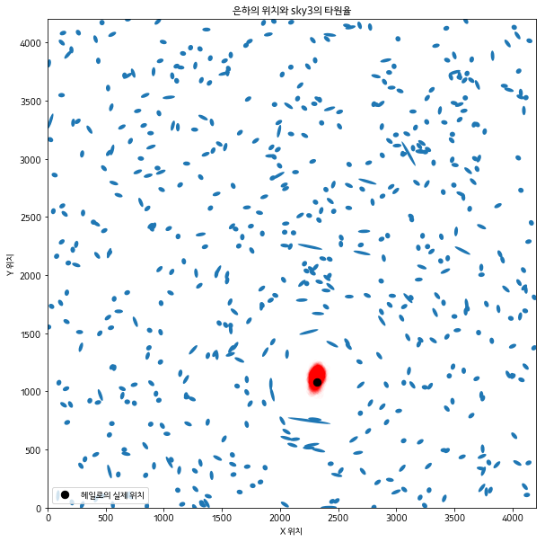
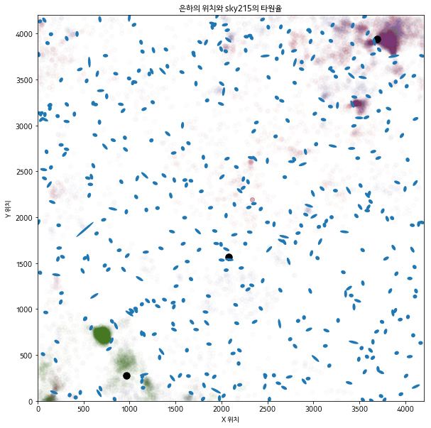

# 예제: 캐글의 Observing Dark World 콘테스트

<https://www.kaggle.com/c/DarkWorlds>

**Observing Dark World** 콘테스트의 목적은 암흑물질이 존재할 가능성이 있는 위치를 예측하는 것이다. 
우승자 Tim Salimans는 헤일로의 위치를 찾기 위해 베이지안 추론을 사용했다. 팀의 해결방법을 정리하면 다음과 같다

1. 헤일로의 기대위치 p(x)에 대한 사전분포를 구성한다.
2. 암흑물질 헤일로의 위치가 주어졌을 때 데이터에 대한 확률론적 모델을 구성한다 : p(e|x)
3. 베이즈법칙을 통해 헤일로 위치에 대한 사후분포를 얻는다. (데이터를 사용해서 헤일로가 있을만한 곳을 짐작한다)
4. 헤일로의 위치를 예측한 사후분포에서 기대손실을 최소화한다.

이 문제에서 손실함수는 매우 복잡하다. 손실함수는 (콘테스트 홈페이지에서 제공하는) `DarkWorldsMetric.py` 파일에 담겨있다. 
파일 내용 전체를 읽어보라고 권유하지는 않을 것이다.

이제 팀의 우승 방법과 손실함수에 대해 공부한 내용을 바탕으로 PyMC3를 사용해 모형을 구현해보자.


```python
import numpy as np
import pandas as pd

import matplotlib
import matplotlib.pyplot as plt
from matplotlib.patches import Ellipse

%matplotlib inline
matplotlib.rc('font', family = 'Kakao')
```

## 데이터

데이터셋은 300개의 개별 파일이고, 각각의 파일은 천체(sky)를 나타낸다. 각 파일에는 300~720개의 은하(galaxy)가 존재한다. 
하나의 천체를 골라서 시각적으로 확인해보자.

```python
def draw_sky(galaxies):
    """adapted from Vishal Goklani"""
    size_multiplier = 45
    fig = plt.figure(figsize=(10,10))
    ax = fig.add_subplot(111, aspect='equal')
    n = galaxies.shape[0]
    for i in range(n):
        _g = galaxies[i,:]
        x,y = _g[0], _g[1]
        d = np.sqrt( _g[2]**2 + _g[3]**2 )
        a = 1.0/ ( 1 - d )
        b = 1.0/( 1 + d)
        theta = np.degrees( np.arctan2( _g[3], _g[2])*0.5 )
        
        ax.add_patch( Ellipse(xy=(x, y), width=size_multiplier*a, height=size_multiplier*b, angle=theta) )
    ax.autoscale_view(tight=True)
    
    return fig
```


```python
sky_url = 'https://raw.githubusercontent.com/CamDavidsonPilon/Probabilistic-Programming-and-Bayesian-Methods-for-Hackers/master/Chapter5_LossFunctions/data/Train_Skies/Train_Skies/Training_Sky{}.csv'
```


```python
n_sky = 3
data = np.genfromtxt(sky_url.format(n_sky), dtype=None, skip_header=1, delimiter=',', usecols=[1,2,3,4])
```


```python
fig = draw_sky(data)
plt.title('은하의 위치와 sky{}의 타원율'.format(n_sky))
plt.xlabel('X 위치')
plt.ylabel('Y 위치')
```


## 사전확률

각 천체에는 암흑물질 헤일로가 1~3개 존재한다. 팀의 해결방법에서는 헤일로의 위치에 대한 사전분포를 균등분포로 가정하였다.

```
X_i ~ Uniform(0, 4200)
Y_i ~ Uniform(0, 4200)
(여기서 i = 1,2,3)
```

대부분의 천체는 큰 헤일로를 하나 가지며, 만약 또 다른 헤일로가 존재한다면 그 헤일로는 훨씬 작다. 
팀은 큰 헤일로의 질량이 40~180 사이의 로그균일분포를 따를 것이라고 판단하였다. 그리고 작은 은하들의 질량을 log 20 으로 고정시켰다. 

```
M_large ~ log Uniform(40, 180)
```

PyMC3 코드로는 다음과 같다

```python
exp_mass_large = pm.Uniform('exp_mass_large', 40, 180)
mass_large = pm.Deterministic('mass_large', np.log(exp_mass_large))
```

## PyMC3 구현과 학습

우리는 각각의 천체에 대한 베이지안 모델을 통해 헤일로 위치에 대한 사후확률분포를 구할 것이다. 일반적으로 케글 대회에서 사용하는 방법과는 다르게, 알려진 헤일로의 위치는 무시한다. 우리가 사용할 모델은 다른 천체나 알려진 헤일로 위치에서 나온 데이터를 사용하지 않는다.


```python
import pymc3 as pm
import theano.tensor as T

def euclidean_distance(x, y):
    return np.sqrt((x - y)**2).sum(axis=1)

def f_distance(gxy_pos, halo_pos, c):
    # position 값은 2-d numpy array
    # T.maximum은 theano tensor에서 elementwise maximum을 구한다
    return T.maximum(euclidean_distance(gxy_pos, halo_pos), c)[:, None]

def tangential_distance(gxy_pos, halo_pos):
    # position 값은 2-d numpy array
    delta = gxy_pos - halo_pos
    t = 2 * T.arctan(delta[:,1] / delta[:,0])
    return T.stack([-T.cos(t), -T.sin(t)], axis=1)
```


```python
with pm.Model() as model:
    # 헤일로의 질량
    mass_large = pm.Uniform('mass_large', 40, 180)
    
    # 헤일로 위치의 초기값을 구한다 (2차원의 균등분포를 사용)
    halo_position = pm.Uniform('halo_position', 0, 4200, shape=(1,2))
    
    mean = pm.Deterministic(
        'mean',
        mass_large /\
        f_distance(T.as_tensor(data[:,:2]), halo_position, 240) *\
        tangential_distance(T.as_tensor(data[:,:2]), halo_position)
    )
    ellpty = pm.Normal('ellipcity', mu=mean, tau=1/0.05, observed=data[:,2:])
```

ADVI를 사용해서 초기값을 구하고, NUTS 샘플러를 이용해 사후분포를 추출한다.


```python
with model:
    mu, sds, elbo = pm.variational.advi(n=20000)
    step = pm.NUTS(scaling=model.dict_to_array(sds), is_cov=True)
    trace = pm.sample(5000, step=step, start=mu)
```


사후확률분포를 히트맵 형태로 표현해보자. 아래 그래프에서 붉은 부분이 헤일로의 위치에 대한 사후확률분포를 나타낸다.


```python
t = trace["halo_position"].reshape(5000,2)

fig = draw_sky(data)
plt.title("은하의 위치와 sky{}의 타원율".format(n_sky))
plt.xlabel("X 위치")
plt.ylabel("Y 위치")
plt.scatter(t[:,0], t[:,1], alpha = 0.015, c = "r")
plt.xlim(0, 4200)
plt.ylim(0, 4200)
```


`Training_halos.csv` 파일에는 천체 속 암흑물질 헤일로의 위치를 최대 세 개 가지고 있다.


```python
halo_url = 'https://github.com/CamDavidsonPilon/Probabilistic-Programming-and-Bayesian-Methods-for-Hackers/raw/master/Chapter5_LossFunctions/data/Training_halos.csv'
halo_data = np.genfromtxt(
    fname=halo_url,
    delimiter=',',
    usecols=[1,2,3,4,5,6,7,8,9],
    skip_header=1)
```


```python
fig = draw_sky(data)
plt.title('은하의 위치와 sky{}의 타원율'.format(n_sky))
plt.xlabel('X 위치')
plt.ylabel('Y 위치')
plt.scatter(t[:,0], t[:,1], alpha=0.015, c='r')
plt.scatter(halo_data[n_sky-1][3], halo_data[n_sky-1][4],
           label='헤일로의 실제 위치',
           c='k', s=70)
plt.legend(scatterpoints=1, loc='lower left')
plt.xlim(0, 4200)
plt.ylim(0, 4200)
```





```python
mean_posterior = t.mean(axis=0).reshape(1,2)
print(mean_posterior)

# [[ 2312.07247533  1126.81316631]]
```

손실함수를 사용하여 우리가 찾은 위치를 최적화해보자. 단순하게는 그냥 평균을 사용한다.


```python
from DarkWorldsMetric import main_score

_halo_data = halo_data[n_sky - 1]

nhalo_all = _halo_data[0].reshape(1, 1)
x_true_all = _halo_data[3].reshape(1, 1)
y_true_all = _halo_data[4].reshape(1, 1)
x_ref_all = _halo_data[1].reshape(1, 1)
y_ref_all = _halo_data[2].reshape(1, 1)

sky_prediction = mean_posterior

print('평균을 사용할 경우:')
main_score(nhalo_all, x_true_all, y_true_all, \
            x_ref_all, y_ref_all, sky_prediction)

random_guess = np.random.randint(0, 4200, size=(1,2))
print("임의의 위치를 사용:", random_guess)
main_score(nhalo_all, x_true_all, y_true_all, \
            x_ref_all, y_ref_all, random_guess)

# 평균을 사용할 경우:
# Your average distance in pixels you are away from the true halo is 45.0161019044
# Your average angular vector is 1.0
# Your score for the training data is 1.0450161019
# 임의의 위치를 사용: [[ 393 2232]]
# Your average distance in pixels you are away from the true halo is 2240.46823921
# Your average angular vector is 1.0
# Your score for the training data is 3.24046823921
```


이번 예측은 진짜 위치와 크게 멀지 않다. 하지만 주어진 손실함수를 사용하지 않았다. 또, 더 작은 헤일로를 최대 2개까지 추가로 사용하도록 코드를 확장해야 한다. PyMC3 함수를 작성해보자.


```python
def halo_posteriors(n_halos_in_sky, galaxy_data, samples=5e5, burn_in=500):
    with pm.Model() as model:
        # 헤일로 질량의 크기를 설정한다
        mass_large = pm.Uniform('mass_large', 40, 180)
        mass_small_1 = 20
        mass_small_2 = 20
        
        masses = np.array([mass_large, mass_small_1, mass_small_2],
                          dtype=object)
        
        # 헤일로의 초기 위치를 설정한다 (2차원 균등분포)
        halo_positions = pm.Uniform('halo_positions', 0, 4200,
                                   shape=(n_halos_in_sky, 2))
        fdist_constants = np.array([240, 70, 70])
        
        _sum = 0
        for i in range(n_halos_in_sky):
            _sum += masses[i]/f_distance(galaxy_data[:,:2], halo_positions[i,:], fdist_constants[i]) *\
                tangential_distance(galaxy_data[:,:2], halo_positions[i,:])
        
        mean = pm.Deterministic('mean', _sum)
        
        ellpty = pm.Normal('ellipcity', mu=mean, tau=1/0.05, observed=galaxy_data[:,2:])
        
        mu, sds, elbo = pm.variational.advi(n=30000)
        step = pm.NUTS(scaling=model.dict_to_array(sds), is_cov=True)
        trace = pm.sample(samples, step=step, start=mu)
    
    burned_trace = trace[burn_in:]
    return burned_trace['halo_positions']
```

```python
data215 = np.genfromtxt(sky_url.format(215), dtype=None, skip_header=1, delimiter=',', usecols=[1,2,3,4])
traces = halo_posteriors(3, data215, samples=5000, burn_in=500)
```

```python
fig = draw_sky(data215)
plt.title('은하의 위치와 sky{}의 타원율'.format(215))
plt.xlabel('X 위치')
plt.ylabel('Y 위치')

colors = ["#467821", "#A60628", "#7A68A6"]

for i in range(traces.shape[1]):
    plt.scatter(traces[:, i, 0], traces[:, i, 1],
               c=colors[i], alpha=0.02)
    
for i in range(traces.shape[1]):
    plt.scatter(halo_data[215-1][3 + 2*i], halo_data[215-1][4 + 2*i], 
                label='실제 헤일로 위치', c='k', s=90)

plt.xlim(0, 4200)
plt.ylim(0, 4200)
```





```python
_halo_data = halo_data[215 - 1]

nhalo_all = _halo_data[0].reshape(1, 1)
x_true_all = _halo_data[3].reshape(1, 1)
y_true_all = _halo_data[4].reshape(1, 1)
x_ref_all = _halo_data[1].reshape(1, 1)
y_ref_all = _halo_data[2].reshape(1, 1)

sky_prediction = traces.mean(axis=0).reshape(1,6)

print('평균을 사용할 경우:')
main_score([1], x_true_all, y_true_all, \
            x_ref_all, y_ref_all, sky_prediction)

random_guess = np.random.randint(0, 4200, size=(1,2))
print("임의의 위치를 사용:", random_guess)
main_score([1], x_true_all, y_true_all, \
            x_ref_all, y_ref_all, random_guess)

# 평균을 사용할 경우:
# Your average distance in pixels you are away from the true halo is 4502.93702035
# Your average angular vector is 1.0
# Your score for the training data is 5.50293702035
# 임의의 위치를 사용: [[2775 4109]]
# Your average distance in pixels you are away from the true halo is 936.445756304
# Your average angular vector is 1.0
# Your score for the training data is 1.9364457563
```

수렴하려면 시간이 더 필요할 것 같다......
