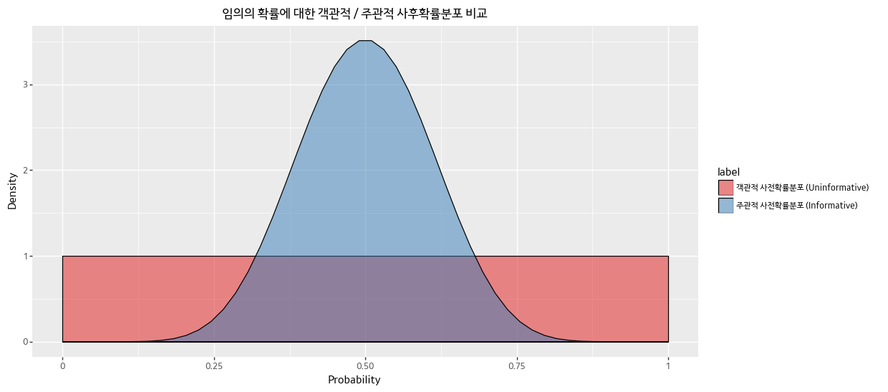

# Ch 6. Getting our prior-ities straight

이 장에서는 **적절한 사전확률분포를 어떻게 고를 것이지**에 대해 다룬다. 

데이터셋이 커질수록 사전확률분포의 영향력이 어떻게 변화하는지 보여주고, 사전확률분포와 선형회귀의 페널티 사이의 관계에 대해서도 살펴본다.

## 주관적 vs 객관적 사전확률분포

베이지안 사전확률분포는 크게 두 가지 분류로 나누어진다

- 객관적인 사전확률분포 (objective priors) : 데이터가 사후확률분포에 최대한 영향을 미치도록 한다
- 주관적인 사전확률분포 (subjective priors) : 실무자가 사전확률분포에 자신의 견해를 반영한다

### 객관적 사전확률분포

평평한 사전확률분포 (flat prior) 는 객관적 사전확률분포의 일종이라고 볼 수 있다. 미지수가 가질 수 있는 전체 구간에 대해 균등분포를 가정한다. 다시 말해서, 모든 가능한 값에 동일한 비중을 부여한다. 이러한 사전확률분포를 선택하는 것은, 어떤 값을 특별히 더 선호할 이유가 없다는 **무차별성의 원리**에 따르는 것이다.

### 주관적 사전확률분포

사전확률분포의 특정 영역에 확률 질량 (probability mass) 를 더 추가한다면, 특정 영역에 존재하는 모수에 편향된 추론을 하게 된다. 이것을 주관적 사전확률 분포라고 한다. (subjective / informative prior)


```python
from plotnine import *
import pandas as pd
import numpy as np
import scipy.stats as stats

df_uninformative = pd.DataFrame({
    'label': '객관적 사전확률분포 (Uninformative)',
    'x': np.linspace(0, 1),
    'value': stats.beta.pdf(np.linspace(0, 1), 1, 1)
})

df_informative = pd.DataFrame({
    'label': '주관적 사전확률분포 (Informative)',
    'x': np.linspace(0, 1),
    'value': stats.beta.pdf(np.linspace(0, 1), 10, 10)
})

df_obj_sub = pd.concat([df_uninformative, df_informative])
```


```python
(ggplot(df_obj_sub, aes(x='x', y='value', fill='label')) +
 geom_density(stat='identity', alpha = 0.5) +
 scale_fill_brewer(type='qual', palette='Set1') +
 xlab('Probability') + ylab('Density') + 
 ggtitle('임의의 확률에 대한 객관적 / 주관적 사후확률분포 비교') +
 theme_gray(base_family='Kakao') +
 theme(figure_size=(12,6))
)
```





주관적 사후확률분포를 선택하는 것이 항상 실무자의 주관적인 의견을 사용한다는 것은 아니다. 주관적인 사전확률분포는 이전 문제의 사후확률분포라고 볼 수도 있다. 또한 도메인 지식을 문제에 반영하는데 사용되기도 한다.

### 결정

보통 해결하려는 문제에 따라 객관적 / 주관적 사전확률분포를 선택한다. 하지만 특정 사전확률분포가 더 선호되는 경우가 몇 가지 있는데, 과학 연구의 경우 결과에 대한 편향을 제거하기 위해 객관적인 사전확률분포를 선택하게 된다.

사전확률분포를 선택하는 일은 모델링 과정의 일부라는 것을 명심해야 한다. 사후확률분포에서 무언가 이상한 점을 느꼈다면, 현재의 사전확률분포에 더 필요한 정보가 있다는 것을 의미한다. 따라서 사전확률분포를 업데이트 해야 한다.

객관적 사전확률분포를 선택할 때, 범위가 큰 균등분포를 사용하는 것은 보통 좋은 선택이다. 다만 이 경우 사전확률분포의 상당 부분이 직관적이지 않은 위치에 배치될 수 있다. 수치 변수의 경우 자연스럽게 0으로 편향되는 경우가 많다. 그렇다면 분산이 큰 정규분포나 두꺼운 꼬리를 가진 지수분포 (양수 / 음수만 존재할 경우) 를 선택하는 것이 나을 수 있다.

### 경험적 베이즈 (Empirical Bayes)

경험적 베이즈는 빈도주의자와 베이지안 추론을 결합한 트릭이다. 경험적 베이즈에서는 빈도주의 방법으로 사전확률분포의 파라미터를 선택하고, 원래의 문제는 베이지안 방법으로 처리한다.

sd = 5인 정규분포의 모수 mu를 추정한다고 해보자. mu는 실수 범위를 가지기 때문에 사전확률분포로 정규분포를 선택할 수 있다. 이 때 사전확률분포의 파라미터를 (`mu_p`, `sigma_p`) 선택해야한다. `sigma_p`의 경우 우리가 가진 불확실성을 반영해서 결정하면 된다. `mu_p` 에 대해서는 다음 두 가지 중 하나를 선택할 수 있다.

- **경험적 베이즈** : 표본 평균을 사용한다
- **전통적 베이즈** : 사전 지식 또는 객관적 사전확률분포를 사용한다

경험적 베이즈 방법론은 데이터를 중복해서 계산한다는 의견도 있다. 데이터를 사전확률분포에서 한 번 사용하고, MCMC 추론과정에서 다시 사용한다. 이렇게 이중으로 계산을 하게 되면 실제 불확실성을 과소평가하게 될 우려가 있다. 

```
경험적 베이즈 : 관측 데이터 -> 사전확률 -> 관측 데이터 -> 사후확률
전통적 베이즈 : 사전확률 -> 관측 데이터 -> 사후확률
```
