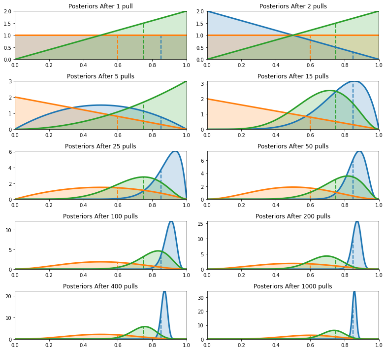

# 예제: 베이지안 MAB (Multi-Armed Bandits)

여러분 앞에 슬롯머신이 열 대 있다고 해보자. 각 기계는 상금을 탈 수 있는 임의의 확률을 가지고 있다. 상금은 같지만 확률은 각각 다르고, 우리는 확률을 모른다. 우리는 승률이 높을 것 같은 슬롯머신을 선택하는 방식으로 상금을 극대화시키는 것을 목표로 한다. 가장 높은 확률을 가진 기계가 무엇인지 알고 있다면, 항상 그 기계를 고르는 것이 최고의 수익을 얻는 방법일 것이다. 따라서 우리가 해야 할 일은 **가장 확률이 높은 슬롯머신을 최대한 빨리 찾아내는 것**이다.

이 작업은 슬롯머신의 확률적 성질때문에 꽤 복잡해진다. 두 번째로 확률이 높은 기계가 운이 좋아서 더 높은 승률을 보일 수 있다. 제일 확률이 높은 기계가 운이 나빠서 실패를 많이 할 수도 있다. 우리는 계속 손해를 봐야할까? 중간에 포기해야 할까? 또, 꽤 좋은 승률을 보이는 기계를 찾았다고 해보자. 좋은 결과를 유지하기 위해서는, 그 기계를 계속 사용할 것인지 아니면 더 좋은 결과를 위해 다른 기계를 찾아볼지도 결정해야 한다. 이것은 **탐색(exploration)과 활용(exploitation)의 딜레마**라고 한다.

## 베이지안 밴디트 솔루션

보통 MAB 문제를 풀기 위해서 제안하는 방법론은 온라인 학습이다. (인터넷과 관련된 말은 아니다. 학습 결과가 계속해서 업데이트된다는 의미에서 온라인이라는 표현을 사용한다.) 더 구체적으로는 강화학습과도 깊은 연관성이 있다. 

알고리즘은 아무것도 모르는 상태에서 시작해서 점차 데이터를 쌓아나간다. 데이터와 결과를 얻을 때마다 최선의 행위와 최악의 행위가 무엇이었는지를 배운다.

베이지안 솔루션은 각 슬롯머신에서 승리할 확률에 대한 사전확률분포를 가정한다. 맨 처음 설명했던 예제에서는 이러한 확률을 전혀 모른다고 가정했다. 따라서 0과 1사이의 평평한 사전확률을 사용하는 것이 자연스럽다. 그 이후의 진행은 다음과 같다.

1. 모든 슬롯머신(bandit) b의 사전확률에서 임의의 표본 `X_b`를 추출한다
2. 표본값이 가장 큰 슬롯머신을 선택한다. ( `B = argmax X_b`를 선택한다 )
3. 슬롯머신 B의 결과를 관측하고, B의 사전확률을 업데이트한다
4. 1번으로 돌아가서 반복한다

최초의 사전확률은 균등분포인 `Beta(alpha=1, beta=1)` 이고, 관측된 결과 X는 이항분포를 따르기 때문에 사후확률은 `Beta(alpha=1+X, beta=1+1-X)`가 된다. 알고리즘은 우리가 돈을 잃는 슬롯머신을 완전히 버리는 대신 슬롯머신을 선택하는 빈도를 줄이는 방식으로 진행한다. 지금 당장 돈을 잃고 있다고 해서 가장 큰 확률을 가진 슬롯머신일 확률이 전혀 없지는 않지만 더 많은 시행을 통해 확률을 줄여나갈 수 있다.

클래스가 두 개인 베이지안 밴디트를 구현해보자. `Bandits` 클래스는 슬롯머신을 정의하고, `BayesianStrategy` 클래스는 학습 전략을 수행한다.


```python
import numpy as np
import scipy.stats as stats
```


```python
class Bandits(object):
    """
    Bandits 클래스는 N개의 슬롯머신을 나타낸다
    
    paramters:
        p_array: [0, 1] 구간의 확률을 담고 있는 Numpy array
    
    methods:
        pull( i ): i번째 슬롯머신을 당긴 결과를 반환한다 (0 또는 1)
    """
    def __init__(self, p_array):
        self.p = p_array
        self.optimal = np.argmax(p_array)
        
    def pull(self, i):
        # i는 잡아당길 슬롯머신
        # 보상이 있으면 True, 없으면 False를 반환한다
        return np.random.rand() < self.p[i]
    
    def __len__(self):
        return len(self.p)
    

class BayesianStrategy(object):
    """
    MAB 문제를 풀기 위한 온라인 학습 방법을 구현한다
    
    parameters:
        bandits: `.pull` 메서드를 가지는 Bandits 클래스
    
    methods:
        sample_bandits(n): n번의 시도에 대해 표본을 추출하고 훈련시킨다
        
    attributes:
        N:        누적된 샘플 수
        choices:  선택한 결과에 대한 히스토리를 numpy array로 반환
        bb_score: 스코어 히스토리를 numpy array로 반환
    """
    def __init__(self, bandits):
        self.bandits = bandits
        n_bandits = len(self.bandits)
        self.wins = np.zeros(n_bandits)
        self.trials = np.zeros(n_bandits)
        self.N = 0
        self.choices = []
        self.bb_score = []
        
    def sample_bandits(self, n=1):
        bb_score = np.zeros(n)
        choices = np.zeros(n)
        
        for k in range(n):
            # 각 슬롯머신의 사전확률을 바탕으로 표본추출하고 가장 큰 표본을 고른다
            choice = np.argmax(np.random.beta(1 + self.wins, 1 + self.trials - self.wins))
            
            # 선택한 슬롯머신을 표본추출한다
            result = self.bandits.pull(choice)
            
            # 사전확률을 업데이트하고 점수를 부여한다
            self.wins[choice] += result
            self.trials[choice] += 1
            bb_score[k] = result
            self.N += 1
            choices[k] = choice
        
        self.bb_score = np.r_[self.bb_score, bb_score]
        self.choices = np.r_[self.choices, choices]
        return
```

베이지안 밴디트 알고리즘을 시각화해보자


```python
from IPython.core.pylabtools import figsize
import matplotlib.pyplot as plt

%matplotlib inline
figsize(11, 10)
```


```python
beta = stats.beta
x = np.linspace(0.001,.999,200)

def plot_priors(bayesian_strategy, prob, lw=3, alpha=0.2, plt_vlines=True):
    wins = bayesian_strategy.wins
    trials = bayesian_strategy.trials
    
    for i in range(prob.shape[0]):
        y = beta(1+wins[i], 1 + trials[i] - wins[i])
        p = plt.plot(x, y.pdf(x), lw = lw)
        c = p[0].get_markeredgecolor()
        plt.fill_between(x, y.pdf(x), 0, color = c, alpha = alpha, 
                         label="underlying probability: {:.2f}".format(prob[i]))
        if plt_vlines:
            plt.vlines(prob[i], 0, y.pdf(prob[i]) ,
                       colors = c, linestyles = "--", lw = 2)

        plt.autoscale(tight = "True")
        plt.title("Posteriors After {} pull".format(bayesian_strategy.N) +\
                    "s"*(bayesian_strategy.N > 1))
        plt.autoscale(tight=True)

    return
```


```python
np.random.seed(124)

hidden_prob = np.array([0.85, 0.60, 0.75])
bandits = Bandits(hidden_prob)
bayesian_strat = BayesianStrategy(bandits)

draw_samples = [1, 1, 3, 10, 10, 25, 50, 100, 200, 600]

for j,i in enumerate(draw_samples):
    plt.subplot(5, 2, j+1) 
    bayesian_strat.sample_bandits(i)
    plot_priors(bayesian_strat, hidden_prob)
    plt.autoscale(tight = True)

plt.tight_layout()
```





여기서 주목할 것은 숨겨진 확률을 얼마나 정확히 추론했는지에 대해서는 관심이 없다는 것이다. 이 문제에서 우리는 최고의 슬롯머신을 고르는데 더 관심이 있다. 위 그래프에서 오렌지색 슬롯머신의 분포는 매우 넓어서 숨겨진 확률이 얼마나 되는지 알 수 없다. 하지만 우리는 그것이 가장 좋은 슬롯머신이 아니라는 것을 확신하고 알고리즘이 해당 슬롯머신을 무시하도록 한다.

1000번의 pull을 시도한 뒤 파란색 선이 가장 좋다는 것을 알 수 있었다. 따라서 우리는 해당 슬롯머신만을 선택할 것이다.

가장 높은 확률을 가진 슬롯머신에서 관측된 비율의 편차는 성능의 척도로 사용할 수 있다. 장기적으로 최적의 보상/시도 (reward/pull) 비율을 얻을 수 있다. 이 비율이 확률 (슬롯머신 중 가장 높은 승률을 가진 슬롯머신의 승리 확률)보다 낮다면 장기적으로 비효율적이다.
