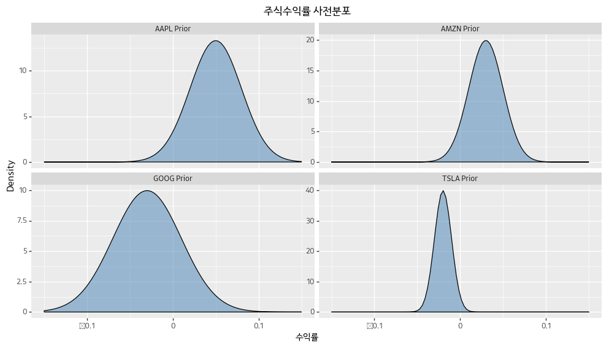

# 주식 수익률 예제

주식 종목을 고르려고 할 때, 분석가는 각 종목의 **일간수익률**을 종종 참고한다. `S_t`가 t영업일의 주가라면 t일의 일간수익률 `r_t = (S_t - S_{t-1}) / S_{t-1}` 이다. 주식의 **일간기대수익률**은 `mu = E[r_t]`로 표시할 수 있다. 기대수익률이 높은 종목이 더 좋은 종목이라는 것은 분명하다. 하지만 주식 수익률에는 노이즈가 가득하기 때문에 모수를 추정하는 것이 너무 어렵다. 그리고 시간에 따라 모수 자체가 변하기도 한다 (주식이 갑자기 폭락할 수 있다). 따라서 과거 데이터를 많이 사용하는 것이 크게 도움이 되지 않는다.

기대수익률을 표본평균을 통해 추정하는 경우가 많았지만, 좋지 않은 방법이다. 데이터셋이 작다보니 표본평균이 크게 틀릴 가능성이 매우 높다. 따라서 불확실성을 파악할 수 있는 베이지안 추론을 사용하기 좋은 상황이다.

이번 예제에서는 애플(AAPL), 구글(GOOG), 테슬라(TSLA), 아마존(AMZN)의 일간수익률을 살펴보자. 데이터를 보기 전에 펀드매니저에게 다음과 같이 질문했다고 생각해보자.

> 각 회사의 수익률이 어떤 형태일 거라고 생각하십니까?

펀드매니저에게 트라이얼 룰렛 방법을 사용해서 분포 네 개를 구했다. 다음은 펀드매니저를 통해 그려본 사전분포이다.


```python
import pandas as pd
import numpy as np
import scipy.stats as stats
from plotnine import *

expert_prior_params = {
    'AAPL': (0.05, 0.03),
    'GOOG': (-0.03, 0.04),
    'TSLA': (-0.02, 0.01),
    'AMZN': (0.03, 0.02)
}

def _expert_prior_dist(name):
    params = expert_prior_params[name]
    x = np.linspace(-0.15, 0.15, 100)
    y = stats.norm.pdf(x, params[0], scale=params[1])
    
    df = pd.DataFrame({
        'x': x,
        'density': y,
        'name': name + ' Prior'
    })
    
    return df

df_expert_priors = pd.concat([_expert_prior_dist(x) for x in expert_prior_params])

(ggplot(df_expert_priors, aes(x='x', y='density')) +
    geom_density(stat='identity', fill='steelblue', alpha=0.5) +
    facet_wrap('~ name', scales='free_y') +
    xlab('수익률') + ylab('Density') + 
    ggtitle('주식수익률 사전분포') +
    theme_gray(base_family='Kakao') +
    theme(figure_size=(12,6))
)
```





이 분포들은 주관적인 사전확률분포라는 점을 명심하자. 전문가가 각 회사들의 주식수익률에 대해 개인적인 의견을 가지고 있고, 이것을 분포로 표현한 것이다.
