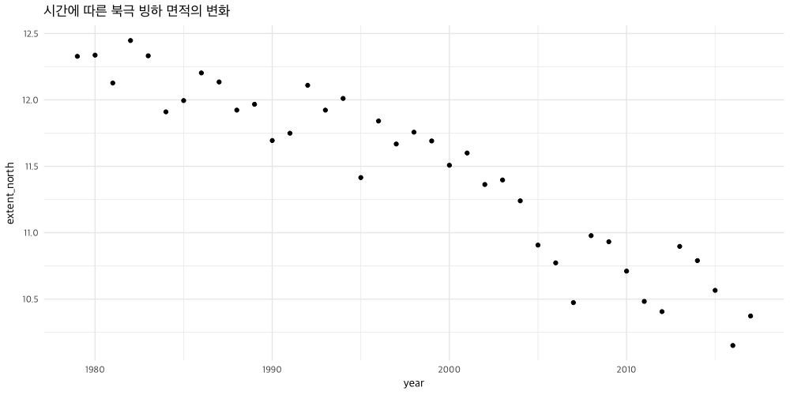

# Intro to Model Design

다음 포스팅을 요약해서 정리한다 

<https://ourcodingclub.github.io/2018/04/06/model-design.html>

## 1. 통계적 모형 (Statistial Model) 이란 무엇인가?

우리가 해결해야 하는 문제를 위해서 데이터 사이의 관계에 대한 통계적인 검정을 필요로 할 때가 있다. 데이터의 구조에 맞게 모형을 구성하고, 해당 모형을 통해 우리의 가설을 테스트해본다. 따라서 모든 데이터 분석에서 가장 먼저 해야하는 것은 문제(질문)를 명확하게 하는 것이다. 

## 2. 해결하려는 문제 (Research Question)

여기서는 [Toolik Lake Field Station](http://arc-lter.ecosystems.mbl.edu/terrestrial-data) 데이터를 사용해서 튜토리얼을 진행할 것이다. 이 데이터는 알래스카 북부의 툰드라 지역의 5군데 장소에 대해서 4년간 식생구성의 변화를 수집한 결과이다. 간단한 질문을 몇 가지 던져보자.

### - 문제 1 : 종풍부도(Species Richness)가 시간에 따라 어떻게 변화하는가?

문제를 정의했으면 가설을 세워야 한다. 가설을 수립하기 위해서는 이 시스템 자체에 대해서 이해할 필요가 있다. 여기서는 가설을 미리 제시해보려고 한다. 종풍부도가 시간에 따라 증가한다고 가정해보자. 툰드라 지역이 온난화를 겪고 있고, 온난화 현상으로 인해 종풍부도가 증가할 것이라고 예상해 볼 수 있다.

> 가설1: Toolik Lake의 종풍부도가 시간이 지남에 따라 증가할 것이다

이제 가설을 세웠으니 귀무가설(Null Hypothesis)에 대해서도 정리해보면 좋겠다. 우리가 비교하려는 가설은 무엇일까??

> 귀무가설 : Toolik Lake의 종풍부도는 시간에 따라 변하지 않는다

또 다른 가설을 세워 볼 수도 있다

> 가설2: Toolik Lake의 종풍부도가 시간이 지남에 따라 감소할 것이다

Toolik Lake Station은 알래스카에 있다. 이 지역은 전세계에서 온난화 현상이 가장 두드러지게 나타나는 곳이다. 따라서 온도의 변화가 식생 분포에 어떤 영향을 미칠지 궁금해질 수 있다. 따라서 다음 질문을 추가로 던져보자.

### - 문제 2 : 연간 평균온도의 변화가 종풍부도에 어떤 영향을 미치는가?

> 가설1: 높은 기온이 높은 종풍부도와 연관이 있을 것이다.

**문제1과 문제2는 어떻게 다른걸까?**

- Detection Model
    - 변화를 감지하는데 관심이 있다
    - *종풍부도가 시간에 따라 어떻게 변하는가?*
    - 왜 변화가 생기는지에 대해서는 검증하지 않는다
- Attribution Model
    - 변화의 주된 요인을 찾으려 한다 (여기서는 온도)
    - 보통 Detection Model의 다음 단계 모형이 된다
    - 무슨일이 일어나는지 알았으니, 왜 일어나는지 파악한다

지금은 이 정도면 모델링을 진행하는데 문제가 없어 보인다. 하지만 앞으로도 **분석을 할 때는 꼭 질문을 던지는 것으로 시작하자**

## 3. 데이터에 대해 살펴보자

```r
# install.packages(c('lme4', 'stargazer', 'MCMCvis', 'MCMCglmm', 'sjPlot'))
toolik_url = 'https://raw.githubusercontent.com/ourcodingclub/CC-model-design/master/toolik_plants.csv'
toolik_plants = read_csv(toolik_url)
```

불필요한 `Species` 항목을 제거한다

```r
species_to_remove = c("Woody cover","Tube","Hole","Vole trail","removed",
                      "vole turds","Mushrooms", "Water","Caribou poop", "Rocks",
                      "mushroom", "caribou poop","animal litter","vole poop",
                      "Vole poop","Unk?")

fltd_toolik_plants = toolik_plants %>% 
  filter(!Species %in% species_to_remove)
```

연도별로 종풍부도의 분포를 확인해보자

```r
richness_toolik = fltd_toolik_plants %>% 
  group_by(Year, Site, Block, Plot) %>% 
  summarise(richness = n_distinct(Species)) %>% 
  ungroup

richness_toolik %>% 
  ggplot(aes(x = richness)) +
    geom_histogram() +
    facet_wrap(~ Year, ncol = 4) +
    theme_light()
```


