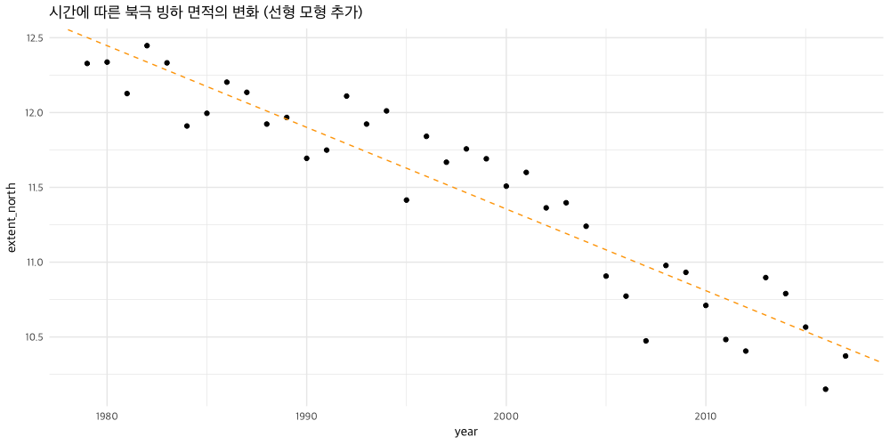
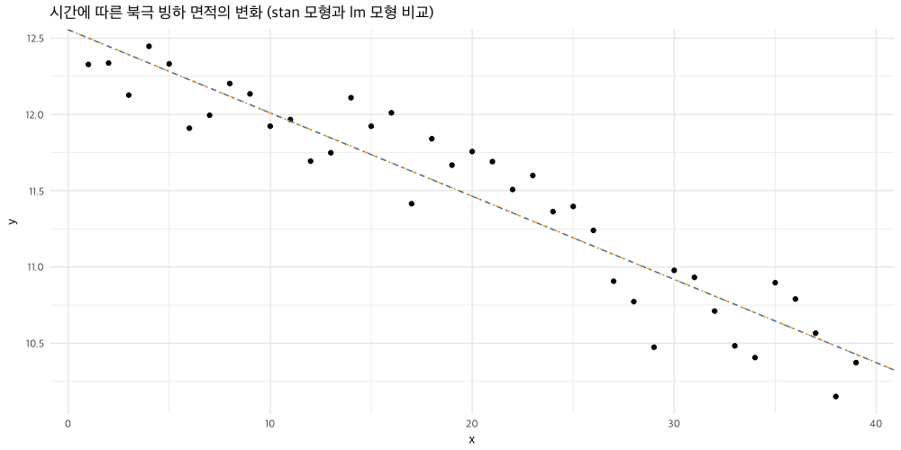
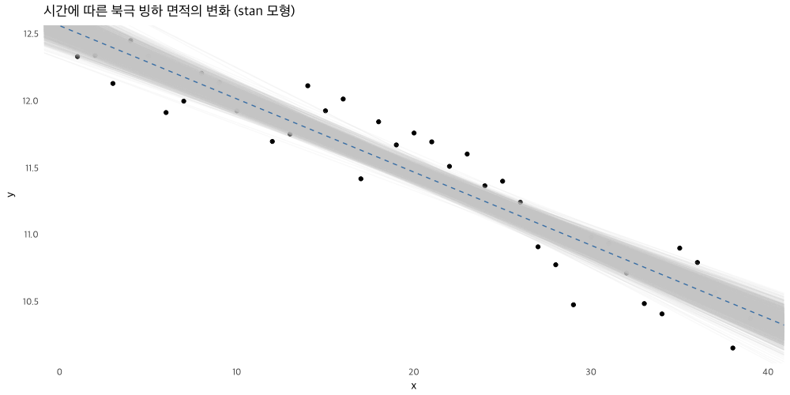
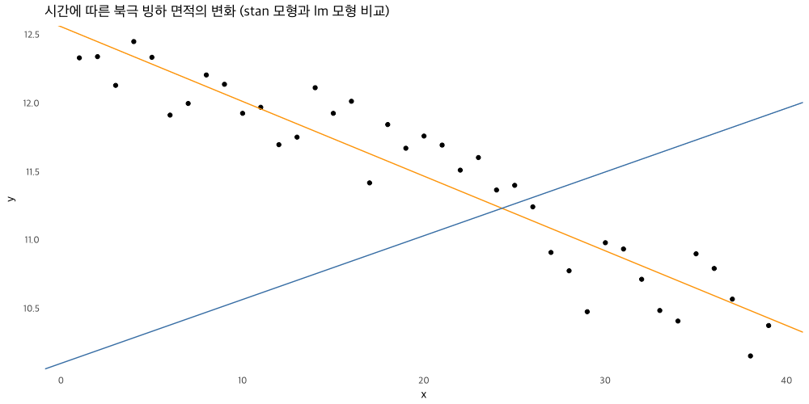
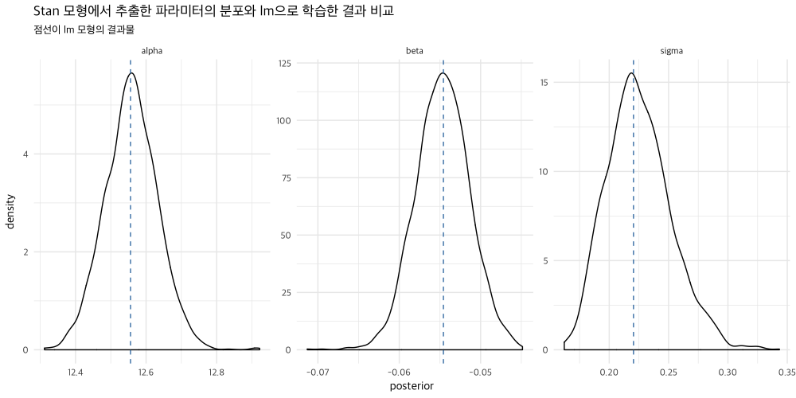
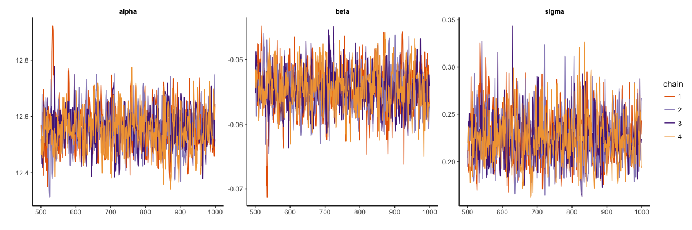
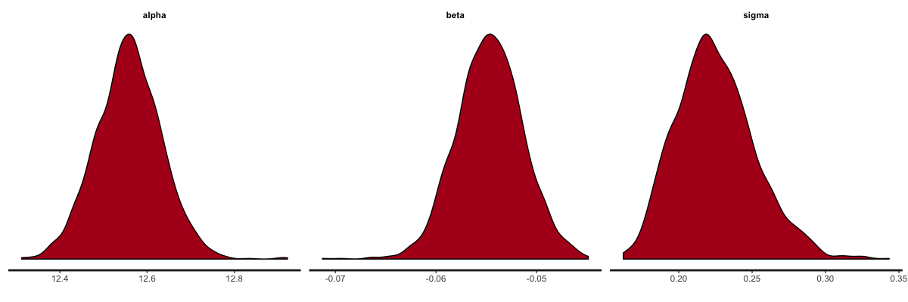
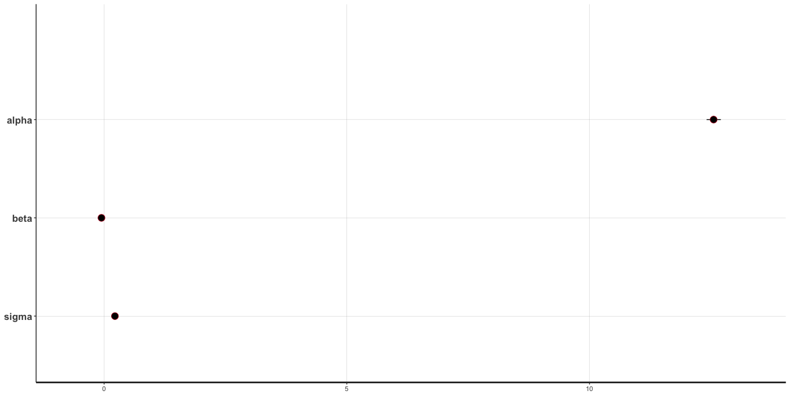
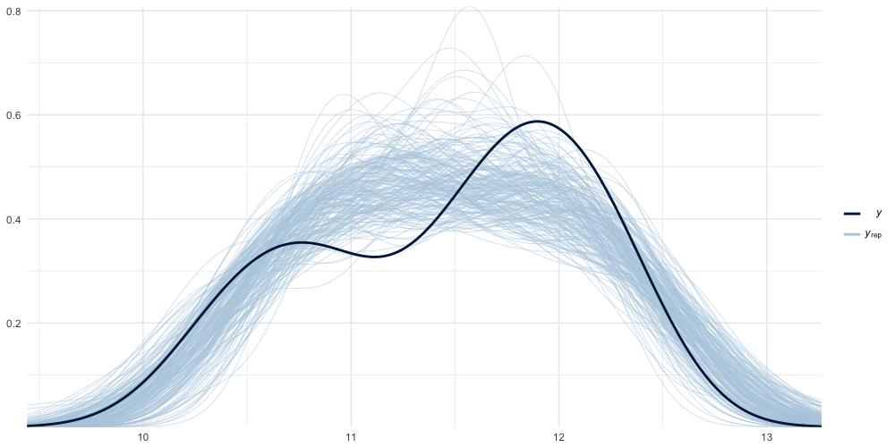
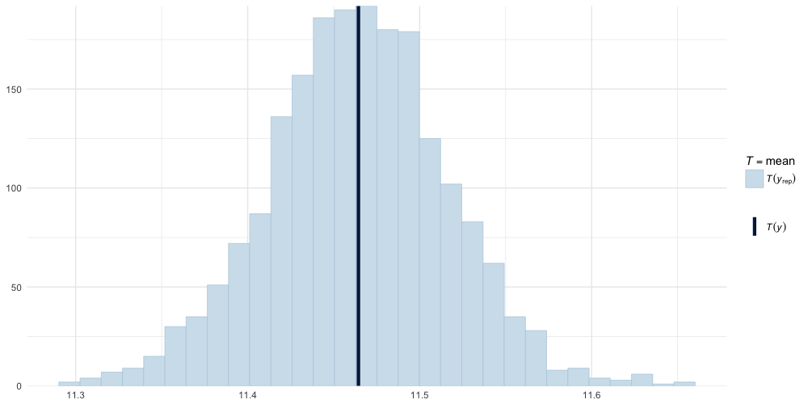

# Intro to Stan

다음 포스팅을 요약해서 정리해보자
<https://ourcodingclub.github.io/2018/04/17/stan-intro.html>

## 1. Learn about Stan

베이지안 모델링같은 통계적 모형들은 문제에 적합한 모형을 구성하고 그 모형이 우리의 데이터에 맞도록 개선하는 과정을 요구한다. 모형을 구성하는 과정과 베이지안 통계에 대한 기본적인 배경지식은 다음 포스팅을 통해 확인할 수 있다.

- <https://ourcodingclub.github.io/2018/04/06/model-design.html>
- <https://ourcodingclub.github.io/2018/01/22/mcmcglmm.html>

통계적 모형은 R이나 다른 언어들을 통해 구성할 수 있다. 하지만 가끔씩 구상하던 모형을 구현하는 것이 패키지나 언어 차원의 제약으로 인해 어려워지는 경우가 있다. 이런 경우가 생기면 `stan` 같은 통계적 프로그래밍 언어를 찾게 된다.

우선 이번 튜토리얼에서는 **stan**을 통해 간단한 선형 모형을 구성해보자. 그리고 점차 더 복잡한 모형을 구성하는 방향으로 진행해보자.

베이지안 모형은 다음과 같은 순서로 구성해 볼 수 있다.

1. 모형을 구성한다
2. Prior를 고른다
    - Informative prior를 쓸 것인가?
    - prior로 변환할 수 있는 외부 데이터가 존재하는가?
3. Posterior 분포의 샘플을 구한다
4. 모형이 잘 수렴되었는지 확인한다
5. Posterior를 통해 모형을 평가하고 데이터와 비교해본다
6. 위 과정을 반복한다

## 2. 데이터

```r
library('tidyverse')
```

```r
knitr::opts_chunk$set(fig.width = 14, fig.height = 7)
```

### 2.1 데이터 불러오기

```r
url_seaice = 'https://raw.githubusercontent.com/ourcodingclub/CC-Stan-intro/master/seaice.csv'
seaice = read_csv(url_seaice)
```

### 2.2 연구하려는 질문: 북극의 빙하 면적이 시간에 따라 감소하고 있는가?

문제에 대한 답변을 위해 그래프를 그려서 한 번 확인해보자

```r
ggplot(seaice, aes(x = year, y = extent_north)) +
  geom_point() +
  ggtitle('시간에 따른 북극 빙하 면적의 변화') +
  theme_minimal(base_family = 'Apple SD Gothic Neo')
```


`lm` 함수를 통해 일반적인 선형 모형을 구성해보자.

```r
lm1 = lm(extent_north ~ year, data = seaice)
summary(lm1)
```

```r
ggplot(seaice, aes(x = year, y = extent_north)) +
  geom_point() +
  geom_abline(slope = lm1$coefficients[2], intercept = lm1$coefficients[1],
              color = 'orange', linetype = 2) +
  ggtitle('시간에 따른 북극 빙하 면적의 변화 (선형 모형 추가)') +
  theme_minimal(base_family = 'Apple SD Gothic Neo')
```



선형 모형의 공식은 다음과 같다

```
Y = alpha + beta*X + error
```

**Stan**에서는 구성하려는 모형의 공식을 명시해야 하기 때문에, 모형의 공식에 대해서 생각해보는 것이 중요하다.

## 2.3 데이터 준비하기

변수들의 이름을 변경하고, 연도를 1부터 39까지의 인덱스값으로 변환하자. 베이지안 모델에서 중요한 점 중에 하나는 데이터의 변화를 분포를 통해 나타내야 한다는 것이다. 여기서는 1979년부터 2017년 기간의 변화량에 대해서 알고자 한다. 500년이나 600년 같이 먼 시점에 대한 예측을 하려는 것이 아니기 때문에, 연도값을 1부터 시작하는 값으로 변환하여 사용한다.

```r
x = I(seaice$year - 1978)
y = seaice$extent_north
N = length(seaice$year)
```

새로 구성한 데이터로 모델을 다시 구성한다.

```r
lm1 = lm(y ~ x)
summary(lm1)

# Call:
#   lm(formula = extent_north ~ year, data = seaice)
# 
# Residuals:
#   Min       1Q   Median       3Q      Max 
# -0.49925 -0.17713  0.04898  0.16923  0.32829 
# 
# Coefficients:
#   Estimate Std. Error t value Pr(>|t|)    
# (Intercept) 120.503036   6.267203   19.23   <2e-16 ***
#   year         -0.054574   0.003137  -17.40   <2e-16 ***
#   ---
#   Signif. codes:  0 ‘***’ 0.001 ‘**’ 0.01 ‘*’ 0.05 ‘.’ 0.1 ‘ ’ 1
# 
# Residual standard error: 0.2205 on 37 degrees of freedom
# Multiple R-squared:  0.8911,  Adjusted R-squared:  0.8881 
# F-statistic: 302.7 on 1 and 37 DF,  p-value: < 2.2e-16
```

나중에 Stan 모형의 결과와 비교하기 위해서 몇 가지 요약 통계량 값을 추출한다

```r
lm_alpha = summary(lm1)$coeff[1]
lm_beta = summary(lm1)$coeff[2]
lm_sigma = sigma(lm1) # Residual Error
```

이제 stan 모형에 사용할 수 있는 형태로 값을 변환해둔다

```r
stan_data = list(N = N, x = x, y = y)
```

# 3. 첫 번째 Stan 프로그램

`Stan`으로 선형 모형을 작성해보자. R 스크립트에 작성할 수도 있고, `.stan` 파일로 따로 작성한 다음 불러와도 된다.

```r
library('rstan')
library('gdata')
library('bayesplot')
```

Stan 프로그램에는 꼭 필요한 세 가지 블록이 존재한다.

1. **Data** block
    - 데이터 타입, 차원, 제약조건(상한, 하한), 변수명을 지정한다
    - 여기서 지정한 이름이 다른 block에서 사용된다
2. **parameters** block
    - 모델링에 필요한 파라미터를 정의한다
    - 파라미터의 차원, 제약조건, 이름을 지정한다
3. **model** block
    - 사용하려는 likelihood를 포함한 샘플링 과정을 나타낸다
        - 샘플링은 `~` 기호를 통해 표현한다
        - Stan에서는 많은 분포를 벡터화된 함수로 제공하고 있다
    - 파라미터에 필요한 사전확률분포(prior)를 명시할 수 있다
    - prior를 생략할 경우, `Uniform(-infinity, +infinity)`를 사용한다
    - prior의 상한, 하한을 명시할 수 있다

 추가적으로 사용할 수 있는 블록은 다음과 같다
 
 - functions
 - transformed data
 - transformed parameters
 - generated quantities

선형 모형을 stan 코드로 작성해보자. 아래 예제에서 prior는 암묵적으로 `uniform(-inf, +inf)` 를 사용하고 있다.

```r
stan_model1 = "
// Stan model for simple linear regression

data {
  int < lower = 1 > N; // Sample size
  vector[N] x; // Predictor
  vector[N] y; // Outcome
}

parameters {
  real alpha; // Intercept
  real beta; // Slope (regression coefficients)
  real < lower = 0 > sigma; // Error SD
}

model {
  y ~ normal(alpha + x * beta , sigma);
}

generated quantities {
} // The posterior predictive distribution"
```

# 4. Stan 모형 학습시키기

## 4.1 stan 함수 사용하기

Stan 프로그램은 사용되기 전에 C++ 코드로 컴파일된다. 따라서 R에서 동작하기 전에 C++ 코드로 변환되는 과정이 필요하고, 이를 위해 C++ 컴파일러가 설치되어 있어야 한다. 

`rstan::stan()` 함수를 이용해 모형을 학습시켜보자. 필요한 인자는 다음과 같다.

- 모형 (`file` 또는 `model_code`), 데이터(`data`)
- warmup 단계 (사용하지 않고 버릴 초반 단계의 결과물) iteration 수 (`warmup`)
    - 기본값은 `iter / 2` 값을 사용한다
- 총 iteration 수 (`iter`)
- 체인 수 (`chain`)
- 사용할 코어 수 (`cores`)
- 샘플을 저장할 주기 (`thin`, 기본값은 1)

```r
fit = stan(model_code = stan_model1, 
           data = stan_data,
           warmup = 500,
           iter = 1000,
           chains = 4,
           cores = 2,
           thin = 1)
```

## 4.2 stanfit 오브젝트

`stan()` 함수는 `stanfit` 오브젝트를 반환한다. (S4 객체) 파라미터를 추정한 결과에 대한 요약 통계량 및 간단한 진단 결과를 확인할 수 있다.

```r
fit

# Inference for Stan model: 872286853a38ddaf5ac4af6d3d421883.
# 4 chains, each with iter=1000; warmup=500; thin=1; 
# post-warmup draws per chain=500, total post-warmup draws=2000.
# 
#        mean se_mean   sd  2.5%   25%   50%   75% 97.5% n_eff Rhat
# alpha 12.56    0.00 0.08 12.40 12.50 12.56 12.60 12.70  1054    1
# beta  -0.05    0.00 0.00 -0.06 -0.06 -0.05 -0.05 -0.05  1162    1
# sigma  0.23    0.00 0.03  0.18  0.21  0.23  0.24  0.29  1010    1
# lp__  37.46    0.04 1.18 34.35 36.86 37.75 38.35 38.84   803    1
# 
# Samples were drawn using NUTS(diag_e) at Wed Jun 27 21:11:17 2018.
# For each parameter, n_eff is a crude measure of effective sample size,
# and Rhat is the potential scale reduction factor on split chains 
# (at convergence, Rhat=1).
```

모형이 수렴했는지 여부를 간단하게 확인해보려면 `Rhat` 값을 살펴보면 된다. `Rhat` 값이 1에 가까울수록 모형이 수렴되었다는 것을 의미한다. 

모형에서 posterior를 추출해보자. 다양한 방법이 있지만 `rstan::extract()` 함수를 사용하면 간단하게 추출할 수 있다.

```r
posterior = rstan::extract(fit)

# extract 함수는 각 파라미터에 대한 리스트의 형태로 값을 반환한다
str(posterior)
```

`lm` 함수를 이용한 결과와 비교해보자

```r
data_frame(x = x, y = y) %>% 
  ggplot(aes(x = x, y = y)) +
    geom_point() +
    geom_abline(slope = lm1$coefficients[2], intercept = lm1$coefficients[1],
                color = 'orange', linetype = 2) +
    geom_abline(slope = mean(posterior$beta), intercept = mean(posterior$alpha),
                color = 'steelblue', linetype = 4) +
    ggtitle('시간에 따른 북극 빙하 면적의 변화 (stan 모형과 lm 모형 비교)') +
    theme_minimal(base_family = 'Apple SD Gothic Neo')
```



stan으로 학습한 결과물이 lm함수의 결과물과 동일한 것을 확인할 수 있다. 우리가 간단한 모형에 대해 학습을 시도했고, 파라미터에 대해서 non-informative한 사전확률분포를 사용했기 때문에 이러한 결과물이 나온 것이다.

모형의 변동성을 확인하기 위해 사후확률분포로부터 나온 값을 가지고 그래프를 그려보자.

```r
data_frame(x = x, y = y) %>% 
  ggplot(aes(x = x, y = y)) +
    geom_point() +
    geom_abline(data = as_data_frame(posterior), aes(slope = beta, intercept = alpha),
                color = '#cccccc', alpha = 0.1, linetype = 1) +
    geom_abline(slope = mean(posterior$beta), intercept = mean(posterior$alpha),
                color = 'steelblue', linetype = 2) +
    ggtitle('시간에 따른 북극 빙하 면적의 변화 (stan 모형)') +
    theme_minimal(base_family = 'Apple SD Gothic Neo')
```



# 5. Prior 변경하기

이번에는 훨씬 정보를 더 담고 있는 사전확률분포를 사용해보자. 표준편차가 작은 정규분포를 prior로 사용하여 학습을 시켜보자. 표준편차가 매우 큰 (1000 이상?) 정규분포라면 균등분포를 사용했을 때와 비슷한 결과가 나올 것이다.

```r
stan_model2 = "
  // Stan model for simple linear regression
  
  data {
    int < lower = 1 > N; // Sample size
    vector[N] x; // Predictor
    vector[N] y; // Outcome
  }
  
  parameters {
    real alpha; // Intercept
    real beta; // Slope (regression coefficients)
    real < lower = 0 > sigma; // Error SD
  }
  
  model {
    alpha ~ normal(10, 0.1); // Informative Prior!!
    beta ~ normal(1, 0.1);   // Informative Prior!!
    y ~ normal(alpha + x * beta , sigma);
  }
  
  generated quantities {}"
```

```r
fit2 = stan(model_code = stan_model2, 
            data = stan_data,
            warmup = 500,
            iter = 1000,
            chains = 4,
            cores = 2,
            thin = 1)
```

```r
fit2

# Inference for Stan model: c53f2bae344435208db650039ec66720.
# 4 chains, each with iter=1000; warmup=500; thin=1; 
# post-warmup draws per chain=500, total post-warmup draws=2000.
# 
#         mean se_mean   sd   2.5%    25%    50%    75%  97.5% n_eff Rhat
# alpha  10.10    0.00 0.10   9.89  10.03  10.10  10.17  10.30  1280    1
# beta    0.05    0.00 0.01   0.03   0.04   0.05   0.05   0.07  1197    1
# sigma   1.30    0.01 0.17   1.01   1.17   1.28   1.39   1.72   993    1
# lp__  -75.09    0.04 1.31 -78.52 -75.68 -74.76 -74.13 -73.62   894    1
# 
# Samples were drawn using NUTS(diag_e) at Thu Jun 28 23:45:49 2018.
# For each parameter, n_eff is a crude measure of effective sample size,
# and Rhat is the potential scale reduction factor on split chains
# (at convergence, Rhat=1).
```

```r
posterior2 = rstan::extract(fit2)
```

```r
data_frame(x = x, y = y) %>% 
  ggplot(aes(x = x, y = y)) +
    geom_point() +
    geom_abline(slope = lm1$coefficients[2], intercept = lm1$coefficients[1],
                color = 'orange', linetype = 1) +
    geom_abline(slope = mean(posterior2$beta), intercept = mean(posterior2$alpha),
                color = 'steelblue', linetype = 1) +
    ggtitle('시간에 따른 북극 빙하 면적의 변화 (stan 모형과 lm 모형 비교)') +
    theme_minimal(base_family = 'Apple SD Gothic Neo')
```



이번에는 무슨 일이 일어난걸까? 모형은 잘 학습된 것일까? 모형의 형태가 왜 이렇게 크게 바뀌었을까? 여러 가지 prior를 적용해보면서 학습된 결과가 어떻게 바뀌는지 살펴보자. 이러한 문제는 베이지안 모델링에서 종종 발생하는 이슈다. 사전분포의 폭이 매우 좁으면서 데이터와 잘 맞지 않는 경우, 데이터를 잘 설명하지 못하는 모델링 결과를 얻게 될 수 있다. 하지만 그렇다고 해서 informative prior를 사용하지 말라는 것은 아니다. 다만 주의해서 사용하면 된다.

## 6.2 잘 수렴되지 않은 경우

모형을 50번의 iteration만 돌려보고 traceplot을 살펴보자

```r
fit_bad = stan(model_code = stan_model1, data = stan_data,
           warmup = 25, iter = 50, chains = 4, cores = 2, thin = 1)
```

```r
fit_bad

# Inference for Stan model: 872286853a38ddaf5ac4af6d3d421883.
# 4 chains, each with iter=50; warmup=25; thin=1; 
# post-warmup draws per chain=25, total post-warmup draws=100.
# 
#         mean se_mean    sd   2.5%    25%    50%    75%  97.5% n_eff Rhat
# alpha   5.23    1.24  3.75  -0.80   3.49   5.13   8.20  10.84     9 2.35
# beta    0.22    0.05  0.14   0.00   0.11   0.22   0.32   0.49    10 2.01
# sigma   4.00    0.64  1.90   1.33   2.36   3.88   5.13   7.77     9 2.16
# lp__  -64.06    7.44 22.10 -91.93 -78.18 -70.07 -49.71 -22.59     9 2.39
# 
# Samples were drawn using NUTS(diag_e) at Fri Jun 29 18:05:45 2018.
# For each parameter, n_eff is a crude measure of effective sample size,
# and Rhat is the potential scale reduction factor on split chains 
# (at convergence, Rhat=1).
```

```r
posterior_bad = rstan::extract(fit_bad)
```

```r
as_data_frame(posterior_bad) %>% 
  mutate(index = row_number()) %>% 
  ggplot(aes(x = index, y = alpha)) +
    geom_line() +
    theme_minimal(base_family = 'Apple SD Gothic Neo')
```


이렇게 모델을 학습시킬 경우 warmup 구간이 지나서 Divergent Transition이 발생할 수도 있다. 이것은 모형이 잘못 설정되었거나, 샘플러가 전체 사후분포의 샘플을 추출하는데 실패한 것일 수 있다 (혹은 둘다!!). 어쨌든 이러한 증상은 모형에 문제가 있다는 것을 의미한다. 

Divergent Transition 관련해서는 다음 Stan 문서를 참고하자 [링크](http://mc-stan.org/misc/warnings.html#divergent-transitions-after-warmup)

## 6.3 파라미터 요약

샘플링한 사후분포를 통해 파라미터의 요약된 수치를 파악할 수 있다. 우리의 결과를 베이지안이 아닌 선형 모형과도 비교해보자.

```r
as_data_frame(posterior) %>% 
  select(alpha, beta, sigma) %>% 
  gather(key = 'parameter', value = 'posterior') %>% 
  ggplot(aes(x = posterior)) +
    geom_density() +
    geom_vline(data = data_frame(parameter = c('alpha', 'beta', 'sigma'),
                                 value = c(lm_alpha, lm_beta, lm_sigma)),
               aes(xintercept = value),
               color = 'steelblue', linetype = 2) +
    facet_wrap(~ parameter, scales = 'free', ncol = 3) +
    ggtitle('Stan 모형에서 추출한 파라미터의 분포와 lm으로 학습한 결과 비교',
            subtitle = '점선이 lm 모형의 결과물') +
    theme_minimal(base_family = 'Apple SD Gothic Neo')
```



사후확률분포로부터 파라미터가 특정 값보다 크거나 작을 확률을 직접 계산할 수 있다

```r
# Beta > 0 일 확률
sum(posterior$beta > 0) / length(posterior$beta)
# [1] 0

# Beta > 0.2 일 확률
sum(posterior$beta > 0.2) / length(posterior$beta)
# [1] 0
```

## 6.4 진단을 위한 그래프 (rstan)

posterior 값을 통해 직접 파악하는 대신 `rstan`에서 기본적으로 제공하는 편리한 도구들을 사용할 수 있다. 

```r
rstan::traceplot(fit)
```



posterior의 density나 히스토그램을 확인할 수도 있다

```r
# Posterior Density
rstan::stan_dens(fit)
```



```r
# Posterior Histogram
rstan::stan_hist(fit)
```


파라미터 추정치와 신용구간(Credible Interval)을 확인해 볼 수 있다. `beta`와 `sigma`의 95% 신용구간은 매우 좁기 때문에, 그래프에서는 거의 점으로 보인다. 

```r
plot(fit, show_density = FALSE, ci_level = 0.5, outer_level = 0.95)
```



## 6.5 Posterior Predictive Check

예측과 모형 검증을 위해, `Stan`에서는 매 iteration마다 각 데이터 포인트에 대한 예측값을 발생시킬 수 있다. 이러한 방식으로 모형과 데이터 생성과정에 대한 불확실성을 예측할 수 있다. `Generated Quantities` 블록을 통해 이러한 작업을 수행할 수 있다.

```r
stan_model2_gq = "
  // Stan model for simple linear regression
  
  data {
    int < lower = 1 > N; // Sample size
    vector[N] x;         // Predictor
    vector[N] y;        // Outcome
  }
  
  parameters {
    real alpha;             // Intercept
    real beta;              // Slope (regression coefficients)
    real <lower = 0> sigma; // Error SD
  }
  
  model {
    y ~ normal(x * beta + alpha, sigma);
  }
  
  generated quantities {
    real y_rep[N];

    for (n in 1:N) {
      y_rep[n] = normal_rng(x[n] * beta + alpha, sigma);
    }
  }"
```

`Generated Quantities` 블록에서는 함수의 벡터화가 지원되지 않는다. 따라서 반복문을 통해 작업해야 하는데, C++로 컴파일되기 때문에 속도는 상당히 빠르다. 데이터를 생성하는 함수는 일반적으로 모델 블록에서 사용하는 함수에 `_rng` 접미사를 붙인다.

```r
fit3 = stan(model_code = stan_model2_gq, data = stan_data,
            iter = 1000, chains = 4, cores = 2, thin = 1)
```

이제 posterior로부터 `y_rep` 값을 추출해보자. `y_rep`를 다루는 방법은 여러 가지가 있다.

```r
y_rep = as.matrix(fit3, pars = 'y_rep')
dim(y_rep)
# [1] 2000   39
```

이제 `bayesplot` 라이브러리를 사용해서 posterior 예측결과를 시각화해보자. y값의 density와 posterior에서 200개를 추출한 값을 비교해보자.

```r
bayesplot::ppc_dens_overlay(y, y_rep[1:200, ])
```



요약된 통계량을 비교하는데 사용할 수도 있다

```r
bayesplot::ppc_stat(y = y, yrep = y_rep, stat = 'mean')
```



# 7. 문제에 답하기

`Stan`으로 모델링하고 잘 수렴되었다는 것을 확인했다. 연구하려는 문제에 어떻게 답을 할 수 있을까? **북극의 빙하 면적이 시간에 따라 감소하고 있는가?** 우리가 작성한 `Stan` 모형은 어떤 답을 내리고 있는가?
