# PyStan을 이용한 베이지안 다층모형

다음 문서를 정리한다. <http://mc-stan.org/users/documentation/case-studies/radon.html>

위계모형, 다층모형 등은 회귀모형을 일반화시킨 결과물이다. 

**다층모형 (Multilevel Model)** 은 모형의 파라미터에 확률 모형이 반영된 회귀모형을 말한다. 이것은 파라미터가 그룹별로 달라진다는 것을 의미한다. 관측한 데이터들은 자연스럽게 클러스터를 이루는 경우가 있다. 이러한 클러스터로 인해 아무리 샘플링을 잘 했다고 하더라도 데이터 사이에 의존성이 생기게 된다.

**위계모형 (Hierarchical Model)** 은 특정 파라미터 안에 다른 파라미터가 중첩되어 있는 다층모형의 특수한 경우를 말한다.

# Radon Contamination 예제

라돈 수치는 가구마다 다르다. 80,000 가구의 라돈 수치를 조사했다. 중요한 두 가지 변수는 다음과 같다.

- 측정장소의 위치 (지하실 또는 1층, 보통 지하실의 라돈 수치가 높다)
- 카운티의 우라늄 수치 (라돈 수치와 상관관계가 있다)

미네소타 주의 라돈 수치를 중심으로 살펴보자. 이 예제에서 hierarchy는 카운티 내의 가구들이다


```python
import pystan
import pandas as pd
from pandas.api.types import CategoricalDtype
import numpy as np
from plotnine import *

%matplotlib inline
```


```python
url_srrs = 'https://raw.githubusercontent.com/pymc-devs/pymc3/master/pymc3/examples/data/srrs2.dat'
url_cty = 'https://github.com/pymc-devs/pymc3/raw/master/pymc3/examples/data/cty.dat'
```


```python
srrs = pd.read_csv(url_srrs)
cty = pd.read_csv(url_cty)
```


```python
srrs_mn = (srrs
    .loc[lambda d: d.state=='MN']
    .rename(columns={'activity': 'radon'})
    .assign(fips = lambda d: d.stfips*1000 + d.cntyfips,
            log_radon = lambda d: np.log(d.radon + 0.1),
            county = lambda d: d['county'].str.strip(),
            county_code = lambda d: d.groupby('county').ngroup() + 1)
)
```


```python
cty_mn = (cty
    .loc[lambda d: d.st == 'MN']
    .assign(fips = lambda d: d.stfips*1000 + d.ctfips)
    .loc[:, ['fips', 'Uppm']]
)
```


```python
radon_mn = srrs_mn.merge(cty_mn, on='fips')
```


```python
radon_mn.loc[:,'log_radon'].hist(bins=25)
```

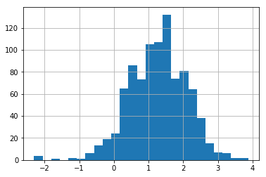


# 전통적인 접근방법

라돈 노출을 모델링하는 전통적인 두 가지 접근방법은 bias-variance trade-off에서 말하는 양 극단을 표현한다.

**Complete Pooling :**
- 모든 카운티의 라돈 수준이 동일할 것이라고 가정한다
- `y_i = alpha + beta * x_i + e_i`

**No Pooling :**
- 모든 카운티가 라돈 수준이 다를 (독립적일) 것이라고 가정한다
- `y_i = alpha_ij + beta * x_i + e_i (j = 1, ..., 85)`

## Complete Pooling

모형을 stan으로 표현하기 위해서 `data` 블록을 작성하는 것부터 시작해보자. `data` 블록에는 다음과 같은 항목이 필요하다

- **y** : log radon 수치로 구성된 벡터
- **x** : 층
- **N** : 샘플 수


```python
pooled_data = """
data {
  int<lower=0> N;
  vector[N] x;
  vector[N] y;
}
"""
```

이제 파라미터를 초기화해보자. 여기서는 선형 모형의 계수들과 정규분포의 scale parameter가 필요하다. scale parameter는 양수 범위로 제한한다는 점을 주의하자.


```python
pooled_parameters = """
parameters {
  vector[2] beta;
  real<lower=0> sigma;
}
"""
```

마지막으로, log-radon 수치를 정규분포로부터 샘플링하도록 모형을 작성한다. 정규분포의 평균은 해당 가구의 층에 대한 함수로 작성한다


```python
pooled_model = """
model {
  y ~ normal(beta[1] + beta[2] * x, sigma);
}
"""
```

이제 `stan` 함수에 data, parameter, model을 넘긴다. 이 과정에서 추가로 제공해야 하는 정보들이 있는데, iteration을 몇 번 반복할 것인지, 몇 개의 병렬 체인을 사용할 것인지 등을 결정해야 한다. 여기서는 2체인으로 1000번 추출한다.


```python
log_radon = radon_mn['log_radon'].values
floor_measure = radon_mn['floor'].values
```


```python
pooled_data_dict = {
    'N': len(log_radon),
    'x': floor_measure,
    'y': log_radon
}

pooled_fit = pystan.stan(
    model_code=pooled_data + pooled_parameters + pooled_model,
    data=pooled_data_dict,
    iter=1000,
    chains=2
)
```


그래프를 그리거나 지표를 요약하기 위해 샘플을 추출할 수 있다


```python
pooled_sample = pooled_fit.extract(permuted=True)
```


```python
b0, m0 = pooled_sample['beta'].T.mean(axis=1)

(ggplot(radon_mn, aes(x='floor', y='log_radon')) +
 geom_point() +
 geom_abline(slope=m0, intercept=b0, color='orange', linetype='--', size=1.5) +
 ylab('log_radon = log(radon + 0.1)') +
 theme(figure_size=(10,6))
)
```


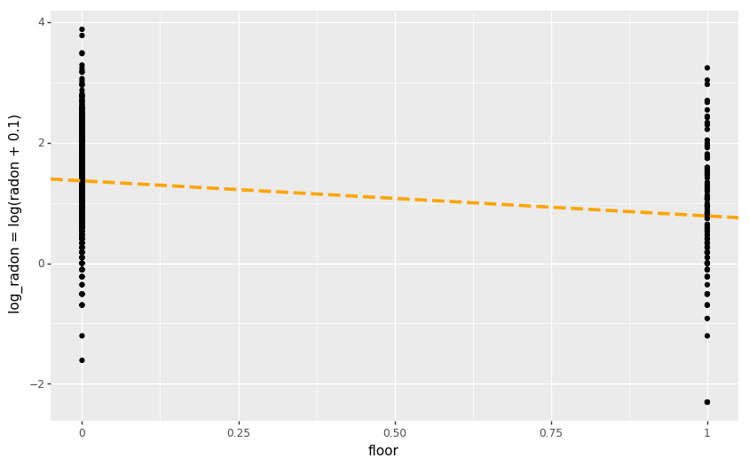

## No Pooling

완전 반대편의 접근법으로는, 모든 카운티 각각에 대해서 학습하는 방법이 있다. 층이 미치는 효과와 오차항 부분은 이전 모형과 동일하다


```python
unpooled_model = """
data {
  int<lower=0> N;
  int<lower=1, upper=85> county[N];
  vector[N] x;
  vector[N] y;
}
parameters {
  vector[85] a;
  real beta;
  real<lower=0, upper=100> sigma;
}
transformed parameters {
  vector[N] y_hat;
  
  for (i in 1:N)
    y_hat[i] <- beta * x[i] + a[county[i]];
}
model {
  y ~ normal(y_hat, sigma);
}
"""
```


```python
unpooled_data = {
    'N': len(log_radon),
    'county': radon_mn['county_code'].values,
    'x': floor_measure,
    'y': log_radon
}
```


```python
unpooled_fit = pystan.stan(
    model_code=unpooled_model,
    data = unpooled_data,
    iter=1000,
    chains=2
)
```


```python
unpooled_estimates = pd.DataFrame({
    'county': radon_mn['county'].unique(),
    'estimates': unpooled_fit['a'].mean(axis=0),
    'se': unpooled_fit['a'].std(axis=0)
})
```


```python
# 그래프에서 county를 정렬하기 위한 Category 타입
county_cate = CategoricalDtype(categories=unpooled_estimates.sort_values('estimates')['county'], 
                               ordered=True)
```


```python
(unpooled_estimates
   .assign(county_cate = lambda d: d['county'].astype(county_cate))
   .pipe(ggplot, aes(x='county_cate', y='estimates')) +
    geom_errorbar(aes(ymax='estimates + se', ymin='estimates - se'), color='#999999') +
    geom_point() +
    ggtitle('Unpooled Model') +
    xlab('County') + ylab('Radon Estimate') +
    theme(figure_size=(12,6), axis_text_x=element_text(angle=90, size=7))
)
```


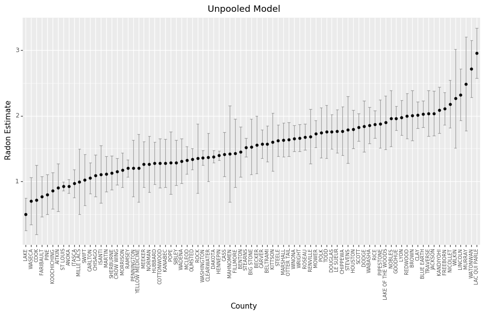

카운티별로 pooled 모형과 unpooled 모형의 추정 차이를 살펴보자. 샘플 수에 따라서 차이나는 정도가 달라진다


```python
sample_county_estimates = (unpooled_estimates
  .loc[lambda d: d['county'].isin(('LAC QUI PARLE', 'AITKIN', 'KOOCHICHING', 
                    'DOUGLAS', 'CLAY', 'STEARNS', 'RAMSEY', 'ST LOUIS'))]
)
```


```python
m = unpooled_fit['beta'].mean(axis=0)
```


```python
(radon_mn
  .loc[lambda d: d['county'].isin(('LAC QUI PARLE', 'AITKIN', 'KOOCHICHING', 
                    'DOUGLAS', 'CLAY', 'STEARNS', 'RAMSEY', 'ST LOUIS'))]
  .pipe(ggplot, aes(x='floor', y='log_radon')) +
  geom_point() +
  geom_abline(slope=m0, intercept=b0, color='orange', linetype='--', size=1) +
  geom_abline(aes(intercept='estimates'), 
              data=sample_county_estimates, slope=m, color='blue') +
  facet_wrap('~ county', ncol=4) +
  ylab('log_radon = log(radon + 0.1)') +
  ggtitle('Unpooled Model') +
  theme(figure_size=(10,6))
)
```


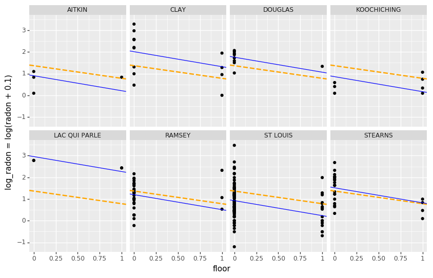


Pooling과 Unpooling 모형 모두 한계점이 있다.

- 라돈 수치가 높은 지역을 탐색하려 한다면, Pooling 모형을 사용하는 것은 의미가 없다
- Unpooled 모형의 수치를 사용할 때, 샘플 수가 적은 지역에 대해서는 신뢰할 수 없다


# 다층 / 위계 모형

Pooled 모형을 사용하는 것은 모든 데이터를 같은 모형으로부터 추출한다는 것을 의미한다. 이것은 (샘플링 과정에서 발생하는 변동에 비해 ) 추출 대상간의 차이를 무시한다.


Unpooled 모형을 통해 데이터를 분석하는 것은 각각의 모형에서 독립적으로 추출한다는 것을 의미한다. Pooled 모형과는 반대로 샘플링 단위 사이의 차이가 커져서 하나로 묶기 어렵다.


**계층 모형**에서는 각각의 파라미터들을 특정한 분포로 부터 추출된 것으로 본다. 따라서 완전히 동일하지도 않고, 완전히 다르지도 않다. 이것을 바로 **Partial Pooling** 이라고 한다.


PyStan을 이용하면 다층 모형을 쉽게 구성할 수 있다. 그리고 Hamiltonian Monte Carlo를 통해 데이터를 학습시킨다.

## Partial Pooling Model

라돈 데이터셋을 위한 가장 단순한 partial pooling 모형은 추가적인 예측변수 없이 라돈 수준을 측정하는 것이다. Partial Pooling 모형은 Pooling 모형과 Unpooling 모형을 샘플 수를 기준으로 가중치를 부여하여 평균을 구한 형태가 된다. 

- 샘플 수가 적은 카운티의 예측값은 전체 평균에 가까워진다
- 샘플 수가 많은 카운티의 예측값은 Unpooled 모형의 예측값과 비슷해진다


```python
partial_pooling = """
data {
  int<lower=0> N;
  int<lower=1,upper=85> county[N];
  vector[N] y;
}
parameters {
  vector[85] a;
  real mu_a;
  real<lower=0,upper=100> sigma_a;
  real<lower=0,upper=100> sigma_y;
}
transformed parameters {
  vector[N] y_hat;
  for (i in 1:N)
    y_hat[i] <- a[county[i]];
}
model {
  mu_a ~ normal(0, 1);
  a ~ normal(10 * mu_a, sigma_a);
  y ~ normal(y_hat, sigma_y);
}
"""
```

두 개의 표준편차가 존재한다는 점에 주목하자. 하나는 관측치의 오차를 설명하고 다른 하나는 카운티간의 변동성을 나타낸다.


```python
partial_pooled_data = {
    'N': len(log_radon),
    'county': radon_mn['county_code'].values,
    'y': log_radon
}
```


```python
partial_pooled_fit = pystan.stan(
    model_code=partial_pooling,
    data=partial_pooled_data,
    iter=1000,
    chains=2
)
```


```python
county_meta = (radon_mn
    .groupby(['county_code', 'county'], as_index=False)['idnum']
    .count()
    .rename(columns={'idnum': 'nvalue'})
    .reset_index()
    .drop(columns='index')
)
```


```python
partial_pooled_estimates = pd.DataFrame({
    'county_code': county_meta['county_code'],
    'county': county_meta['county'],
    'nvalue': county_meta['nvalue'],
    'estimates': partial_pooled_fit['a'].mean(axis=0),
    'se': partial_pooled_fit['a'].std(axis=0),
    'model_type': 'Partial Pooling'
})
```


```python
# 그래프를 그리기 위해 Partial Pooling 모형과 Unpooled 모형의 결과물을 합친다
model_estimates = pd.concat([
    partial_pooled_estimates, 
    unpooled_estimates
      .assign(county_code = lambda d: d.index + 1, 
              model_type = 'Unpooled',
              nvalue = county_meta['nvalue'] )
], sort=False)
```

아래 그래프에서 두 모형의 결과물을 비교해보면, 두 모형의 차이는 주로 샘플 사이즈가 적은 카운티에서 발생한다는 것을 확인할 수 있다. Unpooled 모형이 좀 더 극단적이고 부정확하다.


```python
(ggplot(model_estimates, aes(x='nvalue', y='estimates')) +
 geom_errorbar(aes(ymax='estimates + se', ymin='estimates - se'), 
               color='steelblue', alpha = 0.5, width=0) +
 geom_point(color='steelblue') +
 geom_hline(yintercept=partial_pooled_fit['a'].mean(), linetype='--') +
 facet_wrap('~ model_type') +
 scale_x_sqrt() +
 xlab('number of observations by county') +
 theme(figure_size=(12,6))
)
```


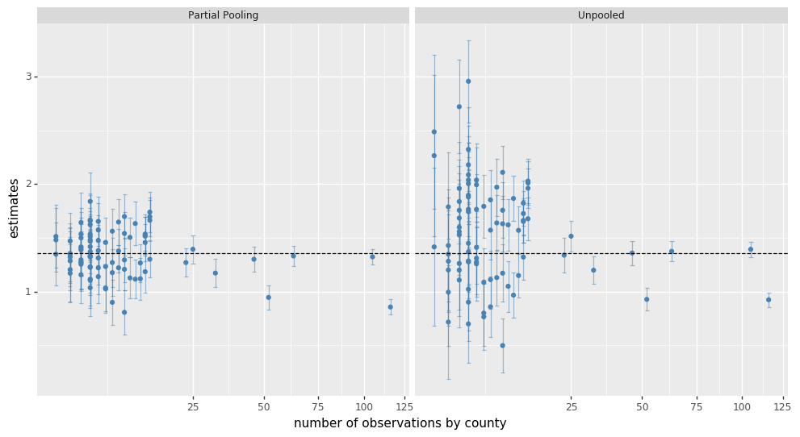


## Varying Intercept Model

이 모형에서는 random effect에 의해 카운티에 따라 다른 절편을 갖도록 한다. 

```
y_i =  a_ji + beta * x_i + e_i

where e_i ~ N(0, (sigma_y)^2)
a_ji ~ N(mu_a, (sigma_a)^2)
```

No-pooling 모형과 마찬가지로 카운티별로 절편값을 다르게 한다. 하지만 다층모형에서는 각 카운티에 대해서 서로 다른 회귀모형을 구하는 것이 아니라, 서로 다른 카운티에 대해서도 영향력을 공유한다. 따라서 데이터가 적은 카운티에서도 어느 정도 합리적인 추론을 할 수 있다.


```python
varying_intercept_model = """
data {
  int<lower=0> J;
  int<lower=0> N;
  int<lower=1,upper=J> county[N];
  vector[N] x;
  vector[N] y;
}
parameters {
  vector[J] a;
  real b;
  real mu_a;
  real<lower=0,upper=100> sigma_a;
  real<lower=0,upper=100> sigma_y;
}
transformed parameters {
  vector[N] y_hat;
  for (i in 1:N)
    y_hat[i] <- a[county[i]] + x[i] * b;
}
model {
  sigma_a ~ uniform(0, 100);
  a ~ normal(mu_a, sigma_a);
  b ~ normal(0, 1);
  sigma_y ~ uniform(0, 100);
  y ~ normal(y_hat, sigma_y);
}
"""
```


```python
varying_intercept_data = {
    'N': len(log_radon),
    'J': len(radon_mn['county_code'].unique()),
    'county': radon_mn['county_code'].values,
    'x': floor_measure,
    'y': log_radon
}
```


```python
varying_intercept_fit = pystan.stan(
    model_code=varying_intercept_model,
    data=varying_intercept_data,
    iter=1000,
    chains=2
)
```


```python
(pd.DataFrame(
    data=varying_intercept_fit['a'], 
    columns=county_meta['county']
 ).melt(value_name='intercept')
  .pipe(ggplot, aes(x='county', y='intercept')) +
  geom_boxplot(outlier_alpha=0.3, outlier_size=1) +
  ggtitle('Varying Intercept Model') +
  theme(figure_size=(12,6), axis_text_x=element_text(angle=90, size=7))
)
```

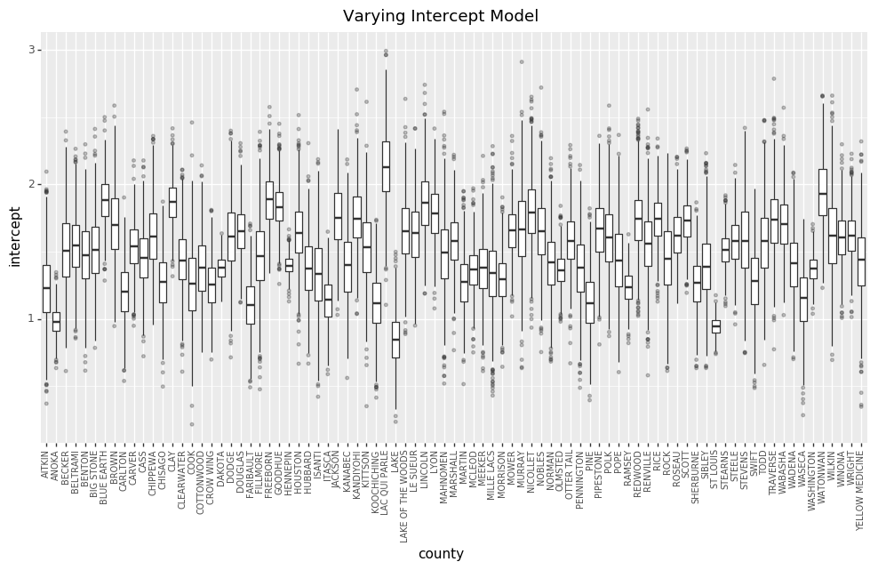


```python
varying_intercept_fit.plot(pars=['sigma_a', 'b'])
```

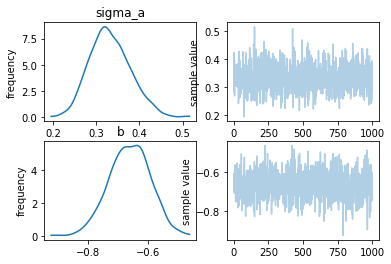


`floor` 계수의 값은 약 -0.66이다. 이것은 모든 카운티에 대해서 고려해본 결과, 지하실이 아닌 곳에서 측정하는 경우 라돈수치가 절반 정도 낮아진다는 것을 의미한다. (`exp(-0.66) = 0.52`)


```python
varying_intercept_fit['b'].mean()
# -0.66164167753054792
```

```python
varying_intercept_estimates = pd.DataFrame({
    'county': county_meta['county'],
    'intercept': varying_intercept_fit['a'].mean(axis=0),
    'slope': varying_intercept_fit['b'].mean()
})
```


```python
(varying_intercept_estimates
   .assign(x1 = lambda d: d['intercept'] + d['slope'])
   .loc[:, ['county', 'intercept', 'x1']]
   .melt(id_vars='county', value_vars=['intercept', 'x1'])
   .assign(xb = lambda d: d['variable'] == 'x1',
           x = lambda d: d['xb'].astype(int))
   .loc[:, ['county', 'x', 'value']]
   .pipe(ggplot, aes(x='x', y='value', group='county')) +
   geom_point(color='steelblue', alpha = 0.5) +
   geom_line(color='steelblue', alpha = 0.5) +
   theme(figure_size=(10,6))
)
```


Partial Pooling 모형이 적어도 샘플 수가 적은 카운티에 대해서는 Pooled 모형이나 Unpooled 모형보다 나은 결과를 제공한다는 것을 쉽게 확인할 수 있다.


```python
varying_intercept_target = (varying_intercept_estimates
    .loc[lambda d: d['county'].isin(('LAC QUI PARLE', 'AITKIN', 'KOOCHICHING', 
        'DOUGLAS', 'CLAY', 'STEARNS', 'RAMSEY', 'ST LOUIS'))]
)
```


```python
(radon_mn
  .loc[lambda d: d['county'].isin(('LAC QUI PARLE', 'AITKIN', 'KOOCHICHING', 
                    'DOUGLAS', 'CLAY', 'STEARNS', 'RAMSEY', 'ST LOUIS'))]
  .pipe(ggplot, aes(x='floor', y='log_radon')) +
  geom_point() +
  geom_abline(slope=m0, intercept=b0, color='orange', linetype='--', size=1) +
  geom_abline(aes(intercept='intercept', slope='slope'), 
              data=varying_intercept_target, 
              color='blue') +
  facet_wrap('~ county', ncol=4) +
  ylab('log_radon = log(radon + 0.1)') +
  ggtitle('Varying Intercept Model') +
  theme(figure_size=(10,6))
)
```

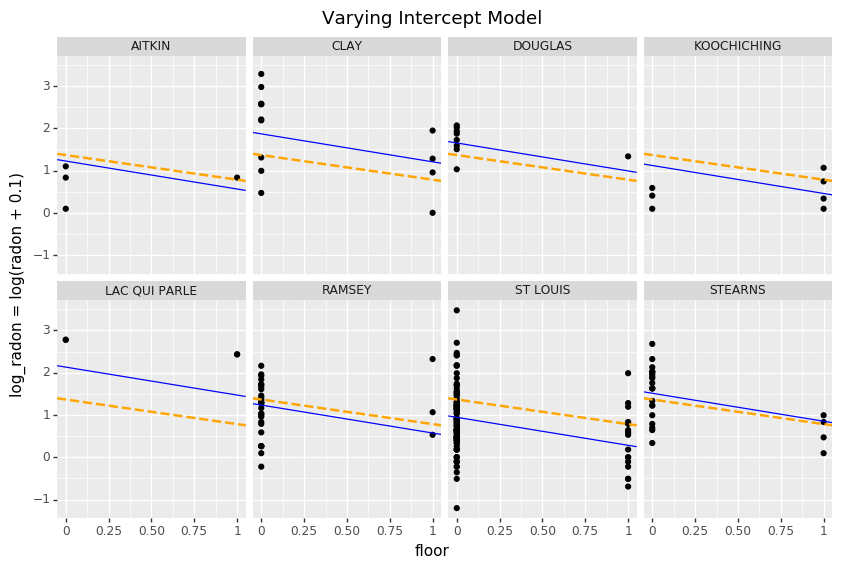


## Varying Slope Model

카운티별로 측정장소가 미치는 영향이 다른 것을 반영하는 모형을 구성할 수도 있다. 

```
y_i = alpha + beta_ji * x_i + e_i
```


```python
varying_slope_model = """
data {
  int<lower=0> J;
  int<lower=0> N;
  int<lower=1, upper=J> county[N];
  vector[N] x;
  vector[N] y;
}
parameters {
  real a;
  vector[J] b;
  real mu_b;
  real<lower=0,upper=100> sigma_b;
  real<lower=0,upper=100> sigma_y;
}
transformed parameters {
  vector[N] y_hat;
  for (i in 1:N)
    y_hat[i] <- a + x[i] * b[county[i]];
}
model {
  sigma_b ~ uniform(0, 100);
  b ~ normal(mu_b, sigma_b);
  a ~ normal(0, 1);
  sigma_y ~ uniform(0, 100);
  y ~ normal(y_hat, sigma_y);
}
"""
```


```python
varying_slope_data = {
    'N': len(log_radon),
    'J': len(radon_mn['county_code'].unique()),
    'county': radon_mn['county_code'].values,
    'x': floor_measure,
    'y': log_radon
}
```


```python
varying_slope_fit = pystan.stan(
    model_code=varying_slope_model,
    data=varying_slope_data,
    iter=1000,
    chains=2
)
```


```python
(pd.DataFrame(
    data=varying_slope_fit['b'], 
    columns=county_meta['county']
 ).melt(value_name='slope')
  .pipe(ggplot, aes(x='county', y='slope')) +
  geom_boxplot(outlier_alpha=0.3, outlier_size=1) +
  ggtitle('Varying slope Model') +
  theme(figure_size=(12,6), axis_text_x=element_text(angle=90, size=7))
)
```

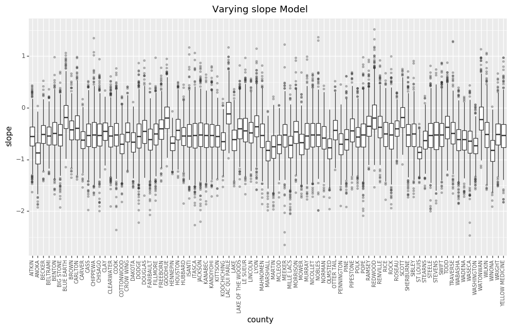

```python
varying_slope_estimates = pd.DataFrame({
    'county': county_meta['county'],
    'intercept': varying_slope_fit['a'].mean(),
    'slope': varying_slope_fit['b'].mean(axis=0)
})
```

```python
(varying_slope_estimates
   .assign(x1 = lambda d: d['intercept'] + d['slope'])
   .loc[:, ['county', 'intercept', 'x1']]
   .melt(id_vars='county', value_vars=['intercept', 'x1'])
   .assign(xb = lambda d: d['variable'] == 'x1',
           x = lambda d: d['xb'].astype(int))
   .loc[:, ['county', 'x', 'value']]
   .pipe(ggplot, aes(x='x', y='value', group='county')) +
   geom_point(color='steelblue', alpha = 0.5) +
   geom_line(color='steelblue', alpha = 0.5) +
   theme(figure_size=(10,6))
)
```

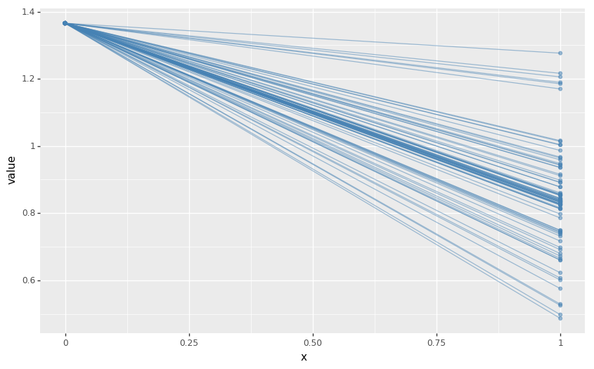

## Varying intercept and slope model

가장 일반화된 모형은 카운티에 따라 기울기와 절편 모두 변하는 것이다.

```
y_i = alpha_ji + beta_ji * x_i + e_i
```


```python
varying_intercept_slope_model = """
data {
  int<lower=0> N;
  int<lower=0> J;
  vector[N] y;
  vector[N] x;
  int county[N];
}
parameters {
  real<lower=0> sigma;
  real<lower=0> sigma_a;
  real<lower=0> sigma_b;
  vector[J] a;
  vector[J] b;
  real mu_a;
  real mu_b;
}
model {
  mu_a ~ normal(0, 100);
  mu_b ~ normal(0, 100);
  
  a ~ normal(mu_a, sigma_a);
  b ~ normal(mu_b, sigma_b);
  y ~ normal(a[county] + b[county].*x, sigma);
}
"""
```


```python
varying_intercept_slope_data = {
    'N': len(log_radon),
    'J': len(radon_mn['county_code'].unique()),
    'county': radon_mn['county_code'].values,
    'x': floor_measure,
    'y': log_radon
}
```


```python
varying_intercept_slope_fit = pystan.stan(
    model_code=varying_intercept_slope_model,
    data=varying_intercept_slope_data,
    iter=1000,
    chains=2
)
```


```python
varying_intercept_slope_estimates = pd.DataFrame({
    'county': county_meta['county'],
    'intercept': varying_intercept_slope_fit['a'].mean(axis=0),
    'slope': varying_intercept_slope_fit['b'].mean(axis=0)
})
```


```python
(varying_intercept_slope_estimates
   .assign(x1 = lambda d: d['intercept'] + d['slope'])
   .loc[:, ['county', 'intercept', 'x1']]
   .melt(id_vars='county', value_vars=['intercept', 'x1'])
   .assign(xb = lambda d: d['variable'] == 'x1',
           x = lambda d: d['xb'].astype(int))
   .loc[:, ['county', 'x', 'value']]
   .pipe(ggplot, aes(x='x', y='value', group='county')) +
   geom_point(color='steelblue', alpha = 0.5) +
   geom_line(color='steelblue', alpha = 0.5) +
   theme(figure_size=(10,6))
)
```


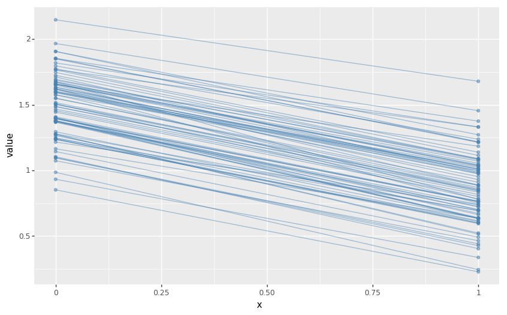

## 그룹 단위의 예측 변수 추가하기

다층모형의 주요 장점 중 하나는 다양한 단계에서 예측 변수를 동시에 처리할 수 있다는 것이다. 위 모형의 varying intercept 모형을 가지고 생각해보자

```
y_i =  a_ji + beta * x_i + e_i
```

여기서 라돈 수치의 기대값에 random effect를 추가하는 대신, 카운티 레벨의 공변량을 가지는 회귀 모형을 추가할 수 있다. 여기서는 라돈 수치에 영향을 미칠 것으로 예상되는 카운티별 우라늄 농도를 `u_j`고 표기하여 사용하자.

(참고. 공변량은 그 자체로 관심을 갖는 변수는 아니지만, 종속변수에 영향을 주는 독립변수다. [링크](https://statkclee.github.io/statistics/stat-modeling.html#fnref2) )

```
a_j = r0 + r1 * u_j + zeta_j

zeta_j ~ N(0, (sigma_a)^2)
```

이제 가구 단위의 변수 (floor 또는 basement) 뿐만 아니라 카운티 단위의 변수 (우라늄) 까지 모형에 포함하게 되었다! 

모형에 각 카운티별 가변수가 있는데 카운티 단위의 공변량까지 추가되었다. 고전적인 회귀분석이라면 이러한 방식으로 모형을 구성할 경우 다중공선성 문제가 발생한다. 다층모형의 경우에는 intercept를 추정하기 위해 partial pooling을 사용하면서 다중공선선 문제를 피해갈 수 있다.

그룹단위의 변수를 추가하면 그룹단위의 변동량(`sigma_a`)을 감소시키는 역할을 한다. 이 말은 그룹단위의 변수를 사용하는 것이 더 강한 Pooling을 유도한다는 것이다.


```python
hierarchical_intercept_model = """
data {
  int<lower=0> J;
  int<lower=0> N;
  int<lower=0,upper=J> county[N];
  vector[N] u;
  vector[N] x;
  vector[N] y;
}
parameters {
  vector[J] a;
  vector[2] b;
  real mu_a;
  real<lower=0,upper=100> sigma_a;
  real<lower=0,upper=100> sigma_y;
}
transformed parameters {
  vector[N] y_hat;
  vector[N] m;
  
  for (i in 1:N) {
    m[i] <- a[county[i]] + u[i] * b[1];
    y_hat[i] <- m[i] + x[i] * b[2];
  }
}
model {
  mu_a ~ normal(0, 1);
  a ~ normal(mu_a, sigma_a);
  b ~ normal(0, 1);
  y ~ normal(y_hat, sigma_y);
}
"""
```


```python
hierarchical_intercept_data = {
    'N': len(log_radon),
    'J': len(radon_mn['county_code'].unique()),
    'u': np.log(radon_mn['Uppm']),
    'county': radon_mn['county_code'].values,
    'x': floor_measure,
    'y': log_radon
}
```


```python
hierarchical_intercept_fit = pystan.stan(
    model_code=hierarchical_intercept_model,
    data=hierarchical_intercept_data,
    iter=1000,
    chains=2
)
```


```python
hierarchical_intercept_estimates = pd.DataFrame({
    'uranium': np.log(radon_mn['Uppm']),
    'm_mean': hierarchical_intercept_fit['m'].mean(axis=0),
    'm_se': hierarchical_intercept_fit['m'].std(axis=0)
})
```

Intercept의 표준오차가 그룹 단위 공변량을 사용하지 않았던 partial pooling 모형에 비해 더 작은 것을 볼 수 있다.


```python
(ggplot(hierarchical_intercept_estimates, aes(x='uranium', y='m_mean')) +
 geom_abline(intercept=hierarchical_intercept_fit['mu_a'].mean(), 
            slope=hierarchical_intercept_fit['b'][:, 0].mean(),
            linetype='--', color='#999999') +
 geom_errorbar(aes(ymax='m_mean + m_se', ymin='m_mean - m_se'), 
               color='steelblue', alpha = 0.5, width=0) +
 geom_point(color='steelblue') +
 xlab('County Level Uranium') +
 theme(figure_size=(12,6))
)
```


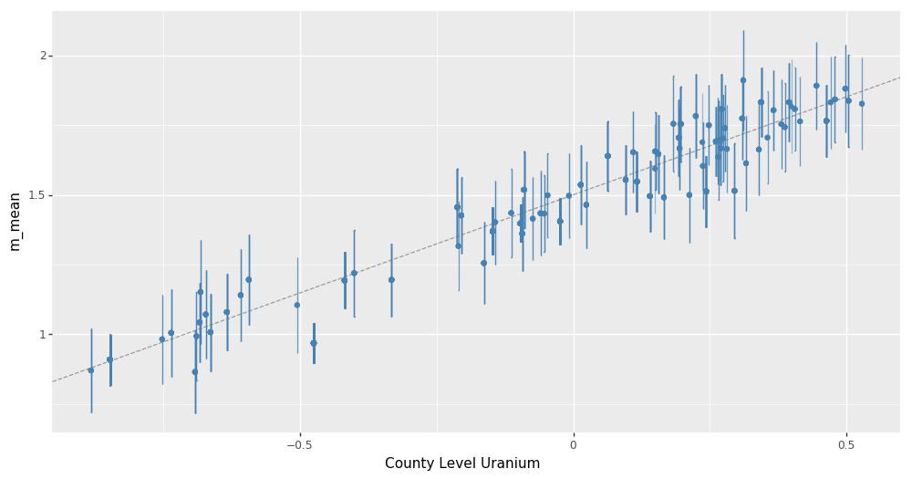


### 각 단계간의 상관관계

여러 단계의 예측 변수를 사용할 경우, 개별 수준의 변수와 그룹 잔차 사이에 상관관계가 존재할 수 있다. 이러한 효과를 모형에 반영하기 위해 예측 변수 각각의 평균을 공변량으로 모형에 포함시킬 수 있다.

```
a_j = r0 + r1*u_j + r2*x_bar + zeta_j
```

일반적으로는 **contextual effects** 라고 한다.


```python
xbar = radon_mn.groupby('county_code')['floor'].mean().values
x_mean = xbar[radon_mn['county_code'].apply(lambda d: d - 1)]
```


```python
contextual_effect_model = """
data {
  int<lower=0> J;
  int<lower=0> N;
  int<lower=0,upper=J> county[N];
  vector[N] u;
  vector[N] x;
  vector[N] x_mean;
  vector[N] y;
}
parameters {
  vector[J] a;
  vector[3] b;
  real mu_a;
  real<lower=0,upper=100> sigma_a;
  real<lower=0,upper=100> sigma_y;
}
transformed parameters {
  vector[N] y_hat;
  for (i in 1:N)
    y_hat[i] <- a[county[i]] + u[i]*b[1] + x[i]*b[2] + x_mean[i]*b[3];
}
model {
  mu_a ~ normal(0, 1);
  a ~ normal(mu_a, sigma_a);
  b ~ normal(0, 1);
  y ~ normal(y_hat, sigma_y);
}
"""
```


```python
contextual_effect_data = {
    'N': len(log_radon),
    'J': len(radon_mn['county_code'].unique()),
    'u': np.log(radon_mn['Uppm']),
    'county': radon_mn['county_code'].values,
    'x': floor_measure,
    'y': log_radon,
    'x_mean': x_mean
}
```


```python
contextual_effect_fit = pystan.stan(
    model_code=contextual_effect_model,
    data=contextual_effect_data,
    iter=1000,
    chains=2
)
```


```python
contextual_effect_fit['b'].mean(0)
# array([ 0.69743844, -0.68573736,  0.41952205])
```

```python
contextual_effect_fit.plot('b')
```

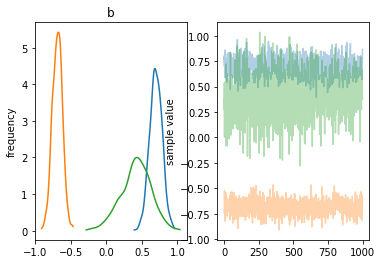


위 결과로부터 알 수 있는 것은 지하실이 없는 가구의 비중이 높은 곳일수록 라돈의 수치가 높은 편이라는 것이다. 아마 토양의 성질에 영향을 받았을 수도 있다. 토양의 성질이 건물의 구조를 결정하는데 영향을 줄 수 있기 때문이다.

# 예측하기

겔만 (2006) 은 unpooled, pooled, partial-pooled 모형의 예측 오차를 구하기 위해 cross validation 기법을 사용했다.

다층 모형의 경우 두 가지 종류의 예측이 존재한다

- 존재하는 그룹 내의 새로운 관측값
- 새로운 그룹의 새로운 관측값

예를 들면, St. Louis 카운티에 지하실이 없는 집의 수치를 예측해보려고 한다. 이 경우에는 적절한 intercept 값을 사용해서 모형으로부터 샘플을 추출하면 된다


```python
# St. Louis 카운티의 county_code 값
county_meta.loc[lambda d: d['county'] == 'ST LOUIS', 'county_code'].values[0]
# 70
```

다시 말하면 다음과 같다

```
y_pred_i ~ Normal(alpha_70 + beta(x_i=1), (sigma_y)^2)
```

stan에서 위 작업을 수행할 때는 코드 몇 줄을 추가해주면 된다.


```python
contextual_pred_model = """
data {
  int<lower=0> J;
  int<lower=0> N;
  int<lower=0,upper=J> stl;
  real u_stl;
  real xbar_stl;
  int<lower=1,upper=J> county[N];
  vector[N] u;
  vector[N] x;
  vector[N] x_mean;
  vector[N] y;
}
parameters {
  vector[J] a;
  vector[3] b;
  real mu_a;
  real<lower=0,upper=100> sigma_a;
  real<lower=0,upper=100> sigma_y;
}
transformed parameters {
  vector[N] y_hat;
  real stl_mu;
  
  for (i in 1:N)
    y_hat[i] <- a[county[i]] + u[i]*b[1] + x[i]*b[2] + x_mean[i]*b[3];
    
  stl_mu <- a[stl] + u_stl*b[1] + b[2] + xbar_stl*b[3];
}
model {
  mu_a ~ normal(0, 1);
  a ~ normal(mu_a, sigma_a);
  b ~ normal(0, 1);
  y ~ normal(y_hat, sigma_y);
}
generated quantities {
  real y_stl;
  
  y_stl <- normal_rng(stl_mu, sigma_y);
}
"""
```


```python
contextual_pred_data = {
    'N': len(log_radon),
    'J': len(radon_mn['county_code'].unique()),
    'u': np.log(radon_mn['Uppm']),
    'county': radon_mn['county_code'].values,
    'x': floor_measure,
    'x_mean': x_mean,
    'y': log_radon,
    'stl': 70,
    'u_stl': cty.loc[lambda d: d['st']=='MN'].loc[lambda d: d['cty']=='STLOUIS', 'Uppm'].values[0],
    'xbar_stl': xbar[70-1]
}
```

```python
contextual_pred_fit = pystan.stan(
    model_code=contextual_pred_model,
    data=contextual_pred_data,
    iter=1000,
    chains=2
)
```

```python
contextual_pred_fit.plot('y_stl')
```

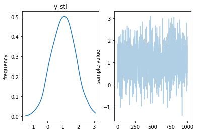


# 다층 모형의 장점

- 관측하려는 데이터의 자연스러운 계층 구조를 반영할 수 있다
- 데이터 수가 적은 그룹에 대한 계수 추정을 할 수 있다
- 그룹 수준으로 모형을 구성할 때, 개별 관측치에 대한 정보와 그룹 정보를 통합할 수 있다
- 그룹간 개별 관측치 계수의 변동성을 모형에 포함할 수 있다

# References

Gelman, A., & Hill, J. (2006). Data Analysis Using Regression and Multilevel/Hierarchical Models (1st ed.). Cambridge University Press.

Gelman, A. (2006). Multilevel (Hierarchical) modeling: what it can and cannot do. Technometrics, 48(3), 432–435.
