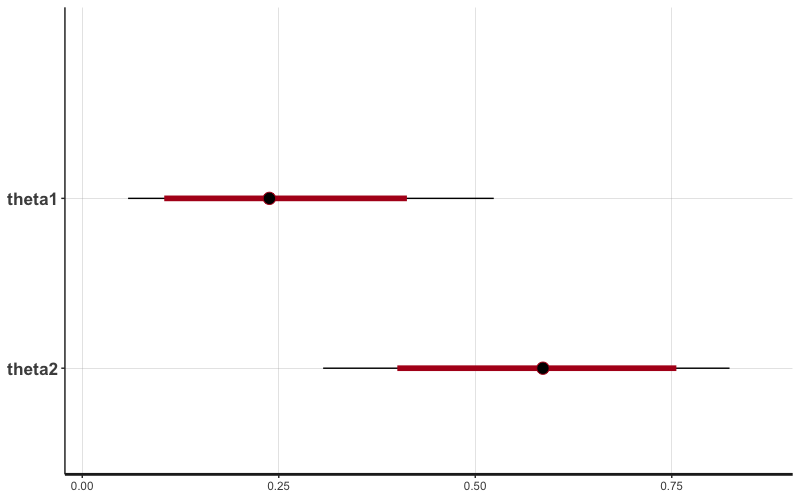
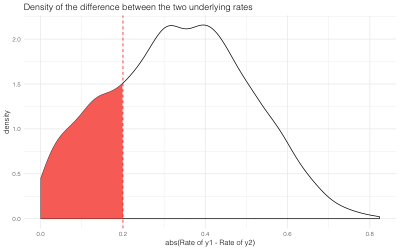

# Beginners Exercise: Bayesian computation with Stan

데이터 분석과 관련된 몇 가지 문제가 있습니다. R과 Stan을 사용하여 문제를 해결하기 위한 모형을 작성하세요.

원본 문제는 [다음 링크](http://www.sumsar.net/files/posts/2017-01-15-bayesian-computation-with-stan-and-farmer-jons/stan_exercise.html)에 있습니다.

# 1. 시작하기

```r
library(tidyverse)
library(rstan)

# To avoid recompilation of unchanged Stan programs
rstan_options(auto_write = TRUE)
```

Question : **코드를 잘 살펴보고, 아래의 코드가 잘 동작하는지 확인해보세요.**

```r
# The Stan model as a string.
model_string = "
data {
  // Number of data points
  int n1;
  int n2;
  // Number of successes
  int y1[n1];
  int y2[n2];
}

parameters {
  // A 'rate' has to be between 0 and 1 => <lower=0, upper=1>
  real<lower=0, upper=1> theta1;
  real<lower=0, upper=1> theta2;
}

model {  
  theta1 ~ beta(1, 1);
  theta2 ~ beta(1, 1);
  y1 ~ bernoulli(theta1);
  y2 ~ bernoulli(theta2);
}

generated quantities {
}
"

y1 = c(0, 1, 0, 0, 0, 0, 1, 0, 0, 0)
y2 = c(0, 0, 1, 1, 1, 0, 1, 1, 1, 0)
data_list = list(y1 = y1, y2 = y2, n1 = length(y1), n2 = length(y2))

# Compiling and producing posterior samples from the model.
stan_samples = stan(model_code = model_string, data = data_list)
```

**Answer**

- 모형에 대한 설명
    - `y1`, `y2` 변수는 베르누이 분포를 따르고, 각각의 파라미터는 (비율, 또는 성공확률을 의미한다) `theta1`, `theta2` 를 따른다
    - `theta1`, `theta2` 는 `Beta(1,1)` 분포를 따른다
    - `theta1`, `theta2` 는 비율을 나타내는 값이기 때문에 0과 1사이에 존재한다
- 학습결과
    - `theta1`의 평균은 0.25 이고, 95% 신뢰구간은 [0.06, 0.52] 이다
    - `theta2`의 평균은 0.58 이고, 95% 신뢰구간은 [0.31, 0.82] 이다

```r
# summarizing the posterior distribution
stan_samples

# Inference for Stan model: 44b4fe5b1a77520188e78f1edb27b9a4.
# 4 chains, each with iter=2000; warmup=1000; thin=1;
# post-warmup draws per chain=1000, total post-warmup draws=4000.
#
#          mean se_mean   sd   2.5%    25%    50%    75%  97.5% n_eff Rhat
# theta1   0.25    0.00 0.12   0.06   0.16   0.24   0.32   0.52  3044    1
# theta2   0.58    0.00 0.14   0.31   0.49   0.59   0.68   0.82  3197    1
# lp__   -15.94    0.03 1.04 -18.78 -16.35 -15.61 -15.19 -14.92  1633    1
#
# Samples were drawn using NUTS(diag_e) at Wed Apr 10 19:16:24 2019.
# For each parameter, n_eff is a crude measure of effective sample size,
# and Rhat is the potential scale reduction factor on split chains (at
# convergence, Rhat=1).
```

```r
plot(stan_samples)
# ci_level: 0.8 (80% intervals)
# outer_level: 0.95 (95% intervals)
```



# 2. 샘플링 결과 다루기

파라미터 각각에 대한 샘플링 결과를 살펴보고 싶다면, stan object를 데이터 프레임으로 변환하여 보는 것이 편리하다.
변환하면 각각의 파라미터를 컬럼별로 확인할 수 있다.

```r
df_samples = stan_samples %>%
  extract() %>%
  as_tibble()

# # A tibble: 4,000 x 3
#    theta1 theta2  lp__
#     <dbl>  <dbl> <dbl>
#  1 0.160   0.720 -15.7
#  2 0.253   0.764 -15.9
#  3 0.360   0.574 -15.2
#  4 0.194   0.263 -17.7
#  5 0.312   0.589 -15.0
#  6 0.214   0.489 -15.2
#  7 0.205   0.759 -15.9
#  8 0.490   0.477 -16.6
#  9 0.0288  0.627 -19.1
# 10 0.351   0.652 -15.3
# # ... with 3,990 more rows
```

Question : **y1, y2 두 항목의 실제 비율 차이가 0.2보다 작을 확률을 구해보세요**

Answer

- 0.2325
- 샘플링 결과에서 `abs(theta1 - theta2)` 를 계산하고, 이 값이 0.2보다 작은 비율을 구한다

```r
# 구해야 하는 확률은 아래 그래프에서 색칠된 구간에 해당된다
ggplot(df_samples, aes(x = abs(theta1 - theta2))) +
  geom_density() +
  geom_area(aes(y = if_else(stat(x) <= 0.2, stat(density), 0)),
            stat = 'density', fill = '#FA7268') +
  geom_vline(xintercept = 0.2, color = 'red', linetype = 2) +
  xlab('abs(Rate of y1 - Rate of y2)') +
  ggtitle('Density of the difference between the two underlying rates') +
  theme_minimal(base_family = 'Helvetica Light')
```



```r
# 두 비율의 차이가 0.2보다 작을 확률을 계산한다
df_samples %>%
  mutate(diff = abs(theta1 - theta2)) %>%
  summarise(p = mean(diff < 0.2)) %>%
  pull(p)
# [1] 0.2325
```

# 3. 효과 좋은 약 찾기

농부 김씨는 많은 수의 소를 키우고 있습니다.
이 중에서 10마리의 소에게 A약을 주고, 10마리의 소에게는 B약을 주었습니다.
그리고 여름동안 소가 병에 걸리는지 (0) 아니면 건강한지(1) 측정했습니다.

그 결과는 다음과 같았습니다.

```{r}
cowA = c(0, 1, 0, 0, 0, 0, 1, 0, 0, 0)
cowB = c(0, 0, 1, 1, 1, 0, 1, 1, 1, 0)
```

Question : **약이 얼마나 효과적이었을까요? A약이 B보다 낫거나 별로였다면 그 근거는 무엇인가요?**

```{r}
data_list_q3 = list(y1 = cowA, y2 = cowB, n1 = length(cowA), n2 = length(cowB))
stan_samples_q3 = stan(model_code = model_string, data = data_list_q3)
```

Answer

- A약이 더 나을 확률은 `0.0425` 로 계산되었다
- 또한 `A약의 효과 - B약의 효과` 의 90% 신용구간은 `[-0.628, -0.0126]` 이다
- 따라서 B약이 더 나을 것으로 보인다

```r
stan_samples_q3
# Inference for Stan model: 44b4fe5b1a77520188e78f1edb27b9a4.
# 4 chains, each with iter=2000; warmup=1000; thin=1;
# post-warmup draws per chain=1000, total post-warmup draws=4000.
#
#          mean se_mean   sd   2.5%    25%    50%    75%  97.5% n_eff Rhat
# theta1   0.25    0.00 0.12   0.06   0.16   0.24   0.33   0.53  3206    1
# theta2   0.59    0.00 0.14   0.30   0.49   0.59   0.69   0.84  3237    1
# lp__   -15.98    0.03 1.09 -18.84 -16.40 -15.66 -15.20 -14.92  1687    1
#
# Samples were drawn using NUTS(diag_e) at Thu Apr 11 17:44:21 2019.
# For each parameter, n_eff is a crude measure of effective sample size,
# and Rhat is the potential scale reduction factor on split chains (at
# convergence, Rhat=1).

df_samples_q3 = stan_samples_q3 %>%
  extract() %>%
  as_tibble()

# A약이 더 나을 확률
p_is_a_better = df_samples_q3 %>% 
  mutate(is_a_better = theta1 > theta2) %>%
  summarise(result = mean(is_a_better)) %>%
  pull(result)
# [1] 0.0425

# B약이 더 나을 확률
p_is_b_better = df_samples_q3 %>%
  mutate(is_b_better = theta1 < theta2) %>%
  summarise(result = mean(is_b_better)) %>%
  pull(result)
# [1] 0.9575

# 90% Credible Interval 계산
df_samples_q3 %>%
  mutate(diff_effect = theta1 - theta2) %>%
  summarise(diff_effect_q05 = quantile(diff_effect, 0.05),
            diff_effect_q95 = quantile(diff_effect, 0.95))
#   diff_effect_q05 diff_effect_q95
#             <dbl>           <dbl>
# 1          -0.628         -0.0126
```
