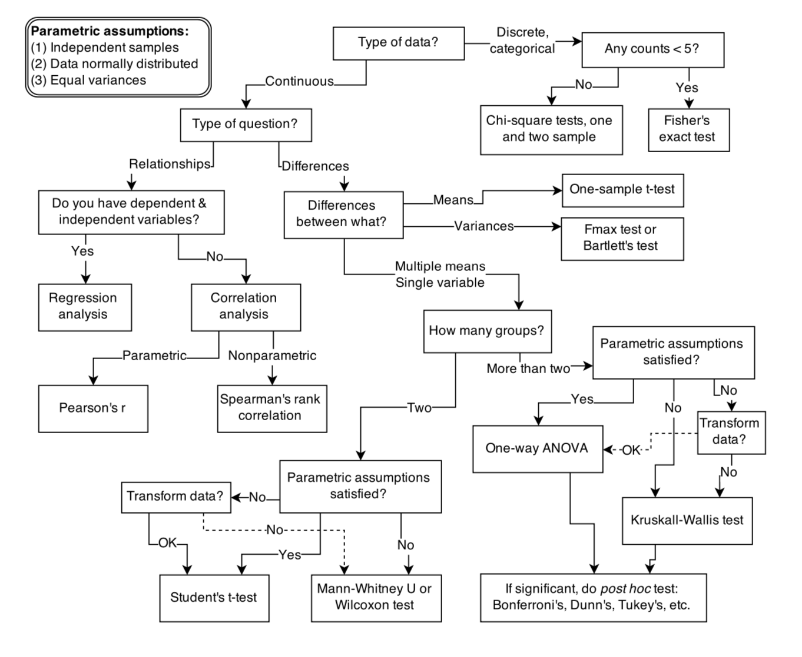
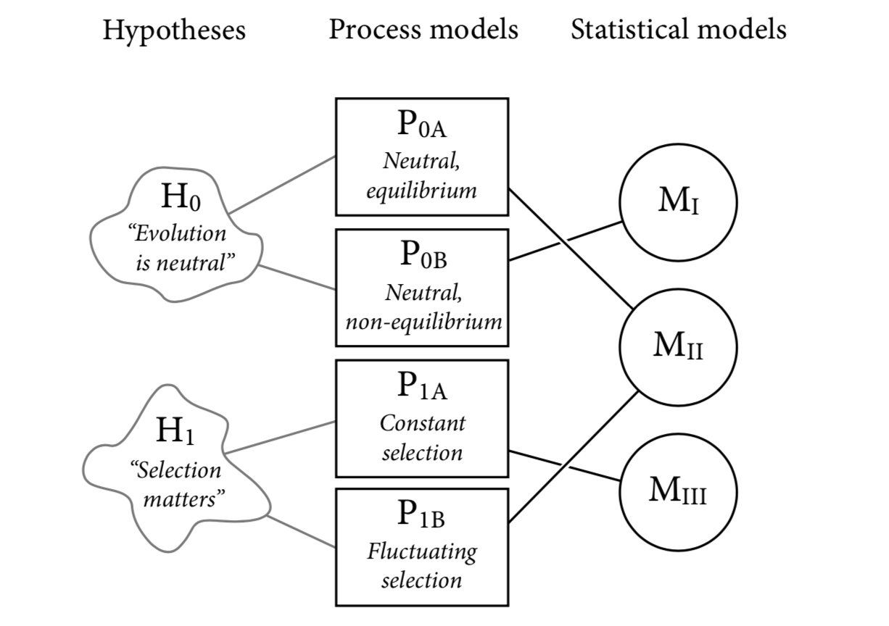

# 1. The Golem of Prague

골렘은 유대인 설화에 나오는 점토 로봇이다. 골렘은 자유 의지가 없기 때문에 주어진 명령만을 정확하게 수행한다. 골렘은 매우 강력하기 때문에 창조자들보다 많은 일을 해낼 수 있지만, 명령을 부주의하게 내리는 등 잘못하면 위험을 불러올 우려도 있다. 

## 1.1 Statistical Golems

통계학자들도 골렘을 만들었다. 이 골렘은 컴퓨터 상에 코드로 존재하는 과학적 모형이지만, 현실 세계에 영향을 미친다. 랍비의 골렘과 마찬가지로 우리도 과학의 골렘을 사용해야 한다. 하지만 그 과정에서 어느 정도 리스크를 수반할 수 밖에 없다.

세상에는 다양한 통계 모형이 존재한다. 고전적인 t 테스트처럼 아주 단순한 모형을 사용한다고 해도, 작은 골렘을 만들어내는 것이다. 불평하지 않고 항상 동일한 계산을 해준다. 하지만 골렘에게는 지성이 존재하지 않는다. 현재 맥락이 결과에 적합한지 고민하지 않는다. 그냥 명령받은 대로 수행할 뿐이다. 그렇기 때문에 각각의 맥락에 맞는 다양한 골렘들을 만들어냈다. 

이런 관점에서 보면 통계학은 수학이나 과학보다는 오히려 엔지니어링에 가깝다. 엔지니어링처럼 공통의 디자인 원칙을 정해두고 특화된 어플리케이션을 다양하게 만들어냈다. 덕분에 기초 통계 강의는 입문자들을 혼란스럽게 하는데 일조했다. 강의에서는 통계 모형을 만들고, 수정하고, 평가하기 위한 방법을 배우는 것이 아니라 미리 만들어진 다양한 골렘들을 모아둔 동물원을 접하게 되었다. 이 골렘이 바로 검정(test) 이라고 한다. 각각의 테스트는 특정한 목적이 있기 때문에, 몇 가지 질문을 통해 원하는 연구에 맞는 테스트를 선택하게 된다.

안타깝게도 숙련된 통계학자들은 일관된 절차들을 배울 기회가 있지만, 대부분의 학생들이나 연구자들은 그렇지 못하다. 이건 공학을 거꾸로 가르치는 것과 비슷하다. 다리를 건설하는 방법을 알려준 다음에 물리학을 알려주는 것이다. 그러다보니 학생들과 많은 연구자들이 구조를 이해하지 못하고 아래와 같은 도표를 만들어 사용하게 된다. 이건 그들의 잘못이 아니다.

어떤 사람들은 미리 만들어진 골렘들만 있으면 충분할 수도 있다. 잘 검증된 환경에서는 각각의 상황에 맞는 몇 가지 도구만으로도 많은 것들을 해낼 수 있다. 배관공들이 유체 역학을 공부하지 않고도 많은 유용한 작업들을 수행할 수 있는 이유와 비슷하다. 하지만 그 범위를 넘어서려는 순간 심각한 문제가 발생한다.

왜 테스트들이 충분하지 않다는 걸까? 통계학 입문에 나오는 고전적인 테스트 절차들은 유연하지 않고 깨지기도 쉽다. 유연하지 않다는 것은 특정한 연구 맥락에 적용하기 위한 방법이 제한적이라는 것을 의미한다. 깨지기 쉽다는 것은 새로운 맥락에 적용하려고 할 때 예측하지 못한 문제로 인해 실패하기 쉽다는 것을 말한다. Fisher's Exact Test는 이러한 상황을 설명하기 좋은 사례다. 이 테스트는 굉장히 좁은 맥락에서 적용할 수 있지만, 실제로는 데이터 개수가 적을 때 일반적으로 사용된다. 논문에서 Fisher's Exact Test를 사용한 사례를 수백번 봤지만, 대부분 피셔의 원래 의도와는 다른 방식으로 사용되었고 제대로 사용하는 것을 본 적이 없다.

특화된 통계 모형들에 문제가 있다는 것이 아니다. 다만 **고전적인 도구들은 일반적인 연구 환경에 적용할 정도로 다양한 문제를 다루지 못한다**는 것이 문제점이다. 게다가 **통계적 도구들은 증거에서 원인을 유추할 수 없다**. 통계 모형이라는 골렘은 인과관계를 이해하지 못하고 상관관계만 이해할 뿐이다. 우리가 명확하게 통제하지 못한다면 만들어진 골렘들은 더이상 유용하지 않다.

연구자들에게 필요한 것은 특정한 목적을 위한 통계 절차를 설계하고, 만들고, 정제하기 위한 통일된 이론이다.

## 1.2 Statistical Rethinking

통계적 추론으로 인해 많은 문제가 발생할 수 있기 때문에, 초보자들이 많은 걱정을 하게 된다. 미리 만들어둔 모형을 플로우차트에서 선택하는 방식을 사용하게 되면 "올바른" 테스트를 선택하는 것에 대해 걱정하게 된다. 하지만 불안감을 지혜로 승화시킬 수도 있다. 그래서 이 책에서는 골렘을 만들기 위한 재료들을 다루는 방법에 대해 다룬다. 골렘이 정보를 다루는 방법을 이해하지 못한다면 골렘이 만들어내는 결과물을 이해할 수 없다. 

통계 모형의 목적과 해석하는 방법에 대한 개념적인 장애물도 존재한다. 가장 큰 장애물은 통계적 가설검정의 목표가 귀무가설을 테스트하는 것이라고 믿는다는 점이다. Karl Popper는 가설이 틀렸다는 것을 입증하면서 과학이 발전한다고 주장했다. 하지만 연역적인 방식으로 가설이 거짓이라는 것을 입증하는 것은 대부분의 과학 분야에서 불가능하다. 두 가지 이유가 있다.

1. 가설은 모형이 아니다. 가설과 모형의 관계는 복잡하다. 여러 모형이 하나의 가설과 연결되기도 하고, 여러 가설이 하나의 모형으로 귀결되기도 한다. 이로 인해 엄격한 의미에서 가설이 거짓이라는 것을 입증하기 어렵다.
2. 측정의 문제가 있다. 데이터가 모형이 틀렸다고 말하더라도, 측정 방법에 문제가 있을지도 모른다. 데이터가 틀렸을 수도 있다.

### 1.2.1 Hypotheses are not models

가설이 틀렸다는 것을 검증하기 위해 무엇인가 모형을 만들어서 작업하게 된다. 모든 모형은 거짓인데 모형이 거짓인지를 증명한다는 것이 무슨 말일까? 모형을 사용해 작업하게 되면, 해당 모형이 틀렸기 때문에 더 이상 가설이 틀렸다는 추론을 이끌어낼 수 없게 된다.

중립 진화론에 대해 논의하는 맥락에서 가설과 모형의 관계를 살펴보자. 

우선 **가설(Hypotheses)**이 있다. 진화가 중립적이거나, 자연 선택에 의해 이루어지거나 하는 두 가지 선택지가 존재한다. 이러한 가설은 명확한 경계가 없다. 모형을 통해 엄밀하게 정의한 것이 아니라 말로 풀어낸 추측에 가깝기 때문이다.

가설을 선택하면 연관된 **Process Models** 들이 있다. Process Models의 주요한 특징은 인과 구조를 나타낸다는 것이다. 서로 다른 Process Model은 각각의 원인-결과 관계를 가지고 있다. 

Process Models에 데이터를 적용하기 위해서는 **통계적 모형(Statistical Models)**을 이끌어낼 필요가 있다. 인과 모형에서 통계 모형을 얻어내려면 어떻게 해야 할까? 한 가지 방법은 인과 모형에서 특정한 값 (통계량, *a "statistic"*) 의 기대 분포를 구하는 것이다.

정리하다 보면 다음과 같은 불편한 진실에 도달한다:

1. 모든 통계 모형(M)은 하나 이상의 Process Model과 연결되어 있다
2. 모든 가설(H)은 하나 이상의 Process Model과 연결되어 있다
3. 모든 통계 모형(M)은 하나 이상의 가설과 연결되어 있다

고전적인 접근법에서는 "중립적인 모형" 그 자체를 귀무 가설이라고 생각한다. 만약 데이터가 귀무가설이 정답일 때 나올 수 있는 결과와 충분히 비슷하지 않을 경우, 우리는 귀무가설을 "기각" 한다. 그런데 P0A를 귀무가설로 선택할 경우 연결된 통계 모형은 M2가 된다. 그리고 M2는 P0A 뿐만 아니라 P1B에도 연결되어 있다. 따라서 귀무가설을 기각하더라도 자연선택이 진화에 영향을 미치는지에 대해서는 여전히 결론지을 수 없다. 여기서는 가설과 모형들 사이의 관계를 나타낸 도표를 볼 수 있지만 일반적인 상황에서 이런 행운은 기대하기 어렵다. 

그렇다면 어떻게 해야 할까? 다양한 process models 후보가 있다면 여러 가지 시도해 볼 수 있다. 만약 모든 process model 들이 특정 증거에 대해 비슷한 예측을 한다면, 증거에 대해 다른 설명을 하는 부분을 찾아야 한다. 한 가지 이상의 모형에 대한 예측을 명시적으로 비교함으로써 일반적인 실수를 피해갈 수 있다.

통계 모형은 관찰되지 않은 변수와 선택 편향을 통해서도 왜곡될 수 있다. Process Model은 이러한 문제점들을 염두에 두고 통계 모형을 설계할 수 있도록 해준다. 통계 모형 단독으로는 충분하지 않다.

### 1.2.2 Measurement matters

반증법의 방식은 단순하다. 가설 H가 있고 해당 가설이 맞다면 D와 같은 데이터가 나올 것이라는 것을 보이면 된다. 그리고 D를 찾다가 실패하면 H가 거짓일 것이라고 결론내리게 된다. 사실 D를 찾는다고 해서 H에 대해 명확해지는 것은 없다. 다른 가설에서도 D로 예측할 수 있기 때문이다.

여기에 관련된 우화로 백조의 색 문제가 있다. 호주에서 검은 백조가 발견되기 전까지 유럽 사람들이 보던 모든 백조는 흰색이었다. 따라서 백조는 모두 희다는 믿음이 생겼다. 이걸 가설로 정리해보자

> H0 : 모든 백조는 하얗다

하지만 유럽 사람들은 호주에서 검은 백조를 마주하게 되었다. 이 증거는 가설 H0가 거짓이라는 것을 바로 증명했다. 여기서 중요한 점은, 호주로 여행을 가기 전까지는 데이터를 얼마나 확보해도 귀무가설이 맞다는 사실을 증명할 수 없다는 점이다. 하지만 귀무가설이 틀렸다는 것을 증명하는 데는 1개의 데이터로도 충분하다. 

이런 반례를 찾는 것은 중요하지만, 백조 사례처럼 명백하게 드러나는 경우는 많지 않다. 이전 단락에서 다루었던 가설-모형의 대응 관계도 있지만 많은 문제들이 논리적으로 뚜렷하게 구분되어 있지 않기 때문이다. 게다가 우리는 두 가지 문제에 직면하게 된다.

1. **Observation error :** 관측에는 오차가 발생하기 쉽다
2. **Continuous hypotheses** : 대부분의 가설은 불연속적/이산적이기 보다 연속적/정량적인 경우가 많다

### 1.2.3 Falsification is consensual

반증법은 논리보다는 합의에 의해 결정된다. 관측 오류와 자연 현상의 연속성 등의 영향으로 과학계는 증거를 어떻게 해석할 수 있을지 논의하고 합의한다. 교과서에서는 종종 논리적으로 증명한 것처럼 잘못 표현하기도 한다.

# 1.3 Tools for golem engineering

모형을 다루는 능력이 있다면 연구 과정에서 다양한 이점이 존재한다. 과학적인 문제들은 대체로 "검정" 보단 일반화된 문제고, 통계학 입문 시간에 배울 기성품 모형들은 많은 연구 맥락에 맞지 않기 때문이다. 

우리는 모형을 바탕으로 연구를 설계하고, 데이터에서 정보를 뽑아내며, 예측할 것이다. 이 책에서는 각각의 목적에 맞게 다음과 같은 도구를 사용할 것이다.

1. Bayesian Data Analysis
2. Model Comparison and Prediction
3. Multilevel Models
4. Graphical Causal Models

## 1.3.1 Bayesian Data Analysis

- 확률을 설명하기 위한 몇 가지 주요 접근 방법이 있다
    - Frequentist
    - Bayesian
- 베이지안 분석 기법은 데이터를 통해 세상을 설명하기 위한 효과적이면서 일반적인 방법이다
    - 베이지안은 데이터를 처리하기 위한 논리적인 절차에 가깝다
    - 세상의 모든 것들은 "random" 이 아닌데, 우리가 가진 정보가 부족해서 정확한 예측을 할 수 없다
    - 데이터를 더 많이 확보할 수록 불확실성 속에서 더 정확하게 예측할 수 있게 될 것이다
    - "randomness" 를 완전하지 않은 정보로 인한 불확실성을 나타내기 위해 사용한다
- 베이지안 프레임워크는 교육할 때 큰 이점이 있다 : 바로 사람들이 더 직관적으로 이해한다는 점이다

## 1.3.2 Model Comparison and Prediction

다양한 모형을 만든 뒤 어떤 모형이 더 타당한지 파악하려면 어떻게 해야 할까? 한 가지 방법은 좋은 예측을 하는 모형을 선택하는 것이다. 이것을 위해 두 가지 도구를 사용한다.

- Cross Validation
- Information Criteria

모형을 학습하는 것은 쉽지만 잘 예측하는 것은 어렵다. 특히 모형이 과적합(overfitting) 되지 않도록 주의를 기울여야 한다.

## 1.3.3 Multilevel Models

다층 모형도 과적합을 다루는데 도움을 준다. Partial Pooling 이라고 하는 트릭을 통해 그룹간 데이터를 종합해서 더 나은 예측을 할 수 있도록 돕는다. 주로 다음과 같은 상황에 사용된다.

1. 반복적인 샘플링을 통해 수집한 데이터를 조정한다
2. 샘플링이 불균형하게 발생했을 때 보정한다
3. 개인간, 그룹간 변동성을 분석하고자 한다
4. 모델링에 적용하기 위해 사전에 데이터의 평균을 구하는 것을 방지한다

다층 모형은 이 외에도 많은 상황에 사용된다. 하지만 여러 장점들이 공짜로 주어지는 것은 아니다. 전통적인 회귀 모형보다 학습하고 해석하는 것이 더 어렵다.

## 1.3.4 Graphical Causal Models

바람이 불면 가지가 흔들린다. 사람들은 이 문장에서 인과관계를 파악할 수 있다. 하지만 우리가 볼 수 있는건 통계적인 상관관계 뿐이다. 데이터만 봤을 때는 가지가 흔들려서 바람이 부는 것이라고 파악할 수도 있다. 통계 모형은 유용하지만 단독으로 인과관계를 파악할 수 없다.

예측 성능이 높은 모형을 만들다 보면, 인과적으로는 말이 안되는 요소들을 적용했을 때 오히려 예측 성능이 높아지는 경우도 있다. 창 밖을 보니 가지가 흔들리고 있다. 그렇다면 정말 바람이 불고 있을 가능성이 높다. 그런데 우리가 세상에 **개입**(intervene)한다면 어떨까? 사람들을 고용해 나뭇가지를 흔들어 보면 어떻게 될까? 아마 바람이 불지 않을 가능성이 높을 것이다.

그래서 어떻게 해야 할까? 통계적 모형들을 도출해 낼 수 있는 인과 모형이 있어야 한다. 완벽한 인과 모형을 만들 수는 없다고 해도 각 변수들이 어떻게 서로에게 영향을 주는지 표현할 수 있다. 이런 인과 관계 가설을 위해 **Graphical Causal Model** 을 사용한다. 가장 단순한 형태의 그래피컬 인과 모형은 바로 **DAG(Directed Acyclic Graph)**다.
