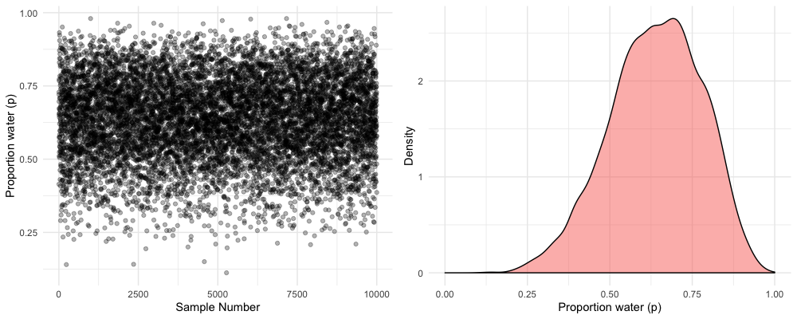

# 3. Sampling the Imaginary

95%의 확률로 뱀파이어 여부를 정확하게 진단하는 테스트가 있다고 생각해보자. (`Pr(Positive | vampire) = 0.95`) 
가끔 실수를 하기도 하는데, 1%의 확률로 일반인은 뱀파이어로 잘못 진단한다. (`Pr(positive | mortal) = 0.01`) 
굉장히 정확한 테스트지만, False Positive 기준으로는 그렇지 않다. 마지막으로 뱀파이어는 전체 인구 중 0.1%를 차지한다. (`Pr(vampire) = 0.001`)

이제 어떤 사람이 테스트에서 양성 판정을 받았다고 가정해보자. 이 사람이 뱀파이어일 확률은 얼마일까?

```
Pr(vampire | positive)
= Pr(positive | vampire) * Pr(vampire) / Pr(positive)

Pr(positive)
= Pr(positive | vampire) * Pr(vampire) 
    + Pr(positive | mortal) * (1 - Pr(vampire))
```

계산해보면 양성 판정일 때 실제로 뱀파이어인 확률은 8.7% 에 해당한다. 
많은 사람들은 이 결과가 직관적이지 않다고 생각할 것이다.
 하지만 이 결과는 현실에 존재하는 많은 검사들, 예를 들면 에이즈나 DNA 검사가 이루어지는 구조를 모방하고 있다. 
 발생 확률이 극히 낮은 경우라면, 발생할 것이라고 예측한 결과의 대부분은 실제로 그렇지 않은 (false positive) 현상이 발생한다.

사실 두 가지 이유로 이 예제를 좋아하지 않는다.

1. "베이지안" 이기 때문에 가능한 내용이 없다. 베이지안 추론은 베이즈 이론을 사용하는지 여부가 아니라 확률에 대한 관점을 통해 구분하는 것이다.
2. 이 예제는 실제보다 베이지안 추론을 더 어려운 것처럼 보이게 한다

확률 대신 아래와 같이 빈도를 통해 문제를 다시 설명해보자.

1. 인구 10만 명 중에서 100명은 뱀파이어다
2. 뱀파이어 100명 중에서 95명은 뱀파이어 검사에서 양성 반응이 발생한다
3. 99,900명의 일반인 중에서 999명은 뱀파이어 검사에서 양성 반응이 발생한다.

이제 다시 양성 판정을 받은 사람 중에서 뱀파이어의 비율을 계산해보자. `95 / (95 + 999)` 로 쉽게 계산할 수 있다. 

확률보다는 빈도수로 이 문제를 다룰 때 사람들이 직관적으로 인식하는 것 같다. 
그리고 우리는 현실 세계에서 주로 빈도수를 접하고, 다루고 있다. 
그렇다면 이러한 현상을 잘 이용해보자. 확률 분포를 바탕으로 샘플링하여 빈도수 값을 생성하는 것이다. 
다른 분포들처럼 Posterior 또한 확률 분포이기 때문에 posterior로부터 샘플을 추출할 수 있다. 여기서는 파라미터 값을 샘플링을 통해 생성할 것이다.

# 3.1 Sampling from a grid-approximate posterior

Grid Approximation을 통해 지구본 던지기 예제의 Posterior를 다음과 같이 계산할 수 있었다. 
여기서 Posterior란 특정한 데이터를 알고 있을 때 비율이 `p`일 확률을 의미한다.

```r
# Grid를 정의한다
p_grid <- seq(from = 0, to = 1, length.out = 1000)

# Prior를 정의한다
prior <- rep(1, 1000)

# 그리드의 각 값에서 Likelihood를 계산한다
likelihood <- dbinom(x = 6, size = 9, prob = p_grid)

# Likelihood와 Prior의 곱을 계산한다
unstd_posterior <- likelihood * prior

# Posterior 분포의 합이 1이 되도록 조정한다
posterior <- unstd_posterior / sum(unstd_posterior)
```

이제 Posterior 에서 10,000개의 샘플을 추출한다. Posterior가 가능한 모든 파라미터 값들을 모아둔 바구니라고 생각해보자. 
0부터 1 사이의 다양한 값들이 들어있을 것이다. 각 파라미터들은 다양한 비율로 존재할 텐데, 분포상 가장 높은 곳 근처의 값들은 꼬리보다 비교적 더 많이 등장할 것이다. 
10,000개의 샘플을 뽑았을 때, 바구니가 잘 섞여 있다고 가정하면 샘플의 분포는 실제 분포와 거의 동일한 비율을 가질 것이다. 

R로는 다음과 같은 코드로 계산할 수 있다. 샘플링 결과가 Grid Approximation 결과와 유사하다는 것을 알 수 있다. 그리고 샘플링 수가 많아질수록 더욱 정확해질 것이다.

```r
samples <- sample(p_grid, prob = posterior, size = 1e4, replace = TRUE)
```



# 3.2 Sampling to summarize

일단 Posterior 분포를 만들어내면 모형이 할 일은 끝난 것이다. 
이제 우리가 posterior 분포를 요약하고 해석해야 한다. 
구체적으로 어떻게 요약할지는 전적으로 우리에게 달려 있지만, 자주 하게되는 질문은 다음과 같다.

1. Intervals of defined boundaries
2. Intervals of defined mass
3. Point Estimates
