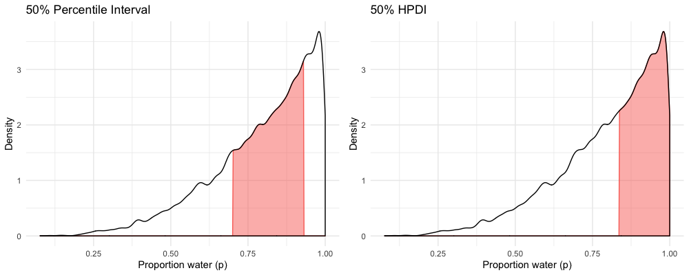
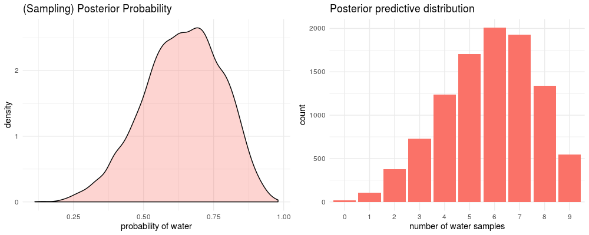

# 3. Sampling the Imaginary

95%의 확률로 뱀파이어 여부를 정확하게 진단하는 테스트가 있다고 생각해보자. (`Pr(Positive | vampire) = 0.95`) 
가끔 실수를 하기도 하는데, 1%의 확률로 일반인은 뱀파이어로 잘못 진단한다. (`Pr(positive | mortal) = 0.01`) 
굉장히 정확한 테스트지만, False Positive 기준으로는 그렇지 않다. 마지막으로 뱀파이어는 전체 인구 중 0.1%를 차지한다. (`Pr(vampire) = 0.001`)

이제 어떤 사람이 테스트에서 양성 판정을 받았다고 가정해보자. 이 사람이 뱀파이어일 확률은 얼마일까?

```
Pr(vampire | positive)
= Pr(positive | vampire) * Pr(vampire) / Pr(positive)

Pr(positive)
= Pr(positive | vampire) * Pr(vampire) 
    + Pr(positive | mortal) * (1 - Pr(vampire))
```

계산해보면 양성 판정일 때 실제로 뱀파이어인 확률은 8.7% 에 해당한다. 
많은 사람들은 이 결과가 직관적이지 않다고 생각할 것이다.
 하지만 이 결과는 현실에 존재하는 많은 검사들, 예를 들면 에이즈나 DNA 검사가 이루어지는 구조를 모방하고 있다. 
 발생 확률이 극히 낮은 경우라면, 발생할 것이라고 예측한 결과의 대부분은 실제로 그렇지 않은 (false positive) 현상이 발생한다.

사실 두 가지 이유로 이 예제를 좋아하지 않는다.

1. "베이지안" 이기 때문에 가능한 내용이 없다. 베이지안 추론은 베이즈 이론을 사용하는지 여부가 아니라 확률에 대한 관점을 통해 구분하는 것이다.
2. 이 예제는 실제보다 베이지안 추론을 더 어려운 것처럼 보이게 한다

확률 대신 아래와 같이 빈도를 통해 문제를 다시 설명해보자.

1. 인구 10만 명 중에서 100명은 뱀파이어다
2. 뱀파이어 100명 중에서 95명은 뱀파이어 검사에서 양성 반응이 발생한다
3. 99,900명의 일반인 중에서 999명은 뱀파이어 검사에서 양성 반응이 발생한다.

이제 다시 양성 판정을 받은 사람 중에서 뱀파이어의 비율을 계산해보자. `95 / (95 + 999)` 로 쉽게 계산할 수 있다. 

확률보다는 빈도수로 이 문제를 다룰 때 사람들이 직관적으로 인식하는 것 같다. 
그리고 우리는 현실 세계에서 주로 빈도수를 접하고, 다루고 있다. 
그렇다면 이러한 현상을 잘 이용해보자. 확률 분포를 바탕으로 샘플링하여 빈도수 값을 생성하는 것이다. 
다른 분포들처럼 Posterior 또한 확률 분포이기 때문에 posterior로부터 샘플을 추출할 수 있다. 여기서는 파라미터 값을 샘플링을 통해 생성할 것이다.

# 3.1 Sampling from a grid-approximate posterior

Grid Approximation을 통해 지구본 던지기 예제의 Posterior를 다음과 같이 계산할 수 있었다. 
여기서 Posterior란 특정한 데이터를 알고 있을 때 비율이 `p`일 확률을 의미한다.

```r
# Grid를 정의한다
p_grid <- seq(from = 0, to = 1, length.out = 1000)

# Prior를 정의한다
prior <- rep(1, 1000)

# 그리드의 각 값에서 Likelihood를 계산한다
likelihood <- dbinom(x = 6, size = 9, prob = p_grid)

# Likelihood와 Prior의 곱을 계산한다
unstd_posterior <- likelihood * prior

# Posterior 분포의 합이 1이 되도록 조정한다
posterior <- unstd_posterior / sum(unstd_posterior)
```

이제 Posterior 에서 10,000개의 샘플을 추출한다. Posterior가 가능한 모든 파라미터 값들을 모아둔 바구니라고 생각해보자. 
0부터 1 사이의 다양한 값들이 들어있을 것이다. 각 파라미터들은 다양한 비율로 존재할 텐데, 분포상 가장 높은 곳 근처의 값들은 꼬리보다 비교적 더 많이 등장할 것이다. 
10,000개의 샘플을 뽑았을 때, 바구니가 잘 섞여 있다고 가정하면 샘플의 분포는 실제 분포와 거의 동일한 비율을 가질 것이다. 

R로는 다음과 같은 코드로 계산할 수 있다. 샘플링 결과가 Grid Approximation 결과와 유사하다는 것을 알 수 있다. 그리고 샘플링 수가 많아질수록 더욱 정확해질 것이다.

```r
samples <- sample(p_grid, prob = posterior, size = 1e4, replace = TRUE)
```


# 3.2 Sampling to summarize

일단 Posterior 분포를 만들어내면 모형이 할 일은 끝난 것이다. 
이제 우리가 posterior 분포를 요약하고 해석해야 한다. 
구체적으로 어떻게 요약할지는 전적으로 우리에게 달려 있지만, 자주 하게되는 질문은 다음과 같다.

1. Intervals of defined boundaries
2. Intervals of defined mass
3. Point Estimates

## 3.2.1 Intervals of defined boundaries

지구본 예제에서 물의 비율이 0.5 보다 작을 사후 확률을 계산해야 한다면 어떻게 해야 할까? Grid Approximation 방법으로 Posterior를 계산한 다음에 확률을 모두 더하면 된다.

```r
# p < 0.5 구간에 대한 모든 posterior 확률을 더한다
sum(posterior[p_grid < 0.5])
# [1] 0.1718746
```

값이 0.17이라는 것은 사후 확률이 0.5보다 작을 확률이 17%라는 것을 의미한다. 너무 간단하다. 하지만 Grid Approximation은 보통 실용적으로 사용하기 어렵기 때문에, 샘플링 결과를 통해 다시 계산해보자.

```r
sum(samples < 0.5) / 10000
# [1] 0.1631
```

완전히 동일하지는 않지만 비슷한 결과를 얻을 수 있다. 이런 방법을 사용하면 사후 확률이 0.5 에서 0.75 사이에 있을 가능성도 구할 수 있다. 

```r
sum(samples > 0.5 & samples < 0.75) / 10000
# [1] 0.6053
# 사후 확률이 0.5와 0.75 사이에 있을 가능성은 약 61%
```

## 3.2.2 Intervals of defined mass

논문에서는 defined mass의 구간을 계산하는 경우가 많다. 조금 더 일반적으로는 **신뢰 구간(Confidence Interval)** 이라고 말한다. 
비슷한 맥락에서 Posterior 확률의 구간은 **신용 구간(Credible Interval)** 이라고 한다. 
이러한 구간들은 파라미터들이 현재 모형과 데이터에 잘 어울리는 구간이 어느 정도인지를 나타낸다. 
이런 문제는 Grid Approximation 보다는 샘플링을 통해 해결하는 것이 더 쉽다.

```r
# 사후 확률 하위 80% 구간
quantile(samples, 0.8)
#       80% 
# 0.7657658

# 사후 확률 하위 10% ~ 상위 10% 구간
quantile(samples, c(0.1, 0.9))
#       10%       90% 
# 0.4524525 0.8178178
```

이런 종류의 구간은 양쪽 꼬리에 동일한 비율로 확률 질량을 부여한다. 이런 방식을 **Percentile Interval (PI)** 이라고 한다. 
이런 방식은 분포가 너무 비대칭이 아니라면 효과적으로 분포의 형태를 표현할 수 있다. 
하지만 어떤 파라미터가 데이터에 적합한지 표현하기에는 적절하지 않은 방식이다. 

지구본을 던졌는데 3번은 육지, 3번은 물이 나왔다고 해보자. 
uniform prior를 사용하고 있다면 분포가 한쪽으로 크게 쏠리기 때문에 `p=1` 에서 가장 높은 형태가 된다. 
이제 PI를 구해보면 다음과 같은 구간이 나온다.

```r
# rethinking 라이브러리의 PI 함수를 사용한다
PI(skewed_sample$sample, prob = 0.5)
#       25%       75% 
# 0.7017017 0.9309309
```

그런데 위 구간을 보면 가장 밀도가 높은 구간(`p=1` 부근)을 포함하지 않는다. 파라미터가 실제로 존재할 가능성이 가장 높은 구간을 빠뜨리는 것이다.

이번에는 HPDI (Highest Posterior Density Interval) 를 구해보자. HPDI는 주어진 확률 질량을 포함하는 가장 좁은 구간을 의미한다. 
이 구간은 사후 확률이 가장 큰 파라미터 구간을 찾는다. 그 결과 구간의 폭이 PI보다 훨씬 줄어든 것을 볼 수 있다. 

```r
# rethinking 라이브러리의 HPDI 함수를 사용한다
HPDI(skewed_sample$sample, prob = 0.5)
#      |0.5      0.5| 
# 0.8368368 1.0000000
```



HPDI 가 PI 대비 몇 가지 장점이 있긴 하지만 대체로 두 구간은 거의 비슷하다. 
Posterior 분포가 한 쪽으로 크게 쏠려있을 때는 차이가 발생한다. 
그리고 HPDI는 계산량이 훨씬 많고 시뮬레이션에 의한 편향 (Posterior로부터 샘플을 어떻게 뽑느냐에 따라 결과가 변할 수 있다) 이 발생하기 쉽다는 단점이 있다. 

그리고 만약에 어떤 구간을 사용하는지에 따라 해석이 달라질 여지가 있다면, 그냥 전체 Posterior 분포를 그래프로 나타내는 것이 더 나을 수도 있다.

## 3.2.3 Point Estimates

세 번째 Posterior 요약 작업은 특정한 하나의 값으로 요약 추정하는 것이다. 전체 Posterior 분포를 어떤 값으로 요약할 것인가? 
분포를 하나의 값으로 요약하면서 정보를 잃게 될 수도 있다. 이런 작업이 필요한걸까?

하지만 하나의 값으로 요약해야 한다면, 몇 가지 주의해야 할 것이 있다. 지구본 던지기 예제에서 3번 던졌을 때 3번 다 바다가 나오는 상황을 생각해보자. 

```r
p_grid <- seq(from = 0, to = 1, length.out = 1000)
prior <- rep(1, 1000)

set.seed(123)
likelihood <- dbinom(x = 3, size = 3, prob = p_grid)

unstd_posterior <- likelihood * prior
posterior <- unstd_posterior / sum(unstd_posterior)  

#### MAP ####
p_grid[which.max(posterior)]
# 1
```

이번에는 Posterior를 샘플링해서 결과를 살펴보자.

```r
# Samling 결과를 바탕으로 점추정
samples = sample(p_grid, prob = posterior, size = 10000, replace = TRUE)

chainmode(samples, adj = 0.01) # MAP    = 0.9898463
mean(samples)                  # mean   = 0.798269
median(samples)                # median = 0.8368368
```

동일한 Posterior를 요약하는 세 가지 지표 (MAP, mean, median) 가 상당히 다르다는 것을 볼 수 있다. 이 중에서 어떤 값을 선택해야 할까?

한 가지 방법은 Loss Function을 선택하는 것이다. Loss Function은 특정한 point estimate를 사용하는데 드는 비용을 정의한다. 
가장 중요한 것은 Loss Function이 달라지면 Point Estimates도 달라진다는 점이다. 

간단한 예제로 살펴보자. 내기를 하나 해보자. 지구본 예제에서 정답이라고 생각하는 물의 비율을 제시한다. 
바로 맞힌다면 $100를 준다. 하지만 틀렸다면, 틀린 거리만큼 상금을 줄인다. 
여기서 중요한 점은 실제 값과 선택한 값의 거리가 Loss와 비례한다는 것이다.

이 때 Posterior 분포를 알고 있다면 어떻게 기대 수익을 최대로 높일 수 있을까? 
이러한 상황에서 기대 수익을 가장 높이는 것은 Posterior 분포 상에서 중앙값을 사용하면 된다는 것이 알려져 있다. 
수학적인 증명 없이 결과를 구해보자.

특정한 선택이 주어진 상황에서 기대 수익/손실을 구한다는 것은 Posterior를 사용해 실제 값에 존재하는 불확실성에 대한 기대값을 계산한다는 것을 의미한다. 
물론 우리는 대부분의 경우 실제 값을 알 수 없다. 하지만 파라미터들에 대한 정보를 알고 있다면, 다시 말해 Posterior 분포 전체를 사용한다면 계산할 수 있다. 
우선  `p=0.5` 라고 생각했을 때의 기대 손실을 계산해보자.

```r
# p=0.5 라고 했을 때 Weighted Average Loss를 계산한다
# 여기서 가중치는 대응되는 Posterior 확률값이 사용된다
sum(posterior * abs(0.5 - p_grid))
# 0.3128752

# 이제 가능한 모든 결정구간에 대해서 계산해보자
loss <- sapply(p_grid, function(d) sum(posterior * abs(d - p_grid)))

# Loss가 최소화되는 지점을 구한다
p_grid[which.min(loss)]  # 0.8408408

# Posterior Median과 비교해보자
median(samples)          # 0.8368368
```

계산해보면 이 지점은 Posterior Median 이라는 것을 알 수 있다. 
샘플링으로 인해 완전히 동일한 결과가 나오지는 않겠지만, 상당히 근접한 결과가 나올 것이다.

정리하면, Point Estimate를 결정하기 위해서는 Loss Function을 선택해야 한다. 대표적인 두 가지 방식이 있다.

1. Absolute Loss ( `|d - p|` ) : 중앙값이 Point Estimate가 된다
2. Quadratic Loss ( `(d - p)^2` ) : 평균이 Point Estimate가 된다

만약 Posterior 분포가 대칭형이고 정규분포와 비슷한 형태라면, 두 가지 방식은 큰 차이가 발생하지 않는다. 
하지만 지구본 던지기 예제와 같은 경우라면 (9번 던져서 6번 물이 나왔다) 두 Loss는 꽤 큰 차이가 난다. 

# 3.3 Sampling to simulate prediction

샘플링으로 많이 하게 되는 작업 중 하나는 모형이 내포하고 있는 관측치를 시뮬레이션하는 것이다. 시뮬레이션은 다음과 같은 이유로 유용하게 사용된다.

1. **모형 설계** : Posterior 뿐만 아니라 Prior에도 샘플링을 적용할 수 있다. 모형이 기대하는 바를 확인함으로써 Prior의 의미를 보다 정확하게 파악할 수 있다.
2. **모형 확인** : 모형을 데이터로 업데이트 한 뒤에 학습이 잘 되었는지, 모형이 어떤 식으로 동작하는지 확인한다.
3. 소프트웨어 검증 : 모형을 학습하는 소프트웨어가 잘 동작하는지 검증하기 위해, 임의의 모형을 바탕으로 시뮬레이션 데이터를 생성한 뒤 원래의 파라미터를 잘 예측하는지 확인한다.
4. 연구 설계 : 가설을 바탕으로 관측치를 시뮬레이션 할 수 있다면, 실험 설계가 효과적일지 여부를 계산해 볼 수 있다.
5. 예측 : 새로운 관측치를 예측하는 데 사용할 수 있다. 이러한 예측은 모형을 평가하고 개선하는 데에도 활용할 수 있다.

## 3.3.1 Dummy Data

지구본 던지기 예제를 간단하게 다시 정리해보자. 

- 실제 물의 비율을 의미한 값 `p`가 존재한다 (우리가 알고자 하는 값)
- 지구본을 던지면 '물' 또는 '육지' 라는 관찰값이 생성된다 (각각의 비율은 p, 1-p)

이전 장에서는 관측치를 바탕으로 `p` 값이 있음직한 영역을 추론할 수 있었다. 그런데 시뮬레이션을 사용하면 모형을 바탕으로 했을 때 발생할 관측치를 시뮬레이션 할 수도 있다. 이렇게 시뮬레이션으로 생성한 데이터를 **Dummy Data** 라고 한다. 지구본 던지기 예제에서는 Binomial Likelihood를 통해 관측치를 생성한다.

```
Pr(W | N, p) = ( N! / ( W! * (N-W)! ) * p^W * (1-p)^{N-W}

N : 지구본을 던진 횟수
W : "물"이 관측된 횟수
```

`p=7` 이라고 할 때, 물이 관측된 횟수별로 등장할 가능성을 계산해보자.

```r
dbinom(0:2, size = 2, prob = 0.7)
# 0.09 0.42 0.49

# - 물이 0번 등장할 확률은 9%
# - 물이 1번 등장할 확률은 42%
# - 물이 2번 등장할 확률은 49%
```

이번에는 위에서 구한 확률값을 바탕으로 관측치를 시뮬레이션해보자.

```r
rbinom(1, size = 2, prob = 0.7)
# 1
# -> 두 번 지구본을 던져서 1번 물이 나왔다는 것을 의미한다

# 시뮬레이션을 10번 수행해보자
rbinom(10, size = 2, prob = 0.7)
# 2 1 2 1 0 2 1 1 1 2
```

Dummy 관측치를 10만 번 생성해보자. 0, 1, 2가 각각 얼마만큼의 비율로 등장하는지 계산해보자. 
수식을 통해 이론적으로 계산한 값과 거의 비슷한 것을 볼 수 있다.

```r
dummy_w <- rbinom(1e5, size = 2, prob = 0.7)
table(dummy_w) / 1e5
#       0       1       2 
# 0.08945 0.41776 0.49279

# 지구본을 9번씩 던지도록 시뮬레이션 해본다
dummy_w <- rbinom(1e5, size = 9, prob = 0.7)
table(dummy_w) / 1e5
#     0     1     2     3     4     5     6     7     8     9 
# 0.000 0.000 0.004 0.021 0.073 0.172 0.265 0.269 0.156 0.040
```

## 3.3.2 Model Checking

모형을 확인한다는 것은 다음과 같은 것들을 파악하는 작업을 말한다.

1. 모형 학습 작업이 잘 이루어졌는가?
2. 모형이 목적에 적합한가?

간단하게는 실제 데이터와 모형을 통해 생성한 결과를 비교해보는 방식으로 모형이 잘 학습되었는지 확인할 수 있다. 
특히 지구본 던지기 예제는 구현이 간단하기 때문에 쉽게 확인할 수 있다. 이번에는 모형의 적합성을 확인해보자. 
모형의 가정이 맞는지 틀렸는지 확인하는 것이 아니다. 오히려 모형이 어떻게 데이터를 잘못 설명하고 있는지 확인하고자 한다.

지구본 던지기 예제의 시뮬레이션 결과로 간단한 모형 확인 작업을 해보자. 여기서 관측하는 값은 **지구본을 던졌을 때 물이 등장한 횟수**다. 
이 때 모형의 예측에는 두 가지 종류의 불확실성이 존재한다.

1. **관측 값의 불확실성** : 실제 p값을 알고 있더라도, 바로 다음 지구본을 던졌을 때 어떤 값이 나올지는 알 수 없다
2. **파라미터 `p`에 대한 불확실성** : Posterior 분포 자체가 p에 대한 불확실성을 나타낸다

파라미터 불확실성을 활용해보자. 모든 파라미터 구간에 대해 결과물의 샘플링 분포를 구할 수 있다. 
그리고 각 `p`값에 대한 예측 분포의 평균을 구한다. 이렇게 **Posterior Predictive Distribution**을 구할 수 있다. 

1. Posterior 분포를 구한다
2. 파라미터를 구간별로 쪼개고, 각 구간의 파라미터 값을 바탕으로 샘플링한 예측 분포를 구한다
3. 2번의 파라미터 구간별 예측 분포를 종합한다 (이 때, Posterior 확률을 가중치로 사용한다)

```r
# 파라미터의 불확실성을 예측에 반영해보자
# -> 파라미터 샘플링 결과를 시뮬레이션에 적용한다
# -> samples : Posterior 분포의 샘플링 결과 ([0,1] 구간의 확률값, 길이 10000의 벡터)
posterior_predictive_w <- rbinom(1e4, size = 9, prob = samples)
```

아래에서 우측의 그래프가 Posterior Predictive 분포를 나타낸다. 
실제로 실험에서 6번 물이 나왔는데 그래프에서도 6에 해당하는 막대가 가장 높은 것을 볼 수 있다. 
분포가 상당히 넓게 퍼져있지만, 이것은 Binomial 분포의 특성이지 파라미터 `p`의 불확실성 때문이 아니다.



하지만 아직 모형이 완벽하다고 판단하기엔 이르다. 지구본을 던지는 각각의 실험이 서로 연관되어 있지는 않을까? 정말 각각의 시행이 독립일까? 
지구본을 던질 때 조금 부주의했다면 계속해서 태평양 부분을 선택해버릴 수 있다. 

다음과 같이 데이터를 조금 다른 시각에서 살펴볼 수도 있다.

- 지구본을 9번 던진 결과가 W L W W W L W L W 이라고 할 때, 연속으로 물이나 대륙이 나온 길이를 고려해보자 (여기서는 W가 3번 연속으로 등장했다)
- 샘플링 과정에서 W → L, 또는 L → W 로 변화가 몇 번 일어났는지 확인한다 (6번 발생했다)

시뮬레이션을 통해 두 가지 지표를 추출하여 분포를 그리고, 관측한 데이터의 지표가 어디쯤 위치하는지 확인해 볼 수 있다.
