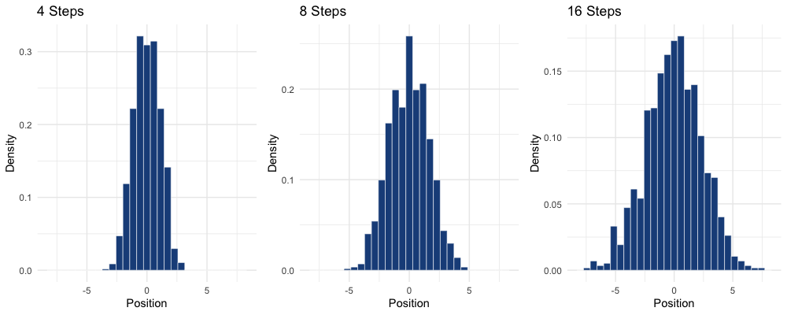

# 4. Geocentric Models

클라우디오스 프톨레미오스는 이집트의 수학자이자 천문학자로, 지동설을 주장한 것으로 유명하다. 
원 안의 원인 주전원 (epicycle) 이라는 개념을 통해 높은 정확도로 천체의 궤도를 설명할 수 있었다. 
현재 우리는 실제 태양계의 형태를 알고 있기 때문에 행성들이 지구를 중심으로 돈다는 주장이 말도 안된다고 생각할 수 있다. 
하지만 고대의 사람들은 일반화된 근사 추정 시스템을 통해 그러한 결론을 도출했다. 
여러 개의 원형 궤도가 포함될 수 있는 공간이 충분하다면, 프톨레미오스의 접근 방식은 푸리에 급수와 비슷해진다. 
주기 함수를 삼각함수의 급수로 분해할 수 있게 되는 것이다. 
따라서 실제로 행성이 어떤 궤도를 돌고 있든, 지동설은 밤하늘에서 별들이 어떻게 움직이는지 설명할 수 있다. 

**선형 회귀 (Linear Regression)** 는 통계학에서 지동설 모형과 비슷한 위치에 있다. 
지동설과 마찬가지로 다양한 문제를 해결할 수 있으며, 그 구조를 제대로 파악하지 못한다면 실수를 저지르기 쉽다. 
물론 잘 사용하면 매우 유용할 것이다. 이번 장에서는 베이지안의 방식으로 선형 회귀 모형을 이해해보자.
확률적으로 해석하면, 선형 회귀는 관심사의 불확실성을 정규분포를 통해 표현한다. 이런 유형의 모형은 모든 상황에 유용하지는 않다. 
하지만 익숙해지고 나면 정규분포를 이용하지 않는 모형으로 쉽게 나아갈 수 있다.

# 4.1 Why normal distributions are normal

수많은 사람들이 운동장에 한가운데 서서 동전을 던진다. 앞면이 나오면 왼쪽으로, 뒷면이 나오면 오른쪽으로 한 걸음 움직인다. 
모든 사람들이 16번씩 동전을 던졌을 때 중앙선 부근에 서 있는 사람들의 비율을 계산할 수 있을까? 
각각의 사람들이 어떤 결과를 얻게 될지는 알 수 없지만, 전체적인 비율에 대해서는 꽤 자신감 있게 이야기 할 수 있다.

## 4.1.1 Normal by addition

위 사례를 시뮬레이션을 통해 확인해보자. 각각의 사람들이 -1, 1 사이의 임의의 숫자를 뽑는다. 
그리고 이 작업을 1000번 반복한다. 임의의 숫자를 4, 8, 16번 뽑은 결과를 비교해보자.

```r
pos4  <- replicate(1000, sum(runif(4,  -1, 1)))
pos8  <- replicate(1000, sum(runif(8,  -1, 1)))
pos16 <- replicate(1000, sum(runif(16, -1, 1)))
```



숫자를 뽑는 횟수가 많아질수록 익숙한 종 모양의 형태에 가까워진다. 더 많이 뽑는다면 정규분포에 점차 수렴하게 될 것이다. 왜 그렇게 되는 걸까?

**동일한 분포에서 랜덤하게 추출한 값을 더하는 모든 확률 과정은 정규분포로 수렴한다.** 그런데 왜 하필 종모양이 되는걸까? 
직관적으로 생각해보자. 모든 개별값은 평균으로부터 변동이 생긴 것이라고 볼 수 있다. 이러한 변동들이 더해지면 서로의 효과가 상쇄되기 시작한다. 
커다란 변동은 반대쪽으로의 커다란 변동을 상쇄시킨다. 이런 과정이 반복되면 모든 합계는 평균과 차이가 나지 않게 된다. 
이러한 현상은 어떤 분포에 의해 발생되는지와는 상관이 없다. 방금 예제처럼 Uniform 분포여도 되고, 다른 분포여도 상관없다. 
분포에 따라서는 수렴이 느릴 수 있지만, 결국 수렴하게 되어있다. 그리고 대부분은 빠른 속도로 수렴한다.

## 4.1.2 Normal by multiplication

정규분포를 얻을 수 있는 방법이 한 가지 더 있다. 유기체의 성장률이 12가지 유전자에 따라 다르다고 가정해보자. 
그리고 모든 위치들이 서로 상호작용해서 성장을 비율로 증가시킨다고 가정해보자. 이렇게 되면 효과는 더해지는 것이 아니라 곱해진다. 
다음 코드를 실행해보면 결과가 정규분포에 근사한다는 것을 알 수 있다. 왜 이런 결과가 나오는 것일까?

```r
# [1.0, 1.1] 사이의 임의의 수 12개를 뽑아서 총 성장률을 계산한다
prod(1 + runif(12, 0, 0.1))

# 10000번 수행했을 때의 분포를 확인해보자
growth <- replicate(10000, prod(1 + runif(12, 0, 0.1)))
rethinking::dens(growth, norm.comp = TRUE)
```

10%씩 성장하도록 하는 유전자가 2개 있다고 해보자.

- 1.1 x 1.1 = 1.21
- 1.1 x 1.1 = (1 + 0.1) x (1 + 0.1) = 1 + 0.2 + 0.01

(1.1 + 1.1) 과 (1.1 x 1.1) 은 0.01밖에 차이가 나지 않는다. 각 유전자의 효과가 작을수록 근사시키는 정확도가 더 높아진다. 
이런 방식으로 효과를 곱하는 방식은 더하기로 근사되기 때문에 결국 정규분포에 수렴하게 된다.

## 4.1.3 Normal by log-multiplication

곱하는 값의 비율이 커지면 정규분포로 근사하지 않게 된다. 하지만 이 경우에도 로그 스케일로는 정규분포를 따르게 된다.

```r
log_big <- replicate(10000, log(prod(1 + runif(12, 0, 0.5))))
```    

로그 값을 더하는 것은 원래 값을 곱하는 것과 동일하기 때문에 정규분포를 따르게 된다. 
값의 스케일과는 무관하게, 측정값에 로그를 취하게 되면 정규분포를 따르는 값을 생성할 수 있다.

## 4.1.4 Using Gaussian distributions

모형을 사용할 때 정규분포를 사용해도 될까? 두 가지 측면에서 접근해보자.

### 4.1.4.1 Ontological justification

**세상은 근사적으로는 모두 정규분포로 가득하다.** 측정에서 발생하는 오류, 추세의 변동성, 분자의 속도는 모두 정규분포로 근사한다. 
이렇게 되는 이유는 여러 변동성들을 **더하는** 과정이기 때문이다. 그 결과 정규분포를 기반으로 하는 모형은 세부적인 과정 각각에 대해서는 명확하게 판별할 수 없다. 
하지만 다시 말하면, 세부적인 각각의 과정들은 모르더라도 모형이 유용한 결과를 얻어낼 수 있다는 의미가 된다. 

자연에는 다양한 패턴이 존재하기 때문에, 만물이 정규분포만을 따를 것이라는 오해를 해서는 안된다. 
이후에 소개할 지수분포, 감마분포, 포아송분포도 자연적으로 등장하는 분포다. 
정규분포는 **Exponential Family** 라고 불리는, 자연적으로 등장하는 근본적인 분포들의 그룹에 속한다. 
이러한 분포들은 실제 세상을 구성하고 있기 때문에 과학적으로 매우 중요하다.

### 4.1.4.2 Epistemological justification

**정규분포는 우리가 얼마나 모르는지 표현한다.** 이것이 우리가 모델링을 위해 정규분포를 사용하는 또 한 가지 이유이자, 
종종 정규분포를 사용하는 것이 오히려 나쁜 결과를 내는 원인이 된다. 정규분포는 우리의 무지를 표현하는 가장 자연스러운 방식이다. 
분산이 유한하다면 정규분포는 추가적인 가정없이 가장 많은 형태의 분포를 설명할 수 있다. 이러한 관점에서는 정규분포가 가장 적합한 분포다. 
만약 정규분포가 적합하지 않다는 생각이 든다면, 다른 종류의 분포가 필요하다.

일단 지금은 정규분포를 사용해서 모델링을 진행해보자. 특정한 모형을 사용하는 것은 무언가 맹세를 하는 것이 아니라는 점을 명심하자. 
모형이라는 그 골렘은 당신의 수하일 뿐이다. 

정규분포를 쓰지 않는 것이 좋은 상황에 대해서는 나중에 살펴보자.

# 4.2 A Language for describing models

이 책에서는 통계적 모형을 표현하고 다루기 위한 표준 문법을 사용한다. 그 방식은 다음과 같다.

1. 우리가 이해하고자 하는 변수들이 있다. 그 중에서 우리가 관측할 수 있는 변수를 **Data** 라고 한다. 비율이나 평균처럼 관측할 수 없는 변수는 **Parameter** 라고 한다.
2. 각각의 변수를 **다른 변수를 통해 표현**하거나, **확률 분포**의 형태로 나타낸다. 이러한 정의를 통해 변수들 사이의 관계를 알 수 있다.
3. 변수들과 각각의 확률 분포를 통해 **Joint Generative Model** 을 구성한다. 모형을 통해 실제 데이터를 분석하거나 시뮬레이션을 수행할 수 있다.

## 4.2.1 Re-describing the globe tossing model

이전 장의 지구본 던지기 문제를 다시 표현해보자. 

```
W ~ Binomial(N, p)
p ~ Uniform(0, 1)

- W는 지구본을 던져서 물이 나온 횟수
- p는 지구본에서 물이 차지하는 비율
```

이런 식으로 표현하면 모형이 가정하고 있는 내용까지 바로 알 수 있다. 이항 분포는 각 샘플이 서로 독립적으로 뽑히는 상황을 가정한다. 
따라서 지구본을 던졌을 때도 각 포인트는 서로 독립이라고 가정하고 있는 것이다. 

- 위 모형에서 첫 번째 줄은 베이즈 정리에서 말하는 **Likelihood** 를, 두 번째 줄은 **Prior** 를 의미한다
- 두 줄 모두 확률론적(stochastic) 관계이기 때문에 `~` 기호로 표시되어 있다
    - 확률론적 관계는 변수 또는 파라미터 하나를 확률 분포와 연결지은 것이다
    - 변수의 값을 확실하게 알 수 없기 때문에 *"확률론적(stochastic)"* 이라고 말한다

# 4.3 Gaussian model of height

실제 데이터를 통해 선형 회귀 모형을 구성해보자. 여기서는 한 가지 측정 변수를 사용해 정규 분포로 모델링한다. 
정규 분포를 구성하기 위해서는 평균과 표준편차라는 2개의 파라미터가 필요하다. 
가능한 모든 평균/표준편차 조합에 대해 각 조합이 얼마나 타당한지 데이터를 통해 계산하면, 이 값이 바로 posterior 확률이 된다. 
실제로 계산할 때는 근사치로 구하게 된다. 모든 조합을 구하는 대신 "분포의 분포" 형태로 표현한다.
