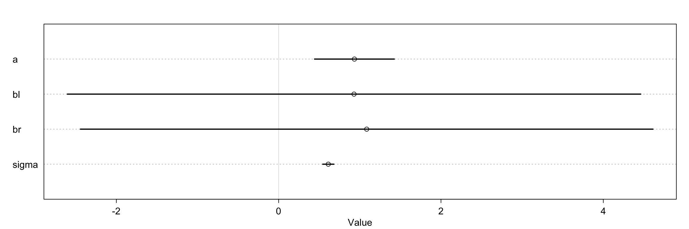
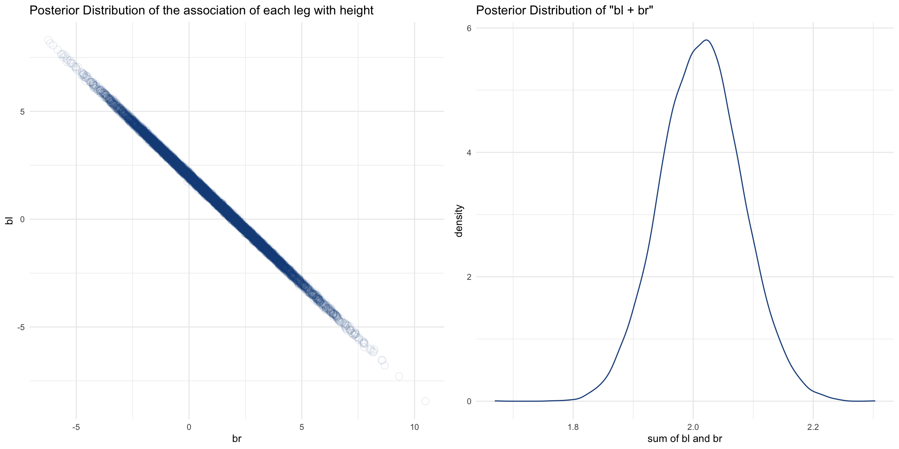

# 6. The Haunted DAG & The Causal Terror

가장 뉴스거리가 되는 과학 연구들은 가장 믿을 것이 못되는 것처럼 보인다. 나에게 가장 해가 되는 것처럼 보일수록, 사실은 그렇지 않은 경우가 있다. 
지루한 주제일수록 결과는 더 가치있다. 이런 음의 상관관계가 어떻게 존재할 수 있는 것일까? 
실제로 이런 음의 상관관계가 발생하기 위해서는 논문을 리뷰하는 사람이 뉴스로서의 가치와 신뢰성에 관심을 가지기만 하면 된다. 
그렇게 되면 선택하는 행위 그 자체만으로도 뉴스로서 가치가 높을수록 신뢰성이 낮아 보이게 만들 수 있다.

이런 현상을 **Berkson's Paradox** 라고 한다. 하지만 쉽게 이해하려면 **선택 편향** 효과라고 생각하면 된다. 
이게 다중 회귀 모형과 어떤 관계가 있을까? 안타깝게도, 모든 것이 연관되어 있다. 
이전 장의 내용만 놓고 보면 잘 모르겠을 때는 모든 변수를 모형에 넣으면 알아서 잘 처리해 줄 것처럼 보인다. 하지만 그렇지 못하는 경우도 있다. 
회귀 모형은 예언자처럼 수수께기 같은 이야기를 하고, 우리가 잘못된 질문을 던지면 그 대가를 치루게 한다. 선택 편향 문제는 다중 회귀 모형 안에서도 일어날 수 있다. 
예측 변수를 추가하는 행동으로 인해 통계적인 선택이 이루어지고, 그 결과 이름만으로는 무슨 의미인지 알기 어려운 **충돌 편향(Collider Bias)** 이 발생한다. 
이것이 특정한 변수에 조건을 부여했을 때, 뉴스로서의 가치와 신뢰성 사이의 음의 상관관계가 있는 것처럼 느껴지게 하는 잘못된 해석을 하게 만든다.

이번 장에서는 세 가지 큰 위험에 대해 다룬다. 

- Multicollinearity
- Post-treatment bias
- Collider bias

그리고 유효한 통계적 추론을 위해 어떤 변수를 넣거나 빼야하는지 알아보는 방법에 대해서 다룬다.

# 6.1 Multicollinearity

다중 공선성(Multicollinearity) 은 두 개 이상의 예측 변수가 서로 강한 상관관계를 가지는 경우를 말한다. 
그 결과 모든 변수가 결과 변수와 연관있더라도 어떤 변수도 결과 변수와 연관이 없다는 결론을 내리게 된다. 
이런 현상은 다중 회귀모형이 동작하는 방식 때문에 발생한다. 간단한 시뮬레이션을 통해 살펴보자.

## 6.1.1 Multicollinear legs

사람의 다리 길이를 통해 키를 예측하는 시뮬레이션을 해보자. 키는 다리 길이와 관련이 있다. 
그렇지 않더라도 적어도 이번 시뮬레이션에서는 그렇게 가정하고 있다. 하지만 두 다리 길이를 모두 모형에 넣으면, 무엇인가 이상한 일이 일어난다. 

100명의 데이터를 시뮬레이션으로 생성해보자. 평균적으로 다리 길이는 키의 45% 정도가 되도록 설정해두었기 때문에, beta 계수는 2.2 정도가 될 것이라고 예상해 볼 수 있다. 
(평균 키 / 평균 다리 길이 = 10 / 4.5 = 2.2)

```r
library(rethinking)
library(tidyverse)

simulate_height <- function(N, seed = 123) {
    # N : 시뮬레이션 하려는 인원수
    set.seed(seed)                 # Random Seed 설정
    leg_prop <- runif(N, 0.4, 0.5) # 키 대비 다리의 비율
    
    # 키, 왼다리, 오른다리 길이를 시뮬레이션한다
    tibble(
        height = rnorm(N, 10, 2),
        leg_left = leg_prop*height + rnorm(N, 0, 0.02), 
        leg_right = leg_prop*height + rnorm(N, 0, 0.02)
    )
}

# 100명의 키를 시뮬레이션으로 생성한다
height_data <- simulate_height(100)
```

이런 데이터에 매우 모호하고 잘못된 prior를 적용할 경우 어떻게 되는지 살펴보자. 그래프를 그려보면 posterior 평균과 표준 편차가 정말 이상하는 것을 볼 수 있다. 

```r
m_leg_01 <- quap(
    alist(
        height ~ dnorm(mu, sigma),
        mu <- a + bl*leg_left + br*leg_right,
        a ~ dnorm(10, 100),
        bl ~ dnorm(2, 10),
        br ~ dnorm(2, 10),
        sigma ~ dexp(1)
    ),
    data = height_data
)

precis(m_leg_01)
#       mean   sd  5.5% 94.5%
# a     0.96 0.31  0.47  1.45
# bl    0.95 2.21 -2.58  4.47
# br    1.06 2.20 -2.46  4.58
# sigma 0.61 0.04  0.54  0.68

plot(precis(m_leg_01))
```



Posteior 학습은 잘 되었다. 그리고 posterior 분포는 우리의 질문에 적합한 대답을 해주었다. 문제는 바로 그 질문이다. 질문은 다음과 같다.

> 다른 쪽 다리의 길이를 이미 알고 있을 때, 한 쪽 다리 길이를 추가로 알게되는 것은 얼마나 가치있을까?

이 이상한 질문에 대한 답변은 여전히 이상하지만, 매우 논리적이다. 우선 bl 과 br 의 Posterior 분포를 그래프로 그려서 살펴보자.

```r
# Posterior 분포로부터 샘플링한다
m_leg_01_posterior <- m_leg_01 %>% 
    extract.samples() %>% 
    as_tibble()

p1 <- m_leg_01_posterior %>% 
    ggplot(aes(x = br, y = bl)) +
    geom_point(size = 3, color = '#1D4E89', shape = 21, alpha = 0.1) +
    labs(title = 'Posterior Distribution of the association of each leg with height') +
    theme_minimal(base_size = 10)

p2 <- m_leg_01_posterior %>% 
    mutate(sum_bl_br = bl + br) %>% 
    ggplot(aes(x = sum_bl_br)) +
    geom_density(color = '#1D4E89') +
    labs(x = 'sum of bl and br',
        title = 'Posterior Distribution of "bl + br"') +
    theme_minimal(base_size = 10)

gridExtra::grid.arrange(p1, p2, ncol = 2)
```



두 파라미터의 posterior 분포는 매우 상관관계가 크다. bl 이 커지면 br 이 작아진다. 
두 변수가 거의 같은 값을 가지기 때문에, 동일한 예측을 하는 bl, br 조합을 거의 무한하게 생성해 낼 수 있다.

이 현상을 설명하기 위해 모형을 다음과 같이 근사시켰다고 생각해보자. 동일한 `x_i` 값이 두 번 사용되었기 때문에 현재 우리가 처한 상황과 매우 유사하다.

```
y_i ~ Normal(mu_i, sigma)
mu_i <- alpha + beta1*x_i + beta2*x_i
     <- alpha + (beta1 + beta2)*x_i
```

위 수식에서 beta1, beta2 파라미터는 분리될 수 없다. 둘 다 독립적으로 `mu` 에 영향을 주는 것이 아니기 때문이다. 
beta1과 beta2의 합이 mu 에 영향을 줄 뿐이다. 
따라서 posterior 분포는 beta1과 beta2의 합이 실제 x, y의 연관성과 비슷해질 때 가능한 모든 beta1, beta2의 조합을 보여준다.

만약 변수를 하나만 사용한다면 실제와 거의 동일한 posterior mean을 구하게 된다.

```r
m_leg_02 <- quap(
    alist(
        height ~ dnorm(mu, sigma),
        mu <- a + bl*leg_left,
        a ~ dnorm(10, 100),
        bl ~ dnorm(2, 10),
        sigma ~ dexp(1)
    ),
    data = height_data
)

# bl 파라미터의 mean은 2.01로 mean(bl)+mean(br) 값과 거의 동일하다
precis(m_leg_02)
#       mean   sd 5.5% 94.5%
# a     0.93 0.31 0.44  1.42
# bl    2.01 0.07 1.91  2.12
# sigma 0.61 0.04 0.54  0.68
```

이번 예제는 상당히 명확하지만 심각한 인과적인 문제를 다루고 있지는 않다. 다음은 더 흥미로운 예제를 살펴보자.

## 6.1.2 Multicollinear milk

다리 길이 문제에서는 두 변수를 동시에 사용하는 것이 이상하다는 것을 쉽게 알 수 있었다. 
하지만 실제 데이터에서는 상관관계가 높은 두 변수가 충돌할 것이라 예상하지 못한다는 것이 문제다. 
결국 우리는 posterior 분포를 잘못 해석하게 되어 두 변수가 모두 중요하지 않다는 결론을 내리게 될 것이다.

다시 이전 장의 `milk` 데이터로 돌아가보자.

```r
data('milk', package = 'rethinking')
# kcal.per.g   : total energy content
# perc.fat     : percent fat
# perc.lactose : percent lactose
# * perc.fat 과 perc.lactose 두 변수는 높은 음의 상관관계를 보인다

milk_data <- milk %>% 
    as_tibble() %>% 
    mutate(K = scale(kcal.per.g)[,1],
           F = scale(perc.fat)[,1],
           L = scale(perc.lactose)[,1])
```

`kcal.per.g` 변수가 `perc.fat` 과 `perc.lactose` 에 대한 함수인 것처럼 모형을 구성해보자. 우선은 각각의 단일 회귀모형을 구한다.

```r
# kcal.per.g ~ perc.fat
m_milk_kf <- quap(
    alist(
        K ~ dnorm(mu, sigma),
        mu <- a + bF*F,
        a ~ dnorm(0, 0.2),
        bF ~ dnorm(0, 0.5),
        sigma ~ dexp(1)
    ),
    data = milk_data
)

# kcal.per.g ~ perc.lactose
m_milk_kl <- quap(
    alist(
        K ~ dnorm(mu, sigma),
        mu <- a + bL*L ,
        a ~ dnorm(0, 0.2),
        bL ~ dnorm(0, 0.5),
        sigma ~ dexp(1)
    ),
    data = milk_data
)

precis(m_milk_kf)
#       mean   sd  5.5% 94.5%
# a     0.00 0.08 -0.12  0.12
# bF    0.86 0.08  0.73  1.00
# sigma 0.45 0.06  0.36  0.55

precis(m_milk_kl)
#        mean   sd  5.5% 94.5%
# a      0.00 0.07 -0.11  0.11
# bL    -0.90 0.07 -1.02 -0.79
# sigma  0.38 0.05  0.30  0.46
```

`perc.fat` 이 높아지면 `kcal.per.g` 도 높아진다. `perc.lactose` 가 높아지면 `kcal.per.g` 가 낮아진다는 모델링 결과를 볼 수 있다. 
그런데 두 변수를 모두 모형에 넣으면 어떻게 될까?

```r
# kcal.per.g ~ perc.fat + perc.lactose
m_milk_kfl <- quap(
    alist(
        K ~ dnorm(mu, sigma),
        mu <- a + bF*F + bL*L,
        a ~ dnorm(0, 0.2),
        bF ~ dnorm(0, 0.5),
        bL ~ dnorm(0, 0.5),
        sigma ~ dexp(1)
    ),
    data = milk_data
)

precis(m_milk_kfl)
#        mean   sd  5.5% 94.5%
# a      0.00 0.07 -0.11  0.11
# bF     0.24 0.18 -0.05  0.54
# bL    -0.68 0.18 -0.97 -0.38
# sigma  0.38 0.05  0.30  0.46
```

이제 `bF` 와 `bL` 모두 posterior mean 값이 이전보다는 0에 가까워진 것을 볼 수 있다. 
그리고 표준 편차가 거의 두 배 가량 늘었다. 이 현상은 다리 길이 예제와 동일한 통계적 현상을 나타낸다. 

다중공선성을 다루기 위한 여러 가지 방법들이 언급되는데, 인과적인 측면에서 다루는 내용은 드물다. 
각 변수 쌍의 상관계수를 보는 것은 적절하지 않다. 문제가 되는 쪽은 상관계수가 아니라 조건부 관계다. 

모유 수유를 자주 하는 종의 모유는 묽고 에너지가 적다. 이런 경우는 당(lactose)이 많아진다. 
모유 수유를 자주 하지 않는 종의 경우 에너지가 더 풍부해야 한다. 그런 경우는 지방(fat)이 풍부해진다. 
이런 현상은 다음과 같은 인과 모형으로 이어진다.

```
L <- (D) -> F
L -> K
F -> K
```

가장 중심이 되는 트레이드오프는 모유가 얼마나 진한지 (dense) 여부를 나타내는 변수가 결정한다. 
우리는 이 변수를 관찰하지 않았기 때문에 원으로 표현한다. 만약 D 변수를 관찰했다면 바로 K 변수에 대한 회귀모형을 구성해서 인과적인 효과를 추정할 수 있었을 것이다. 

다중공선성은 모델링 문제 중에서 **비식별성(Non-Identifiability)** 문제에 속한다. 
어떤 파라미터가 식별 불가능하다면 데이터와 모형이 해당 파라미터의 값을 추정할 수 없다는 것이다. 
일반적으로는 현재 데이터가 관심있는 파라미터에 대한 정보를 충분히 담고 있다는 보장이 없다. 
정보를 충분히 담고 있지 않다면, prior와 매우 비슷한 posterior 를 반환할 것이다. 
따라서 모형이 데이터로부터 정보를 얼마나 끌어내느냐를 본다는 점에서, prior와 posterior를 비교하는 작업은 좋은 방법이다.

# 6.2 Post-treatment bias

중요한 예측 변수를 빠뜨려서 잘못된 추론을 하게 될까봐 걱정하는 일은 항상 발생한다. 
변수를 빠뜨려서 발생하는 편향( **Omitted variable bias** ) 은 이전 장의 예제에서 많이 다루었다. 
이것보다 조금 덜 발생하는 문제 중 하나는, 어떤 변수의 결과로 이루어진 변수를 포함하는 것이다. 
이것을 **Post-Treatment Bias** 라고 한다. 

"post-treatment" 라는 말은 실험 설계에서 나온 용어다. 온실에서 식물을 기르기로 했다고 생각해보자. 
식물에 자라는 토양에 곰팡이가 생기면 성장에 방해가 되기 때문에, 곰팡이 방지 토양이 얼마나 효과가 있는지 알아보기로 했다. 
최종적으로 식물이 발아한 뒤 높이와 곰팡이 발생 여부를 측정한다. 우리의 최종 관심사는 식물의 높이다. 
그런데 만약 인과 관계를 파악하고 싶은 거라면 곰팡이 존재 여부를 모형에 포함해서는 안된다. 왜냐면 그건 post-treatment 효과이기 때문이다.

시뮬레이션을 통해 구체적으로 어떻게 문제가 되는지 살펴보자.

```r
simulate_plants <- function(N, seed = 123) {
    # N   : 식물의 개수
    # seed: random seed
    
    # 시뮬레이션을 통해 기본 높이값을 생성한다
    set.seed(seed)
    h0 <- rnorm(N, 10, 2)
    
    # treatment 여부를 할당한다
    treatment <- rep(0:1, each = N/2)
    # 곰팡이 발생 여부를 시뮬레이션한다
    fungus <- rbinom(N, size = 1, prob = 0.5 - treatment*0.4)
    # 곰팡이 발생에 따른 성장을 반영한다
    h1 <- h0 + rnorm(N, 5 - 3*fungus)
    
    tibble(
        h0 = h0, 
        h1 = h1,
        treatment = treatment, 
        fungus = fungus
    )
}

# 100개의 식물 데이터를 생성한다
sim_plant <- simulate_plants(100)
precis(sim_plant)
# 'data.frame': 100 obs. of 4 variables:
#            mean   sd  5.5% 94.5%  histogram
# h0        10.18 1.83  7.51 13.09 ▁▁▃▃▇▇▃▂▂▁
# h1        14.33 2.27 10.61 17.55 ▁▃▃▃▅▅▇▇▃▁
# treatment  0.50 0.50  0.00  1.00 ▇▁▁▁▁▁▁▁▁▇
# fungus     0.29 0.46  0.00  1.00 ▇▁▁▁▁▁▁▁▁▃
```

## 6.2.1 A prior is born

실제 분석과정에서는 데이터가 생성되는 프로세스를 모를 가능성이 더 높다. 
하지만 과학적인 정보를 통해 모형을 어떻게 구성해야 좋을지 감을 잡을 수 있다. 

우선 시간 `t=1` 시점의 식물은 `t=0` 보다는 커야 한다. 
따라서 높이의 절대값을 사용하는 대신 `t=0` 대비 상대적인 비율을 파라미터로 두게 되면 prior를 더 쉽게 설정할 수 있다. 
우선 단순하게 하기 위해 예측 변수 없이 키 변수에만 집중해보자. 다음과 같은 모형이 된다.

```
h_{1,i} ~ Normal(mu_i, sigma)
mu_i = h_{0,i} * p

* h_{0,i} : 식물 i의 t=0 시점의 높이
* h_{1,i} : 식물 i의 t=1 시점의 높이
* p       : h_{0,i} 대비 h_{1,i} 의 비율
```

따라서 prior를 결정할 때 p의 평균을 1로 두면 식물들의 키가 더 자라지 않을 것이라 생각한다는 것을 의미한다. 
실험이 잘못되어 식물이 죽어버릴 수 있기 때문에 p가 1보다 작아질 수도 있다. 하지만 비율이기 때문에 0보다는 커야한다. 
항상 양수인 이 값을 위해 **Log-Normal** 분포를 prior로 사용해보자.

```r
m_plant_h <- quap(
    alist(
        h1 ~ dnorm(mu, sigma),
        mu <- h0 * p,
        p ~ dlnorm(0, 0.25),
        sigma ~ dexp(1)
    ),
    data = sim_plant
)

# 평균 40% 정도 성장한다는 것을 알 수 있다
precis(m_plant_h)
#       mean   sd 5.5% 94.5%
# p     1.39 0.02 1.36  1.42
# sigma 1.86 0.13 1.65  2.06
```

이제 treatment와 곰팡이 변수를 추가해보자. 

```r
m_plant_htf <- quap(
    alist(
        h1 ~ dnorm(mu, sigma),
        mu <- h0 * p,
        p <- a + bt*treatment + bf*fungus,
        a ~ dlnorm(0, 0.2),
        bt ~ dnorm(0, 0.5),
        bf ~ dnorm(0, 0.5),
        sigma ~ dexp(1)
    ),
    data = sim_plant
)

precis(m_plant_htf)
#        mean   sd  5.5% 94.5%
# a      1.49 0.02  1.45  1.53
# bt    -0.02 0.03 -0.06  0.02
# bf    -0.30 0.03 -0.35 -0.25
# sigma  1.24 0.09  1.10  1.38
```

결과를 보면 treatment의 효과는 0에 가깝고, 곰팡이로 인한 효과는 식물의 성장에 악영향을 미치는 것으로 보인다. 
그런데 여기서 treatment가 식물의 성장에 영향을 준다는 것을 **알고 있다면** 어떻게 될까? 실제로 우리는 그렇게 시뮬레이션을 했다.

## 6.2.2 Blocked by consequence

문제는 곰팡이가 대부분 treatment의 결과로 나타난다는 것이다. 따라서 이 경우에는 `fungus` 변수가 post-treatment 변수라고 할 수 있다. 
만약 `fungus` 변수를 통제하려고 하면 모형은 다음과 같은 질문을 하는 것이 된다. 
*식물에 곰팡이가 피었다는 것을 알고 있을 때 토양의 곰팡이 방지 처리 여부가 영향을 미치는가?* 답은 "아니오" 다. 
왜냐면 토양의 처리 결과는 곰팡이를 방지하는 형태로 식물의 성장에 영향을 미치기 때문이다. 
하지만 우리가 실험을 통해 알고자 하는 것은 토양이 식물의 성장에 미치는 영향이다. 
이것을 제대로 추정하기 위해서는 `fungus` 같은 post-treatment 변수를 모형에서 제거해야 한다.

```r
m_plant_ht <- quap(
    alist(
        h1 ~ dnorm(mu, sigma),
        mu <- h0 * p,
        p <- a + bt*treatment,
        a ~ dlnorm(0, 0.2),
        bt ~ dnorm(0, 0.5),
        sigma ~ dexp(1)
    ),
    data = sim_plant
)

precis(m_plant_ht)
#       mean   sd 5.5% 94.5%
# a     1.33 0.02 1.29  1.37
# bt    0.11 0.03 0.06  0.17
# sigma 1.77 0.12 1.57  1.96
```

이제 토양에 곰팡이 방지 처리를 하는 것이 식물의 성장에 효과적인 것으로 제대로 나타난다. 
식물의 초기 높이인 h0 처럼 인과적 영향을 추정하는데 영향을 미칠 수 있는 요소들은 통제하는 것이 합리적이다. 
그런데 post-treatment 변수를 포함해버리면 treatment의 효과 자체를 가려버릴 수 있다. 

## 6.2.3 Fungus and d-separation

DAG의 형태로 문제를 살펴보는 것이 도움이 된다.

```
H0 -> H1 <- F <- T

* H0 : plant height at time 0
* H1 : plant height at time 1
```

현재 모형이 F 변수를 포함할 경우, treatment가 결과 변수에 영향을 미치는 경로를 막아버린다. 
이것은 곰팡이가 피었는지 여부를 알고 있는 한은 treatment의 정보를 아는 것이 결과 변수에 영향을 미치지 못한다는 것을 의미한다.

DAG를 중심으로 이야기하면, F 변수에 조건을 부여하는 경우 **d-separation** 이 발생한다. 
d-separation 은 DAG 상의 어떤 변수들이 다른 변수들에 대해 독립이라는 것을 말한다. 서로를 이어주는 경로가 없는 것이다. 
여기서는 **F를 알고 있을 때 H1이 T로부터 d-separated** 되어 있다. 왜 이런일이 발생할까? 
우리가 F 변수에 대해 알고 있다면 T를 안다고 해서 H1에 대한 정보를 더 얻을 수 없기 때문이다. 
다음과 같은 코드를 통해 DAG에 어떤 조건부 독립 관계가 있는지 알아볼 수 있다.

```r
library(dagitty)

dag_plant <- dagitty('
dag {
    H_0 -> H_1
    F -> H_1
    T -> F
}')

impliedConditionalIndependencies(dag_plant)
# F _||_ H_0
# H_0 _||_ T
# H_1 _||_ T | F
```
