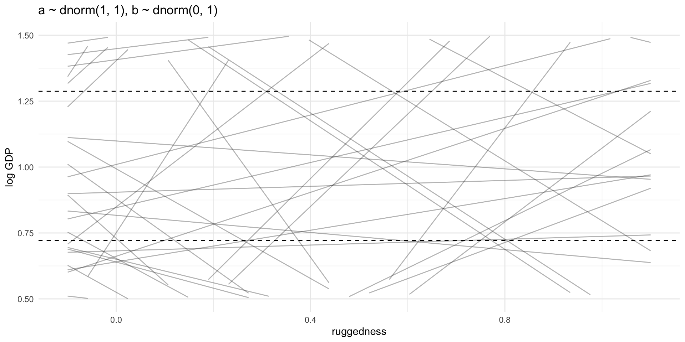
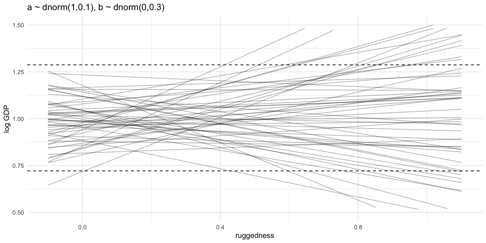
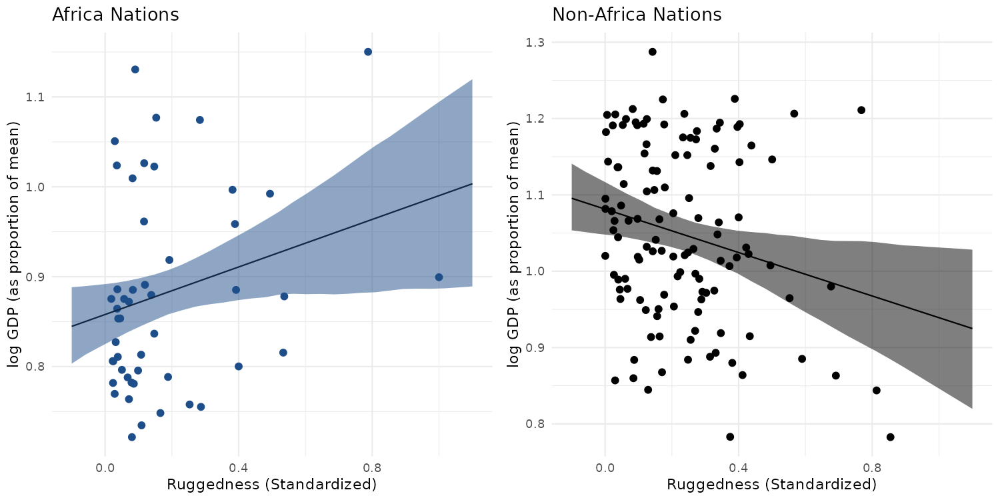
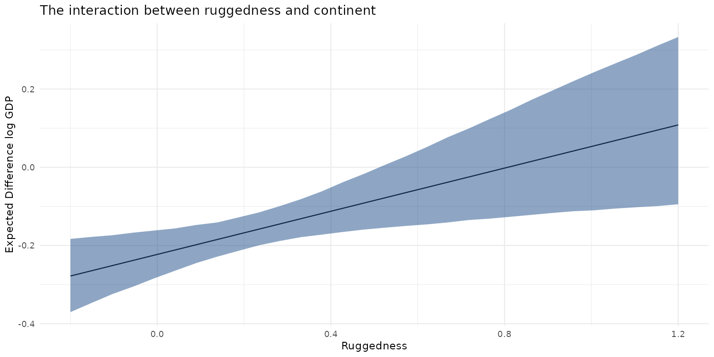

# 8. Conditional Manatees

매너티(Manatee)는 따뜻하고 얕은 물에 사는 포유류이다. 자연적인 천적은 없지만, 매너티들이 살고 있는 물가에는 모터 보트가 많아서 보트의 프로펠러로 인해 위험을 겪을 때가 많다. 
성장한 매너티 중 상당수는 보트와 충돌하면서 생긴 상처를 가지고 있다고 한다.

암스트롱 휘트워스 휘틀리(Armstrong Whitworth A.W.38 Whitley)는 제 2차 세계대전 기간에 사용된 폭격기다. 
매너티와는 달리 위험한 천적들이 있다. 바로 대포와 요격 사격이다. 많은 폭격기들이 임수에서 돌아오지 못했고, 살아서 돌아온 폭격기들도 무수한 상처를 가지고 있다. 

매너티와 폭격기의 공통점은 무엇일까? 매너티는 프로펠러로 인해 생긴 상처를 가지고 있고, 폭격기는 사격으로 인한 구멍이 생겼다. 
그렇다면 남아있는 상처를 토대로 생존율을 높일 방법을 찾아볼 수 있지 않을까? 
매너티를 위해서는 보트의 프로펠러가 매너티와 충돌하지 않게 감싸고, 폭격기가 많이 사격 받는 위치에 추가로 장갑을 덧대는 방법이 있을 것이다.

하지만 두 경우 모두, 정보들이 우리를 헷갈리게 만든다. 프로펠러는 사실 매너티가 부상을 입거나 죽는 가장 주요 원인이 아니다. 
부검 결과를 살펴보면 오히려 보트의 용골처럼 날카롭지 않은 부분에 부딪혔을 때 더 큰 피해를 입는다는 것을 알 수 있다. 
마찬가지로 폭격기에 사격으로 인한 상처가 많은 곳의 장갑을 덧대는 것은 큰 효과가 없다. 오히려 상처가 적은 곳을 집중적으로 보완해야 한다. 

살아남은 매너티와 폭격기에서 정보를 얻었을 때 잘못된 판단을 하게 되는 이유가 무엇일까? 바로 **생존했다는 조건 하에서만** 정보를 얻었기 때문이다. 
용골에 부딪힌 매너티는 프로펠러에 부딪히는 경우보다 살아남는 경우가 적었다. 따라서 살아있는 매너티 중에서는 프로펠러와 충돌했던 경우가 많았다. 
폭격기도 비슷하다. 조종석과 엔진에 손상을 입지 않은 기체들은 무사히 기지로 돌아올 수 있었다. 그 반대는 돌아오지 못했다. 
제대로 된 답을 찾기 위해서는 양쪽의 맥락을 모두 이해할 수 있어야 한다.

조건을 부여하는 것(Conditioning)은 통계적 추론 과정에서 중요한 원칙 중 하나다. 모든 추론은 무언가를 조건으로 한다. 
비록 우리가 파악하지 못했더라도 말이다. 선형 모형은 각 데이터의 예측 변수를 조건으로 했을 때 결과 변수를 설명한다. 
하지만 단순한 선형 모형에서는 여러 조건을 충분하게 설명하지 못할 때가 많다. 
이제까지 다룬 예시 모형에서는 대부분 각 예측변수가 결과변수의 평균과 독립적인 상관관계가 있다고 가정했다. 그 관계가 조건부일 수 있다면 어떨까? 

더 깊은 조건을 모형에서 표현하려면, 다시 말해 한 예측 변수의 중요도가 다른 예측 변수의 값에 따라 달라질 수 있다면 
이것을 표현하기 위해서는 **교호작용(Interaction)** 이 필요하다. Interaction은 흔하게 볼 수 있지만, 다루기는 쉽지 않다.

# 8.1 Building an interaction

아프리카는 참 특별한 곳이다. 그 중에서도 지리적으로는 이상한 방향으로 특별하다. 
보통 지정학적으로 나쁜 위치에 있는 경우 경제력에 부정적인 영향을 미친다. 그런데 아프리카는 정반대의 추이가 나타난다. 
이 현상에 대해 더 살펴보기 위해 지형 기복지표(Terrain Ruggedness Index, 좋지 않은 지형의 사례다)와 log GDP 간의 회귀모형을 구성해보자. 

TRI가 높을 경우 운송수단이 발달하기 어려워지고 이로 인해 시장에 접근하기 어려워진다. 따라서 대부분의 국가에서는 TRI가 높아질수록 GDP가 낮아지는 추이를 보인다. 
그렇기 때문에 반대의 현상이 나타나는 아프리카가 신기해진다. 왜 이런 결과가 나타나는 것일까? 
이유를 고민해보면, 험준한 지형의 국가들은 노예 거래가 적게 이루어졌기 때문일 수 있다. 
하지만 GDP에 영향을 주는 요인이 너무 많기 때문에 정확히 어떤 이유로 그런 현상이 발생했는지 알기는 어렵다. 

이러한 현상을 데이터에서 찾아내고 설명하려면 어떻게 해야 할까? 앞서 살펴봤던 것처럼 아프리카 여부로 데이터를 나누어 쪼개보는 것은 그다지 좋은 방법이 아니다. 
크게 다음과 같은 4가지 이유가 있다.

1. sigma 처럼 아프리카 여부와는 상관없는 파라미터들이 존재한다. 데이터를 특정 변수를 기준으로 쪼갠다면 이러한 변수에 대한 추정 정확도가 낮아질 수 있고, 이 과정에서 암묵적인 가정들이 포함될 수 있다.
2. 데이터를 나누기 위한 기준이 되는 변수에 대한 확률 정보를 얻기 위해서는 해당 변수가 모형에 포함되어야 한다. 여기서는 "아프리카 여부" 변수가 해당된다. 해당 변수의 값에 따라 불확실성이 어떻게 달라지는지 파악하는 것은 중요한 정보다.
3. 여러 모형을 비교하기 위해서는 동일한 데이터를 사용해야 한다. 따라서 데이터를 나누는 것이 아니라 모형이 자체적으로 데이터를 나누어 파악하게 해야 한다.
4. 다층 모형으로 확장하게 되면 특정 카테고리에서 샘플 사이즈가 매우 적어지는 문제가 생길 수 있다. 데이터를 한 번에 모델링하게 되면 다른 카테고리의 정보를 빌려오는 방식으로 문제를 일부 해결할 수 있다.

이제 간단한 모형을 통해 살펴보자.

## 8.1.1 Making two models

데이터를 불러와서 아프리카 아프리카가 아닌 경우 두 그룹으로 나누어보자.

```r
library(rethinking)
library(tidyverse)

# rugged 데이터
# - 각 행은 국가, 각 열은 경제/지리/역사와 관련된 변수들
data(rugged, package = 'rethinking')

# rugged 데이터 전처리
rugged_std <- rugged %>% 
  as_tibble() %>% 
  filter(complete.cases(rgdppc_2000)) %>% 
  mutate(log_gdp = log(rgdppc_2000),
         log_gdp_std = log_gdp / mean(log_gdp),
         rugged_std = rugged / max(rugged)) # 0에 의미가 있기 때문에 z-score를 사용하지 않는다

# 아프리카 여부에 따라 데이터를 분리한다
rugged_std_af <- rugged_std %>% filter(cont_africa == 1)
rugged_std_naf <- rugged_std %>% filter(cont_africa == 0)
```

변수들의 관계를 모델링하기 위해 우선 다음과 같은 형태의 모형을 세워보자.

- alpha 값은 ruggedness가 평균일 때 log GDP 값을 의미한다
    - 따라서 1에 가까워야 하기 때문에 Prior를 `Normal(1, 1)` 로 시작해보자
- beta 값은 0일 때 편향이 없는 것을 의미한다
    - 표준 편차는 아직 잘 모르니 1에서 시작한다 : `Normal(0, 1)`
- sigma의 Prior는 넓게 `exp(1)` 로 시작해보자

```
log(y_i) ~ Normal(mu_i, sigma)
mu_i = alpha + beta * (r_i - r_bar)
alpha ~ Normal(1, 1)
beta ~ Normal(0, 1)

y_i : 각 국가별 GDP
r_i : 각 국가별 Terrain Ruggedness
r_bar : 전체 Terrain Ruggedness 평균 (여기서는 0.215)
```

아프리카 국가들의 데이터에 모델링을 적용해보자.

- 그래프에서 점선은 실제 관측한 log GDP 값의 최대, 최소 값을 의미한다
    - 생성된 회귀선을 보면 실제 값 영역을 한참 넘어선 구간에도 많이 위치하는 것을 볼 수 있다
    - 회귀선은 ruggedness의 평균값인 0.215와 평균 log GDP인 1을 많이 지나가야 할 것 같다
- 기울기도 너무 실제 값에서 나타날 수 있는 영역을 많이 벗어나고 있다
- `a ~ dnorm(1, 0.1)` , `b ~ dnorm(0, 0.3)` 인 경우의 그래프와 비교해서 살펴보자

```r
m8.1_rugged_af_01 <- quap(
  alist(
    log_gdp_std ~ dnorm(mu, sigma),
    mu <- a + b * (rugged_std - 0.215),
    a ~ dnorm(1, 1),
    b ~ dnorm(0, 1),
    sigma ~ dexp(1)
  ),
  data = rugged_std_af
)

# Prior Prediction
set.seed(123)
m8.1_rugged_af_01_prior <- extract.prior(m8.1_rugged_af_01)
m8.1_rugged_af_01_mu <- link(
  m8.1_rugged_af_01, 
  post = m8.1_rugged_af_01_prior, 
  data = data.frame(rugged_std = seq(-0.1, 1.1, length.out = 30))
)

# 그래프 그리기 위한 형태로 변경
m8.1_rugged_af_01_mu_long <- t(m8.1_rugged_af_01_mu[1:50, ]) %>% 
  as_tibble() %>% 
  mutate(ruggedness = seq(-0.1, 1.1, length.out = 30)) %>% 
  tidyr::pivot_longer(cols = V1:V50, names_to = 'group', values_to = 'log_gdp')

ggplot(m8.1_rugged_af_01_mu_long, aes(x = ruggedness, y = log_gdp)) +
  geom_line(aes(group = group), alpha = 0.3) +
  geom_hline(yintercept = min(rugged_std$log_gdp_std), linetype = 2) +
  geom_hline(yintercept = max(rugged_std$log_gdp_std), linetype = 2) +
  ylim(0.5, 1.5) +
  labs(title = 'a ~ dnorm(1,1), b ~ dnorm(0,1)', y = 'log GDP') +
  theme_minimal()
```





이번에는 아프리카 국가가 아닌 경우를 모델링해보자. 모형은 이전과 동일하게 하고 데이터만 바꿔서 적용해보자. 
하나의 모형만으로 동일한 추론을 수행하려면 어떻게 해야 할까?

```r
m8.2_rugged_naf_01 <- quap(
  alist(
    log_gdp_std ~ dnorm(mu, sigma),
    mu <- a + b * (rugged_std - 0.215),
    a ~ dnorm(1, 0.1),
    b ~ dnorm(0, 0.25),
    sigma ~ dexp(1)
  ),
  data = rugged_std_naf
)

precis(m8.1_rugged_af_01_2)
#       mean   sd 5.5% 94.5%
# a     0.89 0.02 0.86  0.91
# b     0.13 0.07 0.02  0.25
# sigma 0.10 0.01 0.09  0.12

precis(m8.2_rugged_naf_01)
#        mean   sd  5.5% 94.5%
# a      1.05 0.01  1.03  1.07
# b     -0.14 0.06 -0.23 -0.05
# sigma  0.11 0.01  0.10  0.12
```

## 8.1.2 Adding an indicator variable doesn’t work

한 가지 짚고 넘어가야 하는 것은, 아프리카 여부를 나타내는 `cont_africa` 변수를 모형에 추가하는 것만으로는 기울기가 역전되는 것을 설명할 수 없다는 것이다. 
고민해 볼 만한 모형은 다음과 같이 두 가지가 있다.

1. 이전과 동일한 모형을(`log GDP ~ ruggedness`) 사용하되, 전체 데이터를 적용한다
2. 아프리카 여부에 따라 다른 절편값을 부여한다

```r
# 아프리카일 경우 1, 아닌 경우 2로 표기하는 변수를 추가한다
rugged_std2 <- rugged_std %>%
  mutate(cid = if_else(cont_africa == 1, 1, 2))

# 기존 모형 + 전체 데이터 사용
m8.3_rugged_all <- quap(
  alist(
    log_gdp_std ~ dnorm(mu, sigma),
    mu <- a + b * (rugged_std - 0.215),
    a ~ dnorm(1, 0.1),
    b ~ dnorm(0, 0.3),
    sigma ~ dexp(1)
  ),
  data = rugged_std2
)

# 아프리카 여부 + 전체 데이터 사용
m8.4_rugged_all <- quap(
  alist(
    log_gdp_std ~ dnorm(mu, sigma),
    mu <- a[cid] + b * (rugged_std - 0.215),
    a[cid] ~ dnorm(1, 0.1),
    b ~ dnorm(0, 0.3),
    sigma ~ dexp(1)
  ),
  data = rugged_std2
)

# WAIC가 63이나 차이가 난다. 아프리카 여부가 큰 영향을 미치는 것으로 보인다
compare(m8.3_rugged_all, m8.4_rugged_all)
#                   WAIC    SE dWAIC   dSE pWAIC weight
# m8.4_rugged_all -252.1 15.36   0.0    NA   4.3      1
# m8.3_rugged_all -188.6 13.35  63.4 15.19   2.7      0

# depth = 2 옵션을 통해 a 파라미터의 카테고리별 추정치를 살펴보자
# 아프리카인 경우(a[1]) 비 아프리카 국가에 비해 수치가 낮다
precis(m8.4_rugged_all, depth = 2)
#        mean   sd  5.5% 94.5%
# a[1]   0.88 0.02  0.85  0.91
# a[2]   1.05 0.01  1.03  1.07
# b     -0.05 0.05 -0.12  0.03
# sigma  0.11 0.01  0.10  0.12
```

아프리카 여부를 모형에 포함한 결과, 아프리카 국가들의 평균이 낮다는 점을 모형을 통해 설명할 수 있게 되었다. 
하지만 기울기에 대해서는 아무런 설명을 하지 못한다. 여전히 좋은 모형은 아니다.

## 8.1.3 Adding an interaction does work

기울기가 변하게 만들려면 인터렉션 효과를 추가해야 한다. 다시 말하면 아프리카 대륙 여부에 따라 조건부로 기울기가 결정되도록 해야 한다.

DAG에서는 아래와 같이 표기할 수 있다. 하지만 다음 DAG는 `G = f(R, C)` 의 관계라는 것만 알려주기 때문에, 인터렉션에 대한 정보를 표현할 수는 없다.

```
R -> G <- C

R : Ruggedness
G : GDP
C : Continent
```

```r
m8.5_rugged_all <- quap(
  alist(
    log_gdp_std ~ dnorm(mu, sigma),
    mu <- a[cid] + b[cid] * (rugged_std - 0.215),
    a[cid] ~ dnorm(1, 0.1),
    b[cid] ~ dnorm(0, 0.3),
    sigma ~ dexp(1)
  ),
  data = rugged_std2
)

precis(m8.5_rugged_all, depth = 2)
#        mean   sd  5.5% 94.5%
# a[1]   0.89 0.02  0.86  0.91
# a[2]   1.05 0.01  1.03  1.07
# b[1]   0.13 0.07  0.01  0.25    # 아프리카의 경우 slope의 방향이 다르다!
# b[2]  -0.14 0.05 -0.23 -0.06
# sigma  0.11 0.01  0.10  0.12
```

기울기의 변화로 인해 모형이 더 잘 학습되었을까? WAIC 값을 통해 앞서 학습했던 2개의 모형과 비교해보자.

8.5 모형의 경우 96%의 estimated model weight를 보이고 있다. 
만약 우리의 목표가 예측이었다면, 데이터가 인터렉션 효과의 존재를 강력하게 뒷받침하고 있다고 볼 수도 있는 상황이다.
하지만 8.4에 약간 부여된 weight를 통해, 모형 8.5의 기울기에 대한 posterior mean이 과적합되었다고 생각할 수 있다.
또한 상위 2개의 모형의 WAIC 차이의 Standard Error는 그 차이값 만큼이나 높다.
결국 아프리카 내에도 국가들이 너무 많다는 것이다.

```r
compare(m8.3_rugged_all, m8.4_rugged_all, m8.5_rugged_all)
#                   WAIC    SE dWAIC   dSE pWAIC weight
# m8.5_rugged_all -258.7 15.18   0.0    NA   5.4   0.96
# m8.4_rugged_all -252.2 15.25   6.6  6.74   4.3   0.04
# m8.3_rugged_all -188.6 13.21  70.1 15.44   2.8   0.00
```

WAIC 또는 LOO 값을 점추정으로 뽑고 싶다면, `pointwise = TRUE` 옵션을 추가한다.
어떤 국가들의 posterior가 값의 변동에 예민한지 확인하는데 도움이 된다.

```r
# 170 국가들 각각에 대한 WAIC 값을 추출한다
waic_list <- WAIC(m8.5_rugged_all, pointwise = TRUE)
```

## 8.1.4 Plotting the interaction

2개의 그래프를 그려보자. 

1. 아프리카 국가들에 대한 MAP 회귀선과 97% 구간
2. 비 아프리카 국가들에 대한 MAP 회귀선과 97% 구간

```r
# Africa Nations
af_mu_link <- link(
  m8.5_rugged_all, 
  data = data.frame(cid = 1, rugged_std = seq(from = -0.1, to = 1.1, length.out = 30))
)

af_mu_link_mean <- apply(af_mu_link, 2, mean)
af_mu_link_ci <- apply(af_mu_link, 2, PI, prob = 0.97)

af_mu_link_df <- tibble(
  rugged_seq = seq(from = -0.1, to = 1.1, length.out = 30),
  mu_mean = af_mu_link_mean,
  mu_ci_02 = af_mu_link_ci[1,],
  mu_ci_98 = af_mu_link_ci[2,]
)

p_af <- rugged_std_af %>% 
  ggplot() +
  geom_point(aes(x = rugged_std, y = log_gdp_std), size = 2, color = '#1D4E89') +
  geom_line(data = af_mu_link_df, aes(x = rugged_seq, y = mu_mean)) +
  geom_ribbon(data = af_mu_link_df, aes(x = rugged_seq, ymin = mu_ci_02, ymax = mu_ci_98), 
              fill = '#1D4E89', alpha = 0.5) +
  labs(x = 'Ruggedness (Standardized)', y = 'log GDP (as proportion of mean)',
       title = 'Africa Nations') +
  theme_minimal()

# Non-Africa Nations
naf_mu_link <- link(
  m8.5_rugged_all, 
  data = data.frame(cid = 2, rugged_std = seq(from = -0.1, to = 1.1, length.out = 30))
)

naf_mu_link_mean <- apply(naf_mu_link, 2, mean)
naf_mu_link_ci <- apply(naf_mu_link, 2, PI, prob = 0.97)

naf_mu_link_df <- tibble(
  rugged_seq = seq(from = -0.1, to = 1.1, length.out = 30),
  mu_mean = naf_mu_link_mean,
  mu_ci_02 = naf_mu_link_ci[1,],
  mu_ci_98 = naf_mu_link_ci[2,]
)

p_naf <- rugged_std_naf %>% 
  ggplot() +
  geom_point(aes(x = rugged_std, y = log_gdp_std), size = 2, color = '#000000') +
  geom_line(data = naf_mu_link_df, aes(x = rugged_seq, y = mu_mean)) +
  geom_ribbon(data = naf_mu_link_df, aes(x = rugged_seq, ymin = mu_ci_02, ymax = mu_ci_98), 
              fill = '#000000', alpha = 0.5) +
  labs(x = 'Ruggedness (Standardized)', y = 'log GDP (as proportion of mean)',
       title = 'Non-Africa Nations') +
  theme_minimal()

gridExtra::grid.arrange(p_af, p_naf, ncol = 2)
```



# 8.2 Symmetry of interactions

인터렉션은 뷔리당의 당나귀 문제와 비슷하다. 간단한 인터렉션 모형은 두 가지 대칭되는 해석으로 이해할 수 있다. 
모형 이외의 정보가 없다면, 두 해석 중 어떤 것이 더 맞는지 판단할 방법이 없다. GDP와 지형 기복 문제를 다시 한 번 살펴보자.
인터렉션은 두 가지 유효한 문장으로 풀어낼 수 있다.

1. 아프리카 국가 여부에 따라 지형 기복과 log GDP 사이의 상관관계가 어떻게 변할까?
2. 지형 기복에 따라 아프리카 국가 여부와 log GDP 사이의 상관관계가 어떻게 변할까?

두 가지 가능성은 다르지만, 모형이라는 골렘의 관점에서 이 둘은 동일하다. 먼저 수학적으로 살펴보자.

`mu_i` 에 대한 모형을 다시 살펴보자.

```
mu_i = alpha_{CID[i]} + beta_{CID[i]} * (r_i - r_bar)
```

이전에는 *"기울기가 대륙에 따라 다르다"* 라고 해석했다. 하지만 절편이 지형 기복에 따라 달라진다고 볼 수도 있다.
식을 아래와 같이 다시 작성해보자.

```
mu_i = (2 - CID_i) * (alpha_1 + beta_1 *(r_i - r_bar))
     + (CID_i - 1) * (alpha_2 + beta_2 *(r_i - r_bar))
```

- `CID_i = 1` 일 경우 첫 번째 항만 남는다
- `CID_i = 2` 일 경우 두 번째 항만 남는다

이제 어떤 나라가 아프리카 대륙이 되었다고 가정해서 어떤 변화가 일어나는지 상상해보자. 예측값이 어떻게 바뀌는지 알고 싶다면, 지형 기복 지표를 알아야 한다.
다음의 해석을 그래프로 그려보는 것이 도움이 된다. 

> 아프리카 대륙 여부와 log GDP의 관계는 지형 기복 지표에 따라 결정된다.

지형 기복 지표를 고정시켜 둔 상태에서 아프리카 여부에 따른 차이를 계산해보면 된다. 이 값을 계산하려면 `link` 를 두 번 사용하고 그 차이를 비교하면 된다.

```r
rugged_seq <- seq(from = -0.2, to = 1.2, length.out = 30)
mu_af <- link(m8.5_rugged_all, data = data.frame(cid = 1, rugged_std = rugged_seq))
mu_naf <- link(m8.5_rugged_all, data = data.frame(cid = 2, rugged_std = rugged_seq))
mu_delta <- mu_af - mu_naf

mu_delta_link_df <- tibble(
  rugged_seq = rugged_seq,
  mu_delta_mean = apply(mu_delta, 2, mean),
  mu_delta_ci_02 = apply(mu_delta, 2, PI, prob = 0.97)[1,],
  mu_delta_ci_98 = apply(mu_delta, 2, PI, prob = 0.97)[2,]
)

ggplot(mu_delta_link_df, aes(x = rugged_seq)) +
  geom_line(aes(y = mu_delta_mean)) +
  geom_ribbon(aes(ymin = mu_delta_ci_02, ymax = mu_delta_ci_98), 
              fill = '#1D4E89', alpha = 0.5) +
  labs(x = 'Ruggedness', y = 'Expected Difference log GDP', 
       title = 'The interaction between ruggedness and continent') +
  theme_minimal()
```



# 8.3 Continuous Interactions

나는 이 글을 읽는 사람들에게 인터렉션 효과를 해석하는 것이 어렵다는 것을 설명하고 싶다. 
카테고리 변수의 상호작용은 카테고리 변수에 따라 기울기를 다르게 두는 방향으로 문제를 좁힐 수 있었다.
하지만 연속형 변수가 변함에 따라 기울기가 점차 변한다는 것을 이해하는 것은 훨씬 어렵다.

이번 섹션에서는 두 개 이상의 연속 예측 변수간의 상호작용이 어떻게 구성되어 있으며, 어떻게 해석해야 할지 명확하게 보여주는 예제와 함께 상호작용을 시각화하는 방법에 대해서 설명해보려고 한다. 상호작용을 시각화하기 위해 트립틱(triptych, 3면으로 된 그림) 플랏을 그린다. 회귀 모형의 결과를 상호 보완적인 3개의 그래프를 통해 표현한다.
그래프에는 특별한 마법같은 것은 없다. 하지만 선택한 변수의 값이 변하는 과정에서 상호작용이 기울기를 어떻게 변화시키는지 살펴볼 수 있다.

## 8.3.1 A winter flower

다음 데이터는 온실에서 기르는 튤립의 크기를 기록한 결과다. 토양의 종류와 채광 상태가 튤립의 크기에 어떻게 영향을 미치는지 확인하려고 한다.

```{r}
data('tulips', package = 'rethinking')
tulips <- as_tibble(tulips)
glimpse(tulips, width = 70)
```

빛과 수분 모두 식물의 성장에 큰 영향을 미치지만 두 변수의 상호작용도 중요하다. 
예를 들어 빛이 부족한 상태에서는 아무리 물을 충분히 제공해도 식물이 성장하기 어려우며, 물이 부족할 경우에도 빛은 성장에 큰 도움이 되지 못한다. 이런 관계를 표현하기 위해 상호작용을 도입할 수 있다. 
단순히 두 변수의 선형 상호작용으로 시작해보는 것은 좋은 시작점이지만, 궁극적으로 우리가 원하는 결과와는 다소 거리가 있다.

## 8.3.2
