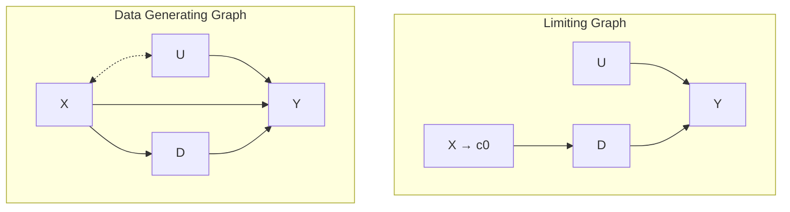

# Regression Discontinuity

<https://mixtape.scunning.com/regression-discontinuity.html>

Regression-discontinuity Design(RDD)은 1960년대부터 조금씩 사용되었지만 그 빈도가 많지는 않았다.
그러다가 1999년에 RDD를 사용한 몇 가지 논문이 크게 주목받으면서 이 방법론이 다시 부상하게 되었다.
경제학계에서 처음으로 RDD를 사용한 것은 1970년대 인데, 이 때부터 1999년까지 미시경제학에서 Potential Outcomes를 선택하는 경우가 많아졌다.
게다가 디지털화된 대량의 행정 데이터를 활용할 수 있게 되면서 treatment 배정에 특이한 행정상의 규칙이 적용된 정황을 확인하게 되었다.
이런 특이한 규칙과 대량의 데이터는 이 방법론을 처음 사용했던 Donald Campbell이 가정한 조건에 들어맞으면서 RDD 방법론이 부흥하는데 결정적인 영향을 미쳤다.

그렇다면 왜 RDD였을까? RDD는 선택 편향을 효과적으로 제거할 수 있는 특성이 있다. 그리고 선택 편향을 제거할 수 있으면 하위 그룹에 대해 보다 정확한 ATE를 추정할 수 있게 된다.
RDD는 간단한 아이디어를 바탕으로 한다. RDD를 DAG로 표현하면 다음과 같은 형태가 된다.

- 왼쪽의 그래프에서 `X` 는 Treatment `D` 에 영향을 미치는 연속형 변수다.
- Treatment 배정은 cutoff 스코어 `c_0` 를 기준으로 이루어진다. (스코어보다 높으면 Treatment)
- 배정에 사용되는 변수 `X` 는 `X -> Y` path를 통해 영향을 미칠 수 있으며, Y에 독립적으로 영향을 미치는 변수 집합 U와 X가 연관성이 존재할 수도 있다. 이 때 U는 Treatment에 영향을 미칠 수 없다.

이 때 DAG를 보면 X변수는 D와 Y의 공통 원인인 confounder라는 것을 알 수 있다. 게다가 cutoff를 통해 Treatment를 결정하기 때문에, 실험군과 대조군에는 동일한 X값이 존재하지 않는다. 이러한 상황에서는 (Matching과 마찬가지로) overlap 조건을 만족하지 않기 때문에 backdoor criterion이 성립하지 않는다.

하지만 RDD를 사용하면 인과효과를 찾아낼(identifying) 수 있다. 그 이유를 오른쪽에 있는 Limited DAG에서 확인할 수 있다.
우리는 컷오프 `c_0` 주위의 점수들을 통해 인과 효과를 판별할 수 있다. 구체적으로 말하면 X가 `c_0` 를 향해 한없이 가까워질 때 부분집합의 평균 인과 효과를 구할 수 있다.

RDD의 그래프 표현을 보면 다양한 가정 사항들이 명시적으로 드러나 있다. 
그 중에서도 지금 살펴보면 좋을 가정이 하나 있는데, 바로 컷오프가 개입에 직접적인 영향을 미치는 것과 Treatment 여부를 구분하는 것은 완전히 동일한 시점에 이루어지지 않는다는 점이다. 이것이 바로 연속성(continuity) 가정이다. 조금 더 형식적으로 설명하자면 컷오프 지점에서 expected potential outcomes가 연속이라는 것을 의미한다.
개인적으로는 귀무가설은 항상 연속성이 있는 상태로 표현되어야 하고, 모든 불연속성은 어떤 원인이 존재한다는 것을 의미한다고 생각한다. 왜냐하면 일반적으로 모든 것들은 점진적으로 변하는 것이 자연스럽다고 기대하기 때문이다. 찰스 다윈은 본인의 책 *종의 기원* 에서 이러한 현상을 요약하여 "자연은 중간에 건너뛰지 않는다." 라고 표현했다.

RDD에서는 ATE를 추정하기 위해 Treatment 여부를 선택하는 방식에 대한 사전 지식을 이용한다.
우리는 Treatment 배정 확률이 `c_0` 지점을 기준으로 불연속적으로 변한다는 것을 알고 있다. 따라서 `c_0` 지점의 위 아래를 나누고 각각의 LATE(local average treatment effect) 라는 값을 구해서 비교하면 된다. 겹치는 구간 즉, common support가 없기 때문에 extrapolation 에 의존할 수 밖에 없는 상황이다. 다시 말하면 실행 변수 (running variable)의 서로 다른 값을 가지는 단위를 비교하게 된다. 각 방향에서 X 변수가 cutoff 지점에 가까워지는 극한값에서만 겹치는 영역이 생긴다. 
RDD에서 사용하는 모든 방법론은 extrapolation 으로 인한 편향을 다루기 위한 방법이다.

RDD는 treatment에 속할 확률이 갑자기 점프하는 지점을 찾는다. 그러면 그 지점을 어떻게 찾아야 할까? 
사람들은 보통 규칙 속에 점프를 섞어 넣고, 운이 좋다면 이러한 규칙을 포함하는 데이터를 확보할 수 있다.
