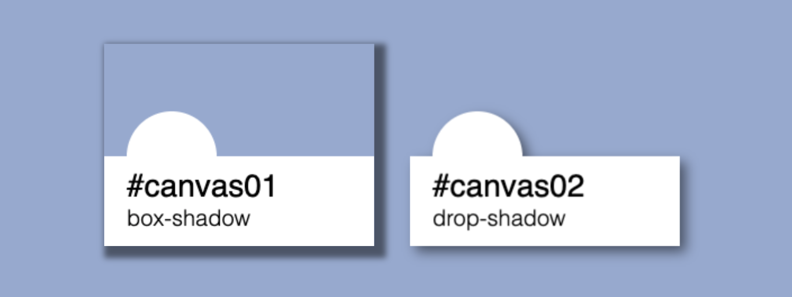

# CSS drop-shadow VS box-shadow

## 문제 상황

PNG 포맷이고 배경의 일부가 투명한 색상인 이미지가 있다. 여기에 CSS의 `box-shadow` 속성으로 그림자를 추가하면 이미지 가장 바깥쪽 테두리에 그림자가 만들어진다.
그런데 이미지 영역의 테두리가 아니라, 이미지 내의 불투명한 부분을 중심으로 그림자를 추가할 수는 없을까?

## 해결 방법

- CSS의 `drop-shadow` filter 를 사용해 그림자를 추가할 수 있다
- 모던 브라우저에서는 대부분 해당 필터를 지원한다
    - IE 11 에서는 사용할 수 없지만 DX 필터를 통해 해결할 수 있다고 한다
    - <https://caniuse.com/#feat=css-filters>

## drop-shadow 와 box-shadow 비교하기

Canvas 객체를 통해 투명한 배경을 포함하는 이미지를 그려보고. 필터를 적용하여 두 가지 방식의 그림자가 어떻게 달라지는지 살펴보자.

최종 결과는 다음과 같은 이미지가 된다.



```html
<div id="content">
  <canvas id="canvas01"></canvas>
  <canvas id="canvas02"></canvas>
</div>
```

```css
div#content {
  width: 530px;
  height: 200px;
  background-color: #93A9D1;
  padding: 20px 20px 20px 60px;
  box-sizing: border-box;
}

canvas {
  width: 180px;
  height: 135px;
  margin: 10px;
}
canvas:last-child {
  margin-right: 0px;
}

#canvas01 {
  box-shadow: 4px 4px 4px 4px rgb(0, 0, 0, 0.5);
}

#canvas02 {
  filter: drop-shadow(4px 4px 4px rgb(0, 0, 0, 0.5));
}
```

```javascript
const drawSample = (id, subtitle) => {
    const canvas = document.getElementById(id);

    // 이미지 해상도를 높이기 위한 비율 및 canvas 사이즈 설정
    const devicePixelRatio = 2;
    canvas.width = 120 * devicePixelRatio;
    canvas.height = 90 * devicePixelRatio;

    // Canvas Context 생성
    const ctx = canvas.getContext('2d');
    // devicePixelRatio 비율만큼 확대하여 그리도록 transform
    ctx.scale(devicePixelRatio, devicePixelRatio);

    // 흰색 사격형 추가
    ctx.fillStyle = '#ffffff';
    ctx.fillRect (0, 50, 120, 90);
    // 흰색 원 추가
    let circle = new Path2D();
    circle.arc(30, 50, 20, 0, 2 * Math.PI);
    ctx.fill(circle);

    // 텍스트 추가
    ctx.fillStyle = '#000000';
    ctx.font = '14px sans-serif';
    ctx.fillText(`#${id}`, 10, 68);
    ctx.font = '300 10px sans-serif';
    ctx.fillText(subtitle, 10, 81);

    // Context를 반환
    return ctx;
}

let ctx01 = drawSample('canvas01', 'box-shadow');
let ctx02 = drawSample('canvas02', 'drop-shadow');
```