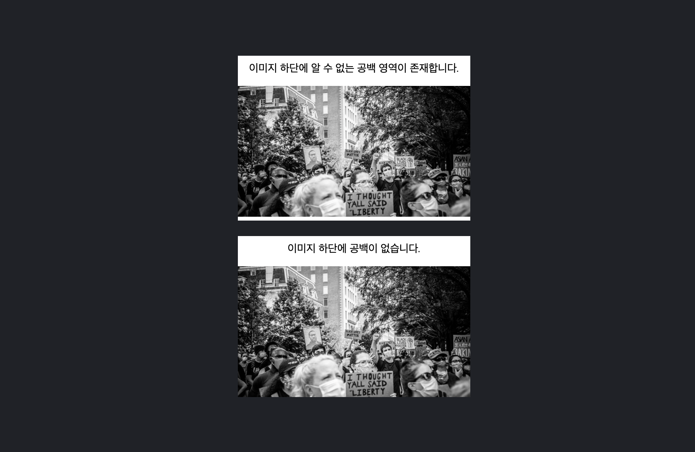

# div 태그 안에 이미지를 삽입할 때 생기는 빈 공간 제거하기

## 문제상황

- 다음과 같이 div 태그를 통해 이미지 태그를 감싸는 형태로 HTML을 구성했다
- 그런데 부모 div 태그의 아래쪽 padding을 0으로 설정해도, 이미지 하단에 알 수 없는 공백 영역이 생기는 것을 볼 수 있다
- 원래 의도대로 이미지 하단에 아무런 공백이 없도록 설정하려면 어떻게 해야 할까?

```html
<style>
.container {
  width: 300px;
  background-color: #FFFFFF;
  padding-bottom: 0;
  margin-bottom: 20px;
}
img {
  width: 100%;
}
</style>

<div class="container">
  
</div>
```



## 해결방법

- div 태그의 `font-size` 와 `line-height` 값 때문에 발생하는 현상이다
    - img 태그를 감싸고 있는 부모 태그의 `font-size` 값을 0으로 변경한다
    - `line-height` 를 0으로 두어도 해결된다
- 아래와 같이 CSS를 변경하면 위 예제와 동일한 결과를 얻을 수 있다

```html
<style>
body {
  height: 500px;
  background-color: #1f2227;
}

.container {
  width: 300px;
  background-color: #FFFFFF;
  margin-bottom: 20px;
}

.container p {
  font-size: 14px;
  text-align: center;
  padding-bottom: 0;
  padding-top: 0.5rem;
}

.rm-unintended-margin {
  font-size: 0;
  /* line-height: 0; */
}

img {
  width: 100%;
}
</style>

<div class="container">
  <p>이미지 하단에 알 수 없는 공백 영역이 존재합니다.</p>
  
</div>

<div class="container rm-unintended-margin">
  <p>이미지 하단에 공백이 없습니다.</p>
  
</div>
```

# 참고자료

- [Stackoverflow | Why is there an unexplainable gap between these inline-block div elements?](https://stackoverflow.com/a/19038859)
- [Stackoverflow | Why there is a gap space between DIV inline block boxes?](https://stackoverflow.com/a/38635505)
- [Unsplash | Photo by Vlad Tchompalov on Unsplash](https://unsplash.com/photos/7vaXdyYp2dI)
