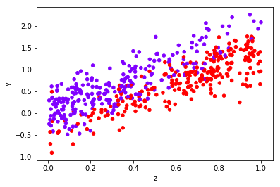
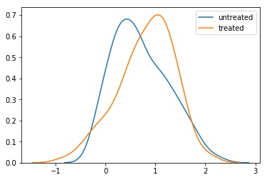
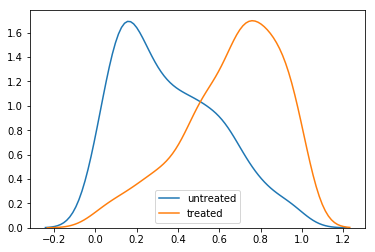
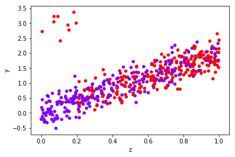
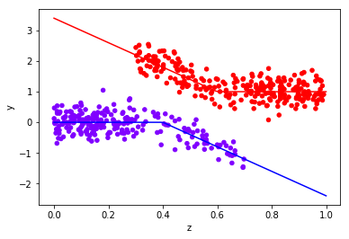

# Part 1. Potential Outcomes

다음 [포스팅](http://www.degeneratestate.org/posts/2018/Mar/24/causal-inference-with-python-part-1-potential-outcomes/) 의 내용을 간단히 정리하고자 한다.

---

이 글에서는 파이썬의 `CausalInference` 패키지를 사용하여 Potential Outcomes 방법론을 통해 관찰한 데이터로부터 인과적 추론을 이끌어내는 방법에 대해 알아볼 것이다.

여기서는 고정된 데이터를 사용하는 대신 직접 작성해둔 함수를 통해 데이터를 생성할 것이다.
이렇게 하면 데이터가 생성되는 과정에 직접 개입할 수 있기 때문에, 우리의 추론이 정확한지 확인할 수 있게 된다는 장점이 있다.
다음 [레포지토리](https://github.com/ijmbarr/notes-on-causal-inference) 에 있는 `datagenerators.py` 파일에서 해당 함수를 찾을 수 있다.

## Environment Setting

```python
# 데이터 생성을 위한 파이썬 코드 다운로드
!git clone https://github.com/ijmbarr/notes-on-causal-inference.git
```

```python
# causalinference 라이브러리 설치
!pip install causalinference
```

```python
import numpy as np
import pandas as pd
import matplotlib.pyplot as plt
import seaborn as sns
%matplotlib inline

import sys
sys.path.append('/content/notes-on-causal-inference')
import datagenerators as dg
```

## Introduction

어느날 팀장은 몇몇 팀원들이 멋진 모자를 쓰고 나온 다음부터 생산성이 떨어지는 경향이 있다는 것을 알게 되었다. 팀장은 어떤 멤버가 모자를 썼고, 어떤 멤버가 생산성이 떨어졌는지 기록하기 시작했다. 일주일간 관찰한 결과 다음과 같은 데이터를 얻게 되었다.

```python
observed_data_0 = dg.generate_dataset_0()
observed_data_0.head()
```

<div>
<table class="dataframe">
  <thead>
    <tr style="text-align: right;">
      <th></th>
      <th>x</th>
      <th>y</th>
    </tr>
  </thead>
  <tbody>
    <tr>
      <th>0</th>
      <td>1</td>
      <td>1</td>
    </tr>
    <tr>
      <th>1</th>
      <td>0</td>
      <td>0</td>
    </tr>
    <tr>
      <th>2</th>
      <td>1</td>
      <td>0</td>
    </tr>
    <tr>
      <th>3</th>
      <td>1</td>
      <td>0</td>
    </tr>
    <tr>
      <th>4</th>
      <td>0</td>
      <td>0</td>
    </tr>
  </tbody>
</table>
</div>

모자를 쓰는 사람들이 그렇지 않은 사람들보다 생산성이 떨어진다고 말할 수 있을까? 다시 말하면 다음 값을 계산할 수 있을까? : `P(Y=1 | X=1) - P(Y=1 | X=0)`

데이터를 통해 계산해보자.

```python
def estimate_uplift(ds):
    base = ds[lambda d: d.x == 0]
    variant = ds[lambda d: d.x == 1]

    delta = variant['y'].mean() - base['y'].mean()
    delta_error = 1.96 * np.sqrt(variant['y'].var() / variant.shape[0] +
                                base['y'].var() / base.shape[0])
    return {'delta': delta, 'delta_error': delta_error}

effect_0 = estimate_uplift(observed_data_0)

print('''
Estimated Effect: {0}
Standard Error: {1}
'''.format(effect_0['delta'], effect_0['delta_error']))

# Estimated Effect: -0.15588488600724743
# Standard Error: 0.08733774503991501
```

통계적 검정을 통해 확인해보면 p-value 값도 매우 작게 나오는 것을 볼 수 있다.

```python
from scipy.stats import chi2_contingency

contingency_table = (observed_data_0
    .assign(placeholder=1)
    .pivot_table(index='x', columns='y', values='placeholder', aggfunc='sum')
    .values
)

_, p_value, _, _ = chi2_contingency(contingency_table, lambda_='log-likelihood')

print(p_value)
# 0.0007348032687889459
```

이러한 정보를 바탕으로, 사람들이 모자를 썼을 때 생산성이 변할 확률을 예상해 볼 수 있다.
관측했던 확률 분포와 동일한 분포일 것이라고 가정하면 이후에도 같은 상관 관계가 있을 것이라고 기대할 수 있다.

그런데 이 결과를 가지고 다른 사람들에게 모자를 쓰거나 쓰지 말 것을 강제해야 할 때에는 문제가 될 수 있다.
우리가 샘플링하는 대상의 환경 자체를 바꾸는 것이기 때문에, 이전에 관측했던 것과는 다른 상관관계를 보일 수 있다.

시스템 상의 변화로 인한 효과를 측정하기 위해 가장 깔끔한 방법은 바로 **Randomized Control Test** 를 수행하는 것이다.
누가 모자를 받을지는 랜덤하게 결정한다면 교란 변수 (Confounding Variables) 의 효과를 제외한 실제 영향을 파악할 수 있다.

```python
# 데이터 생성 과정을 직접 조작하여 A/B 테스트의 결과를 측정해보자
def run_ab_test(datagenerator, n_samples=1000, filter_=None):
    n_samples_a = int(n_samples / 2)
    n_samples_b = n_samples - n_samples_a
    set_x = np.concatenate([np.ones(n_samples_a), np.zeros(n_samples_b)]).astype(np.int64)
    ds = datagenerator(n_samples, set_x)
    if filter_ != None:
        ds = ds[filter_(ds)].copy()
    return estimate_uplift(ds)

run_ab_test(dg.generate_dataset_0)
# {'delta': 0.20799999999999996, 'delta_error': 0.060644652292707504}
```

모자를 썼을 때의 효과가 아까와는 반대의 방향이 되었다. 무슨 일이 일어난 걸까??

**참고.**

위 예제에서 샘플은 iid를 따르고, SUTVA (Stable Unit Treatment Value Assumption) 조건을 따른다는 가정을 하고 있다.
즉, 어떤 사람이 모자를 쓰도록 선택하거나 강제되는 것이 다른 사람의 선택에 영향을 미치지 않는다.


## Definitions of Causality

앞선 사례는 통계학에서 흔히 말하는 **"상관관계는 인과관계를 의미하지 않는다"** 라는 말이 의미하는 것을 잘 보여준다.
그런데 여기서 인과 관계라는 것은 너무 모호한 용어다. 따라서 다음과 같이 정의해보자.

> X와 Y는 확률변수이고, 우리가 측정하고 하는 효과(effect)는 X가 특정한 값을 가지도록 강제했을 때 Y의 분포가 얼마나 변하는지를 말한다.

이렇게 변수가 특정한 값을 가지도록 강제하는 것을 **Intervention** 이라고 한다.

- 모자 예시에서 모자를 썼는지 여부를 관찰했을 때, 생산성의 분포 : `P(Y | X)`
- 일부 사람들에게 모자를 쓰게 했을 때 생산성의 분포 : `P(Y | do(X))`

**위 두 가지는 일반적으로 같지 않다.**

여기서는 관측 결과만 볼 수 있을 때, 개입에 의한 분포 변화를 어떻게 추측할 수 있을지에 대한 답을 찾고자 한다.
이러한 문제는 A/B를 수행하기 어려운 상황에 도움이 된다.
테스트를 하기 어려운 환경에서도 우리는 개입에 의한 효과를 측정하길 원한다.
이를 위해서는 데이터 생성 과정에 대해 몇 가지 가정을 추가해야 한다.


## Potential Outcomes

이 문제에 접근하기 위한 한 가지 방법은 새로운 변수 두 개를 추가하는 것이다.
Y0와 Y1 이라는 변수를 추가하고  이것을 **Potential Outcomes** 라고 한다.
이 변수들은 절대로 직접 관측할 수 없다는 것을 제외하면 다른 확률 변수들과 동일하다.
Y는 다음과 같이 정의할 수 있다.

```
Y = Y1 when X = 1
Y = Y0 when X = 0
```

이렇게 하면 "개입에 의한 분포 변화" 를 추정하는 문제에서 "특정한 분포에서 결측치를 포함하여 샘플링"하는 문제로 바꿀 수 있다.
값이 왜 비어있는지에 대한 몇 가지 가정이 있다면 결측치를 예측하기 위한 방법론들이 존재한다.

## Goals

개입으로 변화하는 분포를 고려하지 않는다면, 두 그룹의 평균 차이를 구하는 것으로도 충분할 수 있다.
이것은 **Average Treatment Effect** 라는 값으로 알려져 있다.
A/B 테스트를 수행하고 각 그룹의 평균을 비교한다면 ATE를 측정하는 것이라고 볼 수 있다.

```
ATE = E(Y1 - Y0)
```

만약 관측한 분포로부터 추정한다면 다음과 같은 값을 얻게 된다.

```
E[Y|X=1] - E[Y|X=0]
  = E[Y1|X=1] - E[Y0|X=0]
  != ATE
```

이 값은 실제 ATE와는 다르다. `E[Yi|X=i] != E[Yi]` 이기 때문이다.

비슷한 값으로는 다음과 같은 것들이 있다.

- **ATT**
    - Average Treatment effect of the Treated
    - `E[Y1 - Y0 | X=1]`
- **ATC**
    - Average Treatment effect of the Control
    - `E[Y1 - Y0 | X=0]`

## Making Assumptions

A/B 테스트를 하면, X의 값을 랜덤하게 배정한다.
따라서 Y1과 Y0 중에 우리가 어떤 값을 보게 될지가 랜덤하게 결정된다. 즉,

```
Y1, Y0 ㅛ X
=> P(X, Y0, Y1) = P(X) * P(Y0, Y1)
=> E[Y1 | X=1] = E[Y1]
```

만약 관측 자료로부터 ATE를 구하고자 한다면, 샘플 데이터에 대한 추가적인 정보가 필요하다.
특히 어떤 treatment를 선택하는지에 대한 정보가 필요하다.
이러한 추가 정보를 확률 변수 Z라고 해보자. 그러면,

```
Y1, Y0 ㅛ X|Z
=> P(X, Y0, Y1 | Z) = p(X | Z) * P(Y0, Y1 | Z)
```

이것은 X가 Z에 의해 완벽하게 설명될 수 있다는 것을 의미한다.
이것을 **Ignorability Assumption** 이라고 한다.

모자 예제에서 "숙련도" 라는 추가 요인이 있다고 가정해보자.
숙련도는 생산성과 모자를 쓸지 말지 여부에 모두 영향을 미치는 변수다.
숙련된 사람들은 대체로 생산성이 더 높고, 모자를 안쓰는 경우가 더 많다.
이러한 사실은 A/B 테스트를 수행했을 때 왜 결과가 반대로 나왔는지 설명할 수 있다.

만약 데이터에서 특정한 사람의 숙련도 여부를 나눌 수 있다면, 각각의 서브 그룹에서는 모자를 쓰면 생산성이 올라간다는 것을 확인할 수 있을 것이다.


```python
obs_0_with_confounders = dg.generate_dataset_0(show_z=True)

print(estimate_uplift(obs_0_with_confounders.loc[lambda df: df['z']==0]))
print(estimate_uplift(obs_0_with_confounders.loc[lambda df: df['z']==1]))

# {'delta': 0.25, 'delta_error': 0.14935204824401044}
# {'delta': 0.19956140350877194, 'delta_error': 0.1778622363930788}
```

하지만 우리는 Y0과  Y1을 동시에 관찰할 수 없기 때문에 `Y1, Y0 ㅛ X|Z` 라는 가정을 확인할 수 없다.
따라서 이 부분은 도메인 지식을 활용해야 한다.

예측의 퀄리티는 이러한 가정을 얼마나 잘 했는지에 따라 결정된다.
Simpson's Paradox는 Z가 모든 교란변수를 포함하지 못할 경우, 우리가 잘못된 추론을 할 수 있다는 것을 극단적으로 보여주는 예시다.
페이스북은 A/B 테스트와 다양한 Causal Inference 결과를 비교하여 가정이 틀렸을 경우 effect가 과도하게 예측될 수 있다는 것을 보여주는 [논문](https://www.kellogg.northwestern.edu/faculty/gordon_b/files/kellogg_fb_whitepaper.pdf)을 발표했다.


## Modeling the Counterfactual

Y0와 Y1을 알고 있다면 ATE를 계산할 수 있다. 그렇다면 Y0과 Y1을 예측해서 직접 계산해보면 어떨까?

- `Yhat0(Z) = E[Y | Z, X=0]`
- `Yhat1(Z) = E[Y | Z, X=1]`

위 두 개의 값을 구하면 ATE를 다음과 같이 추정할 수 있다.

```
mean(Yhat1(Z) - Yhat0(Z))
```

이러한 방식이 잘 동작하기 위해서는 Potential Outcome에 대한 모델링이 잘 이루어져야 한다.
다음 데이터 생성 과정을 살펴보자.

```python
obs_1 = dg.generate_dataset_1()
obs_1.plot.scatter(x='z', y='y', c='x', cmap='rainbow', colorbar=False)
```



counterfactual을 모델링 하기 전에 데이터를 살펴보자.
Y 변수의 분포를 보면 두 그룹 사이에 작은 차이가 존재한다는 것을 확인할 수 있다.

```python
sns.kdeplot(obs_1.loc[lambda df: df['x'] == 0]['y'], label='untreated')
sns.kdeplot(obs_1.loc[lambda df: df['x'] == 1]['y'], label='treated')
```



```python
# The difference in means between two groups
print('Observed ATE: {delta:.3f} ({delta_error:.3f})'.format(**estimate_uplift(obs_1)))

# Observed ATE: 0.107 (0.099)
```

그런데 공분산 Z의 분포를 보면 두 그룹 간의 차이가 더욱 명확하게 나타난다.

```python
sns.kdeplot(obs_1.loc[lambda df: df['x'] == 0]['z'], label='untreated')
sns.kdeplot(obs_1.loc[lambda df: df['x'] == 1]['z'], label='treated')
```



Z가 Y에 영향을 미친다고 생각한다면 이러한 현상은 우려가 된다.
그렇다면 우리는 X가 Y에 미치는 영향과 Z가 Y에 미치는 영향을 분리할 수 있어야 한다.
A/B 테스트 시뮬레이션을 돌려보면 실제 ATE를 계산하고 관측치와의 차이를 계산할 수 있다.

```python
print('Real ATE: {delta:.3f} ({delta_error:.3f})'.format(
    **run_ab_test(dg.generate_dataset_1)))

# Real ATE: -0.542 (0.081)
```

A/B 테스트를 수행할 수 없다면 어떻게 될까? 모델링을 통해서 해결해야 한다.
가장 단순한 형태의 모델이라면 선형 모형을 적용해 볼 수 있다. 다음과 같이 가정해보자.

```
Y0 = alpha + beta*Z + e
Y1 = Y0 + gamma
```

이 가정이 맞다면, 선형 회귀를 통해 `Y = alpha + beta * Z + gamma * X` 를 학습하면 ATE에 대한 추정값을 구할 수 있다.

`causalinference` 라이브러리는 이러한 작업을 위한 간단한 인터페이스를 제공한다.

```python
from causalinference import CausalModel

cm = CausalModel(
    Y=obs_1['y'].values,
    D=obs_1['x'].values,
    X=obs_1['z'].values,
)

cm.est_via_ols(adj=1)
print(cm.estimates)

# Treatment Effect Estimates: OLS
#
#           Est.       S.e.          z      P>|z|      [95% Conf. int.]
# ---------------------------------------------------------------------
# ATE     -0.506      0.032    -15.924      0.000     -0.568     -0.444
```

위에서 제공되는 신뢰구간은 모형이 counterfactual을 얼마나 잘 설명하는지를 의미하는 것이 아니다.
**우리의 모형이 counterfactual을 잘 설명한다고 가정했을 때 추정치의 신뢰구간을** 의미한다.

이번에는 데이터 생성과정이 모형의 가정과 잘 맞도록 설정되어 있었기 때문에 적절한 ATE 값을 계산할 수 있었다.
이번에는 실패하는 경우에 대해서 살펴보자.

첫 번째 사례는 효과가 단순히 더해지지 않는 경우다.

```python
obs_2 = dg.generate_dataset_2()
obs_2.plot.scatter(x='z', y='y', c='x', cmap='rainbow', colorbar=False)
```



```python
print('Observed ATE: {delta:.3f} ({delta_error:.3f})'.format(**estimate_uplift(obs_2)))
print('Real ATE:{delta:.3f} ({delta_error:.3f})'.format(**run_ab_test(dg.generate_dataset_2)))

# Observed ATE: 0.595 (0.107)
# Real ATE:0.621 (0.098)
```

```python
cm = CausalModel(
    Y=obs_2['y'].values,
    D=obs_2['x'].values,
    X=obs_2['z'].values,
)

cm.est_via_ols(adj=1)
print(cm.estimates)

# Treatment Effect Estimates: OLS
#
#           Est.       S.e.          z      P>|z|      [95% Conf. int.]
# ---------------------------------------------------------------------
# ATE      0.187      0.069      2.732      0.006      0.053      0.322
```

이러한 문제는 보통 더 강력한 예측 방법을 통해 해결할 수 있다.
간단하면서 비모수적인 방법론으로는 **matching** 기법이 있다.
treatment 대상 샘플 각각에 대해서 control 그룹의 가장 유사한 샘플을 찾고, 두 값을 직접 비교하는 방식으로 추정한다.
"비슷하다" 라는 것을 어떻게 정의하는지에 따라서 다양하게 활용할 수 있다.

`causalinference` 패키지는 복원추출을 통해 다른 그룹에서 가장 유사한 유닛을 추출하고, 그 차이를 통해 ATE를 계산한다.
기본적으로 매칭은 공변량 공간 Z에서 가장 가까운 이웃으로 이루어지고, 분산의 역수로 가중치를 매긴다.
다음과 같은 코드로 매칭 기법을 적용할 수 있다.

```python
cm = CausalModel(
    Y=obs_2['y'].values,
    D=obs_2['x'].values,
    X=obs_2['z'].values,
)

cm.est_via_matching()
print(cm.estimates)

# Treatment Effect Estimates: Matching
#
#           Est.       S.e.          z      P>|z|      [95% Conf. int.]
# ---------------------------------------------------------------------
# ATE      0.497      0.123      4.029      0.000      0.255      0.738
# ATC      0.871      0.127      6.853      0.000      0.622      1.120
# ATT      0.098      0.167      0.586      0.558     -0.229      0.424
```

이제 추정치의 신뢰구간이 실제 ATE값을 포함하는 것을 볼 수 있다.

## Covariate Imbalance

만약 사용하려는 공변량이 불균형적이라면 문제는 더 어려워진다.
특히 어떤 공변량에는 treated 샘플만 있거나 untreated 샘플만 있는 경우가 있다.
이런 경우 외삽을 통해 효과를 추정해야 하는데, 우리가 사용하는 모형의 가정에 크게 의존하게 된다.

```python
obs_3 = dg.generate_dataset_3()
obs_3.plot.scatter(x='z', y='y', c='x', cmap='rainbow', colorbar=False)

z = np.linspace(0, 1, 100)
y0 = np.where(z >= 0.4, -4*(z-0.4), 0)
y1 = np.where(z < 0.6, -4*(z-0.6), 0) + 1
plt.plot(z, y0, 'b')
plt.plot(z, y1, 'r')
```



```python
print('Observed ATE: {delta:.3f} ({delta_error:.3f})'.format(**estimate_uplift(obs_3)))
print('Real ATE:{delta:.3f} ({delta_error:.3f})'.format(**run_ab_test(dg.generate_dataset_3)))

# Observed ATE: 1.387 (0.078)
# Real ATE:2.422 (0.107)
```

```python
# OLS estimator
cm = CausalModel(
    Y=obs_3['y'].values,
    D=obs_3['x'].values,
    X=obs_3['z'].values,
)

cm.est_via_ols()
print(cm.estimates)

# Treatment Effect Estimates: OLS
#
#           Est.       S.e.          z      P>|z|      [95% Conf. int.]
# ---------------------------------------------------------------------
# ATE      2.019      0.049     41.018      0.000      1.923      2.116
# ATC      2.087      0.055     37.745      0.000      1.978      2.195
# ATT      1.962      0.065     30.269      0.000      1.835      2.089
```

```python
# Matching estimator
cm = CausalModel(
    Y=obs_3['y'].values,
    D=obs_3['x'].values,
    X=obs_3['z'].values,
)

cm.est_via_matching()
print(cm.estimates)

# Treatment Effect Estimates: Matching
#
#           Est.       S.e.          z      P>|z|      [95% Conf. int.]
# ---------------------------------------------------------------------
# ATE      2.189      0.179     12.257      0.000      1.839      2.539
# ATC      2.299      0.283      8.120      0.000      1.744      2.853
# ATT      2.096      0.222      9.450      0.000      1.661      2.530
```

OLS를 통한 예측은 실제 효과를 잡아내는데 실패했다.
매칭은 그보다는 낫지만 완전히 겹치지 않는 구간에 대해 예측하기엔 정보가 부족하다.
이러한 예제는 작위적으로 보일 수 있다. 하지만 고차원의 데이터셋에서 이러한 문제는 흔하게 발생한다.

`causalinference`는 `summary_stats` 프로퍼티를 통해 변수 간에 얼마나 겹치는지 빠르게 살펴볼 수 있는 도구를 제공한다.
엄밀한 통계 검정은 아니지만, 서로 다른 공변량간에 얼마나 겹쳐있는지 간단히 확인하는데는 도움이 된다.
Normalized Difference 값이 1보다 크다면 겹치는 구간이 많지 않다는 것을 의미한다.

```python
print(cm.summary_stats)

# Summary Statistics
#
#                        Controls (N_c=229)         Treated (N_t=271)             
#        Variable         Mean         S.d.         Mean         S.d.     Raw-diff
# --------------------------------------------------------------------------------
#               Y       -0.128        0.417        1.259        0.475        1.387
#
#                        Controls (N_c=229)         Treated (N_t=271)             
#        Variable         Mean         S.d.         Mean         S.d.     Nor-diff
# --------------------------------------------------------------------------------
#              X0        0.240        0.190        0.680        0.206        2.220
```

## Propensity Score

성향 점수 (propensity score) 는 주어진 공변량에 대해서, 얼마나 treatment 그룹에 배정될 것 같은지 예측한 값을 말한다.

```
phat(Z) = P(X | Z)
```

인과 관계 추론의 문제는 우리가 알고 싶어하는 것은 `E[Yi]`인데, 알 수 있는 것은 `E[Yi | X=i]` 라는 점이다.
`E[Yi]` 를 다음과 같이 예측할 수 있다.

```
P(Yi) = P(Yi | X=i) * P(X=i) 이므로
E[Yi] = E[Yi / P(X=i|Z) * P(X=i|Z)] = E[Yi / P(X=i|Z) | X=i, Z]
```

즉, 각각의 포인트를 성향 점수의 역수로 나누면, potential outcome 값을 복구해낼 수 있다.
이러한 방법을 **inverse propensity score weight** 라고 한다.

`causalinference` 라이브러리에서는 `est_propensity_s` 또는 `est_propensity` 메서드를 통해 적용할 수 있다.
성향 점수를 예측하기 위해 로지스틱 회귀를 사용한다.


```python
cm = CausalModel(
    Y=obs_1['y'].values,
    D=obs_1['x'].values,
    X=obs_1['z'].values,
)

cm.est_propensity_s()

propensity = cm.propensity['fitted']

df_obs_1 = obs_1
df_obs_1['ips'] = np.where(df_obs_1['x'] == 1, 1/propensity, 1/(1-propensity))
df_obs_1['ipsw'] = df_obs_1['y'] * df_obs_1['ips']

# ipse (Inverse Propensity Score weight Estimator)
(df_obs_1[lambda df: df['x'] == 1]['ipsw'].sum() -
 df_obs_1[lambda df: df['x'] == 0]['ipsw'].sum()
) / df_obs_1.shape[0]
# IPSE = -0.5223408029722488
```

이러한 방법은 성향 점수가 잘 예측되어야 한다.
우리가 사용한 샘플 데이터를 생성하기 위해서는 일반적인 로지스틱 회귀를 사용했었다.
만약 우리가 성향점수를 추정하기위해 scikit-learn 의 로지스틱 회귀를 사용한다면, 해당 함수는 기본적으로 regularization을 사용하기 때문에 정확하지 않은 결과를 얻게 될 것이다.

## Doubly Robust Weighted Estimator

Inverse propensity score weighting estimator와 linear estimator 를 함께 사용할 수도 있다.
Inverse propensity score를 가중치로 하는 weighted linear regression을 수행하는 방식으로 적용한다.
이것을 **Roubly Robust Weighted Estimator** 라고 한다.

관측한 자료에서는 어떤 샘플이 treat 되어있는지에 편향이 존재한다.
treat 되어 있지만 잘 보이지 않는 데이터라면 더 중요하기 때문에 가중치를 더 부여한다는 아이디어를 바탕으로 한다.


```python
cm = CausalModel(
    Y=obs_1['y'].values,
    D=obs_1['x'].values,
    X=obs_1['z'].values,
)

cm.est_propensity_s()
cm.est_via_weighting()

print(cm.estimates)

# Treatment Effect Estimates: Weighting
#
#           Est.       S.e.          z      P>|z|      [95% Conf. int.]
# ---------------------------------------------------------------------
# ATE     -0.515      0.032    -16.062      0.000     -0.578     -0.453
```

## Unconfoundedness and the Propensity Score

이전까지, 우리는 결과값과 treatment가 공변량이 주어졌을 때 독립이라고 가정했다. 즉,

```
Y1, Y0 ㅛ X|Z
```

여기서 조금 더 강한 가정을 할 수도 있다. 성향점수가 주어졌을 때, 결과값과 treament가 독립이라고 가정할 수 있다.

```
Y1, Y0 ㅛ X|phat(Z)
```

이렇게 가정하면 교란변수로 인한 차원을 줄일 수 있다. 따라서 고차원 공간에서 적용할 수 없는 몇 가지 기법을 적용할 수 있게 된다.

## Trimming

앞에서 공변량 사이의 불균형으로 인해 문제가 발생할 수 있다는 것을 보았다. 간단한 해결 방법 중 하나는 counterfactual을 예측할 때 잘 겹치지 않는 구간을 잘라내고 (trim) 예측하는 것이다. 고차원 공간에서는 "잘 겹친다" 는 것을 정의하기 어려울 수 있기 때문에 이 경우에는 propensity score 를 통해 결정하기도 한다.


```python
cm = CausalModel(
    Y=obs_3['y'].values,
    D=obs_3['x'].values,
    X=obs_3['z'].values,
)

cm.est_propensity_s()
cm.trim_s()
cm.est_via_matching()

print(cm.estimates)

# Treatment Effect Estimates: Matching
#
#           Est.       S.e.          z      P>|z|      [95% Conf. int.]
# ---------------------------------------------------------------------
# ATE      2.043      0.107     19.129      0.000      1.833      2.252
# ATC      2.155      0.187     11.522      0.000      1.789      2.522
# ATT      1.943      0.085     22.894      0.000      1.777      2.109
```

trimming을 적용할 때는 공변량 공간의 일부에서만 인과 관계를 추론할 수 있다는 것을 명시해야 한다.
해당 공간 밖으로 넘어가게 되면 ATE 값을 적용할 수 없다.

## Stratification

성향 점수를 사용하는 또 한 가지 방법은 바로 층화(stratification) 또는 블록킹이라고 하는 방법이다.
유사한 성향 점수를 가지는 데이터들을 그룹으로 묶고 각 그룹별로 ATE를 계산한다.
`causalinference` 에서는 이러한 작업을 위한 인터페이스를 제공한다.

- `stratify` : 사용자가 직접 경계를 설정
- `stratify_s` : 자동으로 경계를 설정

```python
cm = CausalModel(
    Y=obs_1['y'].values,
    D=obs_1['x'].values,
    X=obs_1['z'].values,
)

cm.est_propensity_s()
cm.stratify_s()

print(cm.strata)

# Stratification Summary
#
#               Propensity Score         Sample Size     Ave. Propensity   Outcome
#    Stratum      Min.      Max.  Controls   Treated  Controls   Treated  Raw-diff
# --------------------------------------------------------------------------------
#          1     0.083     0.229       107        19     0.150     0.156    -0.517
#          2     0.229     0.379        45        18     0.299     0.302    -0.625
#          3     0.379     0.523        33        29     0.451     0.459    -0.366
#          4     0.525     0.648        27        36     0.589     0.590    -0.515
#          5     0.650     0.708        12        19     0.673     0.685    -0.412
#          6     0.708     0.751         5        26     0.730     0.729    -0.522
#          7     0.754     0.908        20       104     0.828     0.842    -0.474
```

`est_via_blocking`를 적용하면 층별로 계산한 결과를 하나의 ATE로 묶어준다.


```python
cm.est_via_blocking()
print(cm.estimates)

# Treatment Effect Estimates: Blocking
#
#           Est.       S.e.          z      P>|z|      [95% Conf. int.]
# ---------------------------------------------------------------------
# ATE     -0.517      0.032    -15.964      0.000     -0.580     -0.453
# ATC     -0.523      0.038    -13.847      0.000     -0.597     -0.449
# ATT     -0.511      0.037    -13.676      0.000     -0.584     -0.438
```

성향점수를 바탕으로 데이터를 그룹화시키는 것은 우리가 어떤 값들이 비슷한지에 대한 사전 정보가 없을 때 유용한 방법이다.
하지만 이러한 방식이 유일한 해결 방법인 것은 아니다.
만약 어떻게 그룹이 구성될지에 대한 사전 지식이 있다면, 그에 맞게 그룹을 나누어 ATE를 계산하고 전체 ATE 값으로 합칠 수도 있다.

## Which Technique to Use?

관찰한 데이터로부터 인과 관계를 추론하기 위해 일반적으로 사용하는 기법들은 대부분 다루었다.
이제 남아있는 문제는 어떤 방법을 언제 사용하는지 결정하는 것이다.
기법을 결정하기 위해서는 데이터에 대한 가정을 세워야 한다.
만약 데이터가 공변량 공간에 고르게 퍼져있다면 매칭을 사용하는 것이 좋다.
모든 데이터에 짝이 될 만한 포인트가 항상 존재할 것이기 때문이다.
이러한 상황이 아니라면 데이터가 존재하지 않는 공간을 잘 예측할 수 있는 모형을 사용하거나, 성향 점수가 ignorability 가정을 유지하는데 충분한 정보를 제공한다는 가정을 해야 한다.

이러한 방법은 모두 실패할 수도 있기 때문에 주의해야 한다.

## The Structure of Causal Inference

이제 ignorability 가정의 중요성을 알 수 있을 것이다.

```
Y1, Y0 ㅛ X|Z
```

여기서 이야기하지 않은 것은 어떻게 Z를 결정할지에 대한 것이다.
이것은 해당 분야에 대한 도메인 지식을 필요로 한다.
**Causal Graphical Models** 라는 도구를 이용해서 도메인 지식을 모형에 반영하고 위에서 살펴본 독립성 가정을 확인할 수 있다.
