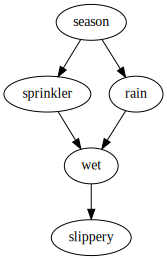
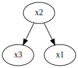
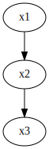
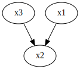
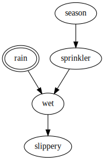
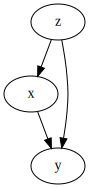
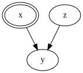
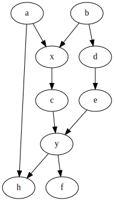
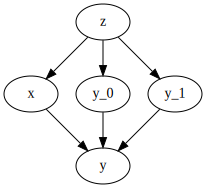
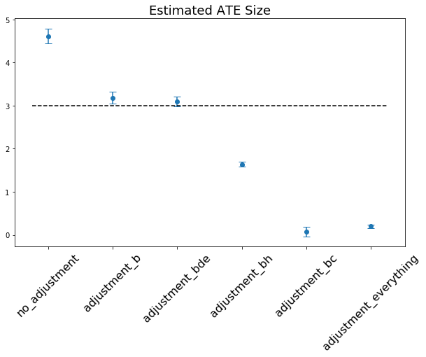

# Part2 : Causal Graphical Models

```
!pip install causalgraphicalmodels
!pip install causalinference
```

다음 [포스팅](http://www.degeneratestate.org/posts/2018/Jul/10/causal-inference-with-python-part-2-causal-graphical-models/) 을 간단히 정리한다.

---

이전 글에서는 Potential Outcomes의 아이디어를 가지고 관측 데이터로부터 인과관계를 추론하는 방법에 대해서 알아보았다. Potential Outcomes 프레임워크에서는 counterfactual 결과를 결측치인 것처럼 다루어서 데이터를 통해 결측치를 추정하는 방식을 사용한다. 이러한 작업을 위해서는 데이터가 생성되는 과정에서 대한 강한 가정이 필요한데, 특히 강한 "Ignorability" 가정이 필요하다.

```
Yi ㅛ X|Z (Z가 주어졌을 때 Yi는 X와 조건부 독립이다)

Yi : 추정하고자 하는 Potential Outcomes
X  : 측정하고 하는 개입 (intervention)
Z  : 추정결과를 수정하기 위해 사용하는 공변량들
```

이런 강한 ignorability가 어디서 성립하는지 확인하기 위해서는 데이터가 생성되는 구조를 가정할 수 있어야 한다. 이러한 구조를 표현하기 위해 **Causal Graphical Models** 를 사용한다. 여기서는 `CausalGraphicalModel` 라이브러리를 사용해서 작업을 수행할 것이다.

이전의 글과 비교하면 인과 관계를 구하기 위한 기법들 보다는 데이터가 생성되는 구조에 대한 직관을 얻는데 집중할 것이다.

## What is Structure?

모델링을 위해 사용할 수 있는 한 가지 방법은 구조적 인과 모형 또는 구조방정식 (Structural Equation Models) 을 사용하는 것이다. 구조방정식을 통해 다양한 변수들의 관계를 함수의 형태로 표현할 수 있다.

예를 들어 x1, x2, x3 세 가지 변수로 구성된 시스템이 다음과 같이 연결되어 있다고 생각해보자.

```
x1 ~ Bernoulli(0.3)
x2 ~ Normal(x1, 0.1)
x3 = x2^2
```

x1과 x2는 확률 변수로부터 샘플링된 값이고,  x3은 x2의 값에 의해서 결정된다. 파이썬 코드로 쉽게 구현해 볼 수 있다.

```python
import numpy as np
import pandas as pd
import matplotlib.pyplot as plt
import seaborn as sns

%matplotlib inline
```

```python
def f1():
    return np.random.binomial(n=1, p=0.3)

def f2(x1):
    return np.random.normal(loc=x1, scale=0.1)

def f3(x2):
    return x2 ** 2

x1 = f1()
x2 = f2(x1)
x3 = f3(x2)

print("x1={}, x2={:.2f}, x3={:.2f}".format(x1, x2, x3))
# x1=0, x2=-0.02, x3=0.00
```

여기서 **구조 (Structure)** 라는 것은, 어떤 변수가 다른 변수에 대한 함수인지 설명해둔 것을 말한다.
위 예제에서는 함수 안의 내용이 어떻든지간에 x1이 x2를 통해서만 x3에 영향을 미칠 수 있다.

이러한 방식으로 구조를 모델링하면 좋은 점은 **개입** 을 자연스럽게 표현할 수 있다는 것이다.
특정 변수를 우리가 선택한 값으로 바꾸면 된다.

```
x1 = f1()
x2 = x2_intervention
x3 = f3(x2)
```

우리가 상상할 수 있는 모든 관계는 이러한 방식으로 표현될 수 있다.
함수들은 매우 복잡하거나 우리가 알기 어려울 수 있지만 존재하기는 할 것이다.
그렇다면 각 변수들을 연결하는 함수를 모른채 구조만 알고 있어도 개입에 의한 영향을 설명할 수 있을까?

## Causal Graphical Models

인과 관계 문제의 고전적인 사례인 스프링클러 예제를 살펴보자. 특정한 날의 상태를 나타내는 5가지 변수로 이루어져 있다.

- `season` : 계절
- `rain` : 비가 왔는지 여부
- `sprinkler` : 스프링클러가 켜졌는지 여부
- `wet` : 땅이 젖어있는지 여부
- `slippery` : 땅이 미끄러운지 여부

비가 오면 땅이 젖어있을 것이다. 하지만 땅을 젖게 한다고 해서 비가 오지는 않는다.
이것이 바로 함수를 통해 설명할 수 있는 방향성을 가진 관계다. 지금은 구체적인 함수없이, 변수들과 각 관계의 방향성만 가지고 있다.
이런 구조를 표현하기 위해서는 directed graph, 그 중에서도 DAG (Directed Acyclic Graph) 를 사용하는 것이 자연스럽다.
인과관계에서 루프가 생기는 것을 방지하기 위해서는 그래프 상에 루프가 없도록 해야 한다.

위 모형을 그래프를 통해 표현해보자.

```python
from causalgraphicalmodels import CausalGraphicalModel

sprinkler = CausalGraphicalModel(
    nodes=['season', 'rain', 'sprinkler', 'wet', 'slippery'],
    edges=[
        ('season', 'rain'),
        ('season', 'sprinkler'),
        ('rain', 'wet'),
        ('sprinkler', 'wet'),
        ('wet', 'slippery')
    ]
)

sprinkler.draw()
```



이것은 시스템을 확률적 그래피컬 모형으로 표현한 것이다. 데이터가 어떤 방식으로 생성되는지 비모수적인 모형으로 표현한다.

이러한 표현 방식은 모든 변수에 대한 결합 확률분포가 다음과 같은 방식으로 factorized 될 수 있다는 것을 의미한다.

```
P(X) = PROD( P(Xi | PA(Xi)) )

PA(Xi) : 그래프 상에서 Xi의 부모 노드
```

그래피컬 모형을 바탕으로 결합확률분포를 다음과 같이 얻을 수 있다.


```python
print(sprinkler.get_distribution())
# P(season)P(sprinkler|season)P(rain|season)P(wet|rain,sprinkler)P(slippery|wet)
```

결합확률분포를 위와 같은 방식으로 분해할 수 있다는 것은 변수들 간의 관계에 특정한 조건부 독립이 성립한다는 것을 의미한다.
예를 들어 땅이 젖었는지 아닌지를 알고 있다면 땅이 미끄러운지 아닌지는 계절과 독립적이다.
확률적 그래피컬 모형에서는 d-separated가 성립할 경우, 두 변수는 다른 변수들이 주어졌을 때 조건부 독립이 성립된다.

세 개의 노드가 있다면, Fork, Chain, Collider 라는 세 가지 경우가 존재할 수 있다.

```python
# Fork
from causalgraphicalmodels.examples import fork, chain, collider

print(fork.get_all_independence_relationships())
# [('x3', 'x1', {'x2'})]

fork.draw()
```




```python
# Chain
print(chain.get_all_independence_relationships())
# [('x3', 'x1', {'x2'})]

chain.draw()
```



Fork와 Chain의 경우 동일한 독립성 관계를 나타낸다.
**x1와 x3는 x2값이 정해지지 않는한 독립이 아니다.** x2값이 정해지면 조건부 독립이 성립한다.
다만 두 가지는 서로 다른 인과적 관계를 나타내는데, chain에서 x1은 x3에 대해 인과적인 영향을 미치지만, fork에서는 인과적인 영향이 없다.

```python
print(collider.get_all_independence_relationships())
# [('x3', 'x1', set())]

collider.draw()
```



Collider에서는 x2나 x2의 자손 노드가 결정되지 않았을 경우 x1과 x3이 독립이 된다. 이것은 Perkson's Paradox라고도 불린다.

길이가 3보다 긴 path의 경우에는 두 개의 노드가 d-separated 되어있는지 알기 위해 이전의 결과들을 활용할 수 있다.
만약 연결된 3개의 노드가 모두 d-separated 되어있다면 그 path는 d-separated 되어 있다.

x1 부터 x5까지 연결된 다음 path를 살펴보자.

```python
path = CausalGraphicalModel(
    nodes=['x1', 'x2', 'x3', 'x4', 'x5'],
    edges=[
        ('x1', 'x2'), ('x3', 'x2'), ('x4', 'x3'), ('x4', 'x5')
    ]
)

path.draw()
```


아무런 조건도 걸지 않는다면, collider (x1, x2, x3) 로 인해 path가 막혀서 d-separated 된다.
하지만 x2나 그 자손 노드에 조건을 걸게되면, 남아있는 path가 fork(x3, x4, x5) 와 chain(x2,x3,x4) 를 구성하게 되어 막히지 않게 된다.
만약 x2와 x3에 조건을 걸게 되면 chain(x2, x3, x4)으로 인해 다시 막힌다.

다음 코드를 통해 다시 확인해보자.

```python
print("""
Are x1 and x5 unconditional independent?                              : {}
Are x1 and x5 conditional independent when conditioning on x2?        : {}
Are x1 and x5 conditional independent when conditioning on x2 and x3? : {}
""".format(
    path.is_d_separated('x1', 'x5', {}),
    path.is_d_separated('x1', 'x5', {'x2'}),
    path.is_d_separated('x1', 'x5', {'x2', 'x3'})
))

# Are x1 and x5 unconditional independent?                              : True
# Are x1 and x5 conditional independent when conditioning on x2?        : False
# Are x1 and x5 conditional independent when conditioning on x2 and x3? : True
```

스프링클러 예제에서 그래프를 통해 확인할 수 있는 모든 독립 관계를 확인할 수 있다.

```python
sprinkler.get_all_independence_relationships()
# [('sprinkler', 'rain', {'season'}),
#  ('sprinkler', 'slippery', {'wet'}),
#  ('sprinkler', 'slippery', {'season', 'wet'}),
#  ('sprinkler', 'slippery', {'rain', 'wet'}),
#  ('sprinkler', 'slippery', {'rain', 'season', 'wet'}),
#  ('season', 'wet', {'rain', 'sprinkler'}),
#  ('season', 'wet', {'rain', 'slippery', 'sprinkler'}),
#  ('season', 'slippery', {'wet'}),
#  ('season', 'slippery', {'rain', 'wet'}),
#  ('season', 'slippery', {'sprinkler', 'wet'}),
#  ('season', 'slippery', {'rain', 'sprinkler'}),
#  ('season', 'slippery', {'rain', 'sprinkler', 'wet'}),
#  ('rain', 'slippery', {'wet'}),
#  ('rain', 'slippery', {'season', 'wet'}),
#  ('rain', 'slippery', {'sprinkler', 'wet'}),
#  ('rain', 'slippery', {'season', 'sprinkler', 'wet'})]
```

Causal Graphical Models 는 비모수적인 모형이다. 변수들 간에 어떤 관계를 가지는지를 함수의 형태로 가정하지 않는다.
따라서 이러한 모형에서 테스트해볼 수 있는 유일한 가정은 변수들 간의 조건부 독립 관계에 대한 가정이다.
하지만 일반적인 상황에서 조건부 독립을 테스트해보는 것은 불가능하다.
합리적인 수의 변수로 생성할 수 있는 다양한 DAG가 있기 때문에, 관찰 데이터만으로 인과 관계 구조를 찾아내는 것은 매우 어려운 작업이다.

인과관계 구조를 찾아내기 위한 흥미로운 접근방법들이 연구되고 있지만, 일단 여기서는 Causal Graphical Models를 활용하기 좋은 사례는 바로 사전 지식을 명시적으로 모델링에 반영하는 것이다.
사전 지식을 그래프 구조로 나타낸 후, 여기에 관찰한 데이터를 반영하여 인과적인 개입에 의한 효과를 예측할 수 있다.


## From Bayesian networks to Causal Graphical Models

여기까지 Causal Graphical Models에 대해 설명했던 것은 베이지안 네트워크에 대한 설명과 동일하다.
이러한 구조에 인과 관계의 개념을 추가하기 위해서는 개입이 일어났을 때 어떤 일이 일어나는지에 대한 가정이 몇 가지 필요하다.
Causal Graphical Models에서는 **안정성(Stability)** 또는 **불변성(Invariance)** 이라는 개념을 사용한다.
이것은 만약 우리가 특정 변수에 개입하더라도 인과관계 그래프의 구조나 변수들 사이의 관계 함수 자체는 변하지 않는다는 것을 의미한다.

만약 불변성 가정이 성립된다면, 개입이 일어난 변수와 그 부모 변수가 연결된 edge는 제거된다.
그리고 개입이 일어난 변수를 보통 두 줄의 외곽선을 가진 노드로 표기한다.

스프링클러 예제에서 날씨를 컨트롤한다고 상상해보자. **rain** 노드에 개입한다면 다음과 같이 그래프에 반영된다.


```python
sprinkler_do = sprinkler.do('rain')
print(sprinkler_do.get_distribution())
# P(season)P(sprinkler|season)P(wet|do(rain),sprinkler)P(slippery|wet)

sprinkler_do.draw()
```



Causal Graphical Models가 비모수적 방법론이기 때문에, 두 변수가 어떤 관계에 있는지 알려주지는 않는다.
다만 조건부 독립 관계가 있다면 그에 대한 정보를 줄 수는 있다.
이러한 작업은 변수간의 path가 존재하는지를 확인하는 방식으로 이루어진다.
만약 두 변수 사이에 막혀있지 않은 path가 하나도 없다면 두 변수는 독립이다.
이것은 두 개의 모형이 동일한 path를 가지고 있다면, 두 변수 사이의 조건부 관계는 동일하다는 것을 의미한다.

예를 들어, 스프링클러 예제에서 `P(slippery | wet)` 은 `rain` 변수에 개입하든 안하든 동일하다. 하지만 `P(slippery | season)` 은 그렇지 않다.

개입을 이런 방식으로 표현하게 되면 다음과 같은 결과를 얻을 수 있다.

- X가 Y에 영향을 미치기 위해서는 연결된 path가 적어도 하나는 존재해야 한다
- 만약 X에서 Y로 바로 연결된 path가 한 개만 존재한다면, X가 Y에 미치는 인과적 영향은 조건부 확률 분포 `P(Y | X)` 로 표현할 수 있다
- X와 Y 사이에 막혀있지는 않지만 직접 연결되지는 않은 path가 존재한다면, 두 변수 사이에 공통 조상이 존재한다고 볼 수 있다. 이 공통 조상을 **교란 변수 (Confounder)** 라고 한다. 그리고 이 경우에는 `P(Y, X)` 를 통해 `P(Y, do(X))` 를 예측하면 편향이 발생할 수 있다.


## Causal Inference with Causal Graphical Models

여기까지 관찰된 값들의 분포와 개입으로 인한 분포가 어떻게 생성되었는지 표현하고 어떤 방식으로 서로 연관되어 있는지 살펴보았다.
그렇다면 어떤 상황에서 데이터를 바탕으로 인과적인 추론을 내릴 수 있을까?
이러한 문제를 보통 **"Identifiability"** 라고 한다.
구체적으로 말하면, 이 문제는 어떤 상황에서 관측치를 바탕으로 `P(Y | do(X))` 를 예측할 수 있는지를 구하는 것이다.

확률 분포를 다루기 위한 **Do-Calculus** 를 통해 이러한 계산을 할 수 있다.
이를 통해 `do()` 액션이 포함된 확률 분포를 개입이 포함되지 않은 확률 분포로 변환할 수 있다.

여기서 do-calculus를 자세하게 다루지는 않겠지만, 몇 가지 간단한 예제를 살펴보자.

```python
from causalgraphicalmodels.examples import simple_confounded

simple_confounded.draw()
```



X변수에 개입 하게 되면, 데이터를 생성하는 그래피컬 모형은 다음과 같이 구성된다.

```python
simple_confounded.do('x').draw()
```



여기서 우리가 예측하고자 하는 값은 `P(Y | do(X))` 이다.

```
# By rules of marginalization
P(Y | do(X)) = SUM_z( P(Y | do(X), Z) * P(Z | do(X)) )

# Because do(X) is independent of Z
P(Y | do(X)) = SUM_z( P(Y | do(X), Z) * P(Z) )

# Because of the assumption of stability
P(Y | do(X)) = SUM_z( P(Y | X, Z) * P(Z) )
```

관측값에서의 조건부 확률 분포와 비교해보자.

```
P(Y | X) = SUM_z( P(Y | X, Z) * P(Z | X) )
```

## When can we use the Adjustment Formula?

방금 살펴본 공식은 *adjustment formula*, *g-formula*, 또는 *backdoor adjustment formula* 라고 부른다.
이것은 변수 집합 W가 존재할 때 특정 상황에서 X가 Y에 미치는 인과적 영향을 그래피컬 모형을 통해 구할 수 있다는 것을 나타낸다.
그리고 그 인과적 영향을 다음과 같은 공식을 통해 구할 수 있다.

```
P(Y | do(X)) = SUM_w( P(Y | X, W) * P(W) )
```

이에 해당되는 W 변수가 존재할 수 있는 조건을 **backdoor criterion** 이라고 한다. 그래프로는 다음과 같이 표현된다.

1. W는 X와 Y 사이에 있는 모든 백도어 path를 차단한다
2. W는 X의 자손변수를 포함하지 않는다

W가 X의 부모변수라면 이러한 조건을 충족시키지만, 유일한 집합은 아니다.

```python
from causalgraphicalmodels.examples import big_csm

example_cgm = big_csm.cgm
example_cgm.draw()
```



X와 Y 사이의 모든 백도어 패스를 찾아보자.

```python
example_cgm.get_all_backdoor_paths('x', 'y')
# [['x', 'a', 'h', 'y'], ['x', 'b', 'd', 'e', 'y']]
```

하지만 첫 번째 path에서 h변수는 collider기 때문에 h값이 결정되지 않을 때 블락된다.
적절한 조정 집합을 찾기 위해서는 path를 막아버리는 변수들을 찾아야 한다.
위 조합에서는 B, D, E 가 그렇게 동작한다. 새로운 path를 만들어내지 않는 한에서 다른 변수를 추가할 수 있다.
H, F, C 변수를 추가할 경우에는 새로운 패스를 만들어버리기 때문에 부적절한 조정 집합이 된다.

```python
example_cgm.is_valid_backdoor_adjustment_set('x', 'y', {'b', 'd', 'e'})
# True

example_cgm.is_valid_backdoor_adjustment_set('x', 'y', {'b', 'd', 'e', 'h'})
# False
```

모든 유효한 조정 집합을 다음과 같이 구할 수 있다.

```python
example_cgm.get_all_backdoor_adjustment_sets('x', 'y')
# frozenset({frozenset({'a', 'd'}),
#            frozenset({'a', 'b'}),
#            frozenset({'e'}),
#            frozenset({'a', 'b', 'e'}),
#            frozenset({'d'}),
#            frozenset({'d', 'e'}),
#            frozenset({'a', 'd', 'e'}),
#            frozenset({'b'}),
#            frozenset({'b', 'd'}),
#            frozenset({'b', 'd', 'e'}),
#            frozenset({'a', 'e'}),
#            frozenset({'a', 'b', 'd'}),
#            frozenset({'b', 'e'}),
#            frozenset({'a', 'b', 'd', 'e'})})
```

모든 변수가 관찰되었다면, 조정을 위해 사용될 수 있다.
만약 모든 변수가 관찰된 것이 아니라면, 데이터를 통해 인과 관계를 설명하지 못하는 경우가 존재할 수 있다.


## Relationship with Potential Outcomes

이전 포스팅의 Potential Outcomes와 Causal Graphical Models는 어떤 관계가 있을까?
사실 두 가지는 서로 완벽하게 동일하며, 서로를 대체할 수 있는 접근 방법이다.
지금까지는 Potential Outcomes가 Counterfactual inference를 다루고, 그래피컬 모형이 Causal Inference (개입이 존재할 때 데이터가 어떻게 생성되는지 추론) 를 다룬다고 표현했다.
하지만 CGM으로도 counterfactual을 다룰 수 있다. 다만 여기에서는 범위를 넘어가기 때문에 다루지 않는다.

시스템을 명시적으로 CGM을 통해 표현함으로써 얻는 이득은 조건부 확률 `Yi ㅛ X|Z` 가 성립하는지 명확하게 확인할 수 있다는 점이다.
이제 CGM이 Potential Outcomes 를 포함하도록 확장해보자.

```python
from causalgraphicalmodels.examples import simple_confounded_potential_outcomes

simple_confounded_potential_outcomes.draw()
```



여기서 Yi는 `X = i` 일 때의 potential outcome이기 때문에, Y는 `Y(X, Y1, Y0) = Yx` 라는 결정론적 함수가 된다.
그리고 `Yi ㅛ X|Z`가 성립한다.

그래프를 보면 X로부터 Yi로 직접 이어진 패스가 없다. 백도어뿐이다.
이 말은 Z가 X와 Y 사이의 모든 백도어 패스를 막고 새로운 패스를 생성하지 않는 한 백도어 조건이 성립한다는 것을 의미한다.


## Actually Estimating Causal Effects

`simple_confounding` 예제에서 보면 `P(Y | do(X))` 값을 예측하기 위해서는 데이터에서 `P(Y | X,Z)` 값을 추정할 수 있어야 한다.
하지만 Causal graphical models는 그러한 방법을 제공하지 않는다.
CGM은 인과적 추론을 할 수 있을지 확인하기 위한 도구다.

하지만 이러한 추론을 할 수 있게 해주는 다양한 통계적 기법들이 존재한다.
예를 들면, 이전의 포스팅에서는 편향되었을 가능성이 높은 관측값으로부터 `E[Y | X,Z]` 를 예측하기 위한 다양한 방법들에 대해서 다루었다.


## Example Use Case

Causal graphical Model 을 어떻게 활용할 수 있을지 살펴보자.

```python
big_csm.cgm.draw()
```


이 모형은 베르누이 분포를 따르는 X 변수를 제외하면 모두 가우시안 분포를 따로는 노이즈를 가지고 있으며, 변수들 간에 선형 관계를 가지고 있다.


```python
big_csm.sample(5)
```

<div>
<table class="dataframe">
  <thead>
    <tr style="text-align: right;">
      <th></th>
      <th>b</th>
      <th>d</th>
      <th>e</th>
      <th>a</th>
      <th>x</th>
      <th>c</th>
      <th>y</th>
      <th>h</th>
      <th>f</th>
    </tr>
  </thead>
  <tbody>
    <tr>
      <th>0</th>
      <td>-0.698542</td>
      <td>-0.324917</td>
      <td>1.130313</td>
      <td>1.172245</td>
      <td>0</td>
      <td>0.115907</td>
      <td>-2.184138</td>
      <td>-0.464425</td>
      <td>-2.181469</td>
    </tr>
    <tr>
      <th>1</th>
      <td>1.340993</td>
      <td>-1.617529</td>
      <td>-4.546512</td>
      <td>-0.437969</td>
      <td>0</td>
      <td>0.758893</td>
      <td>5.022804</td>
      <td>4.265745</td>
      <td>4.552087</td>
    </tr>
    <tr>
      <th>2</th>
      <td>0.766811</td>
      <td>1.161572</td>
      <td>2.394520</td>
      <td>-1.545275</td>
      <td>1</td>
      <td>0.463457</td>
      <td>-1.899452</td>
      <td>-8.061320</td>
      <td>-1.033007</td>
    </tr>
    <tr>
      <th>3</th>
      <td>0.367357</td>
      <td>-1.497929</td>
      <td>-3.292253</td>
      <td>0.442938</td>
      <td>1</td>
      <td>2.725412</td>
      <td>11.046723</td>
      <td>14.332715</td>
      <td>7.479917</td>
    </tr>
    <tr>
      <th>4</th>
      <td>-0.176533</td>
      <td>-1.216289</td>
      <td>-1.244310</td>
      <td>1.316214</td>
      <td>0</td>
      <td>-0.107377</td>
      <td>0.400961</td>
      <td>3.118903</td>
      <td>0.415497</td>
    </tr>
  </tbody>
</table>
</div>

`causalinference` 라이브러리를 사용하여 X의 Y에 대한 ATE를 구해보자. 핵심이 되는 문제는 우리가 조정해야하는 공변량이 어떤 것인지 확인하는 것이다.

```python
from causalinference import CausalModel

def estimate_ate(dataset, adjustment_set=None, method='matching'):
    if adjustment_set is None:
        y0 = dataset.loc[lambda df: df['x']==0, 'y'].mean()
        y1 = dataset.loc[lambda df: df['x']==1, 'y'].mean()
        y0_var = dataset.loc[lambda df: df['x']==0, 'y'].var()
        y1_var = dataset.loc[lambda df: df['x']==1, 'y'].var()
        y0_n = dataset.loc[lambda df: df['x']==0].shape[0]
        y1_n = dataset.loc[lambda df: df['x']==1].shape[0]

        return {
            'ate': y1 - y0,
            'ate_se': 2 * np.sqrt(y0_var / y0_n + y1_var / y1_n)
        }

    cm = CausalModel(
        Y=dataset['y'].values,
        D=dataset['x'].values,
        X=dataset[adjustment_set].values
    )

    cm.est_via_ols()
    cm.est_via_matching()
    cm.est_propensity_s()
    cm.est_via_weighting()

    cm.stratify_s()
    cm.est_via_blocking()

    return {
        'ate': cm.estimates[method]['ate'],
        'ate_se': cm.estimates[method]['ate_se']
    }
```


```python
n_samples = 10000
ds = big_csm.sample(n_samples)

ds_intervention = (big_csm
  .do('x')
  .sample(n_samples=1000000,
          set_values={'x': np.random.binomial(p=0.5, n=1, size=1000000)})
)

true_ate = estimate_ate(ds_intervention)['ate']

# Generate results for a number of different adjustment sets
results = {
    'no_adjustment': estimate_ate(ds),
    'adjustment_b': estimate_ate(ds, ['b']),
    'adjustment_bde': estimate_ate(ds, ['b', 'd', 'e']),
    'adjustment_bh': estimate_ate(ds, ['b', 'h']),
    'adjustment_bc': estimate_ate(ds, ['b', 'c']),
    'adjustment_everything': estimate_ate(ds, ['a', 'b', 'c', 'd', 'e', 'f', 'h'])

}
```

```python
# plot the results
x_label = list(results.keys())
x = np.arange(len(x_label))
y = [results[l]['ate'] for l in x_label]
yerr = [results[l]['ate_se'] for l in x_label]

plt.figure(figsize=(10,6))
plt.errorbar(x=x, y=y, yerr=yerr, linestyle='none', capsize=5, marker='o')
plt.xticks(x, x_label, rotation=45, fontsize=16)
plt.title('Estimated ATE Size', fontsize=18)
xmin, xmax = plt.xlim()
plt.hlines(true_ate, xmin, xmax, linestyles='dashed')
```




적절한 adjustment sets를 사용할 경우 실제값과 비슷해지는 것을 확인할 수 있다.
따라서 데이터가 생성되는 구조를 파악하고 적절한 변수를 사용하는 것이 중요하다.
Causal Graphical Models는 이러한 작업을 수행하는데 도움을 준다.

## Conclusions

Causal Graphical Models에 대해서 간단히 살펴보았다. 아직도 다루지 못한 부분이 많이 남아있다. 크게 두 가지 영역이 있다.

- **Identification** : 인과 구조를 가정했을 때, 특정 변수가 다른 변수에 미치는 영향을 추정할 수 있을까?
- **Discovery** : 데이터가 주어졌을 때, 인과 구조를 추정할 수 있을까?

앞에서 살펴본 backdoor adjustment 방법은 identification 문제의 일종이라고 볼 수 있다.
backdoor 방법이 유일하지는 않기 때문에, 다음 포스팅에서는 Mediating variables를 통해 인과 관계를 추론하는 방법에 대해서 살펴볼 것이다.

데이터를 통해 인과 구조를 학습하는 것은 더 어려운 문제다.
구조를 추정하기 위한 도구들이 몇 가지 있지만, 경험상으로는 데이터만 사용할 경우 상식적이지 않은 결과가 나오는 경우가 종종 있었다.
제한된 데이터로는 구조를 추론하기엔 정보가 부족한 것이 아닐까 하는 추측을 했다.
다양한 시도가 이루어지고 있지만 아직 열려있는 문제라고 생각한다.
