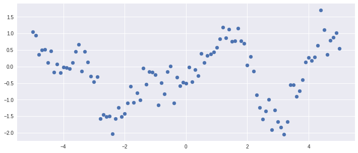
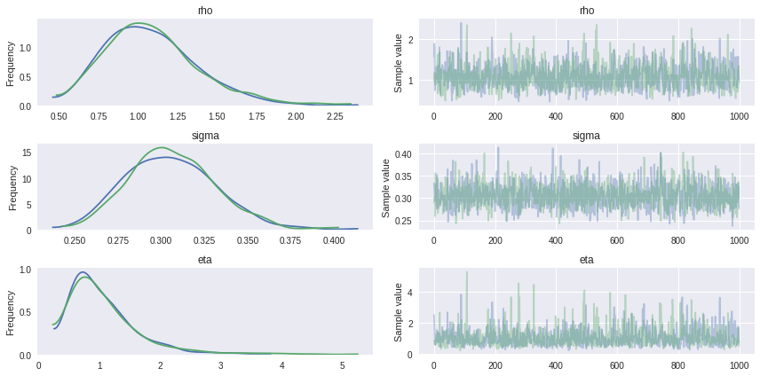
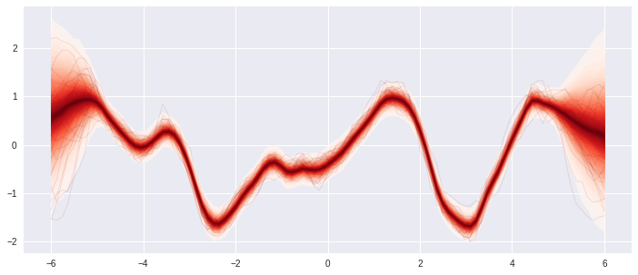

# Fitting Gaussian Process Models in Python

다음 [포스팅](https://blog.dominodatalab.com/fitting-gaussian-process-models-python/) 에서 gp를 pymc3로 구현한 부분에 대해서 정리해보려고 한다.

```python
import numpy as np
import pymc3 as pm
import matplotlib.pyplot as plt
%matplotlib inline
```

예제에 사용된 샘플 데이터를 변수로 저장한다.

```python
X = np.array([-5, -4.9, -4.8, -4.7, -4.6, -4.5, -4.4, -4.3, -4.2, -4.1,
              -4, -3.9, -3.8, -3.7, -3.6, -3.5, -3.4, -3.3, -3.2, -3.1,
              -3, -2.9, -2.8, -2.7, -2.6, -2.5, -2.4, -2.3, -2.2, -2.1,
              -2, -1.9, -1.8, -1.7, -1.6, -1.5, -1.4, -1.3, -1.2, -1.1,
              -1, -0.9, -0.8, -0.7, -0.6, -0.5, -0.4, -0.3, -0.2, -0.1,
              0, 0.1, 0.2, 0.3, 0.4, 0.5, 0.6, 0.7, 0.8, 0.9, 1, 1.1,
              1.2, 1.3, 1.4, 1.5, 1.6, 1.7, 1.8, 1.9, 2, 2.1, 2.2, 2.3,
              2.4, 2.5, 2.6, 2.7, 2.8, 2.9, 3, 3.1, 3.2, 3.3, 3.4, 3.5,
              3.6, 3.7, 3.8, 3.9, 4, 4.1, 4.2, 4.3, 4.4, 4.5, 4.6, 4.7,
              4.8, 4.9, 5])

Y = np.array(
    [1.04442478194401, 0.948306088493654, 0.357037759697332, 0.492336514646604,
     0.520651364364746, 0.112629866592809, 0.470995468454158, -0.168442254267804,
     0.0720344402575861, -0.188108980535916, -0.0160163306512027, -0.0388792158617705,
     -0.0600673630622568, 0.113568725264636, 0.447160403837629, 0.664421188556779,
     -0.139510743820276, 0.458823971660986, 0.141214654640904, -0.286957663528091,
     -0.466537724021695, -0.308185884317105, -1.57664872694079, -1.44463024170082,
     -1.51206214603847, -1.49393593601901, -2.02292464164487, -1.57047488853653,
     -1.22973445533419, -1.51502367058357, -1.41493587255224, -1.10140254663611,
     -0.591866485375275, -1.08781838696462, -0.800375653733931, -1.00764767602679,
     -0.0471028950122742, -0.536820626879737, -0.151688056391446, -0.176771681318393,
     -0.240094952335518, -1.16827876746502, -0.493597351974992, -0.831683011472805,
     -0.152347043914137, 0.0190364158178343, -1.09355955218051, -0.328157917911376,
     -0.585575679802941, -0.472837120425201, -0.503633622750049, -0.0124446353828312,
     -0.465529814250314, -0.101621725887347, -0.26988462590405, 0.398726664193302,
     0.113805181040188, 0.331353802465398, 0.383592361618461, 0.431647298655434,
     0.580036473774238, 0.830404669466897, 1.17919105883462, 0.871037583886711,
     1.12290553424174, 0.752564860804382, 0.76897960270623, 1.14738839410786,
     0.773151715269892, 0.700611498974798, 0.0412951045437818, 0.303526087747629,
     -0.139399513324585, -0.862987735433697, -1.23399179134008, -1.58924289116396,
     -1.35105117911049, -0.990144529089174, -1.91175364127672, -1.31836236129543,
     -1.65955735224704, -1.83516148300526, -2.03817062501248, -1.66764011409214,
     -0.552154350554687, -0.547807883952654, -0.905389222477036, -0.737156477425302,
     -0.40211249920415, 0.129669958952991, 0.271142753510592, 0.176311762529962,
     0.283580281859344, 0.635808289696458, 1.69976647982837, 1.10748978734239,
     0.365412229181044, 0.788821368082444, 0.879731888124867, 1.02180766619069,
     0.551526067300283])
```

주어진 데이터가 어떻게 분포되어 있는지 Scatter Plot을 그려서 확인해보자

```python
plt.figure(figsize=(12,5))
plt.scatter(X, Y)
```



pymc3는 베이지안 모델링을 위한 라이브러리이다.
Gaussian Process 를 모델링하기 위해 필요한 Mean / Covariance Function 및 각종 확률 분포를 위한 함수들을 제공한다.
`Model` 컨텍스트 내부에서 베이지안 모형을 구성하기 위해 필요한 변수와 함수들을 선언하는 방식으로 모델링한다.

```python
with pm.Model() as gp_fit:

    # Covariance Function을 위한 hyperprior
    rho = pm.Gamma('rho', 1, 1)
    eta = pm.Gamma('eta', 1, 1)

    # Covariance Function
    # - Matern 3/2 함수를 사용한다
    K = eta * pm.gp.cov.Matern32(1, rho)

    # Mean Function
    M = pm.gp.mean.Zero()

    # Observation noise
    # - Half Cauchy 분포를 따르도록 한다
    sigma = pm.HalfCauchy('sigma', 2.5)

    # 문서에 있는 pm.gp.GP 는 현재는 deprecated 된 API 인 것 같다
    # - pm.gp.Marginal를 사용한다
    # - Marginal은 GP prior와 additive noise 의 합으로 표현되는 경우에 사용한다
    gp = pm.gp.Marginal(cov_func=K)

    # pm.gp.Marginal 에서는 GP의 input이 column vector 형태로 주어져야 한다
    # - 따라서 X[:, None] 형태로 사용한다
    gp.marginal_likelihood('y_obs', X=X[:, None], y=Y, noise=sigma)

    # 주어진 분포를 바탕으로 샘플링한다
    # - pm.sample을 사용하면 MCMC 샘플링을 수행한다
    # - 기본값으로는 NUTS 샘플러를 사용한다
    trace = pm.sample(2000, n_init=20000)
```

Fitting 결과를 진단하기 위해 `pm.traceplot` 함수를 사용하여 샘플링 결과를 확인한다.

```python
pm.traceplot(trace[-1000:], varnames=['rho', 'sigma', 'eta'])
```



Posterior predictive distribution을 바탕으로 예측 결과를 샘플링한다.

위에서 학습한 trace를 바탕으로, 새롭게 생성한 점 Z에 대한 결과를 예측해본다.

```python
Z = np.linspace(-6, 6, 100).reshape(-1, 1)
with gp_fit:
    f_pred = gp.conditional('f_pred', Z)
    pred_samples = pm.sample_posterior_predictive(trace[-1000:], vars=[f_pred], samples=1000)
```

예측한 결과를 그래프를 통해 확인한다.

```python
fig = plt.figure(figsize=(12,5))
ax = fig.gca()
pm.gp.util.plot_gp_dist(ax, pred_samples['f_pred'], Z)
```


