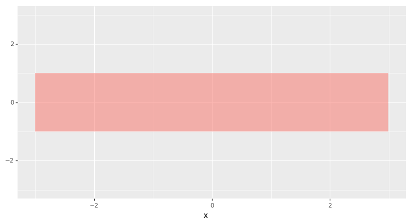
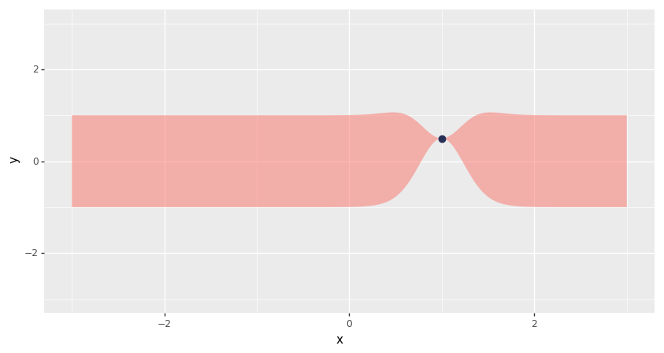
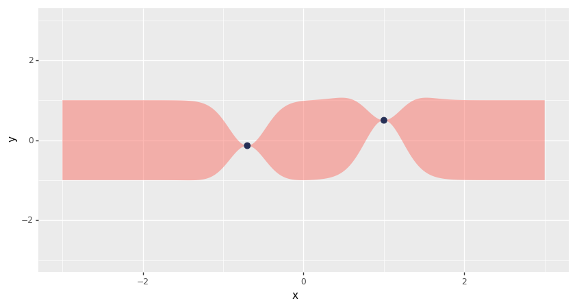
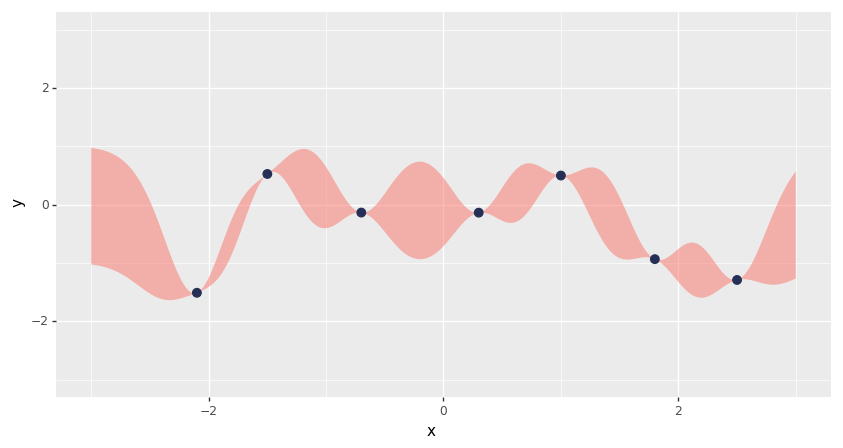

# Fitting Gaussian Process Models in Python

Chris Fonnesbeck의 글 앞부분을 정리해보고 상세한 설명을 추가해보려한다.

<https://blog.dominodatalab.com/fitting-gaussian-process-models-python/>

---

비선형 관계에 있는 변수들에 대해 회귀 모형을 구성해야 하는 경우가 종종 있다. 다음과 같은 방법이 존재한다.

1. sinusoidal, exponential, polynomial 함수처럼 **비선형적인 관계를 나타내기 위한 모형을 사용할 수 있다**
    - 하지만 이 경우에는 패턴이 명확하게 보이는 경우가 아니라면 가장 적합한 모형을 선택하기 위한 절차가 필요해진다
2. **spline 또는 kernel regression 을 통한 비모수적 접근 방법**을 사용할 수도 있다
    - 이러한 knot layout procedures 은 임시적인 방법이다. 그리고 변수 선택을 필요로 할 수도 있다.
3. **비모수적 베이지안 전략**을 통해 목표로 하는 함수를 직접 모델링하는 방법이 있다
    - 이를 위해 **Gaussian Process**를 사용해보자

베이지안의 맥락에서 *비모수적* 이라는 명칭은 오해의 여지가 많다.
베이지안 모형을 구축하기 위한 첫 번째 단계가 미지의 변수에 확률 분포를 부여하여 전체 확률 모형을 구성하는 것이기 때문이다.
모수적인 확률 함수들 없이 전체 확률 모형을 나타내는 것은 너무나도 어려운 작업이다.

여기서 비모수적이라는 것은 parameter가 없다는 의미가 아니라, 파라미터 수가 데이터가 커질수록 증가한다는 것을 의미한다. 비모수적 베이지안 모형들은 사실 모수적인 방법론이다.

# Building models with Gaussians

정규분포를 통해 데이터를 모델링한다면 어떻게 될까?

정규분포는 다양한 확률 분포 중에서 그다지 유연한 편이 아니기 때문에 큰 이점이 없을 것처럼 보인다. 하지만 가우시안 분포를 사용하게 될 경우 얻을 수 있는 이점이 몇 가지 있다.

1. 다변량 정규분포를 따르는 샘플의 marginal distribution 또한 정규분포를 따른다
2. 다변량 정규분포의 subset에서 조건부 확률 분포가 (남아있는 요소를 조건으로 할 때) 정규분포를 따른다

가우시안 프로세스는 함수의 분포라고 생각할 수 있다. **다변량 정규분포가 평균 벡터와 공분산 행렬로 표현**되는 것처럼, **GP는 평균 함수와 공분산 함수로 표현**된다. 유한개의 점이 있다면 GP는 다변량 정규 분포가 된다. 이 때, 평균과 공분산은 평균 함수와 공분산 함수를 가지고 해당 점에서 계산한 값이 된다.

# Sampling from a Gaussian Process

GP가 **함수에 대한 분포**라는 개념을 더 구체적으로 확인해보자.

- 아직 데이터가 주어지지 않았기 때문에 GP의 prior로부터 샘플링한다
    - 우선 **공분산 함수**가 필요하다 : Squared Exponential로 한다
    - **특정한 포인트에서의 공분산을 계산하기 위한 함수**가 필요하다 (공분산 행렬을 추출하기 위해)


```python
# colab에서 plotnine 설치시 발생하는 에러를 방지하기 위해 statsmodels 업데이트
# https://github.com/has2k1/plotnine/issues/252
!pip install statsmodels -U

# 그래프 작성을 위해 plotnine 설치
!pip install plotnine
```

```python
%matplotlib inline
import pandas as pd
import numpy as np
import matplotlib.pylab as plt
from plotnine import *

def exponential_cov(x, y, params):
    return params[0] * np.exp( -0.5 * params[1] * np.subtract.outer(x, y)**2)
```

다변량 정규분포의 조건부 확률 성질을 이용하여 값들을 순차적으로 생성해보자. 함수로 구현해보면 다음과 같다.

```python
def conditional(x_new, x, y, params):
    # p(x|y) = N(MUx + Sxy*Sy^-1 *(Y - MUy), Sx - Sxy*Sy^-1*Sxy')
    Sxy = exponential_cov(x_new, x, params)
    Sy = exponential_cov(x, x, params)
    Sx = exponential_cov(x_new, x_new, params)

    mu = np.linalg.inv(Sy).dot(Sxy.T).T.dot(y)
    sigma = Sx - Sxy.dot(np.linalg.inv(Sy).dot(Sxy.T))

    return(mu.squeeze(), sigma.squeeze())
```

가우시안 프로세스를 수행해보자

- 하이퍼 파라미터는 `theta0 = 1`, `theta1 = 10` 로 둔다
- 평균 함수는 zero function으로 한다
    - 모든 구간에서 평균에 대한 표준편차를 표현하는 밴드를 그릴 수 있다

```python
theta = [1, 10] # hyperparameters for GP (theta0, theta1)
sigma0 = exponential_cov(0, 0, theta)

xpts = np.arange(-3, 3, step=0.01)

(pd.DataFrame({
    'x': xpts,
    'y': np.zeros(len(xpts)),
    'sigma': sigma0})
  .pipe(ggplot, aes(x='x', ymax='y+sigma', ymin='y-sigma')) +
  geom_ribbon(fill='#FA7268', alpha=0.5) +
  ylim(-3, 3) +
  theme(figure_size=(10,5))
)
```



임의의 시작점을 선택해보자. `x=1` 으로 고른다. 이전 포인트가 하나도 없기 때문에, unconditional Gaussian 으로부터 샘플링한다.

```python
np.random.seed(42)

x = [1.]
y = [np.random.normal(scale=sigma0)]

y
# [0.4967141530112327]
```

이제 신뢰구간 밴드를 업데이트할 수 있다. 방금 샘플링한 포인트가 주어졌을 때, 공분산 함수를 통해 특정 포인트의 구간을 구한다.

```python
sigma1 = exponential_cov(x, x, theta)

def predict(x, data, kernel, params, sigma, t):
    k = [kernel(x, y, params) for y in data]
    Sinv = np.linalg.inv(sigma)
    y_pred = np.dot(k, Sinv).dot(t)
    sigma_new = kernel(x, x, params) - np.dot(k, Sinv).dot(k)
    return y_pred, sigma_new

x_pred = np.linspace(-3, 3, 1000)
predictions = [predict(i, x, exponential_cov, theta, sigma1, y) for i in x_pred]
y_pred, sigmas = np.transpose(predictions)
```

```python
df_points = pd.DataFrame({'x':x, 'y':y})
df_ribbons = pd.DataFrame({'x': x_pred, 'y': y_pred, 'sigma': sigmas})

(ggplot(df_ribbons, aes(x='x')) +
  geom_ribbon(aes(ymax='y+sigma', ymin='y-sigma'), fill='#FA7268', alpha=0.5) +
  geom_point(data=df_points, mapping=aes(y='y'), color='#263056', size=3) +
  ylim(-3, 3) +
  theme(figure_size=(10,5))
)
```



이제 저 지점과 우리가 설정했던 공분산 함수를 조건으로 하면, 추가적인 포인트가 위치할만한 지점이 제한된다.

새로운 포인트를 샘플링해보자.

```python
m, s = conditional([-0.7], x, y, theta)
y2 = np.random.normal(m, s)

y2
# -0.1382640378102619
```

```python
x.append(-0.7)
y.append(y2)
```

```python
sigma2 = exponential_cov(x, x, theta)
predictions = [predict(i, x, exponential_cov, theta, sigma2, y) for i in x_pred]
y_pred, sigmas = np.transpose(predictions)
```

```python
df_points = pd.DataFrame({'x':x, 'y':y})
df_ribbons = pd.DataFrame({'x': x_pred, 'y': y_pred, 'sigma': sigmas})

(ggplot(df_ribbons, aes(x='x')) +
  geom_ribbon(aes(ymax='y+sigma', ymin='y-sigma'), fill='#FA7268', alpha=0.5) +
  geom_point(data=df_points, mapping=aes(y='y'), color='#263056', size=3) +
  ylim(-3, 3) +
  theme(figure_size=(10,5))
)
```



동시에 여러 개의 포인트를 추가할 수도 있다

```python
x_more = [-2.1, -1.5, 0.3, 1.8, 2.5]
mu, s = conditional(x_more, x, y, theta)
y_more = np.random.multivariate_normal(mu, s)

y_more
# array([-1.5128756 ,  0.52371713, -0.13952425, -0.93665367, -1.29343995])

x += x_more
y += y_more.tolist()

sigma_new = exponential_cov(x, x, theta)
predictions = [predict(i, x, exponential_cov, theta, sigma_new, y) for i in x_pred]
y_pred, sigmas = np.transpose(predictions)
```

```python
df_points = pd.DataFrame({'x':x, 'y':y})
df_ribbons = pd.DataFrame({'x': x_pred, 'y': y_pred, 'sigma': sigmas})

(ggplot(df_ribbons, aes(x='x')) +
  geom_ribbon(aes(ymax='y+sigma', ymin='y-sigma'), fill='#FA7268', alpha=0.5) +
  geom_point(data=df_points, mapping=aes(y='y'), color='#263056', size=3) +
  ylim(-3, 3) +
  theme(figure_size=(10,5))
)
```


