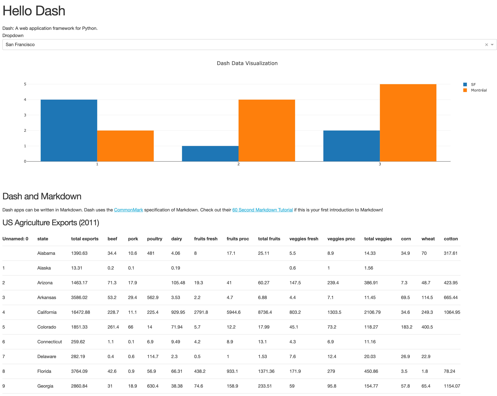

# Dash Tutorial 따라하기

R 생태계에 `shiny`가 있다면, 파이썬에는 `dash`가 있다.
다음 [튜토리얼](https://dash.plot.ly/getting-started) 을 따라하면서 dash의 기본적인 사용법을 익혀보려고 한다.

## Environment

`dash` 를 사용하기 위한 환경을 구성한다.

```sh
conda create -n dash_env python=3.6
source activate dash_env
```

필요한 라이브러리를 설치한다.

```sh
pip install dash==0.41.0
pip install dash-daq==0.1.4
pip install pandas==0.24.2
```

## Code

다음과 같이 `app.py` 파일을 작성한다

```python
import dash
import dash_core_components as dcc
import dash_html_components as html
import pandas as pd

# USA Agriculture Exports
df_agriculture = pd.read_csv(
    'https://gist.githubusercontent.com/chriddyp/'
    'c78bf172206ce24f77d6363a2d754b59/raw/'
    'c353e8ef842413cae56ae3920b8fd78468aa4cb2/'
    'usa-agricultural-exports-2011.csv')

# Reusable Table generating Function
def generate_table(df, title='', max_rows=10):
    return html.Div(children=[
        html.H4(children=title),
        html.Table(
            # Header
            [html.Tr([html.Th(col) for col in df.columns])] +
            # Body
            [html.Tr([
                html.Td(df.iloc[i][col]) for col in df.columns
            ]) for i in range(min(len(df), max_rows))]
        )
    ])

external_stylesheets = ['https://codepen.io/chriddyp/pen/bWLwgP.css']
app = dash.Dash(__name__, external_stylesheets=external_stylesheets)

app.layout = html.Div(children=[
    html.H1(children='Hello Dash'),

    html.Div(children='Dash: A web application framework for Python.'),

    html.Div([
        html.Label('Dropdown'),
        dcc.Dropdown(
            options=[
                {'label': 'New York City', 'value': 'NYC'},
                {'label': u'Montréal', 'value': 'MTL'},
                {'label': 'San Francisco', 'value': 'SF'}
            ],
            value='MTL'
        )
    ]),

    # `Graph` renders interactive data visualizations using plotly.js
    dcc.Graph(
        id='example-graph',
        figure={
            'data': [
                {'x': [1, 2, 3], 'y': [4, 1, 2], 'type': 'bar', 'name': 'SF'},
                {'x': [1, 2, 3], 'y': [2, 4, 5], 'type': 'bar', 'name': 'Montréal'},
            ],
            'layout': {
                'title': 'Dash Data Visualization'
            }
        }
    ),

    # Using Markdown to write blocks of text
    html.Div([
        dcc.Markdown(children='''
### Dash and Markdown

Dash apps can be written in Markdown.
Dash uses the [CommonMark](http://commonmark.org/) specification of Markdown.
Check out their [60 Second Markdown Tutorial](http://commonmark.org/help/)
if this is your first introduction to Markdown!
        ''')
    ]),

    # Generate Table with reusable components
    generate_table(df_agriculture, title='US Agriculture Exports (2011)')

])

if __name__ == '__main__':
    app.run_server(debug=True)
```

 `python app.py` 로 서버를 동작시키면 결과물을 확인할 수 있다.



## 주의할 점

- `dcc.Markdown` 으로 마크다운을 작성할 때, 마크다운 텍스트에 인덴트를 넣으면 인식하지 못한다
