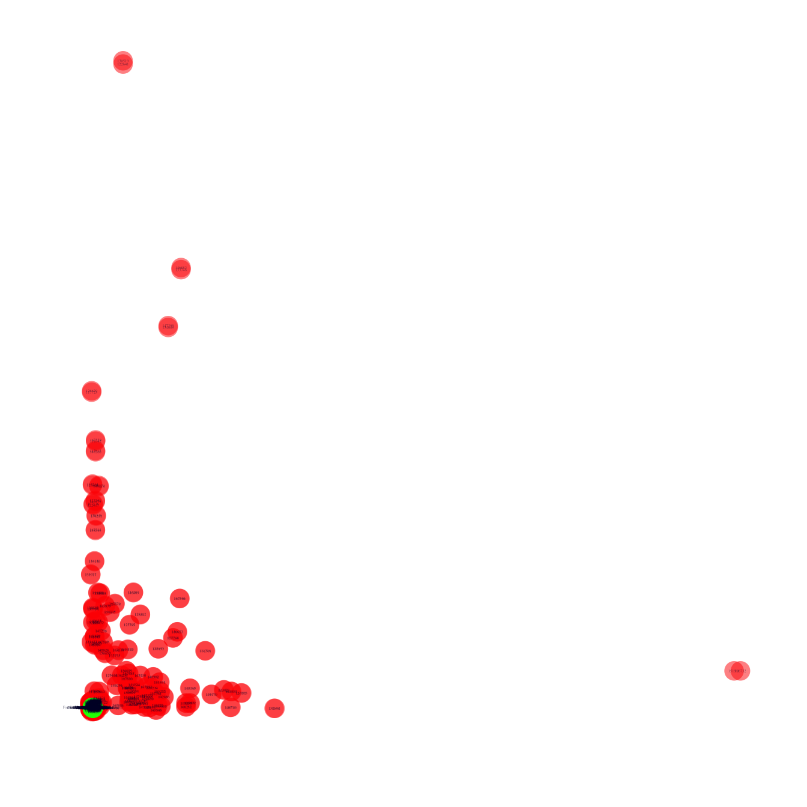
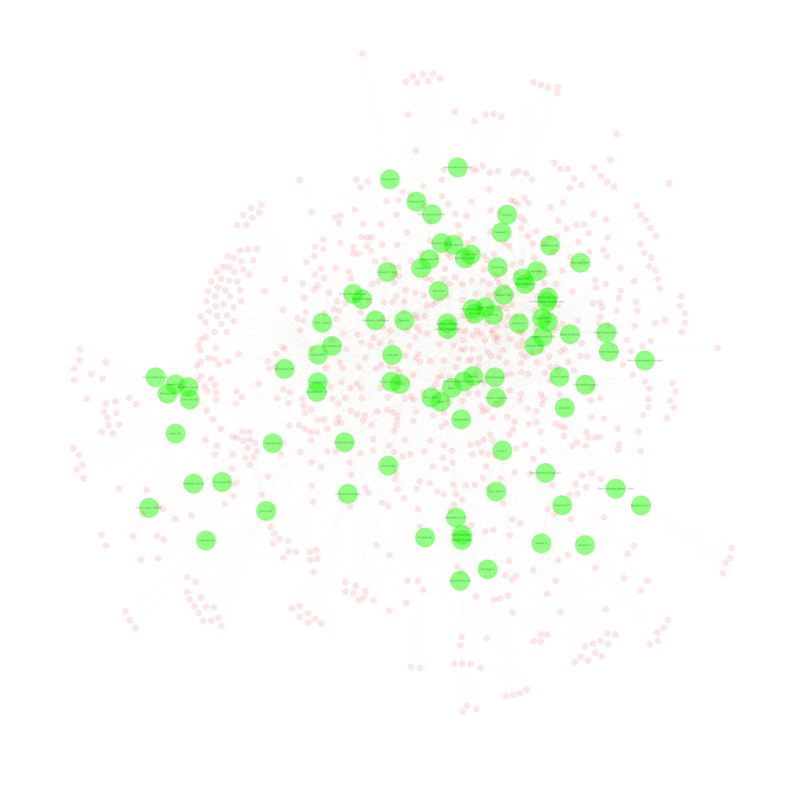
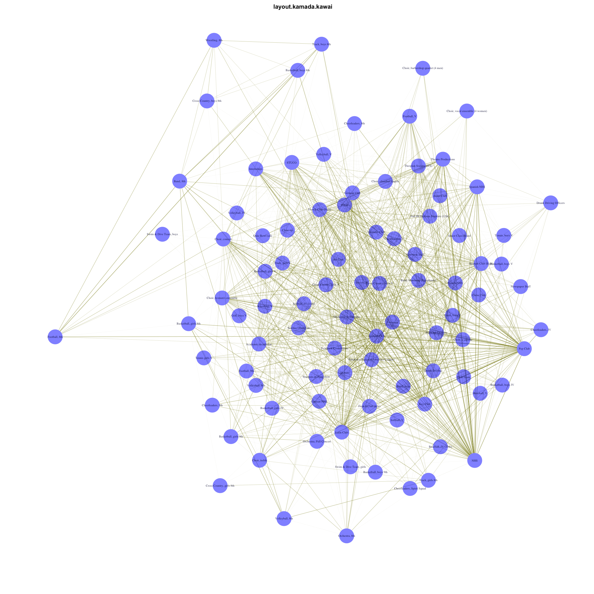
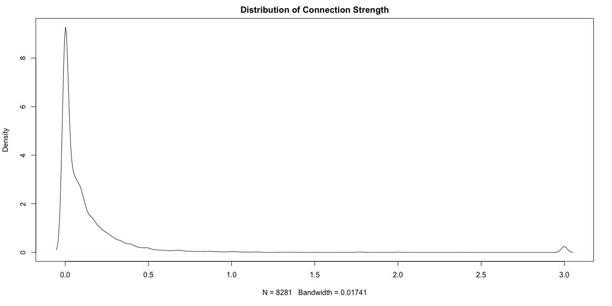
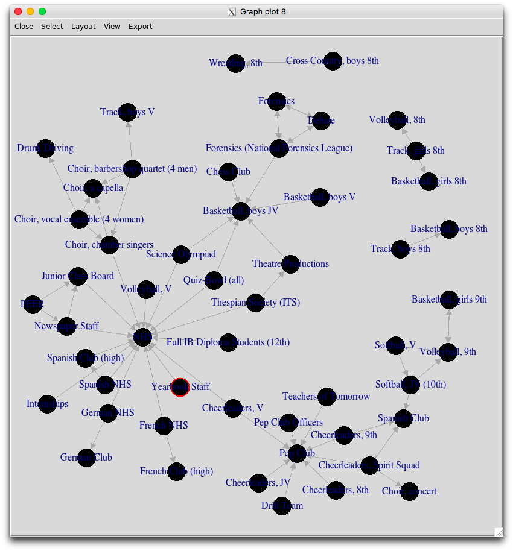
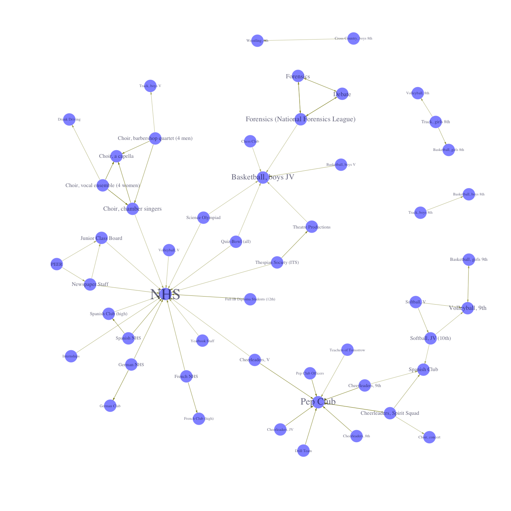

다음 포스팅을 정리하여 공유한다.

<https://solomonmessing.wordpress.com/2012/09/30/working-with-bipartiteaffiliation-network-data-in-r/>

# Bipartite/Affiliation Network Data

네트워크 형태의 데이터는 서로 다른 성질의 노드로 구성될 수 있다. (two-mode network data)

- 사람들과 그 사람들이 속한 그룹들
- 유저와 유저가 활동하고 있는 게시판/스레드

위와 같은 형태로 구성된 데이터 예제를 살펴보자. 

```r
library('tidyverse')

df <- data_frame(
  person = c('Sam','Sam','Sam','Greg','Tom','Tom','Tom','Mary','Mary'), 
  group = c('a','b','c','a','b','c','d','b','d')
)

df
# A tibble: 9 x 2
#   person group
#    <chr> <chr>
# 1    Sam     a
# 2    Sam     b
# 3    Sam     c
# 4   Greg     a
# 5    Tom     b
# 6    Tom     c
# 7    Tom     d
# 8   Mary     b
# 9   Mary     d
```

## Two-mode to One-mode conversion in R

위와 같은 데이터에서 사람들이 어떻게 직접 연결되어 있는지 궁금할 수 있다. 예를 들면, 같은 그룹의 속한 사람들을 연결해보고 싶다면 어떻게 해야 할까? 이런 경우에는 two-mode 네트워크를 one-mode 네트워크로 변환해야 한다.

two-mode의 incidence matrix를 one-mode의 adjacency matrix로 변환하기 위해서는 incidence matrix에 자기 자신의 전치행렬을 곱해주면 된다. incidence matrix는 0과 1로 구성되어 있기 때문에, 대각선상의 원소를 제외한 나머지 값들이 두 사람 사이에 공통적으로 존재하는 그룹을 나타내게 된다. 

```r
m <- df %>% table %>% as.matrix()

m
#       group
# person a b c d
#   Greg 1 0 0 0
#   Mary 0 1 0 1
#   Sam  1 1 1 0
#   Tom  0 1 1 1

m %*% t(m)
#       person
# person Greg Mary Sam Tom
#   Greg    1    0   1   0
#   Mary    0    2   1   2
#   Sam     1    1   3   2
#   Tom     0    2   2   3
```

`network`나 `sna` 라이브러리를 사용한다면 `as.matrix()`, `igraph` 라이브러리를 사용한다면 `get.adjacency()` 함수를 통해 위와 같은 네트워크 객체를 만들 수 있다. 

하지만 대용량 데이터를 다룬다면 어떻게 될까? 네트워크 데이터는 대체로 희소(sparse)하다. 연결된 노드보다 연결되지 않은 노드가 훨씬 많다. 그렇기 때문에 edgelist 형태로 데이터를 저장하는 방식을 선호한다. 여기서는 R의 행렬 관련 기능을 활용해보자. 

- `person` 열을 i 인덱스에 두고 (행렬의 행을 구성한다)
- `group` 열을 j 인덱스에 둔다 (행렬의 열)
- 연결되어 있는 경우 1을 표기한다

```r
sparse_m <- Matrix::spMatrix(
  nrow = length(unique(df$person)),
  ncol = length(unique(df$group)),
  i = as.numeric(factor(df$person)),
  j = as.numeric(factor(df$group)),
  x = rep(1, length(df$person))
)
row.names(sparse_m) <- levels(factor(df$person))
colnames(sparse_m) <- levels(factor(df$group))

sparse_m
# 4 x 4 sparse Matrix of class "dgTMatrix"
#      a b c d
# Greg 1 . . .
# Mary . 1 . 1
# Sam  1 1 1 .
# Tom  . 1 1 1
```

Row간의 (위 예제에서는 person) 연결관계에 대한 one-mode 표현을 보기 위해서는 원래의 행렬에 전치행렬을 곱하면 된다. 

```r
sparse_m %*% Matrix::t(sparse_m)
# 4 x 4 sparse Matrix of class "dgCMatrix"
#      Greg Mary Sam Tom
# Greg    1    .   1   .
# Mary    .    2   1   2
# Sam     1    1   3   2
# Tom     .    2   2   3
```

하지만 더 좋은 방법이 있다. `Matrix::tcrossprod()` 함수는 더 빠르고 효율적으로 계산한다.

```r
sparse_m_row = Matrix::tcrossprod(sparse_m)
# 4 x 4 sparse Matrix of class "dsCMatrix"
#      Greg Mary Sam Tom
# Greg    1    .   1   .
# Mary    .    2   1   2
# Sam     1    1   3   2
# Tom     .    2   2   3
```

`sparse_m_row` 는 row 항목들로 구성된 one-mode 행렬을 표현한다. 같은 그룹에 속한 사람들을 나타낸다. 

Column 항목에 대한 one-mode 표현은 다음과 같이 계산할 수 있다

```r
Matrix::t(sparse_m) %*% sparse_m
# 4 x 4 sparse Matrix of class "dgCMatrix"
#   a b c d
# a 2 1 1 .
# b 1 3 2 2
# c 1 2 2 1
# d . 2 1 2

sparse_m_col = sparse_m %>% 
  Matrix::t() %>% 
  Matrix::tcrossprod()
# 4 x 4 sparse Matrix of class "dsCMatrix"
#   a b c d
# a 2 1 1 .
# b 1 3 2 2
# c 1 2 2 1
# d . 2 1 2
```

여기서는 굉장히 작은 네트워크를 다루었지만, 위 방식은 거대한 네트워크 데이터로도 확장할 수 있다.

## Two-mode 데이터 분석하기

실제 데이터를 가지고 살펴보자. 3년간의 학생 방과후 활동에 대한 정보를 분석하려고 한다. 학생과 학생들이 속한 단체에 대한 정보로 구성되어 있다.

[참고](http://www.stat.cmu.edu/~brian/780/stanford%20social%20network%20labs/05%20Affiliation%20Data%20and%20Network%20Mobility/lab_5.R)

```r
magact96 = read_tsv("http://sna.stanford.edu/sna_R_labs/data/mag_act96.txt", na = "na")
magact97 = read_tsv("http://sna.stanford.edu/sna_R_labs/data/mag_act97.txt", na = "na")
magact98 = read_tsv("http://sna.stanford.edu/sna_R_labs/data/mag_act98.txt", na = "na")
```

위 파일들의 1-4열은 각 개인의 정보를 나타내고, 그 외의 다른 열들은 다양한 그룹에 참여하는지 여부에 대한 dummy variable이다. 연도에 따라 값이 변하지 않는 첫 4열은 새로운 변수로 따로 빼두자. 나머지 dummy variable은 행렬 형태로 변환한다.

```r
student_attributes = magact96[, 1:4]
```

```r
g96 = as.matrix(magact96[,-(1:4)])
g97 = as.matrix(magact97[,-(1:4)])
g98 = as.matrix(magact98[,-(1:4)])

row.names(g96) = magact96$`ID#`
row.names(g97) = magact97$`ID#`
row.names(g98) = magact98$`ID#`
```

이제 two-mode 행렬을 igraph로 불러온다

```r
library('igraph')

i96 = graph.incidence(g96, mode = c('all'))
i97 = graph.incidence(g97, mode = c('all'))
i98 = graph.incidence(g98, mode = c('all'))
```

### Two-mode 네트워크 시각화

```r
V(i96)$color[1:1295] = rgb(1, 0, 0, 0.5)
V(i96)$color[1296:1386] = rgb(0, 1, 0, 0.5)

V(i96)$label = V(i96)$name
V(i96)$label.color = rgb(0, 0, 0.2, 0.5)
V(i96)$label.cex = 0.4
V(i96)$size = 6
V(i96)$frame.color = NA
```

화면에 보여야 하는 Edge수가 많기 때문에 투명도를 높여서 보여준다.

```r
E(i96)$color <- rgb(0.5, 0.5, 0, 0.2)
```

Fruchterman-Reingold force-directed layout 알고리즘을 적용하여 시각화해보자. 일반적으로 edge가 많은 데이터는 Kamada-Kawai layout 알고리즘이 잘 동작한다. 하지만 노드 수가 많은 경우 속도가 크게 느려질 수 있다. 큰 데이터에는 Fruchterman-Reingold 알고리즘이 더 빠르게 동작하는데, 따로 떨어져있는 노드가 많을 경우 아래와 같이 유의미한 패턴을 찾아내는데 실패할 수 있다. 우리의 데이터를 표현하는데 어떤 알고리즘이 가장 잘 동작하는지 알기 위해서는 다양한 실험이 필요하다.

```r
plot(i96, layout=layout.fruchterman.reingold)
```



일단 홀로 떨어져있는 노드를 모두 제거하고 다시 그려보자. degree 값이 0인 항목(연결된 노드의 개수가 0개라는 것을 의미한다)을 모두 제거하면 된다. 

```r
i96_rm_isolates = delete.vertices(i96, V(i96)[ degree(i96)==0 ])
```

또한 학생 node는 더 작게 그리고, 레이블을 제거해버리자.

```r
V(i96_rm_isolates)$label[1:857] = NA
V(i96_rm_isolates)$color[1:857] = rgb(1, 0, 0, 0.1)
V(i96_rm_isolates)$size[1:857] = 2
 
E(i96_rm_isolates)$width = 0.3
E(i96_rm_isolates)$color = rgb(0.5, 0.5, 0, 0.1)
```

그래프를 확대해서 확인하고 싶다면 pdf로 출력 후 확인하면 된다.

```r
plot(i96_rm_isolates, layout=layout.fruchterman.reingold)
```



### Two-mode 에서 One-mode 로 변환하기

이제 그룹간의 연결관계를 나타내는 네트워크를 구성해보자.

```R
g96e = t(g96) %*% g96
g97e = t(g97) %*% g97
g98e = t(g98) %*% g98
 
i96e = graph.adjacency(g96e, mode = 'undirected')
```

동일한 edge가 여러번 반복되면 weight값이 높아지도록 그래프를 수정해보자.

```r
# 중복되는 Edge 수를 count하여 weight 프로퍼티에 추가한다.
E(i96e)$weight = count.multiple(i96e)

# 중복되는 Edge들을 제거한다
i96e_simple = simplify(i96e)
```

위에서 했던 것과 마찬가지로 시각화를 위한 옵션을 추가한다.

```r
V(i96e_simple)$label = V(i96e_simple)$name
V(i96e_simple)$label.color = rgb(0, 0, 0.2, 0.8)
V(i96e_simple)$label.cex = 0.6
V(i96e_simple)$size = 6
V(i96e_simple)$frame.color = NA
V(i96e_simple)$color = rgb(0, 0, 1, 0.5)
 
# Set edge gamma according to edge weight
edge_gamma = (log(E(i96e_simple)$weight) + 0.3)/max(log(E(i96e_simple)$weight) + 0.3)
E(i96e_simple)$color <- rgb(0.5, 0.5, 0, edge_gamma)
```

```r
plot(i96e_simple, main = 'layout.kamada.kawai', layout=layout.kamada.kawai)
```



### Group overlap networks and plots

그룹 간에 얼마나 겹치는지 정도가 궁금할 수도 있다. 이것은 방향성을 가진 directed graph가 된다. 그룹 간의 겹치는 정도가 대칭적인 지표가 아니기 때문이다. 예를 들면, Spanish NHS 멤버 중에서 3/4이 NHS 멤버이지만 NHS 멤버 중에서 1/8 만이 Spanish NHS 멤버이다. 

모든 연도의 데이터에 대해 그래프를 구해보자.

우선 percent overlap graph를 구성해보자. 

```r
# 각 row를 행렬의 대각원소 값으로 나눈다
overlap_g96 = g96e / diag(g96e)
overlap_g97 = g97e / diag(g97e)
overlap_g98 = g98e / diag(g98e)

# 각 행렬을 합치고 NA값이 존재하는 경우 0으로 변경한다
overlap_all = overlap_g96 + overlap_g97 + overlap_g98
overlap_all[is.na(overlap_all)] = 0
```

3년치 데이터를 합쳤기 때문에 각 노드의 최대값은 1대신 3이 된다.

평균 그룹 사이즈를 구해보자. 각 대각행렬의 값을 평균하면 된다.

```r
avg_group_size = list(g96e, g97e, g98e) %>% 
  Map(diag, .) %>% 
  Reduce(cbind, .) %>% 
  apply(1, mean)

avg_group_size[1:5]
# Asian Club      Hispanic Club         Latin Club  French Club (low) French Club (high) 
#   20.33333           28.00000           45.00000           40.33333           49.66667 
```

`overlap_all` 그래프를 위한 중심성 지표들을 계산해보자. igraph 객체를 생성할 때 `weighted=T` 옵션을 추가해야 한다. 해당 옵션이 빠질 경우 edge 값을 연결된 횟수로 처리한다 (정수값으로 반영된다)

```r
overlap_all_graph = graph.adjacency(overlap_all, weighted = TRUE)

# Degree
V(overlap_all_graph)$degree = degree(overlap_all_graph)

# Betweenness centrality
V(overlap_all_graph)$btwcnt = betweenness(overlap_all_graph)
```

네트워크 데이터를 시각화하기 전에, 일부 edge를 필터링 해야 한다. 그렇지 않으면 너무 복잡해져서 눈에 잘 들어오지 않게 된다. edge 간의 연결 강도 분포를 그래프로 확인해보자.

```r
plot(density(overlap_all), main = 'Distribution of Connection Strength')
```



대부분의 edge weight가 1보다 작다. 다시 말하면 그룹이 겹치는 비중이 대부분 1/3보다 작다는 것이다. weight가 1보다 작은 경우를 제거하도록 하자. 

```r
overlap_all_lt1 = overlap_all
overlap_all_lt1[overlap_all_lt1 < 1] = 0

overlap_all_lt1_graph = overlap_all_lt1 %>% 
  graph.adjacency(weighted = TRUE) %>% 
  igraph::simplify(remove.multiple = FALSE, remove.loops = TRUE) # Source/Target node가 같은 edge만 제거

# 연결된 edge가 없는 node를 제거하자
overlap_all_lt1_graph = overlap_all_lt1_graph %>% 
  delete.vertices(degree(.) == 0)

# Degree & Betweenness centrality
V(overlap_all_lt1_graph)$degree = degree(overlap_all_lt1_graph)
V(overlap_all_lt1_graph)$btwcnt = betweenness(overlap_all_lt1_graph)
```

이번에는 Fruchterman-Reingold 알고리즘을 기반으로 커스텀 레이아웃을 구성해보자. tkplot GUI 환경을 이용하면 각 노드의 위치를 손으로 조정할 수 있다.

```r
overlap_all_lt1_graph$layout = layout.fruchterman.reingold(overlap_all_lt1_graph)
V(overlap_all_lt1_graph)$label = V(overlap_all_lt1_graph)$name

# tkplot GUI 작동
igraph::tkplot(overlap_all_lt1_graph, canvas.width = 800, canvas.height = 800)
```

label이 겹쳐서 가려지지 않도록 주의해서 작업하자. 수정한 레이아웃을 그래프에 저장한다.

```r
# 작업했던 tkplot 객체의 id값을 통해 커스텀으로 수정한 레이아웃 결과를 가져온다
# tkplot GUI가 켜져있어야 한다
# GUI 상단에 있는 <Graph Plot {00}> 에서 {00}에 해당하는 값이 id값이다
# ex) <Graph Plot 1> ==> tkplot.getcoords(1)
overlap_all_lt1_graph$layout = tkplot.getcoords(1)
```



이제 그래프를 그리기 위한 설정들을 반영한다

```r
# vertex 설정
V(overlap_all_lt1_graph)$label = V(overlap_all_lt1_graph)$name
V(overlap_all_lt1_graph)$label.color = rgb(0, 0, 0.2, 0.6)
V(overlap_all_lt1_graph)$size = 6
V(overlap_all_lt1_graph)$frame.color = NA
V(overlap_all_lt1_graph)$color = rgb(0, 0, 1, 0.5)

# Edge 설정
E(overlap_all_lt1_graph)$arrow.size = 0.3

# Edge weight값에 따라 Edge Gamma 값 조정
edge_gamma = (E(overlap_all_lt1_graph)$weight + 0.1) / max(E(overlap_all_lt1_graph)$weight + 0.1)
E(overlap_all_lt1_graph)$color <- rgb(0.5, 0.5, 0, edge_gamma)

# Degree 값을 기준으로 Label의 크기를 조절한다
# 워드클라우드와 비슷한 효과를 낸다
V(overlap_all_lt1_graph)$label.cex = V(overlap_all_lt1_graph)$degree %>% { . / (max(.) / 2) + 0.5 }
```

```r
plot(overlap_all_lt1_graph)
```



참고로 위 그래프를 그리는데는 커스텀 레이아웃을 사용했고, 해당 레이아웃은 그래프 객체에 포함되어 있기 때문에 `plot()` 함수를 사용할 때 layout 옵션을 추가할 필요가 없다.
