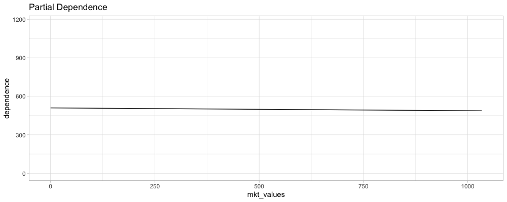
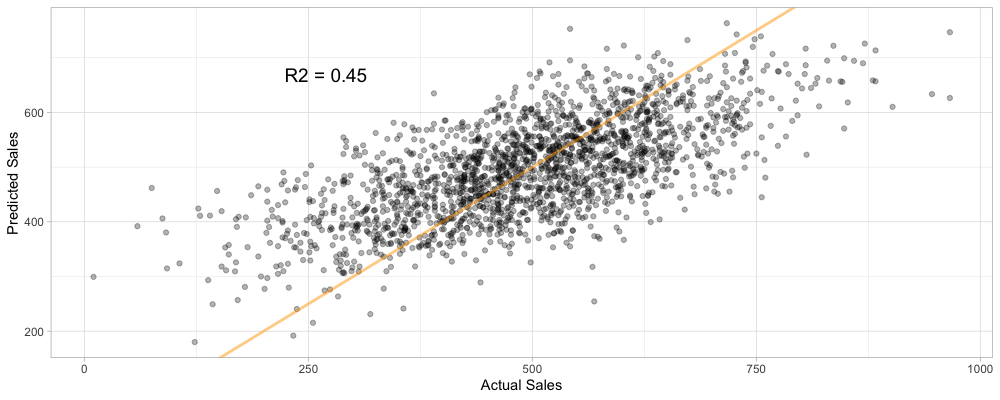

- 다음 포스팅을 요약해서 정리해보자

["X affects Y". What does that even mean?](https://iyarlin.github.io/2019/03/13/x-affects-y-what-does-that-even-mean/)

---

# Analyzing the effect of X on Y

Causal inference 분야는 X 변수가 Y 변수에 어떻게 영향을 미치는지에 대해 다룬다. 우선은 머신러닝이 보통 이 문제를 어떻게 다루는지 살펴보자.

## Partial Dependence Plots

고전적인 머신러닝 문제는 관측 가능한 변수 {X, Z} 집합이 있을 때 결과 변수 Y의 기대값을 예측하고자 한다.

```
E(Y | X=x, Z=z)

- 여기서 X는 Y에 어떻게 영향을 미치는지 알고 싶은 특별한 변수다
- Z는 나머지 모든 측정 가능한 변수를 말한다
```

관측치 `{y_i, x_i, z_i}` 가 있다면, 예측함수 `f(x, z)` 를 구성할 수 있다.

```
f(x, z) = E_hat(Y | X=x, Z=z)
```

X의 Y에 대한 marginal effect를 구하고자 할 때, 머신러닝에서 일반적으로 사용하는 방식은 Partial dependece plot을 사용하는 것이다. 
Partial dependence 함수는 다음과 같이 정의할 수 있다.

```
PD(x) = E(Y | X=x) = E_z(f(x, Z))

- Z의 모든 값에 대해서 marginalize 하고 있다
```

`PD(x)` 는 보통 다음과 같이 예측한다.

```
PD_hat(x) = 1/n * SUM( f(x, z_i) )
```

Partial Dependence Plot은 다양한 X값과 각각에 대응하는 PD 값을 그래프로 표현한다.

흔한 오해 중 하나는 PDP가 다양한 X의 값이 Y에 어떻게 영향을 미치는지를 보여준다고 생각하는 것이다. 왜 이것이 오해라는 것일까? 간단한 예제 모형을 살펴보자.

마케팅 비용이 매출에 얼마나 영향을 미치고 있는지 파악해야 한다고 생각해보자. 다음과 같은 정보를 가지고 있다.

- mkt : 마케팅 비용 사용 기록
- visits : 웹사이트 방문 수
- sales : 판매건수
- comp : competition index

몇 가지 식을 통해 간단한 시뮬레이션을 수행해보자 (구조 방정식 이라고도 한다)

```
SALES  = beta1 * VISITS + beta2 * COMP + error1
VISITS = beta3 * MKT   + error2
MKT    = beta4 * COMP  + error3
COMP   = error4

{beta1, beta2, beta3, beta4} = {0.3, -0.9, 0.5, 0.6} 
error_i ~ N(0,1)
```

우리는 위 공식을 시뮬레이션을 통해 생성한 데이터셋의 데이터 생성 프로세스(DGP: Data Generating Process)라고 이해할 수 있다. 이것을 바탕으로 1만건의 샘플을 생성하고, 처음 8000건에 대해서 다음과 같이 선형 회귀 모형을 구성했다. 

```
SALES = r0 + r1*MKT + r2*VISITS + r3*COMP + error
```

R을 사용해서 시뮬레이션 값을 구하고, mkt와 sales 사이의 PDP를 계산해 그래프로 표현해보자.

```r
library(tidyverse)

# 각 변수들의 값을 생성한다
comp <- rnorm(10000, sd = 1)
mkt <- 0.6 * comp + rnorm(10000, sd = 1)
visits <- 0.5 * mkt + rnorm(10000, sd = 1)
sales <- 0.3 * visits - 0.9 * comp + rnorm(10000, sd = 1)

# 실제 데이터와 유사한 형태로 스케일을 조정한다
sim_data <- tibble(
  mkt = (mkt - min(mkt)) * 100,
  visits = floor((visits - min(visits)) * 1000),
  sales = floor((sales - min(sales)) * 100),
  comp = comp - min(comp)
)

# 생성한 데이터중 일부를 가지고 선형 회귀 모형을 구성한다
model <- lm(sales ~ ., data = sim_data[1:8000,])

# mkt 구간을 10개로 나눈다
mkt_vals <- seq(min(sim_data$mkt), max(sim_data$mkt), length.out = 10)

# 주어진 mkt 값에 대해서 dependence를 계산하는 함수를 구성한다
estimate_dependence <- function(model_obj, newdata, mkt_value) { 
  mean(predict(model_obj, newdata = newdata %>% mutate(mkt = mkt_value)))
}

# 구간별 dependence값을 계산한다
dependence <- mkt_vals %>% 
  map_dbl(partial(estimate_dependence, model_obj = model, newdata = sim_data))

# mkt 값별 dependence 값을 데이터프레임으로 구성한다
mkt_dp <- tibble(
  mkt_values = mkt_vals,
  dependence = dependence
)

# mkt 값별로 dependence 값을 그래프로 표현한다
ggplot(mkt_dp, aes(x = mkt_values, y = dependence)) +
  geom_line() +
  ylim(min(sim_data$sales), max(sim_data$sales)) +
  ggtitle('Partial Dependence') +
  theme_light()
```



선이 거의 평평한 것을 보아 효과가 거의 없다고 해석할 수 있다. 하지만 실제로 이 직선의 기울이는 `beta1 * beta3 = 0.15` 가 되어야 한다.

Sales 변수의 예측값과 실제값을 비교해보면 모형이 완벽하지는 않지만 데이터를 상당히 잘 설명하고 있는 것을 볼 수 있다. 그런데도 PDP는 생각했던 것과 다른 결과가 나오는 것을 볼 수 있다.

```r
# sales의 실제값과 예측값을 데이터프레임으로 구성한다
sales_compare <- tibble(
  actual = sim_data[8001:10000,] %>% pull(sales),
  predicted = predict(model, sim_data[8001:10000,])
)

# 모형의 R-Squared 값을 계산한다
sales_r2 <- with(sales_compare, {
  round(1 - var(predicted - actual) / var(actual), 2)
})

# Sales의 실제값과 예측값을 그래프로 비교한다
ggplot(sales_compare, aes(x = actual, y = predicted)) + 
  geom_point(alpha = 0.3) + 
  geom_abline(intercept = 0, slope = 1, color = 'orange', size = 1, alpha = 0.5) +
  annotate('text', 
           x = quantile(sim_data$mkt, 0.01), 
           y = quantile(sim_data$sales, 0.9), 
           label = paste0('R2 = ', sales_r2), size = 5) + 
  labs(x = 'Actual Sales', y = 'Predicted Sales') +
  theme_light()
```




## The "do" operator

변수간의 관계가 실제와는 다르게 계산된 이유는, **"X가 Y에 어떻게 영향을 미치는가?" 라는 질문이 잘못 정의되었고** 그에 따라 도구를 선택했기 때문이다. 

우리는 다음 두 가지를 구분해서 이해해야 한다.

- `X = x` : X라는 변수가 x 값을 갖는 것을 관찰한다
- `do(X = x)` : X변수가 x라는 값을 갖도록 강제한다
