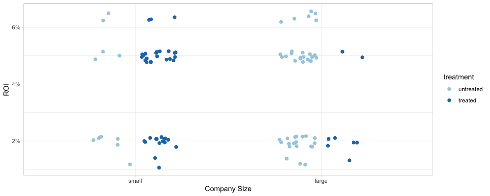

- 다음 포스팅을 요약해서 정리해보자

[Causal inference bake off (Kaggle style!) - Just be-cause](https://iyarlin.github.io/2019/05/20/causal-inference-bake-off-kaggle-style/)

---

# Causal Inference objectives and the need for specialized algorithms

## ATE: Average Treatment Effect

X가 Y에 미치는 인과적인 영향을 예측하기 위해서는 "Backdoor Criteria"를 만족하는 변수 집단 Zb 를 알아야 한다. 그러면 다음과 같은 공식을 적용할 수 있다. 

```
E(Y | do(x)) = SUM_Zb( f(x, Zb) * P(Zb) )

-> Y는 목표 변수를 의미한다
-> do(x) 는 변수 X를 x값으로 설정하는 행위를 말한다
-> f(x, Zb) = E_hat(Y | x, Zb)
```

위 공식에서 f(x, Zb) 는 일반적인 ML 알고리즘을 통해 구할 수 있는 예측 함수다. 그렇다면 머신러닝 알고리즘 대신 특수한 인과 관계 알고리즘이 왜 필요한걸까?

그 이유는 인과관계 추론의 목적이 머신러닝과 다르기 때문이다. 

- **Machine Learning** : `E(Y | x)` 을 예측하고자 한다
- **Causal Inference** : `E(Y | do(x1)) - E(Y | do(x2))` 를 예측하고자 한다
    - 여기서 X에 서로 다른 값을 적용했을 때 발생하는 예측값의 차이를 **Average Treatment Effect (ATE)** 라고 한다

왜 `E(Y | x)` 값의 예측값이 ATE의 예측값과 달라질 수 있는 것일까? 예제를 통해 살펴보자.

- 일부 고객들을 대상으로 새로 개발한 자동 입찰 알고리즘에 대한 테스트를 진행했다
- 자동 입찰 알고리즘을 적용한 경우 treated 군으로 분류한다
- Proportion은 플랫폼 내 전체 캠페인 중에서 얼마나 비중을 차지하는지 알려준다

| Treatment | Company Size | ROI | Proportion |
|-----------|--------------|-----|------------|
| untreated | small        | 1%  | 0.1        |
| treated   | small        | 2%  | 0.4        |
| untreated | large        | 5%  | 0.4        |
| treated   | large        | 5%  | 0.1        |

g-computation 공식을 적용하려면 조정 대상인 Zb 변수를 잘 찾아야 한다. 
고객과 이야기하다보니 대기업들은 분석가들을 통해 캠페인을 최적화시키기 때문에 상대적으로 더 높은 ROI를 얻는다는 것을 알게 되었다. 
그런 대규모 분석팀을 꾸리고 있는 회사라면 작은 회사들에 비해서 우리의 자동 입찰 알고리즘을 테스트해보려 하지 않을 것이다. 
따라서 다음과 같은 DAG를 생각해볼 수 있다.

```
Company Size -> Treatment
                    ↓
Company Size -> ROI
```

위 DAG에 "Backdoor Criteria" 를 적용하면 회사의 규모가 교란 변수라는 것을 알게 된다. 따라서 회사의 규모가 바로 `Z_b` 변수가 된다.

```
E(ROI | do(treatment))
= SUM_{company_size}( E(ROI | treatment, company_size ) * P(company_size)

여기서 company_size 는 {small, large} 값을 가질 수 있다
```

결국 다음과 같은 값을 계산할 수 있다.

```
E(ROI | do(treated))
= 2% + (0.4 + 0.1) + 5% * (0.1 + 0.4)
= 3.5%

E(ROI | do(untreated))
= 1% * (0.4 + 0.1) + 5% * (0.1 + 0.4)
= 3%

ATE = E(ROI | do(treated)) - E(ROI | do(untreated))
    = 0.5%
```

최종적으로 자동 입찰 알고리즘을 사용하면 평균적으로 ROI가 0.5% 가량 상승한다는 것을 의미한다.

이번에는 데이터에 오차가 많아서 평균 ROI 만으로는 정확한 ROI를 예측하기 어렵다고 가정해보자. 이번에는 2개의 모형을 통해 ROI를 예측한다. (괄호 안의 %는 오차를 의미한다)

| Treatment | Company Size | Proportion | ROI (true, unknown) | ROI (model1) | ROI (model2) |
|-----------|--------------|------------|---------------------|--------------|--------------|
| untreated | small        | 0.1        | 1%                  | 1.5% (0.5%)  | 0% (1%)      |
| treated   | small        | 0.4        | 2%                  | 1.5% (0.5%)  | 1% (1%)      |
| untreated | large        | 0.4        | 5%                  | 5.5% (0.5%)  | 4% (1%)      |
| treated   | large        | 0.1        | 5%                  | 4.5% (0.5%)  | 4% (1%)      |

모형1,2를 가지고 ATE를 예측해보자. 모형 2의 오차가 더 크지만 더 정확하게 예측하는 것을 볼 수 있다.

```
#### model1 ####
E_hat(ROI | do(treated))
= 1.5% * (0.4 + 0.1) + 4.5% * (0.1 + 0.4)
= 3%

E_hat(ROI | do(untreated))
= 1.5% * (0.4 + 0.1) + 5.5% * (0.1 + 0.4)
= 3.5%

ATE_hat = -0.5%


#### model2 ####
E_hat(ROI | do(treated))
= 1% * (0.4 + 0.1) + 4% * (0.1 + 0.4)
= 2.5%

E_hat(ROI | do(untreated))
= 0% * (0.4 + 0.1) + 4% * (0.1 + 0.4)
= 2%

ATE_hat = 0.5%
```

## CATE : Conditional Average Treatment Effect

맨 처음 제시된 테이블을 보면 자동 입찰 알고리즘을 사용할 경우 ROI가 평균적으로 0.5% 상승하는 반면, 
작은 회사들에 대해서는 1% 상승시켰고 큰 회사들에서는 ROI가 개선되지 않았다는 것을 알 수 있다. 

Z 변수(이번 예제의 Company Size 변수)에 대한 조건부 효과를 **"Conditional Average Treatment Effect"** (CATE) 라고 한다. 
Binary의 경우 CATE는 다음과 같이 정의할 수 있다.

```
CATE(z) := E(Y | do(1), z) - E(Y | do(0), z)
```

앞서 살펴본 두 모형에 대해 실제 CATE와 예측값을 비교해보자. (괄호 안은 절대 오차를 나타낸다)

| Company Size | CATE (true, unknown) | CATE (model1) | CATE (model2) |
|--------------|----------------------|---------------|---------------|
| Small        | 1%                   | 0% (1%)       | 1% (0%)       |
| Large        | 0%                   | -1% (1%)      | 0% (0%)       |

`E(Y)` 를 더 정확하게 예측했던 model1은 이번에도 실제 CATE를 예측하는데 실패했다. 반면 model2는 정확하게 예측했다.

## An example with simulated data

100개의 데이터를 생성해서 의사결정 트리를 통해 학습시켰다. 그런데 학습결과를 보니 트리가 자동 알고리즘 적용 여부 (Treatment)를 완전히 무시했다.

    0.034 (100%)
    ㄴ Company_size = Small -> 0.046 (56%)
    ㄴ Company_size = Large -> 0.019 (44%)

왜 그런 일이 발생했는지 알아보기 위해 데이터의 분포를 확인해보자.

```R
library(tidyverse)

# Random Seed 설정
set.seed(123)

# 샘플링 과정에 공통적으로 사용할 표준편차 파라미터
sample_sd <- 0.01

# 주어진 비율에 맞게 그룹 샘플링 
sampled_group <- sample(
    x = c('untreated, small', 'treated, small', 'untreated, large', 'treated, large'),
    size = 100,
    replace = TRUE, 
    prob = c(0.1, 0.4, 0.4, 0.1)
)

# 샘플링된 그룹 정보에 따라 ROI 값을 시뮬레이션
ROI <- case_when(
    sampled_group == 'untreated, small' ~ rnorm(1, mean = 0.01, sd = sample_sd),
    sampled_group == 'treated, small'   ~ rnorm(1, mean = 0.02, sd = sample_sd),
    sampled_group == 'untreated, large' ~ rnorm(1, mean = 0.05, sd = sample_sd),
    sampled_group == 'treated, large'   ~ rnorm(1, mean = 0.05, sd = sample_sd),
)

# 시뮬레이션 결과를 테이블로 정리
sim_data <- tibble(
    treatment = factor(gsub(',.+', '', sampled_group), levels = c('untreated', 'treated')), 
    company_size = factor(gsub('.+, ', '', sampled_group), levels = c('small', 'large')), 
    ROI = ROI
)

# 그룹별 ROI 분포를 시각화
ggplot(sim_data, aes(x = company_size, y = ROI, color = treatment)) + 
    geom_point(position = position_jitterdodge(dodge.width = 0.5, jitter.height = 0.002),
                size = 2) + 
    xlab('Company Size') + 
    scale_color_brewer(palette = 'Paired') +
    scale_y_continuous(labels = scales::percent_format(accuracy = 1)) +
    theme_light()
```



위 데이터를 보면 인과 추론 문제를 일반적인 ML 문제로 풀었을 때 문제가 될 수 있는 부분들이 존재한다.

1. 다른 요인들에 비해서 Treatment에 의한 변동성이 작아서 **Treatment에 의한 효과를 과소평가할 우려**가 있다
    - 여기서는 Company Size에 의한 변동성이 더 크기 때문에, 의사결정 트리를 학습하면 Treatment에 따른 차이를 무시해버린다
2. Treatment에 따른 **분포가 한 쪽으로 크게 쏠려있다**
    - 작은 회사에서는 treatment 대상인 회사들이 많고, 큰 회사에서는 거의 없다
    - 같은 규모의 회사끼리 비교하기 어려워져서 CATE를 예측하기 힘들어진다

더 강력한 ML 알고리즘과 CI 문제를 풀기 위한 알고리즘을 적용해보고 결과를 비교해보자.
