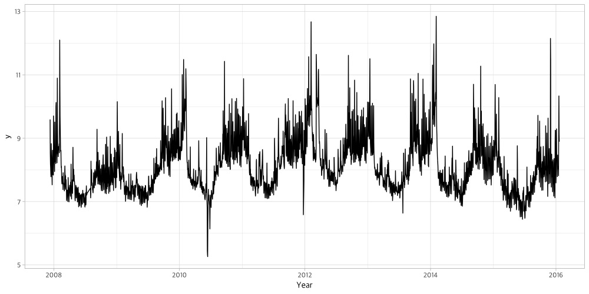
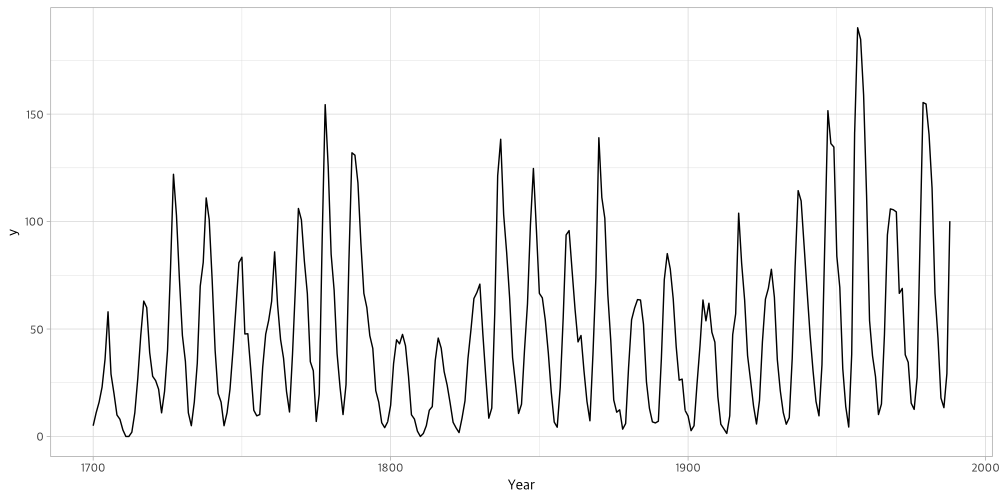
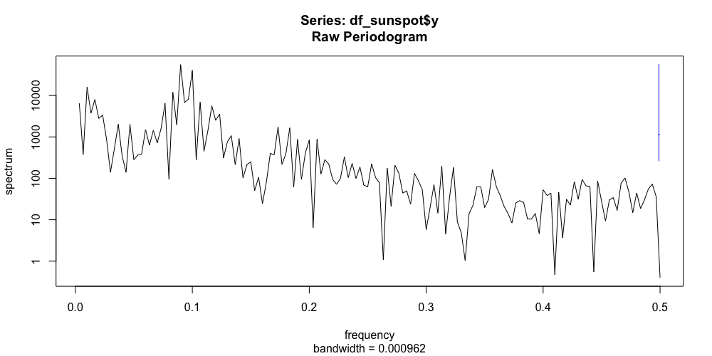
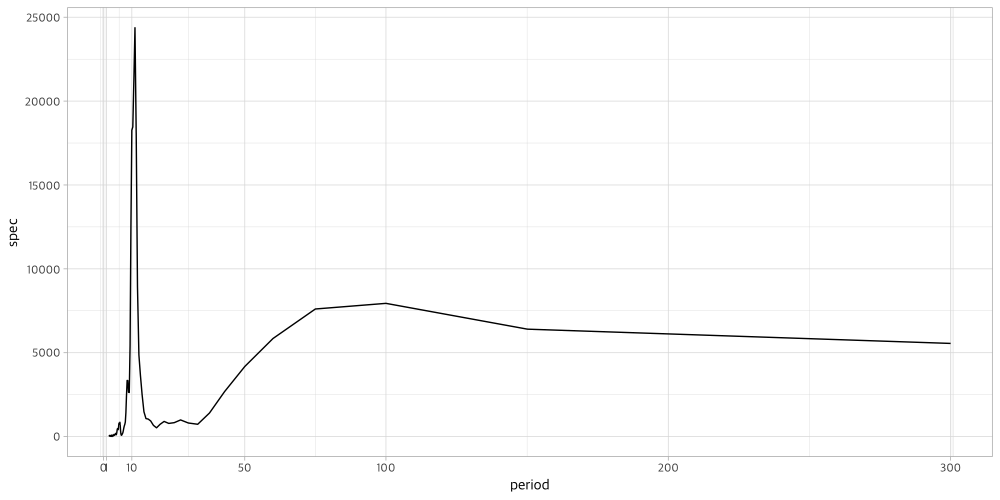
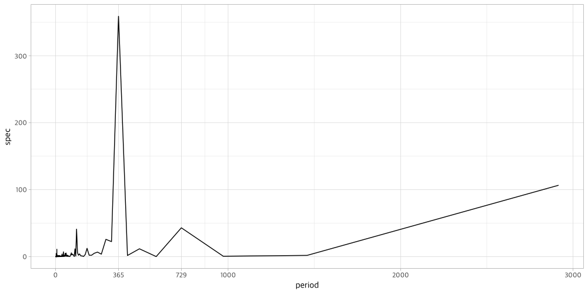

# 시계열 자료에서 주기를 추출하기

시계열 데이터를 다루다 보면 그래프 상으로는 명확하게 주기가 보이는 경우가 있다.
만약 주기적인 반복이 보일 때, 해당 주기를 어떻게 수치적으로 구할 수 있을까?

## 라이브러리 및 데이터 준비

```r
library(tidyverse)

# prophet 예제로 나오는 peyton manning 데이터
peyton = read_csv('https://github.com/facebook/prophet/raw/master/examples/example_wp_log_peyton_manning.csv')

# 연도별 태양 흑점수 데이터
# - R에서 기본적으로 제공하는 sunspot.year 자료를 tidy data로 변환한다
df_sunspot = broom::tidy(sunspot.year) %>%
  mutate(year = seq(1700, 1988, 1)) %>%
  select(year, y = value) %>%
  mutate(ds = lubridate::ymd(year, truncated = 2))
```

## 그래프로 추이를 확인해보자

```r
ggplot(peyton, aes(x = ds, y = y)) +
  geom_line() +
  xlab('Year')
```



```r
ggplot(df_sunspot, aes(x = ds, y = y)) +
  geom_line() +
  xlab('Year')
```



## 데이터에서 주기를 어떻게 파악할 수 있을까?

- FFT (Fast Fourier Transform) 을 사용해 Spectral Density를 추정하면 이를 바탕으로 주기를 계산할 수 있다
- `spec.pgram` 함수를 이용해 **Periodogram** 을 그려보자

```r
spec.pgram(df_sunspot$y)
```



- `spec.pgram` 함수는 두 가지 값을 반환한다
    - `freq` : 주파수
    - `spec` : 해당 주파수의 spectral density
- frequency의 역수를 구하면 주기를 구할 수 있다
- 따라서 spectral density가 최대값이 되는 지점의 `1 / freq` 값을 구하면, 해당 지점이 바로 주기일 가능성이 가장 높은 값이다
- `spec.pgram` 을 통해 주기와 spectral density를 구해서 그래프로 확인해보자

```r
spec_sunspot = spec.pgram(df_sunspot$y, plot = FALSE)

period_sunspot = tibble(
  period = 1 / spec_sunspot$freq,
  spec = spec_sunspot$spec
)

ggplot(period_sunspot, aes(x = period, y = spec)) +
  geom_line() +
  scale_x_continuous(breaks = c(0, 1, 10, 50, 100, 200, 300))
```



```r
spec_peyton = spec.pgram(peyton$y, plot = FALSE)

period_peyton = tibble(
  period = 1 / spec_peyton$freq,
  spec = spec_peyton$spec
)

ggplot(period_peyton, aes(x = period, y = spec)) +
  geom_line() +
  scale_x_continuous(breaks = c(0, 365, 729, 1000, 2000, 3000))
```



## 함수를 작성해서 주기를 추출해보자

이제 주기를 구하는 원리를 대강 파악했으니, 함수로 작성해서 추출해보자.

```r
get_period = function(ts_vector) {
  spec_vector = spec.pgram(ts_vector, plot = FALSE)
  (1 / spec_vector$freq)[which.max(spec_vector$spec)]
}

get_period(df_sunspot$y) # 11.11111
get_period(peyton$y)     # 364.5
```
