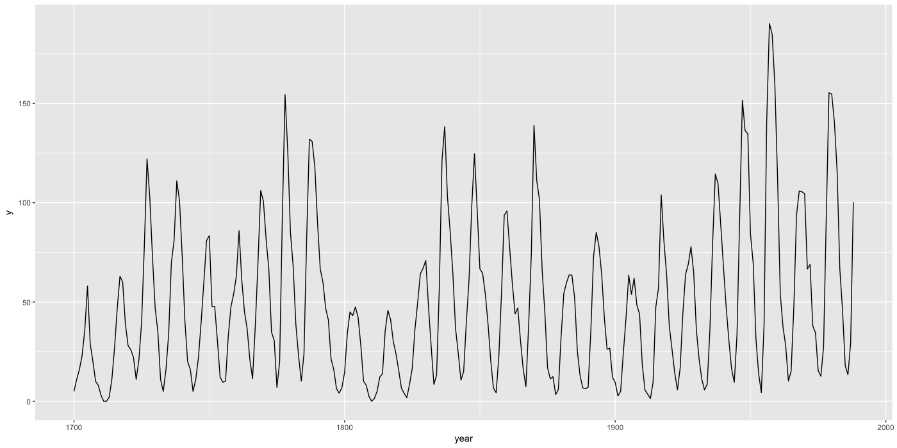
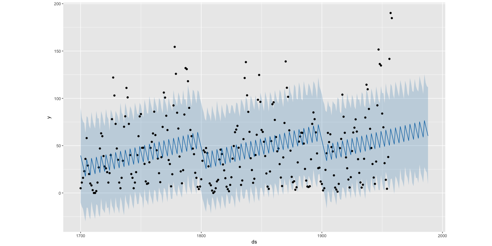
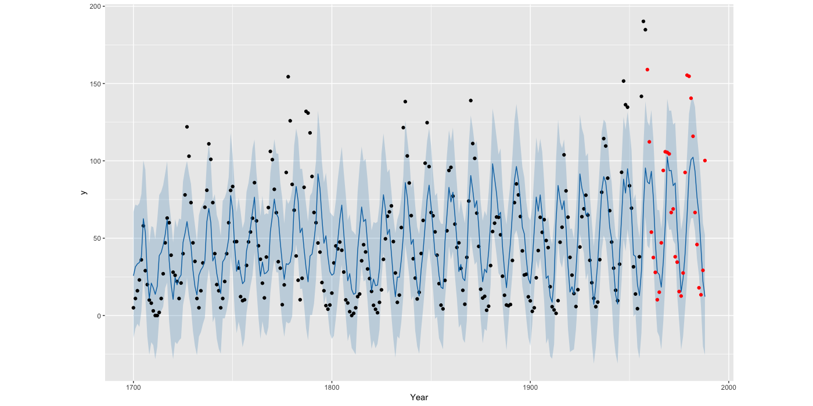

# Prophet - Sunspot 데이터 예측하기

```r
library('tidyverse')
library('prophet')
```

R에서 기본적으로 내장하고 있는 `sunspot.year` 데이터는 태양의 흑점 개수를 연도별로 측정한 결과이다. (1700년부터 1988년)

```r
df_sunspot = broom::tidy(sunspot.year) %>%
  mutate(year = seq(1700, 1988, 1)) %>%
  select(year, y = value) %>%
  tbl_df() %>%
  mutate(ds = lubridate::ymd(year, truncated = 2))

ggplot(df_sunspot, aes(x = year, y = y)) +
  geom_line()
```



데이터 총 기간 중에서 마지막 30년 (1959년부터 88년까지) 를 test 기간으로 두고, 학습셋을 통해 모형을 학습시켜보자.

```r
# 총 데이터 개수
total_row_length = nrow(df_sunspot)
# 테스트셋 데이터 수
n_ts_dataset = 30
# 훈련셋 인덱스
tr_index = seq_len(total_row_length - n_ts_dataset)
# 테스트셋 인덱스
ts_index = seq(total_row_length - n_ts_dataset + 1, total_row_length)

# 훈련셋 테스트셋 분리
tr_sunspot = df_sunspot %>% select(ds, y) %>% slice(tr_index)
ts_sunspot = df_sunspot %>% select(ds, y) %>% slice(ts_index)

# 훈련셋 데이터 학습
m = prophet(tr_sunspot)

# 학습 + 예측하려는 기간(30년)의 데이터프레임 생성
df_future_range = make_future_dataframe(m, periods = 30, freq = 'year')

# 예측
df_future_predict = predict(m, df_future_range) %>% tbl_df()
df_future_predict %>%
  select(ds, yhat, yhat_lower, yhat_upper)

plot(m, df_future_predict)
```



태양의 흑점 개수는 11년 주기로 변한다고 알려져 있다.
하지만 학습된 결과를 보면 prophet의 모형은 11년 주기를 잘 반영하지 못하고 있는 것을 볼 수 있다.

~~이것은 prophet 모형의 특성 때문인 것으로 보인다.
기본적으로 prophet은 모형은 n개의 changepoint를 가지는 선형 모형으로 표현되어 있다.
따라서 11년 주기로 진동하는 흑점 개수는 변동성이 큰 오차를 가지는 선형 모형으로 인식되어 버린다.
학습된 결과를 보면, changepoint에 도달할 때마다 (주기의 진폭이 변하는 지점을 인식한 것 같다) intercept가 변하고 있는 것을 볼 수 있다.
또, 변동성을 크게 예측했기 떄문에 80% interval (파란 영역)이 넓게 퍼져서 데이터 상당수를 포함하고 있는 것을 확인할 수 있다.~~

~~현재 구성되어 있는 prophet 모형을 수정해서 sunspot 데이터를 잘 fitting 할 수 있을지는 더 고민이 필요할듯!!~~

문제는 현재 데이터가 연도별 값이라는 점이었다. 현재 Prophet에서는 **기본적으로 daily, weekly, yearly seasonality만 제공** 한다. 모형에서 최대 1년 단위의 주기를 제공하는데, 흑점 데이터를 잘 표현하기 위해서는 11년 주기를 표현할 수 있어야 한다. 따라서 기본모델에서는 짧게 진동하는 형태가 된다.

이러한 문제를 해결하기 위해 Custom Seasonality를 추가할 수 있다. ([prophet 공식 문서 링크](https://facebook.github.io/prophet/docs/seasonality,_holiday_effects,_and_regressors.html#specifying-custom-seasonalities))

`add_seasonality(name, period, fourier.order)` 함수를 통해 Custom Seasonality를 추가할 수 있다. 각각의 인자가 의미하는 것은 다음과 같다.

- `name` : 해당 컴포넌트의 이름 (Chracter)
- `period` : 한 주기의 길이 (일 단위, Double)
- `fourier.order` : 주기를 학습하는데 사용할 값 (푸리에 급수의 차수, Int)

이제 다시 연도별 흑점 개수를 모델링해보자.

```r
# Train / Test Set 분리
tr_sunspot = df_sunspot %>% slice(seq_len(nrow(.) - 30))
ts_sunspot = df_sunspot %>% tail(30)

# 학습용 데이터를 가지고 prophet 모형을 학습시킨다
m_sunspot = prophet() %>% # 여기서 df를 넘기지 않으면 fitting 하지 않는다
  # 11년 주기의 Custom Seasonality를 생성한다
  add_seasonality(name = 'year10', period = 365*11, fourier.order = 10) %>%
  fit.prophet(tr_sunspot) # 학습 데이터를 fitting 시킨다

# 예측하고자 하는 기간에 대한 데이터프레임을 생성한다
future_sunspot = make_future_dataframe(m_sunspot, periods = 30, freq = 'year')

# 모형을 통해 예측한다
pred_sunspot = predict(m_sunspot, future_sunspot)

# 결과를 그래프로 표현한다
plot(m_sunspot, pred_sunspot) +
  geom_point(data = ts_sunspot, aes(x = as.POSIXct(ds), y = y), color = 'red') +
  xlab('Year')
```



처음 학습했던 결과물보다 훨씬 잘 학습된 것을 볼 수 있다.
모형을 미세하게 조정하면 지금보다 성능을 더 높일 수 있겠지만, 연단위의 데이터에도 잘 적용된다는 것을 확인한 것으로 만족하고 마무리하는 걸로.
