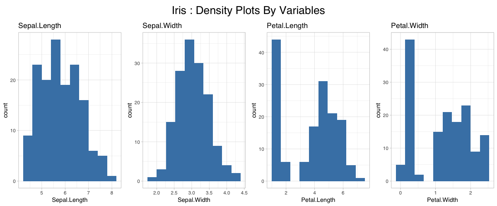

# gridExtra 그래프에 제목 추가하고 폰트 설정하기

여러 개의 ggplot2 그래프를 하나의 그래프로 합치기 위해 `gridExtra` 라이브러리를 사용한다.
이 경우 그래프 묶음에 공통 제목을 추가하려면 다음과 같은 단계를 거치면 된다.

* (1) `gridExtra::grid.arrange` 를 통해 ggplot 오브젝트를 통합
* (2) 공통제목은 `grid::textGrob` 을 사용한다
* (3) 제목의 폰트 설정은 textGrob의 gp 옵션에 `grid::gpar` 를 통해 옵션값을 전달한다
* (4) 제목과 그래프 사이의 여백 설정은 padding을 조절한다

```r
library('tidyverse')

# 데이터에서 주어진 변수에 대한 density plot을 그리는 함수 작성
draw_density = function(df, col) {
  qcol = enquo(col)
  ggplot(df, aes(x = !!qcol)) +
    geom_histogram(bins = 10, fill = 'steelblue') +
    ggtitle(quo_name(qcol)) +
    theme_light(base_family = 'Helvetica')
}

# 각각의 그래프 객체를 생성한다
p1 = draw_density(iris, Sepal.Length)
p2 = draw_density(iris, Sepal.Width)
p3 = draw_density(iris, Petal.Length)
p4 = draw_density(iris, Petal.Width)

# 그래프 객체를 하나로 모으고 공통 제목을 추가!
gridExtra::grid.arrange(
  p1, p2, p3, p4,       # ggplot 객체
  ncol = 4,             # 그래프를 4열로 배치
  widths = c(1,1,1,1),  # 너비는 모두 동일한 비율로
  top = grid::textGrob(
    label = 'Iris : Density Plots By Variables',              # 제목
    gp = grid::gpar(fontfamily = 'Helvetica', fontsize = 20)  # 폰트 설정
  ),
  padding = unit(1.5, "line")  # 최상단 여백 + 제목과 그래프 사이 여백 설정
)
```


