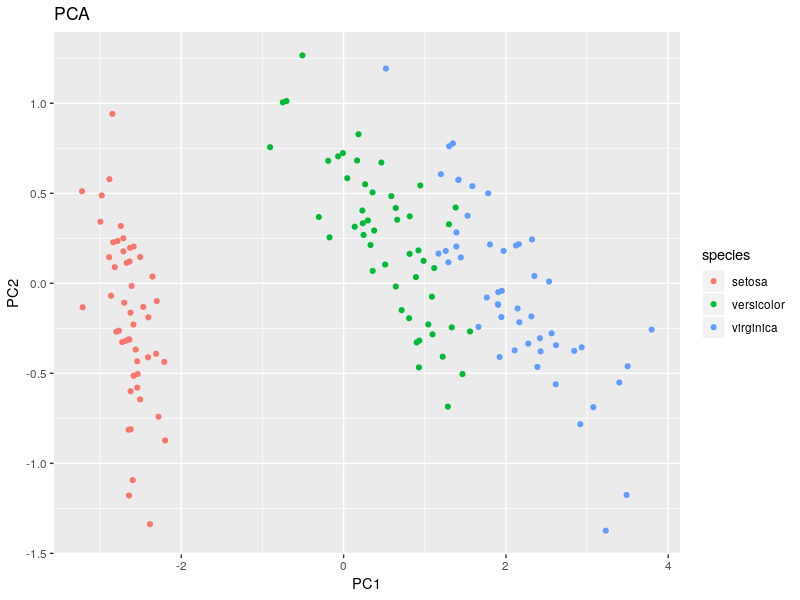
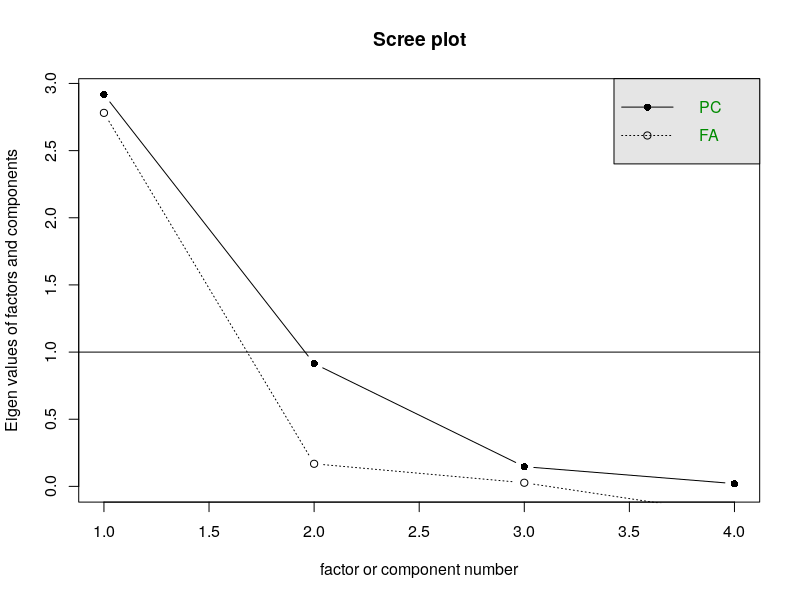
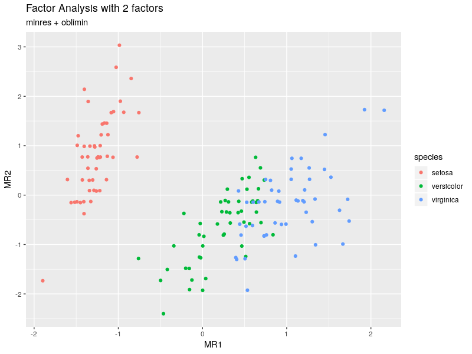

# Iris 데이터에 Factor Analysis 적용해보기

## 데이터

필요한 라이브러리를 불러오고 데이터를 준비해보자. 데이터는 R에 기본적으로 내장되어 있는 `iris` 데이터를 사용한다.

```r
library('tidyverse')
library('psych')

# Iris 데이터를 행렬로 변환한다
mat_iris = as.matrix(iris[,1:4])

# 필요할 경우 공분산행렬 추출한다
# iris_cov = cov(mat_iris)
```


## PCA 부터 적용해보자

```r
pca_iris = prcomp(mat_iris)

pca_iris$x %>%
  as.data.frame() %>% tbl_df() %>%
  mutate(species = datasets::iris$Species) %>%
  ggplot(aes(x = PC1, y = PC2, color = species)) +
  geom_point() +
  ggtitle('PCA')
```



PCA를 통해 얻을 수 있는 rotation matrix는 pca 결과 객체에 `rotation` 프로퍼티로 접근하면 얻을 수 있다.
직접 계산하려면 공분산 행렬에서 고유벡터를 추출하면 된다.

```r
# PCA 적용
pca_iris$rotation
#                      PC1         PC2         PC3        PC4
# Sepal.Length  0.36138659 -0.65658877  0.58202985  0.3154872
# Sepal.Width  -0.08452251 -0.73016143 -0.59791083 -0.3197231
# Petal.Length  0.85667061  0.17337266 -0.07623608 -0.4798390
# Petal.Width   0.35828920  0.07548102 -0.54583143  0.7536574

# 공분산 행렬에서 고유벡터 추출
eigen(cov(mat_iris))$vectors
#              [,1]        [,2]        [,3]       [,4]
# [1,]  0.36138659  0.65658877  0.58202985  0.3154872
# [2,] -0.08452251  0.73016143 -0.59791083 -0.3197231
# [3,]  0.85667061 -0.17337266 -0.07623608 -0.4798390
# [4,]  0.35828920 -0.07548102 -0.54583143  0.7536574
```

## Factor Analysis

이번에는 Factor Analysis를 적용해보자

```r
# Factor를 몇 개 사용해야 할지 모르겠다면 스크리 도표를 먼저 확인해본다
# 두 번째 컴포넌트에서 크게 꺾이는 것을 볼 수 있다. 일단 2개의 factor로 시작해보자.
scree(mat_iris)
```



```r
# Factor Analysis 적용
fa_iris = psych::fa(mat_iris, nfactors = 2, fm = 'minres', rotate = 'oblimin')

# 2차원 공간에 맵핑해보자
predict(fa_iris, mat_iris) %>%
  as.data.frame() %>%
  mutate(species = iris$Species) %>%
  ggplot(aes(x = MR1, y = MR2, color = species)) +
  geom_point() +
  ggtitle('Factor Analysis with 2 factors', subtitle = 'minres + oblimin')
```




# FA 에서 weight, score 직접 구하기

## Weights 구하기

Factor Analysis 로 변수간의 관계를 구할 수는 있지만, PCA 처럼 명확하게 latent space로 맵핑하기는 어려운 것 같다.
이를 위해 weight를 구해야 하는데, weight 를 구하는 방법이 여러 가지 존재하는 것으로 보인다. (`factor.scores {psych}` 문서를 참고)
따라서 먼저 weight matrix를 구하고, score를 계산해보자

```r
# fa 함수를 적용할 경우, weights 프로퍼티를 통해 접근할 수 있다
fa_iris$weights
```

weights 값을 직접 구하려면 어떻게 해야 할까?

```r
# 1) fa 함수가 내부적으로 사용하고 있는 함수를 직접 호출한다
# - fa_iris$weights 와 동일한 값을 구할 수 있다
psych::factor.scores(mat_iris, fa_iris, method = 'regression')$weights

# 2) 공식을 보니 상대적으로 구하기 쉬워보이는 Thurstone Method 가 있었음
# - 얘도 factor.scores 함수를 통해 구할 수 있고,
psych::factor.scores(mat_iris, fa_iris, method = 'Thurstone')$weights
# Thurstone Method 를 직접 적용해서 weights를 구할 수도 있다 (바로 위 항목과 동일한 값)
solve(cor(mat_iris), fa_iris$loadings %*% fa_iris$Phi)

#                     MR1         MR2
# Sepal.Length -0.2252966  0.02449216
# Sepal.Width   0.2281782  0.98249445
# Petal.Length  1.6855200  0.02771815
# Petal.Width  -0.4074788 -0.04446706
```


## Scores 구하기

score가 바로 FA를 통해 latent space에 맵핑된 값으로 볼 수 있을 것 같다

- (1) score를 구하는데는 weight가 필요하다
- (2) psych::factor.scores (fa함수 내부에서 사용) 에서 x에 raw.data가 주어질 경우 score를 구해준다

score matrix를 구할 수 있는 여러 가지 방법을 정리했다

```r
# 다음 네 가지 결과물은 동일하다
# 1) fa 함수 결과물에서 scores 프로퍼티 (cor, cov 행렬이 input일 경우에는 생성되지 않는다)
fa_iris$scores[1:5, ]

# 2) predict 함수 적용 (학습된 모형을 기존 데이터에 적용)
predict(fa_iris, mat_iris)[1:5, ]

# 3) 원본 데이터를 scale 처리한 뒤 weight 행렬과 곱한다
(scale(mat_iris) %*% fa_iris$weights)[1:5, ]

# 4) 원본 데이터를 z-score로 변환한 뒤 weight 행렬과 곱한다
(apply(mat_iris, 2, function(x) (x - mean(x)) / sd(x)) # 이 부분이 scale(mat_iris) 과 동일함
  %*% fa_iris$weights)[1:5, ]

# 어떻게 구하든 다음과 같은 결과를 얻을 수 있다

#            MR1         MR2
# [1,] -1.283229  0.99711143
# [2,] -1.490566 -0.13586355
# [3,] -1.426931  0.30747456
# [4,] -1.261113  0.08224525
# [5,] -1.203671  1.21956557
```

## 이렇게 적용해보는 이유는??

- PySpark 에는 Factor Analysis가 구현되어 있지 않음
- PySpark 에서도 correlation matrix는 쉽게 구할 수 있다 (MLLib에 기능 존재함)
- 다음과 같은 프로세스로 Factor Anlaysis에 해당하는 결과물을 얻을 수 있을 것이라 예상함
   - 1) PySpark 에서 UFO Score 테이블을 통해 Correlation Matrix 계산
   - 2) R에서 Correlation Matrix 를 가지고 FA 적용 후 weights matrix 반환
   - 3) 다시 PySpark 에서 adid별 feature vector에 weights matrix 를 곱해서 score를 구한다
