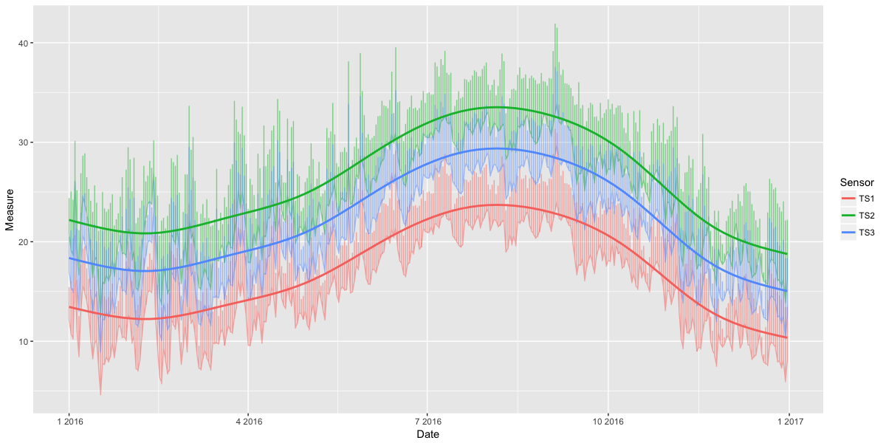
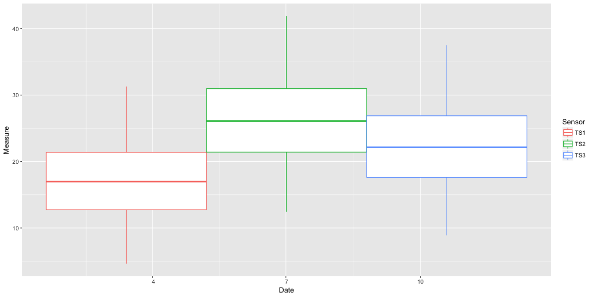
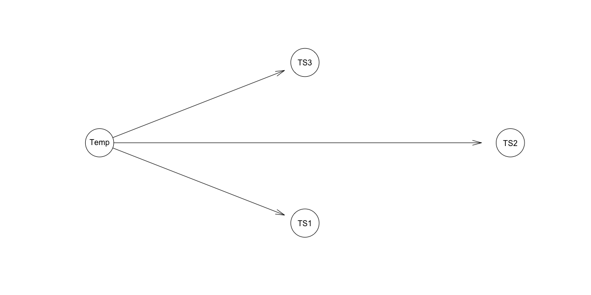
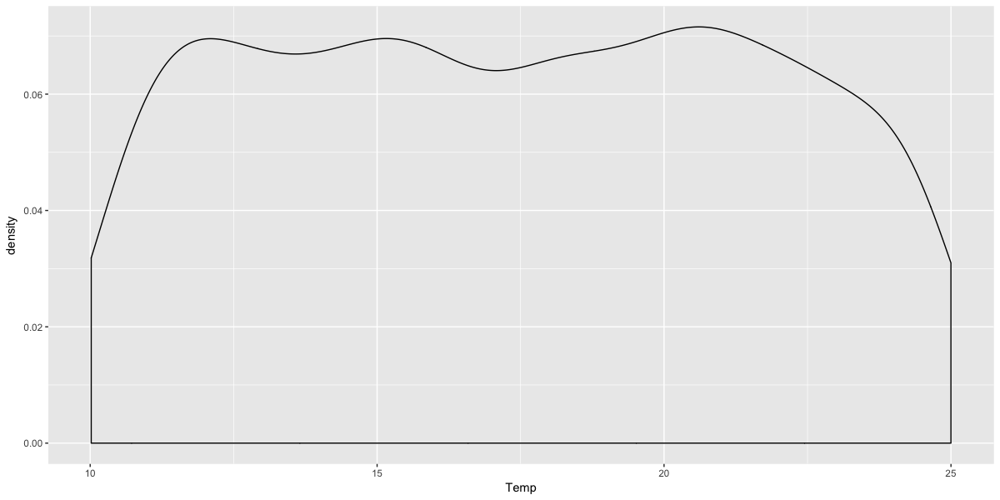

다음 링크의 예제를 참고하여 정리

<http://jarias.es/bayesnetRtutorial/#modeling_with_bayesian_networks>

# Modeling With Bayeisan Networks : Problems

냉각 작업이 실패했는지 여부를 파악하기 위해 온도 센서를 부착했다. 해당 센서는 1년 전에 설치되었고, 그동안 쌓인 데이터를 바탕으로 방 전체 또는 특정 부분에서 발생하는 발열 문제를 탐지하는 모형을 만들어야 한다. 방에는 세 군데에 센서를 배치했고, 1년간 측정한 자료를 제공한다.

```r
library('lubridate')
library('tidyverse')
library('bnlearn')
```

```r
data_raw = read_csv('https://raw.githubusercontent.com/jacintoArias/bayesnetRtutorial/master/data/heatAlarm-lvl1.csv')

# A tibble: 6 x 5
#   Date       Hour        TS1   TS2   TS3
#   <date>     <chr>     <dbl> <dbl> <dbl>
# 1 2016-01-01 4H 0M 0S   12.2  20.9  17.1
# 2 2016-01-01 8H 0M 0S   13.9  22.6  18.8
# 3 2016-01-01 12H 0M 0S  15.4  24.3  20.5
# 4 2016-01-01 16H 0M 0S  13.8  22.6  18.7
# 5 2016-01-01 20H 0M 0S  12.2  20.8  17.0
# 6 2016-01-02 4H 0M 0S   10.8  19.3  15.5
```

# EDA

데이터의 분포를 간단히 살펴보자

각 센서별로 살펴보면, 모든 날짜에 대해 데이터가 존재하지만 값의 범위는 다르다는 것을 알 수 있다.

```r
summary(data_raw)

#      Date                Hour                TS1              TS2             TS3       
# Min.   :2016-01-01   Length:1830        Min.   : 4.627   Min.   :12.44   Min.   : 8.89  
# 1st Qu.:2016-04-01   Class :character   1st Qu.:12.745   1st Qu.:21.41   1st Qu.:17.61  
# Median :2016-07-01   Mode  :character   Median :16.979   Median :26.09   Median :22.15  
# Mean   :2016-07-01                      Mean   :17.011   Mean   :26.12   Mean   :22.19  
# 3rd Qu.:2016-10-01                      3rd Qu.:21.384   3rd Qu.:30.96   3rd Qu.:26.88  
# Max.   :2016-12-31                      Max.   :31.276   Max.   :41.89   Max.   :37.50  
```

모든 날짜에 대해 동일하게 5번씩 측정되었다는 것을 확인할 수 있다.

```r
data_raw %>%
  group_by(Date) %>%
  summarise(Measures = n()) %>% 
  group_by(Measures) %>% 
  summarise(cnt = n())

# A tibble: 1 x 2
#   Measures   cnt
#      <int> <int>
# 1        5   366
```

각 센서별로 일별 추이 및 대략적인 분포를 확인해보자.

```r
data_raw %>%
  gather('Sensor', 'Measure', TS1:TS3) %>%
  ggplot(aes(x=Date, y=Measure, group=Sensor, color=Sensor)) +
  geom_line(alpha = 0.5) +
  geom_smooth(se = FALSE)
```



```r
data_raw %>%
  gather('Sensor', 'Measure', TS1:TS3) %>%
  ggplot(aes(x=Date, y=Measure, group=Sensor, color=Sensor)) +
    geom_boxplot()
```



각 센서의 분포를 살펴보니, 약간의 선형적인 변화가 존재하는 것 같다. intercept값을 추가하는 형태의 모형을 통해서 이러한 관계를 표현할 수 있다. 이런 의존적인 관계는 Bayesian Network를 통해 모델링할 수 있다. 하지만 모형을 어떻게 구성하는 것이 제일 좋을까?

# Latent Variables

센서가 실제로는 존재하지만 우리가 관찰할 수는 없는 온도값을 측정한다고 생각해보자. 숨겨진 값은 다른 센서들이 측정하는 값에 영향을 미치기 때문에 각 센서가 측정하는 값의 분포를 모델링할 수 있게 된다. 다시 말하면, 우리 모형에는 새로운 변수가 필요하다. 관찰할 수는 없지만 각 센서들의 값과 종속관계를 가지는 임시 변수가 있어야 한다. 

```r
data_latent = data_raw %>% 
  mutate(Temp = NA_real_) %>% 
  select(Temp, TS1, TS2, TS3) %>% 
  as.data.frame()
```

다음 과정은 임시 변수의 값을 예측하는 것이다. 여기서는 EM 알고리즘을 사용한다.

```r
heat_alarm_dag1 = model2network('[Temp][TS1|Temp][TS2|Temp][TS3|Temp]')
plot(heat_alarm_dag1)
```



`bnlearn` 라이브러리에서는 EM 알고리즘을 위한 구현체를 제공하지 않는다. 하지만 EM 알고리즘을 작성하기 위한 도구는 제공한다. 기본적으로 parametric EM 알고리즘은 다음과 같은 방식으로 구현된다

- **E Step** : 실제 모형을 바탕으로 베이지안 추정을 시행하여 결측치를 채운다
- **M Step** : 추정한 데이터를 바탕으로 MLE를 통해 새로운 파라미터를 추정한다

위와 같은 과정을 특정 횟수 또는 수렴할 때까지 반복한다. latent variable의 결측치를 채우기 위해서는 `impute()` 함수를 사용하는데, 모형의 초기값을 잘 설정해주어야 한다. 

처음에는 Temp 변수를 Random하게 초기화시켜보자.

```r
data_imputed = data_latent %>% 
  rowwise() %>% 
  mutate(Temp = runif(1, 10, 25))
```

```r
data_imputed %>% 
  ggplot(aes(x = Temp)) +
  geom_density()
```



EM 알고리즘을 수행한다

```r
parametric.em = function(dag, dataLatent, dataImputed, iter = 5) {
  fitted = bn.fit(dag, dataImputed, method = 'mle')
  for (i in seq(iter)) {
    complete = impute(fitted, data = dataLatent, method = 'bayes-lw')
    fitted = bn.fit(dag, complete, method = 'mle')
  }
  
  fitted
}
```

```r
heat_alarm_model1 = parametric.em(heat_alarm_dag1, data_latent, data_imputed, iter = 10)

#   Bayesian network parameters
# 
#   Parameters of node Temp (Gaussian distribution)
# 
# Conditional density: Temp
# Coefficients:
# (Intercept)  
#    17.44104  
# Standard deviation of the residuals: 0.2455696 
# 
#   Parameters of node TS1 (Gaussian distribution)
# 
# Conditional density: TS1 | Temp
# Coefficients:
# (Intercept)         Temp  
#   384.15598    -21.05064  
# Standard deviation of the residuals: 0.05423669 
# 
#   Parameters of node TS2 (Gaussian distribution)
# 
# Conditional density: TS2 | Temp
# Coefficients:
# (Intercept)         Temp  
#   431.91461    -23.26649  
# Standard deviation of the residuals: 0.05994582 
# 
#   Parameters of node TS3 (Gaussian distribution)
# 
# Conditional density: TS3 | Temp
# Coefficients:
# (Intercept)         Temp  
#   416.38425    -22.60174  
# Standard deviation of the residuals: 0.05823308 
```

