다음 링크의 예제를 참고하여 정리

<http://jarias.es/bayesnetRtutorial/#modeling_with_bayesian_networks>

# Modeling With Bayeisan Networks : Problems

냉각 작업이 실패했는지 여부를 파악하기 위해 온도 센서를 부착했다. 해당 센서는 1년 전에 설치되었고, 그동안 쌓인 데이터를 바탕으로 방 전체 또는 특정 부분에서 발생하는 발열 문제를 탐지하는 모형을 만들어야 한다. 방에는 세 군데에 센서를 배치했고, 1년간 측정한 자료를 제공한다.

```r
library('lubridate')
library('tidyverse')
library('bnlearn')
```

```r
data_raw = read_csv('https://raw.githubusercontent.com/jacintoArias/bayesnetRtutorial/master/data/heatAlarm-lvl1.csv')

# A tibble: 6 x 5
#   Date       Hour        TS1   TS2   TS3
#   <date>     <chr>     <dbl> <dbl> <dbl>
# 1 2016-01-01 4H 0M 0S   12.2  20.9  17.1
# 2 2016-01-01 8H 0M 0S   13.9  22.6  18.8
# 3 2016-01-01 12H 0M 0S  15.4  24.3  20.5
# 4 2016-01-01 16H 0M 0S  13.8  22.6  18.7
# 5 2016-01-01 20H 0M 0S  12.2  20.8  17.0
# 6 2016-01-02 4H 0M 0S   10.8  19.3  15.5
```

# EDA

데이터의 분포를 간단히 살펴보자

각 센서별로 살펴보면, 모든 날짜에 대해 데이터가 존재하지만 값의 범위는 다르다는 것을 알 수 있다.

```r
summary(data_raw)

#      Date                Hour                TS1              TS2             TS3       
# Min.   :2016-01-01   Length:1830        Min.   : 4.627   Min.   :12.44   Min.   : 8.89  
# 1st Qu.:2016-04-01   Class :character   1st Qu.:12.745   1st Qu.:21.41   1st Qu.:17.61  
# Median :2016-07-01   Mode  :character   Median :16.979   Median :26.09   Median :22.15  
# Mean   :2016-07-01                      Mean   :17.011   Mean   :26.12   Mean   :22.19  
# 3rd Qu.:2016-10-01                      3rd Qu.:21.384   3rd Qu.:30.96   3rd Qu.:26.88  
# Max.   :2016-12-31                      Max.   :31.276   Max.   :41.89   Max.   :37.50  
```

모든 날짜에 대해 동일하게 5번씩 측정되었다는 것을 확인할 수 있다.

```r
data_raw %>%
  group_by(Date) %>%
  summarise(Measures = n()) %>% 
  group_by(Measures) %>% 
  summarise(cnt = n())

# A tibble: 1 x 2
#   Measures   cnt
#      <int> <int>
# 1        5   366
```

각 센서별로 일별 추이 및 대략적인 분포를 확인해보자.

```r
data_raw %>%
  gather('Sensor', 'Measure', TS1:TS3) %>%
  ggplot(aes(x=Date, y=Measure, group=Sensor, color=Sensor)) +
  geom_line(alpha = 0.5) +
  geom_smooth(se = FALSE)
```


```r
data_raw %>%
  gather('Sensor', 'Measure', TS1:TS3) %>%
  ggplot(aes(x=Date, y=Measure, group=Sensor, color=Sensor)) +
    geom_boxplot()
```


각 센서의 분포를 살펴보니, 약간의 선형적인 변화가 존재하는 것 같다. intercept값을 추가하는 형태의 모형을 통해서 이러한 관계를 표현할 수 있다. 이런 의존적인 관계는 Bayesian Network를 통해 모델링할 수 있다. 하지만 모형을 어떻게 구성하는 것이 제일 좋을까?

# Latent Variables

센서가 실제로는 존재하지만 우리가 관찰할 수는 없는 온도값을 측정한다고 생각해보자. 숨겨진 값은 다른 센서들이 측정하는 값에 영향을 미치기 때문에 각 센서가 측정하는 값의 분포를 모델링할 수 있게 된다. 다시 말하면, 우리 모형에는 새로운 변수가 필요하다. 관찰할 수는 없지만 각 센서들의 값과 종속관계를 가지는 임시 변수가 있어야 한다. 

```r
data_latent = data_raw %>% 
  mutate(Temp = NA_real_) %>% 
  select(Temp, TS1, TS2, TS3) %>% 
  as.data.frame()
```

다음 과정은 임시 변수의 값을 예측하는 것이다. 여기서는 EM 알고리즘을 사용한다.

```r
heat_alarm_dag1 = model2network('[Temp][TS1|Temp][TS2|Temp][TS3|Temp]')
plot(heat_alarm_dag1)
```


`bnlearn` 라이브러리에서는 EM 알고리즘을 위한 구현체를 제공하지 않는다. 하지만 EM 알고리즘을 작성하기 위한 도구는 제공한다. 기본적으로 parametric EM 알고리즘은 다음과 같은 방식으로 구현된다

- **E Step** : 실제 모형을 바탕으로 베이지안 추정을 시행하여 결측치를 채운다
- **M Step** : 추정한 데이터를 바탕으로 MLE를 통해 새로운 파라미터를 추정한다

위와 같은 과정을 특정 횟수 또는 수렴할 때까지 반복한다. latent variable의 결측치를 채우기 위해서는 `impute()` 함수를 사용하는데, 모형의 초기값을 잘 설정해주어야 한다. 

처음에는 Temp 변수를 Random하게 초기화시켜보자.

```r
data_imputed = data_latent %>% 
  rowwise() %>% 
  mutate(Temp = runif(1, 10, 25))
```

```r
data_imputed %>% 
  ggplot(aes(x = Temp)) +
  geom_density()
```


EM 알고리즘을 수행한다

```r
parametric.em = function(dag, dataLatent, dataImputed, iter = 5) {
  fitted = bn.fit(dag, dataImputed, method = 'mle')
  for (i in seq(iter)) {
    complete = impute(fitted, data = dataLatent, method = 'bayes-lw')
    fitted = bn.fit(dag, complete, method = 'mle')
  }
  
  fitted
}
```

```r
heat_alarm_model1 = parametric.em(heat_alarm_dag1, data_latent, data_imputed, iter = 10)

#   Bayesian network parameters
# 
#   Parameters of node Temp (Gaussian distribution)
# 
# Conditional density: Temp
# Coefficients:
# (Intercept)  
#    17.44104  
# Standard deviation of the residuals: 0.2455696 
# 
#   Parameters of node TS1 (Gaussian distribution)
# 
# Conditional density: TS1 | Temp
# Coefficients:
# (Intercept)         Temp  
#   384.15598    -21.05064  
# Standard deviation of the residuals: 0.05423669 
# 
#   Parameters of node TS2 (Gaussian distribution)
# 
# Conditional density: TS2 | Temp
# Coefficients:
# (Intercept)         Temp  
#   431.91461    -23.26649  
# Standard deviation of the residuals: 0.05994582 
# 
#   Parameters of node TS3 (Gaussian distribution)
# 
# Conditional density: TS3 | Temp
# Coefficients:
# (Intercept)         Temp  
#   416.38425    -22.60174  
# Standard deviation of the residuals: 0.05823308 
```

값을 샘플링해서 그래프를 통해 살펴보자

```r
heat_alarm_model1 %>% 
  impute(data = data_latent, method = 'bayes-lw') %>% 
  gather('Sensor', 'Measure') %>% 
  ggplot(aes(x = Measure, color = Sensor)) +
    geom_density()
```

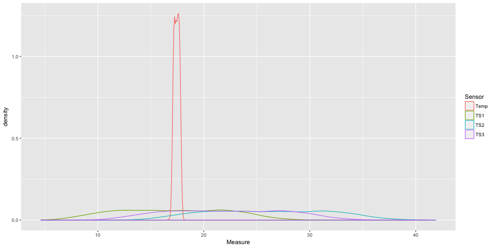

모형에서 Intercept 값을 보면 뭔가 잘못된 것 같다. 또, 그래프를 보면 Temp 변수만 완전히 다른 분포를 보이고 있다. Temp 변수에 다른 Prior를 적용해보자. 

```r
statistics = data_latent %>% 
  gather('Sensor', 'Measure', TS1:TS3) %>% 
  summarise(mu = mean(Measure),
            sigma = sd(Measure))

data_imputed2 = data_latent %>% 
  rowwise() %>% 
  mutate(Temp = rnorm(1, statistics$mu, statistics$sigma))
```

```r
data_imputed2 %>% 
  ggplot(aes(x = Temp)) +
  geom_density()
```


```r
heat_alarm_model2 = parametric.em(heat_alarm_dag1, data_latent, data_imputed2, iter = 10)

#   Bayesian network parameters
# 
#   Parameters of node Temp (Gaussian distribution)
# 
# Conditional density: Temp
# Coefficients:
# (Intercept)  
#     22.2041  
# Standard deviation of the residuals: 0.4415202 
# 
#   Parameters of node TS1 (Gaussian distribution)
# 
# Conditional density: TS1 | Temp
# Coefficients:
# (Intercept)         Temp  
#  -242.96255     11.70836  
# Standard deviation of the residuals: 0.04593405 
# 
#   Parameters of node TS2 (Gaussian distribution)
# 
# Conditional density: TS2 | Temp
# Coefficients:
# (Intercept)         Temp  
#  -261.21640     12.94082  
# Standard deviation of the residuals: 0.05076922 
# 
#   Parameters of node TS3 (Gaussian distribution)
# 
# Conditional density: TS3 | Temp
# Coefficients:
# (Intercept)         Temp  
#  -256.94301     12.57108  
# Standard deviation of the residuals: 0.04931867 
```

```r
heat_alarm_model2 %>% 
  impute(data = data_latent, method = 'bayes-lw') %>% 
  gather('Sensor', 'Measure') %>% 
  ggplot(aes(x = Measure, color = Sensor)) +
    geom_density()
```

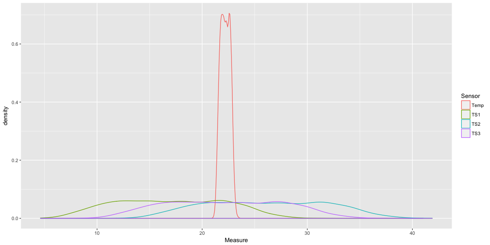

이번에도 잘못된 prior을 사용했는지 결과가 좋지 않다. 이번에는 더 나은 모형을 위해 실제 센서값에 종속적이도록 prior를 구성한다.

```r
data_imputed3 = data_latent %>% 
  rowwise() %>% 
  mutate(Temp = mean(TS1, TS2, TS3))
```

```r
data_imputed3 %>% 
  ggplot(aes(x = Temp)) +
  geom_density()
```

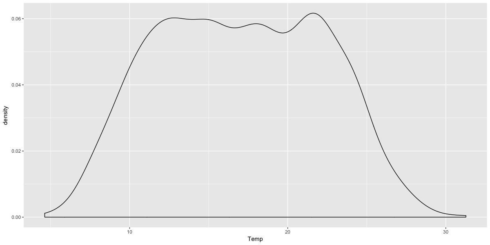

```r
heat_alarm_model3 = parametric.em(heat_alarm_dag1, data_latent, data_imputed3, iter = 10)

#   Bayesian network parameters
# 
#   Parameters of node Temp (Gaussian distribution)
# 
# Conditional density: Temp
# Coefficients:
# (Intercept)  
#    17.00291  
# Standard deviation of the residuals: 5.151672 
# 
#   Parameters of node TS1 (Gaussian distribution)
# 
# Conditional density: TS1 | Temp
# Coefficients:
# (Intercept)         Temp  
# -0.05070602   1.00345967  
# Standard deviation of the residuals: 0.04395342 
# 
#   Parameters of node TS2 (Gaussian distribution)
# 
# Conditional density: TS2 | Temp
# Coefficients:
# (Intercept)         Temp  
#    7.265119     1.109087  
# Standard deviation of the residuals: 0.0485801 
# 
#   Parameters of node TS3 (Gaussian distribution)
# 
# Conditional density: TS3 | Temp
# Coefficients:
# (Intercept)         Temp  
#    3.867602     1.077399  
# Standard deviation of the residuals: 0.0471921 
```

```r
heat_alarm_model3 %>% 
  impute(data = data_latent, method = 'bayes-lw') %>% 
  gather('Sensor', 'Measure') %>% 
  ggplot(aes(x = Measure, color = Sensor)) +
    geom_density()
```

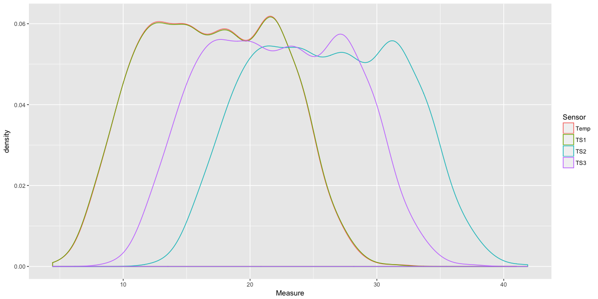

이제 잘 학습된 것 같다. 센서값의 분포가 latent Temp 변수를 선형 변환한 형태가 되었다.


# Modeling Domain

데이터를 살펴보다보면 시간에 따라서 분포가 달라지기도 한다. 이러한 도메인 정보를 추가하면 더 나은 모형을 구축하는데 도움이 된다.

우선 월별 정보를 추가해보자.

```r
data_by_month = data_raw %>% 
  mutate(Month = as.factor(month(Date, label = TRUE, abbr = TRUE)))
```

```r
data_by_month %>% 
  gather("Sensor", "Measure", TS1, TS2, TS3) %>%
  ggplot(aes(x = Measure, color = Sensor, fill = Sensor)) + 
    geom_density(alpha = 0.5) +
    facet_wrap(~ Month)
```

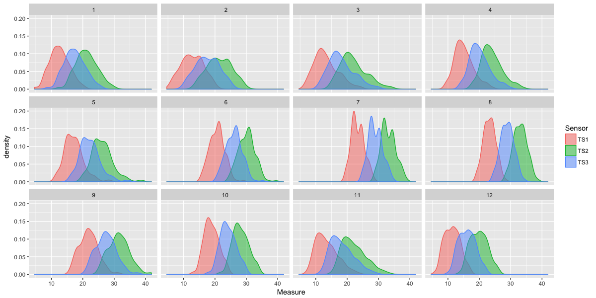

그래프를 보면 월별 정보가 분포에 대한 추가적인 정보를 줄 수 있을 것으로 보인다. 이 경우에는 월별 정보를 Temp 변수의 이산형 부모 변수로 추가하면 데이터를 더 잘 학습시킬 수 있을 것이다. 하지만 그렇게 하면 12개의 서로 다른 정규분포에 대한 파라미터가 필요하다. 그건 조금 과한 것 같다.

월별 정보를 조금 더 낮은 차원으로 낮추어 요약할 수 없을까? 날씨에 대해 생각해보면 가장 먼저 떠오르는 것은 계절일 것이다. 계절별로 다른 분포를 적용해보자.

```r
data_by_season = data_by_month %>%
  mutate(
    date2012 = as.Date(strftime(Date, format="2012-%m-%d")),
    Season = case_when(
      date2012 >= as.Date('2012-12-15') | date2012 < as.Date('2012-03-15') ~ 'winter',
      date2012 >= as.Date('2012-03-15') & date2012 < as.Date('2012-06-15') ~ 'spring',
      date2012 >= as.Date('2012-06-15') & date2012 < as.Date('2012-09-15') ~ 'summer',
      TRUE ~ 'fall'),
    Season = factor(Season)
  ) %>% 
  select(-date2012)
```

```r
data_by_season %>% 
  gather('Sensor', 'Measure', TS1, TS2, TS3) %>%
  ggplot(aes(x = Measure, color = Sensor, fill = Sensor)) + 
    geom_density(alpha = 0.5) +
    facet_wrap(~ Season)
```

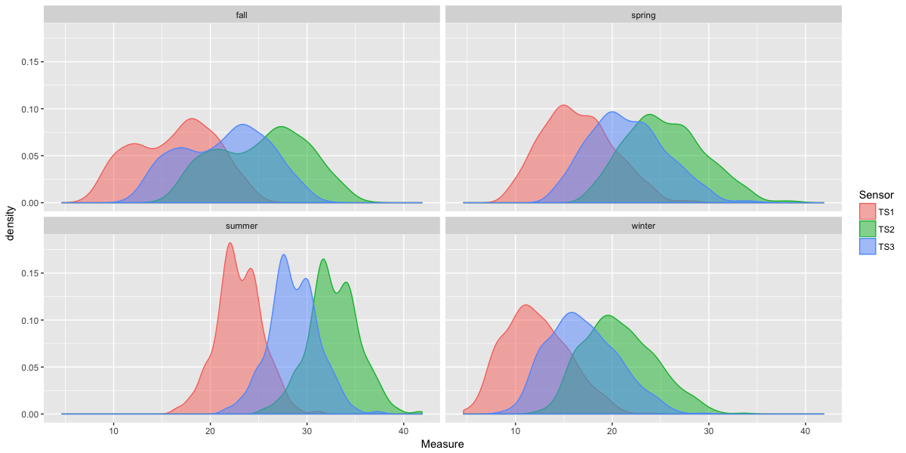

각 계절별 분포는 정규분포처럼 보이진 않지만, 같은 패턴을 가진다. 월별, 계절별 두 네트워크를 학습시키고 파라미터가 잘 학습되는지 확인해보자.

먼저 월별 모형이다.

```r
data_latent_month = data_by_month %>% 
  mutate(Temp = NA_real_) %>% 
  select(Month, Temp, TS1, TS2, TS3) %>%
  as.data.frame()
```

네트워크 DAG를 구성한다.

```r
heat_alarm_dag_month = model2network('[Month][Temp|Month][TS1|Temp][TS2|Temp][TS3|Temp]')
plot(heat_alarm_dag_month)
```

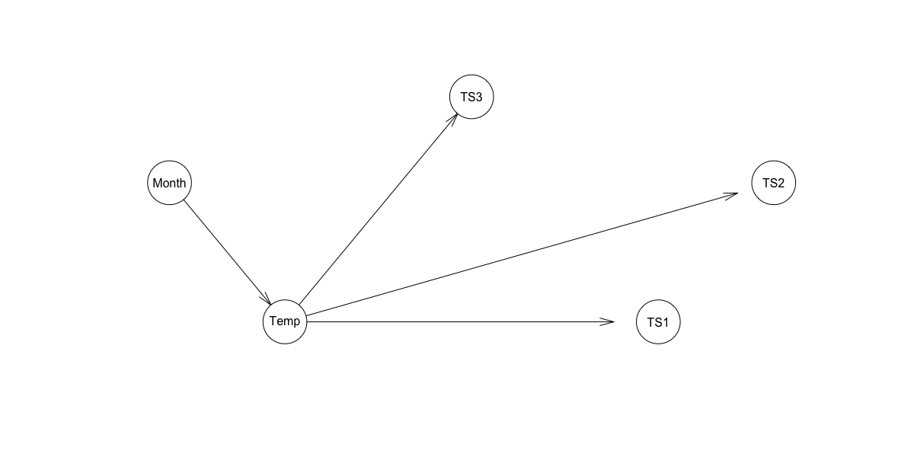

EM 알고리즘을 적용하여 숨겨진 변수의 분포를 나타내는 파라미터를 유도한다.

```r
data_imputed_month = data_latent_month %>% 
  rowwise() %>% 
  mutate(Temp = mean(c(TS1, TS2, TS3))) %>% 
  as.data.frame()
```

```r
heat_alarm_model_month = parametric.em(heat_alarm_dag_month, data_latent_month, data_imputed_month, iter = 10)

#   Bayesian network parameters
# 
#   Parameters of node Month (ordinal distribution)
# 
# Conditional probability table:
#           1          2          3          4          5          6
#  0.08469945 0.07923497 0.08469945 0.08196721 0.08469945 0.08196721 
#           7          8          9         10         11         12 
#  0.08469945 0.08469945 0.08196721 0.08469945 0.08196721 0.08469945 
# 
#   Parameters of node Temp (conditional Gaussian distribution)
# 
# Conditional density: Temp | Month
# Coefficients:
#                     0         1         2         3         4         5
# (Intercept)  17.10762  17.32978  17.86328  19.75084  21.81250  25.52818
#                     6         7         8         9        10        11
# (Intercept)  28.38999  28.24101  26.79861  23.68272  18.05335  15.86617
# Standard deviation of the residuals:
#        0         1         2         3         4         5
# 3.214897  3.625582  3.940742  3.142792  3.113433  2.525933  
#        6         7         8         9        10        11
# 2.139447  2.031236  3.082260  2.429373  3.596838  2.573902  
# Discrete parents' configurations:
#     Month
# 0       1
# 1       2
# 2       3
# 3       4
# 4       5
# 5       6
# 6       7
# 7       8
# 8       9
# 9      10
# 10     11
# 11     12
# 
#   Parameters of node TS1 (Gaussian distribution)
# 
# Conditional density: TS1 | Temp
# Coefficients:
# (Intercept)         Temp  
#  -3.8736470    0.9616823  
# Standard deviation of the residuals: 0.0818937 
# 
#   Parameters of node TS2 (Gaussian distribution)
# 
# Conditional density: TS2 | Temp
# Coefficients:
# (Intercept)         Temp  
#    3.039763     1.062912  
# Standard deviation of the residuals: 0.09051409 
# 
#   Parameters of node TS3 (Gaussian distribution)
# 
# Conditional density: TS3 | Temp
# Coefficients:
# (Intercept)         Temp  
#   -0.237029     1.032543  
# Standard deviation of the residuals: 0.08792797
```

```r
data_impute_month_posterior = impute(heat_alarm_model_month, data = data_latent_month, method = 'bayes-lw')
```

```r
data_impute_month_posterior %>% 
  gather('Sensor', 'Measure', Temp, TS1, TS2, TS3) %>%
  ggplot(aes(x = Measure, color = Sensor, fill = Sensor)) + 
    geom_density(alpha = 0.5) +
    facet_wrap(~ Month)
```

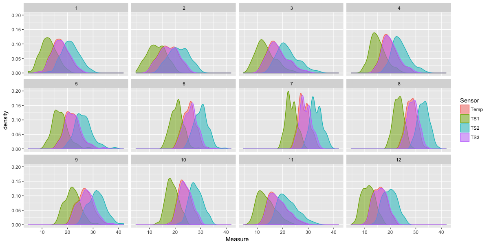

이번에는 학습이 꽤 잘됐다. Temp 변수가 TS3과 거의 유사하고, 다른 두 변수는 해당 변수를 변환한 형태가 되었다. 계절을 사용하는 것은 어떨지 확인해보자.

```r
data_latent_season = data_by_season %>% 
  mutate(Temp = NA_real_) %>% 
  select(Season, Temp, TS1, TS2, TS3) %>% 
  as.data.frame()
```

```r
heat_alarm_dag_season = model2network('[Season][Temp|Season][TS1|Temp][TS2|Temp][TS3|Temp]')
plot(heat_alarm_dag_season)
```


```r
data_imputed_season = data_latent_season %>% 
  rowwise() %>% 
  mutate(Temp = mean(c(TS1, TS2, TS3))) %>% 
  as.data.frame()
```

```r
heat_alarm_model_season = parametric.em(heat_alarm_dag_season, data_latent_season, data_imputed_season, iter = 10)

#   Bayesian network parameters
# 
#   Parameters of node Season (multinomial distribution)
# 
# Conditional probability table:
#       fall    spring    summer    winter 
# 0.2486339 0.2513661 0.2513661 0.2486339 
# 
#   Parameters of node Temp (conditional Gaussian distribution)
# 
# Conditional density: Temp | Season
# Coefficients:
#                     0         1         2         3
# (Intercept)  21.01400  21.17159  28.02136  16.69815
# Standard deviation of the residuals:
#        0         1         2         3  
# 4.372325  3.781638  2.434635  3.447969  
# Discrete parents' configurations:
#    Season
# 0    fall
# 1  spring
# 2  summer
# 3  winter
# 
#   Parameters of node TS1 (Gaussian distribution)
# 
# Conditional density: TS1 | Temp
# Coefficients:
# (Intercept)         Temp  
#  -3.7755244    0.9560571  
# Standard deviation of the residuals: 0.07837023 
# 
#   Parameters of node TS2 (Gaussian distribution)
# 
# Conditional density: TS2 | Temp
# Coefficients:
# (Intercept)         Temp  
#    3.148215     1.056695  
# Standard deviation of the residuals: 0.08661972 
# 
#   Parameters of node TS3 (Gaussian distribution)
# 
# Conditional density: TS3 | Temp
# Coefficients:
# (Intercept)         Temp  
#  -0.1316762    1.0265035  
# Standard deviation of the residuals: 0.08414488 
```

```r
data_impute_season_posterior = impute(heat_alarm_model_season, data = data_latent_season, method = 'bayes-lw')
```

```r
data_impute_season_posterior %>% 
  gather('Sensor', 'Measure', Temp, TS1, TS2, TS3) %>%
  ggplot(aes(x = Measure, color = Sensor, fill = Sensor)) + 
    geom_density(alpha = 0.5) +
    facet_wrap(~ Season)
```

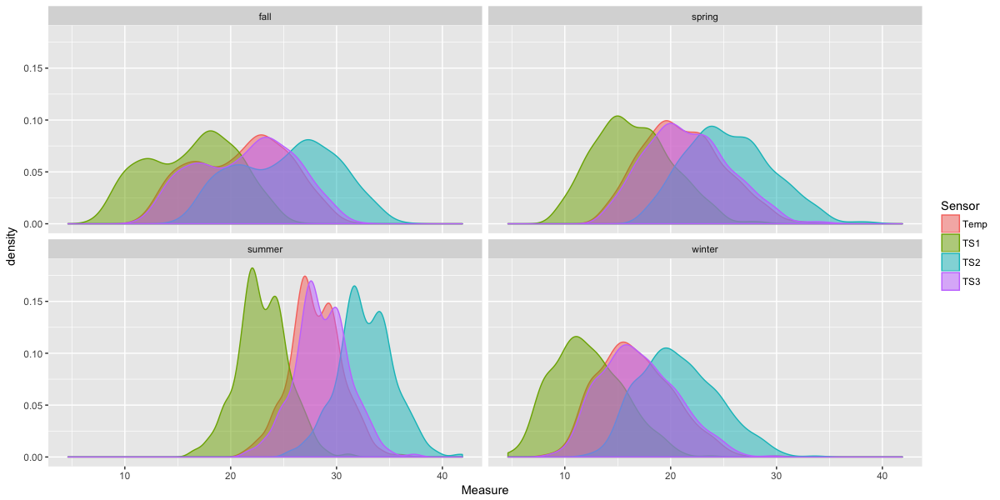

이것도 잘 학습되었다. 어떤 접근방법이 더 좋을까? 우선은 계절 모형이 더 나을 것 같다. 월별 모형에 비해서 파라미터 개수가 더 적기 때문이다. BIC 점수를 살펴보자

```r
BIC(heat_alarm_model_season, data_impute_season_posterior)
# [1] -1497.113
```

```r
BIC(heat_alarm_model_month, data_impute_month_posterior)
# [1] -5206.456
```

BIC 점수를 보면 계절 모형의 점수가 더 좋은 것을 확인할 수 있다. bnlearn 라이브러리의 `BIC.bn()` 함수는 -1/2로 리스케일되었기 때문에 기존 BIC 점수와는 다르게 클수록 더 좋은 값을 나타낸다. 따라서 계절 모형을 사용하는 것으로 한다.

# Modeling Anomalies

베이지안 네트워크가 가지는 장점 중 하나는 모형에 전문 지식을 포함시킬 수 있다는 것이다. 다른 프레임워크에서는 매우 어려운 일이지만, 베이지안 네트워크에서는 자연스럽게 처리할 수 있다.

흔히들 BN을 오픈 박스 모형이라고 한다. 파라미터 값을 이해하고 해석할 수 있기 때문이다. 이러한 특성은 이상값을 탐지하는데 유용하다. 잠재변수와 전문지식을 통해 일반적으로 잘 등장하지 않는 이벤트를 표현할 수 있다. 

잘 발생하지 않는 사건이라면 데이터를 통해서는 학습할 수 없다. 데이터를 수집해야 한다면 기계를 부수거나 방에 불을 질러야 한다. 이렇게 데이터를 모은다면 엄청난 비용이 든다. 희귀병이나 자율주행, 금융사고 등도 이와 비슷한 경우다.

`Alarm` 이라는 변수를 추가하여 전체적으로 발생할 수 있는 오류를 모델링해보자. 이 변수는 yes 또는 no의 값을 가질 수 있다. 1년 동안 데이터를 수집하면서 한 번도 문제가 발생한 적이 없다고 가정해보자. 그렇다면 `Alarm` 변수의 값은 항상 **no** 일 것이다.

```r
data_latent_alarm = data_latent_season %>%
  mutate(Alarm = factor('no', levels = c('no', 'yes'))) %>%
  select(Alarm, Season, Temp, TS1, TS2, TS3) %>%
  as.data.frame()
```

```r
heat_alarm_dag_alarm = model2network('[Alarm][Season][Temp|Season:Alarm][TS1|Temp][TS2|Temp][TS3|Temp]')
plot(heat_alarm_dag_alarm)
```

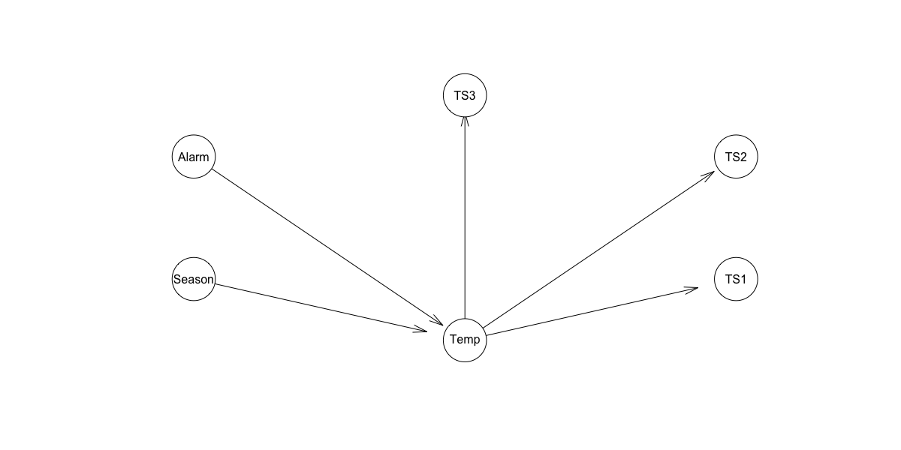

EM 알고리즘을 다시 돌려보자. 파라미터 값이 변하지는 않겠지만, 논리 구조를 더 강화시킬 수 있다.

```r
data_imputed_alarm = data_latent_alarm %>% 
  rowwise() %>% 
  mutate(Temp = mean(c(TS1, TS2, TS3))) %>% 
  as.data.frame()
```

```r
heat_alarm_model_alarm = parametric.em(heat_alarm_dag_alarm, data_latent_alarm, data_imputed_alarm, iter = 10)
```

`Alarm` 변수의 결과를 살펴보자

```r
heat_alarm_model_alarm$Alarm

#   Parameters of node Alarm (multinomial distribution)
# 
# Conditional probability table:
#   no yes 
#   1   0 
```

모든 경우에 대해서 알람이 울리지 않는 것으로 학습된 것을 볼 수 있다. 이제 전문 지식을 추가해볼 차례다. 우리는 전문가를 통해 해당 변수의 적당한 파라미터 값을 파악할 수 있었다.

> 시스템은 1/1000 의 확률로 오류가 발생할 수 있다. 그러한 경우에는 온도가 빠르게 10도 가량 상승한다.

전문 지식을 `Alarm` 변수에 반영해보자. `Temp` 변수에 추가적인 파라미터가 포함되어야 한다.

```r
cpt_alarm = coef(heat_alarm_model_alarm$Alarm)
# no yes 
#  1   0 

cpt_alarm[] = c(0.999, 0.001) # table class를 유지하기 위해 cpt_alarm[] 에 값을 대입

heat_alarm_model_alarm$Alarm = cpt_alarm
#   Parameters of node Alarm (multinomial distribution)
# 
# Conditional probability table:
#     no   yes 
# 0.999 0.001 
```

`Temp` 변수는 조금 더 복잡하다

```r
cgauss_temp = coef(heat_alarm_model_alarm$Temp)
#                    0   1        2   3        4   5        6   7
# (Intercept) 21.01192 NaN 21.16248 NaN 28.02392 NaN 16.68349 NaN

sd_temp = heat_alarm_model_alarm$Temp$sd
#        0        1        2        3        4        5        6        7 
# 4.372354      NaN 3.763531      NaN 2.448182      NaN 3.419937      NaN 

cgauss_temp[is.nan(cgauss_temp)] = cgauss_temp[!is.nan(cgauss_temp)] + 10
sd_temp[is.nan(sd_temp)] = sd_temp[!is.nan(sd_temp)]

heat_alarm_model_alarm$Temp = list(coef = cgauss_temp, sd = sd_temp)

#   Parameters of node Temp (conditional Gaussian distribution)
# 
# Conditional density: Temp | Alarm + Season
# Coefficients:
#                     0         1         2         3         4         5         6         7
# (Intercept)  21.01192  31.01192  21.16248  31.16248  28.02392  38.02392  16.68349  26.68349
# Standard deviation of the residuals:
#        0         1         2         3         4         5         6         7  
# 4.372354  4.372354  3.763531  3.763531  2.448182  2.448182  3.419937  3.419937  
# Discrete parents' configurations:
#    Alarm  Season
# 0     no    fall
# 1    yes    fall
# 2     no  spring
# 3    yes  spring
# 4     no  summer
# 5    yes  summer
# 6     no  winter
# 7    yes  winter
```

이제 이상치 탐지 기법이 포함된 완전한 모형이 완성되었다. 몇 가지 쿼리를 날려보자.

```r
e = list('Season' = 'winter', 'TS1' = 23, 'TS2' = 33, 'TS3' = 29)
query = cpquery(heat_alarm_model_alarm, event = (Alarm == 'yes'), evidence = e, method = 'lw', n = 100000)
mean(rep(query, 10000)) # [1] 0.228908
```

이 온도는 겨울치고는 너무 높기 때문에, 알람이 발생할 확률이 높게 계산된다.

```r
e2 = list('Season' = 'summer', 'TS1' = 23, 'TS2' = 33, 'TS3' = 29)
query2 = cpquery(heat_alarm_model_alarm, event = (Alarm == 'yes'), evidence = e2, method = 'lw', n = 100000)
mean(rep(query2, 10000)) # [1] 0
```

여름에는 잘 맞는 온도기 때문에 확률값이 0이 나왔다. 

# More Anomalies

각 센서별로 발생할 수 있는 오작동에 대한 모델링을 추가할 수 있다. 그러한 경우에는 온도가 특이한 날인지 기계가 오작동한 것인지 판단할 수 있어야 한다.

흔히 사용하는 방법은 각 센서에 대해서 오작동 여부에 대한 확률 분포를 나타내는 숨겨진 이산형 변수를 추가하는 것이다.

```r
# 새로 추가하는 변수
TS1_fault_states = list(No = 'No', Yes = 'Yes')

data_latent_ts1fault = data_latent_season %>% 
  mutate(Alarm = factor('no', levels = c('no', 'yes')),
         TS1Fault = factor('no', levels = c('no', 'yes'))) %>% 
  select(Alarm, Season, Temp, TS1Fault, TS1, TS2, TS3) %>% 
  as.data.frame()

data_imputed_ts1fault = data_latent_ts1fault %>% 
  rowwise() %>% 
  mutate(Temp = mean(c(TS1, TS2, TS3))) %>% 
  as.data.frame()

heat_alarm_dag_ts1fault = model2network('[Alarm][Season][TS1Fault][Temp|Season:Alarm][TS1|Temp:TS1Fault][TS2|Temp][TS3|Temp]')

plot(heat_alarm_dag_ts1fault)
```
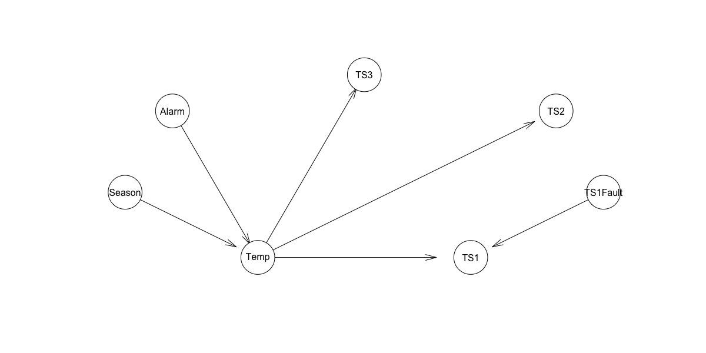

노드의 확률값을 수정하고 (`Alarm`과 `TS1Fault`) EM 알고리즘을 동작시켜보자. 관련된 도메인 지식이 추가로 필요하다. IoT 팀에 센서의 오차가 얼마나 되는지 문의했다. 다음과 같은 답변을 얻었다.

> 우리 센서는 좋기 때문에 거의 오류를 내지 않습니다. 테스터들은 1/1000 정도의 확률이라고 생각합니다.

괜찮은 것 같다. 새로 추가한 노드는 모형의 다른 부분에 노이즈를 발생시키지 않으면서 이상치를 탐지한다. 

```r
heat_alarm_model_alarm2 = parametric.em(heat_alarm_dag_ts1fault, data_latent_ts1fault, data_imputed_ts1fault, iter = 10)
cpt_alarm[] = c(0.999, 0.001)
heat_alarm_model_alarm2$Alarm = cpt_alarm
cgauss_temp = coef(heat_alarm_model_alarm2$Temp)
sd_temp = heat_alarm_model_alarm2$Temp$sd

cgauss_temp[is.nan(cgauss_temp)] = cgauss_temp[!is.nan(cgauss_temp)] + 10
sd_temp[is.nan(sd_temp)] = sd_temp[!is.nan(sd_temp)]

heat_alarm_model_alarm2$Temp = list(coef = cgauss_temp, sd = sd_temp)
```

```r
cpt_TS1_fault = coef(heat_alarm_model_alarm2$TS1Fault)

cpt_TS1_fault
# no yes 
#  1   0 

cpt_TS1_fault[] <- c(0.9999, 0.0001)
heat_alarm_model_alarm2$TS1Fault <- cpt_TS1_fault

heat_alarm_model_alarm2$TS1Fault
#   Parameters of node TS1Fault (multinomial distribution)
# 
# Conditional probability table:
#      no    yes 
# 0.9999 0.0001 
```

이제 TS1 노드에 확률 변수를 반영해야 한다. 분산이 큰 정규분포를 적용한다.

```r
cgauss_ts1 = coef(heat_alarm_model_alarm2$TS1)
#                      0   1
# (Intercept) -3.7039785 NaN
# Temp         0.9524747 NaN

sd_ts1 = heat_alarm_model_alarm2$TS1$sd
#          0          1 
# 0.08420779        NaN 
```

```r
cgauss_ts1[is.nan(cgauss_ts1)] = 0
sd_ts1[is.nan(sd_ts1)] = 100000

heat_alarm_model_alarm2$TS1 = list(coef = cgauss_ts1, sd = sd_ts1)

heat_alarm_model_alarm2$TS1
#   Parameters of node TS1 (conditional Gaussian distribution)
# 
# Conditional density: TS1 | Temp + TS1Fault
# Coefficients:
#                       0           1
# (Intercept)  -3.7039785   0.0000000
# Temp          0.9524747   0.0000000
# Standard deviation of the residuals:
#            0             1  
# 8.420779e-02  1.000000e+05  
# Discrete parents' configurations:
#    TS1Fault
# 0        no
# 1       yes
```

TS1 센서가 오작동하거나 이상한 신호가 잡히는 경우에 대해서 테스트해보자. TS1 센서만 온도가 높게 나온다면 fault node가 작동되어 이상 상황을 감지할 것이다.

```r
e_ts1_fault = list('Season' = 'winter', 'TS1' = 35, 'TS2' = 24, 'TS3' = 20)
query_ts1_fault = cpquery(heat_alarm_model_alarm2, event = Alarm == 'yes', evidence = e_ts1_fault, method = 'lw', n = 100000)
mean(rep(query_ts1_fault, 10000))
```
