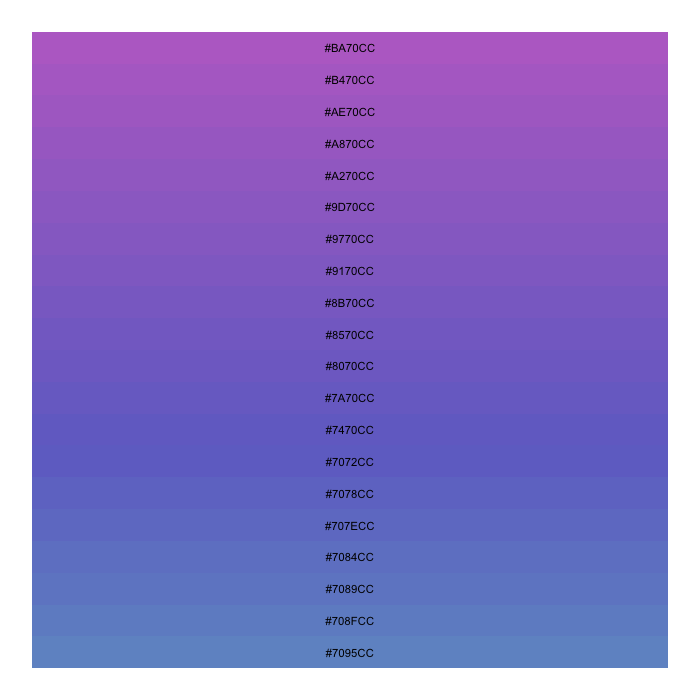

# Palette Generator

HSV 색체계에서 saturation과 value를 고정시키고 다양한 색상 팔레트를 추출한다.

- `N_COLORS` : 원하는 팔레트 색상 개수
- `HUE_RANGE` : Hue 범위 (min, max)
- `SATURATION` : 고정된 saturation 값
- `VALUE` : 고정된 Value 값

```r
library('ggplot2')

N_COLORS = 20
HUE_RANGE = c(0.6, 0.8)
SATURATION = 0.45
VALUE = 0.8

dd = data.frame(
  color = hsv(seq(HUE_RANGE[1], HUE_RANGE[2], length.out = N_COLORS), SATURATION, VALUE),
  x = 1,
  y = seq_len(N_COLORS)
)

ggplot(dd, aes(x = x, y = y, fill = color)) +
  geom_tile(stat = 'identity') +
  geom_text(aes(label = color), size = 3) +
  scale_fill_identity() +
  theme_void()
```



다음과 같이 색상값을 반환한다.

```r
paste("['", paste(dd$color, collapse = "','"), "']", sep='')
# ['#7095CC','#708FCC','#7089CC','#7084CC','#707ECC',
#  '#7078CC','#7072CC','#7470CC','#7A70CC','#8070CC',
#  '#8570CC','#8B70CC','#9170CC','#9770CC','#9D70CC',
#  '#A270CC','#A870CC','#AE70CC','#B470CC','#BA70CC'] 
```