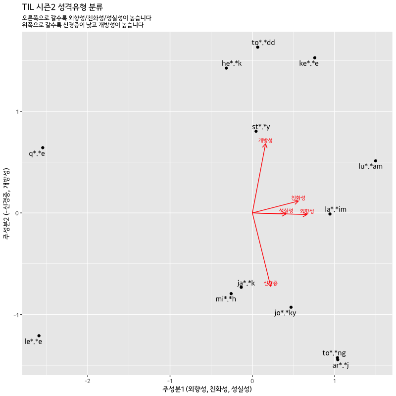

# Personality big5 검사결과에 PCA 적용하기

Personality big5 검사결과를 바탕으로 비슷한 유형의 사람들끼리 묶어보려고 한다. 
PCA를 적용하여 두 개의 주성분을 추출한 뒤, 2차원 평면에 그래프로 그려보았다.

```r
library('tidyverse')

#### Data ####
personality_big5 = tribble(
  ~name, ~extraversion, ~neuroticism, ~agreeableness, ~conscientiousness, ~exp_openness,
  'lu*.*am', 17,-4,10,4,5,
  'to*.*dd', 16,-4,0,-12,20,
  'la*.*im', 14,3,1,6,9,
  'to*.*ng', 12,7,6,5,-4,
  'ar*.*j',  11,7,5,8,-4,
  'jo*.*ky', 11,1,13,-11,-7,
  'ja*.*k',  5,2,10,-12,-3,
  'mi*.*h',  3,6,1,-2,3,
  'ke*.*e',  1,-14,14,11,4,
  'he*.*k', -1,-12,9,-1,6,
  'st*.*y', -2,-1,8,0,12,
  'q*.*e',  -7,-11,-7,-9,1,
  'le*.*e', -15,0,-6,-4,-8
)


#### PCA 적용 #### 
pca_personality = personality_big5[,2:6] %>% 
  { prcomp(~ ., data = ., scale = TRUE) }


#### Rotation Matrix ####
pca_personality_rotation = pca_personality$rotation[,1:2] %>% 
  as_data_frame() %>% 
  mutate(label = c('외향성', '신경증', '친화성', '성실성', '개방성'))

pca_personality_rotation
#         PC1         PC2  label
#       <dbl>       <dbl>  <chr>
# 1 0.6653561 -0.01581085 외향성
# 2 0.2223399 -0.72200736 신경증
# 3 0.5598009  0.11711130 친화성
# 4 0.4106625 -0.00996736 성실성
# 5 0.1607655  0.68164579 개방성

# PC1 : 외향성, 친화성, 성실성
# PC2 : -신경증, 개방성


#### 시각화 ####
personality_big5 %>% 
  mutate(pc1 = pca_personality$x[,1],
         pc2 = pca_personality$x[,2]) %>% 
  ggplot(aes(x = pc1, y = pc2)) +
    geom_point() +
    ggrepel::geom_text_repel(aes(label = name), 
                             family = 'Kakao') +
    geom_segment(data = pca_personality_rotation,
                 aes(x = 0, y = 0, xend = PC1, yend = PC2),
                 arrow = arrow(length = unit(0.1, 'inches')),
                 color = 'red') +
    geom_text(data = pca_personality_rotation,
              aes(x = PC1, y = PC2, label = label),
              color = 'red', family = 'Kakao', size = 3, vjust = -0.5) +
    xlab('주성분1 (외향성, 친화성, 성실성)') + 
    ylab('주성분2 (-신경증, 개방성)') +
    ggtitle('TIL 시즌2 성격유형 분류',
            subtitle = '오른쪽으로 갈수록 외향성/친화성/성실성이 높습니다\n위쪽으로 갈수록 신경증이 낮고 개방성이 높습니다') +
    theme_gray(base_family = 'Kakao')
```


