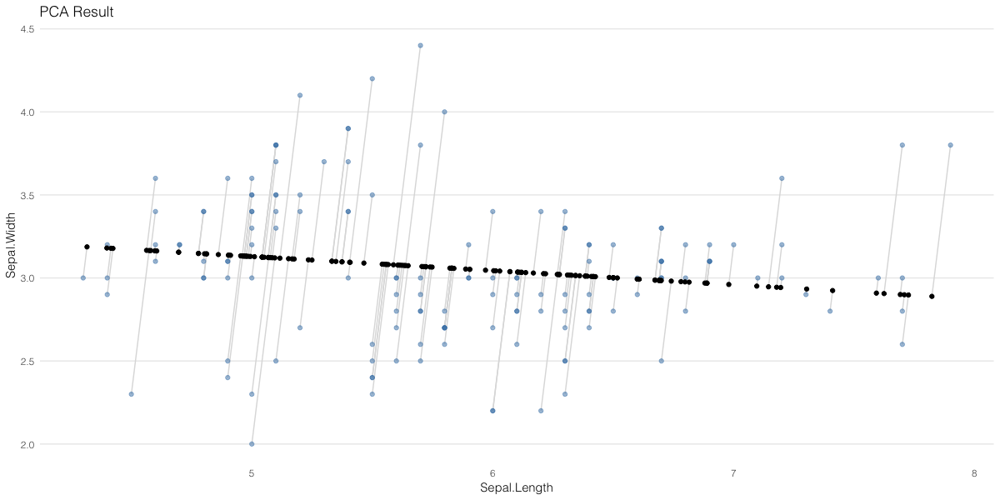
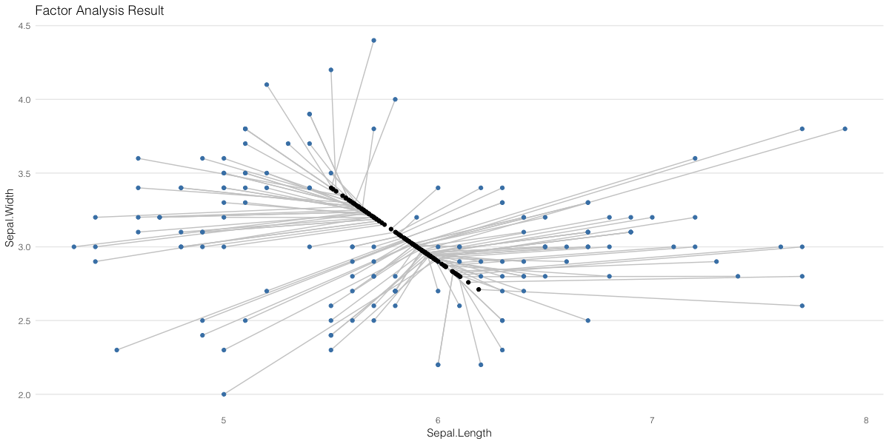

# PCA와 FA의 차이점 알아보기

PCA와 Factor Analysis는 둘 다 널리 사용되고 있는 차원축소 기법이다

- PCA, 특히 Probabilistic PCA의 경우 error term 이 `e ~ N(0, sigma^2 * I)` 를 따른다
    - 학습을 통해 sigma를 0에 가깝게 줄여나가면 PCA의 결과와 동일해진다
- 반면 FA의 경우 `e ~ N(0, D), 여기서 D는 Diagonal Matrix` 이다
    - D의 존재로 인해 PCA와는 달리 factor들이 서로 상관관계를 가질 수 있다 (독립이 아닐 수 있다)

두 방법론이 어떻게 다른 결과를 내는지 비교해보자.

각각의 방법론을 통해 Iris 데이터에서 2개의 차원을 1개로 축소시키고 결과를 살펴보자.

## R code

```r
library('tidyverse')
library('psych')

# PCA 적용
pca_iris = prcomp(iris[, 1:2])

# Factor Analysis 적용 (Minimum Residuals + Varimax Rotation)
fa_iris = fa(
  scale(iris[,1:2]), # Centered data
  nfactors = 1,      # Factor 개수
  rotate = 'varimax' # Rotation 방법은 varimax로 설정
)
```

## PCA

PCA는 분산이 가장 큰 방향을 축으로 잡는다. 따라서 FA에 비해 더 넓은 방향으로 퍼지는 것을 볼 수 있다.

여기서 error term은 첫 번째 주성분과 직교하는 방향으로만 구성되는 것을 볼 수 있다.

```r
iris %>%
  select(Sepal.Length, Sepal.Width) %>%
  # projection 결과를 바탕으로 원래의 2차원공간에 원복시킨다 (reconstruction)
  bind_cols(as_tibble(pca_iris$x[,1] %*% t(pca_iris$rotation[,1])) %>%
              select(PC1 = Sepal.Length, PC2 = Sepal.Width) %>%
              mutate(PC1 = PC1 + pca_iris$center[1],
                     PC2 = PC2 + pca_iris$center[2])) %>%
  ggplot(aes(x = Sepal.Length, y = Sepal.Width)) +
  geom_segment(aes(xend = PC1, yend = PC2), color = '#dddddd') +
  geom_point(color = 'steelblue', alpha = 0.5) +
  geom_point(aes(x = PC1, y = PC2), color = 'black') +
  ggtitle('Factor Analysis Result')
```



## Factor Analysis

PCA와는 달리 원에 가까운 error term 분포를 가진다.
따라서 PCA 처럼 projection 결과가 길게 퍼지지 않고 상대적으로 중앙에 몰려있는 것을 볼 수 있다.

```r
iris %>%
  select(Sepal.Length, Sepal.Width) %>%
  bind_cols(as_tibble(fa_iris$scores %*% t(fa_iris$loadings)) %>%
              select(PC1 = Sepal.Length, PC2 = Sepal.Width) %>%
              mutate(PC1 = PC1 + mean(iris$Sepal.Length),
                     PC2 = PC2 + mean(iris$Sepal.Width))) %>%
  ggplot(aes(x = Sepal.Length, y = Sepal.Width)) +
  geom_segment(aes(xend = PC1, yend = PC2), color = '#cccccc') +
  geom_point(color = 'steelblue') +
  geom_point(aes(x = PC1, y = PC2), color = 'black') +
  ggtitle('Factor Analysis Result')
```


