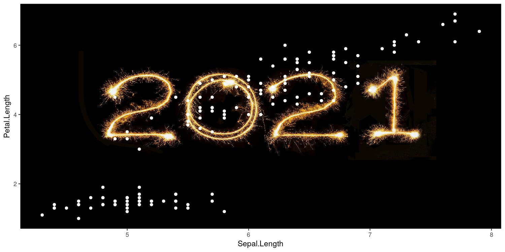

# ggplot2 그래프에 배경 이미지 추가하기

- jpeg 등 이미지를 그래프에 배경으로 추가하려면 어떻게 해야할까?
    1. `jpeg::readJPEG` 등 파일 포맷에 맞는 그래픽 디바이스로 이미지를 불러온다
    2. `ggplot2::annotation_raster` 를 통해 그래프 영역에 이미지를 추가한다

```r
library(ggplot2)

# native=TRUE 옵션을 추가하지 않으면 메모리 소비량이 엄청나게 늘어난다
bg_image <- jpeg::readJPEG('~/myroom/unsplash_2021.jpg', native = TRUE)

p <- ggplot(iris, aes(x = Sepal.Length, y = Petal.Length)) +
  annotation_raster(bg_image, -Inf, Inf, -Inf, Inf) +
  geom_point(color = '#FFFFFF')

ggsave('plot.png', p, device = 'jpeg', dpi = 150, width = 10, height = 5)
```



# 참고자료

- [How to add a background image to ggplot2 graphs](https://www.r-bloggers.com/2016/10/how-to-add-a-background-image-to-ggplot2-graphs/)
- [Stackoverflow | Inserting an image to ggplot2](https://stackoverflow.com/a/66220111)
