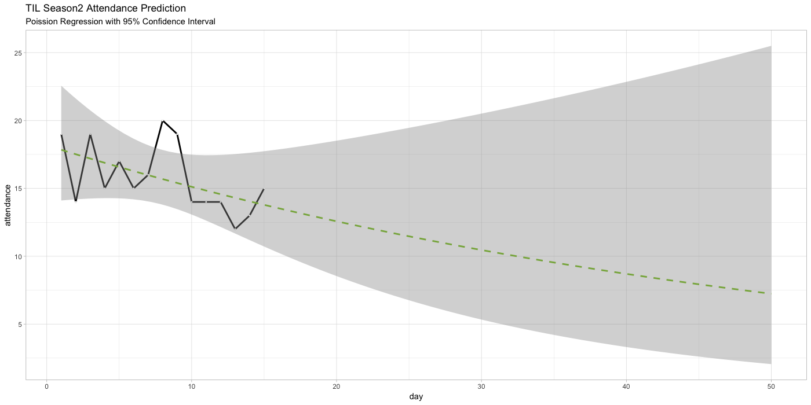

# TIL 시즌2 출석수 예측

엑셀에서 추세선을 그릴 경우 일반 linear regression을 이용하여 그린다. 이 경우 Day15 기준으로 63일쯤 되면 출석수가 0보다 작아지도록 학습이 이루어진다. 이것은 학습하는 데이터가 0보다 크거나 같은 count 값이라는 제약조건이 반영되지 않았기 때문에 발생하는 문제이다.

일반적인 형태의 Linear Regression 대신 Poisson Regression을 적용하여 데이터의 특성에 맞는 모형을 구성해보자.

`glm` 함수를 직접 적용하는 대신 ggplot2의 `geom_smooth()` 함수에서 glm과 관련된 옵션을 수정하는 방식으로 적용한다. `method.args` 항목에 `glm` 함수가 데이터를 학습하기 위해 필요한 인자들을 list 형태로 제공하면 된다. 

기본적으로 `geom_smooth()` 를 사용하게 되면 day 1부터 15까지에 해당되는 구간에 대해서만 추세선을 그리게 된다. 50일까지의 예측을 확인하기 위해서 다음과 같이 수정한다.

- `xlim(1,50)` 을 적용하여 그래프에서 표시하는 X축 범위를 명시한다
- `geom_smooth()` 함수에 `fullrange = TRUE` 옵션을 적용한다

```r
library('tidyverse')

# 15일까지의 출석수
attendance = c(19,14,19,15,17,15,16,20,19,14,14,14,12,13,15)

# 데이터프레임 구성
df_attendance = data_frame(
  day = seq_along(attendance),
  attendance = attendance
)

# Fitting된 결과를 그래프에 반영
ggplot(df_attendance, aes(x = day, y = attendance)) +
  geom_line(size = 1) +
  geom_point(size = 0.3, color = 'white') +
  geom_smooth(method = 'glm', method.args = list(family = 'poisson'), 
              color = '#88B04B', linetype = 2, fullrange = TRUE) +
  xlim(1, 50) +
  ggtitle('TIL Season2 Attendance Prediction',
          subtitle = 'Poission Regression with 95% Confidence Interval') +
  theme_light()
```

