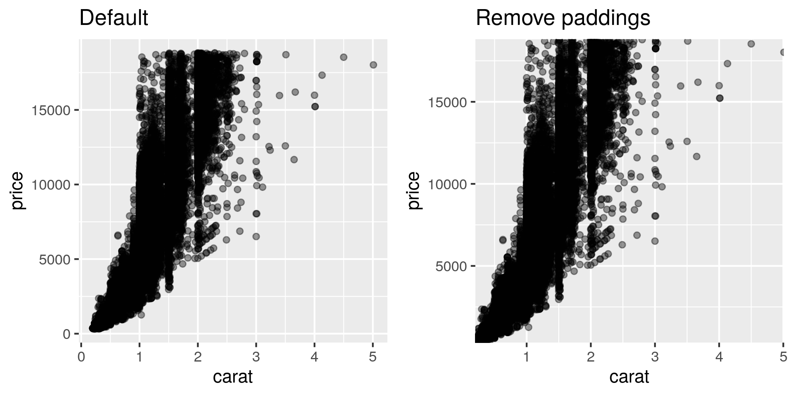

# ggplot2 scale "expand" 옵션 조정하기

- ggplot2 에서는 데이터가 축으로부터 일정 거리 이상 떨어지는 것을 보장할 수 있도록 padding 값을 추가한다
- 이 값을 조정해야 하는 경우, scale에서 expand 관련 옵션을 조정해야 한다
- 다음과 같은 경우 사용한다
    - 그래프 영역이 좌측 하단이 정확히 (0,0) 좌표가 되었으면 좋겠다
    - 데이터와 상관없이 축으로부터 데이터의 거리를 조정하고자 한다

```r
library(ggplot2)

p1 <- ggplot(diamonds, aes(x = carat, y = price)) +
  geom_point(alpha = 0.4) +
  ggtitle('Default')

p2 <- ggplot(diamonds, aes(x = carat, y = price)) +
  geom_point(alpha = 0.4) +
  scale_x_continuous(expand = c(0, 0)) +
  scale_y_continuous(expand = c(0, 0)) +
  ggtitle('Remove paddings')

# ggsave('ggplot2_scale_expand_continuous.png', 
#        gridExtra::grid.arrange(p1, p2, ncol = 2),
#        device = ragg::agg_png(width = 1000, height = 500, res = 150))
```



```r
p3 <- ggplot(diamonds, aes(x = cut)) +
  geom_bar() +
  ggtitle('Default')

p4 <- ggplot(diamonds, aes(x = cut)) +
  geom_bar() +
  scale_x_discrete(expand = c(0, 0)) +
  scale_y_discrete(expand = c(0, 0)) +
  ggtitle('Remove paddings')

# ggsave('ggplot2_scale_expand_discrete.png', 
#        gridExtra::grid.arrange(p3, p4, ncol = 2),
#        device = ragg::agg_png(width = 1000, height = 500, res = 150))
```


# 참고자료

- [StackOverflow | Force the origin to start at 0](https://stackoverflow.com/a/61437896)
- [ggplot2 | Position scales for continuous data (x & y)](https://ggplot2.tidyverse.org/reference/scale_continuous.html)
