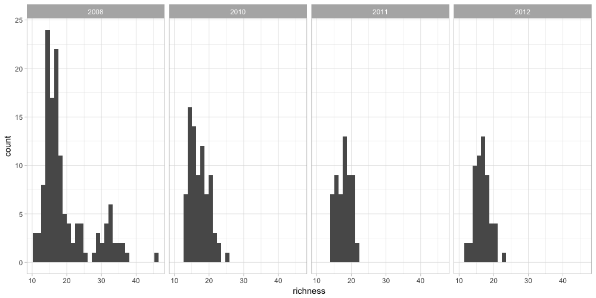
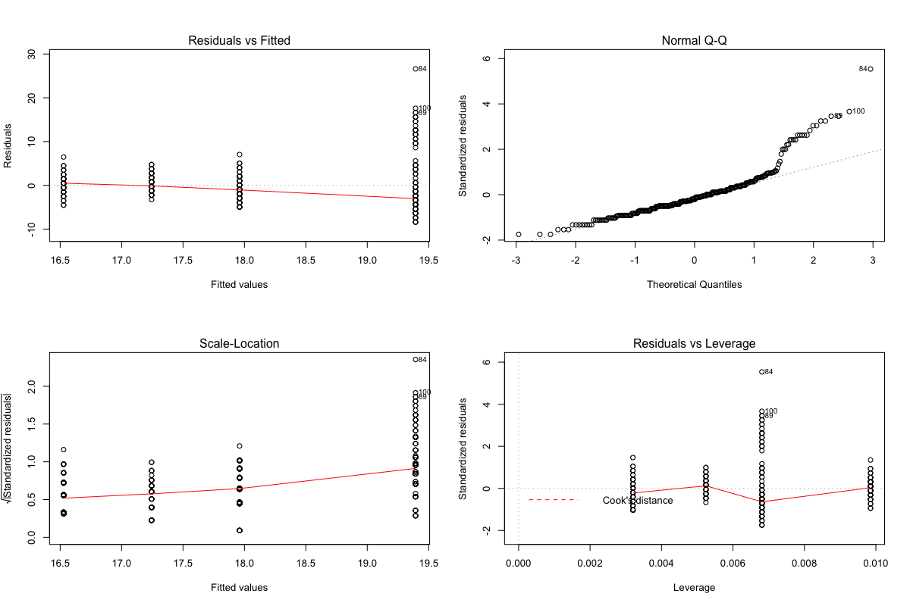

# Intro to Model Design

다음 포스팅을 요약해서 정리한다 

<https://ourcodingclub.github.io/2018/04/06/model-design.html>

## 1. 통계적 모형 (Statistial Model) 이란 무엇인가?

우리가 해결해야 하는 문제를 위해서 데이터 사이의 관계에 대한 통계적인 검정을 필요로 할 때가 있다. 데이터의 구조에 맞게 모형을 구성하고, 해당 모형을 통해 우리의 가설을 테스트해본다. 따라서 모든 데이터 분석에서 가장 먼저 해야하는 것은 문제(질문)를 명확하게 하는 것이다. 

## 2. 해결하려는 문제 (Research Question)

여기서는 [Toolik Lake Field Station](http://arc-lter.ecosystems.mbl.edu/terrestrial-data) 데이터를 사용해서 튜토리얼을 진행할 것이다. 이 데이터는 알래스카 북부의 툰드라 지역의 5군데 장소에 대해서 4년간 식생구성의 변화를 수집한 결과이다. 간단한 질문을 몇 가지 던져보자.

### - 문제 1 : 종풍부도(Species Richness)가 시간에 따라 어떻게 변화하는가?

문제를 정의했으면 가설을 세워야 한다. 가설을 수립하기 위해서는 이 시스템 자체에 대해서 이해할 필요가 있다. 여기서는 가설을 미리 제시해보려고 한다. 종풍부도가 시간에 따라 증가한다고 가정해보자. 툰드라 지역이 온난화를 겪고 있고, 온난화 현상으로 인해 종풍부도가 증가할 것이라고 예상해 볼 수 있다.

> 가설1: Toolik Lake의 종풍부도가 시간이 지남에 따라 증가할 것이다

이제 가설을 세웠으니 귀무가설(Null Hypothesis)에 대해서도 정리해보면 좋겠다. 우리가 비교하려는 가설은 무엇일까??

> 귀무가설 : Toolik Lake의 종풍부도는 시간에 따라 변하지 않는다

또 다른 가설을 세워 볼 수도 있다

> 가설2: Toolik Lake의 종풍부도가 시간이 지남에 따라 감소할 것이다

Toolik Lake Station은 알래스카에 있다. 이 지역은 전세계에서 온난화 현상이 가장 두드러지게 나타나는 곳이다. 따라서 온도의 변화가 식생 분포에 어떤 영향을 미칠지 궁금해질 수 있다. 따라서 다음 질문을 추가로 던져보자.

### - 문제 2 : 연간 평균온도의 변화가 종풍부도에 어떤 영향을 미치는가?

> 가설1: 높은 기온이 높은 종풍부도와 연관이 있을 것이다.

**문제1과 문제2는 어떻게 다른걸까?**

- Detection Model
    - 변화를 감지하는데 관심이 있다
    - *종풍부도가 시간에 따라 어떻게 변하는가?*
    - 왜 변화가 생기는지에 대해서는 검증하지 않는다
- Attribution Model
    - 변화의 주된 요인을 찾으려 한다 (여기서는 온도)
    - 보통 Detection Model의 다음 단계 모형이 된다
    - 무슨일이 일어나는지 알았으니, 왜 일어나는지 파악한다

지금은 이 정도면 모델링을 진행하는데 문제가 없어 보인다. 하지만 앞으로도 **분석을 할 때는 꼭 질문을 던지는 것으로 시작하자**

## 3. 데이터에 대해 살펴보자

```r
# install.packages(c('lme4', 'stargazer', 'MCMCvis', 'MCMCglmm', 'sjPlot'))
toolik_url = 'https://raw.githubusercontent.com/ourcodingclub/CC-model-design/master/toolik_plants.csv'
toolik_plants = read_csv(toolik_url)
```

불필요한 `Species` 항목을 제거한다

```r
species_to_remove = c("Woody cover","Tube","Hole","Vole trail","removed",
                      "vole turds","Mushrooms", "Water","Caribou poop", "Rocks",
                      "mushroom", "caribou poop","animal litter","vole poop",
                      "Vole poop","Unk?")

fltd_toolik_plants = toolik_plants %>% 
  filter(!Species %in% species_to_remove)
```

연도별로 종풍부도의 분포를 확인해보자

```r
richness_toolik = fltd_toolik_plants %>% 
  group_by(Year, Site, Block, Plot) %>% 
  summarise(richness = n_distinct(Species)) %>% 
  ungroup

richness_toolik %>% 
  ggplot(aes(x = richness)) +
    geom_histogram() +
    facet_wrap(~ Year, ncol = 4) +
    theme_light()
```



`Relative.Cover` 변수는 0부터 1 사이의 값으로 되어있으며, 0에 가까운 값으로 몰려있다. 이러한 특성은 모델링 과정에 반영할 수 있다.

```r
fltd_toolik_plants %>% 
  ggplot(aes(x = Relative.Cover)) +
    geom_histogram() +
    theme_light()
```


## 4. 실험설계에 대해 살펴보자

Toolik 데이터에는 다양한 시간대와 공간이 뒤섞여있다. 공간은 세 가지 위계가 있다. 각 site 안에는 여러 개의 block이 있고, 각 block에는 plot이 8개씩 존재한다. 시간대는 해당 식물종이 기록된 연도를 말하며, 4년 단위로 구분되어 있다.

어떤 것들을 더 고민해야 할까??

- **Spatial Autocorrelation** : 공간의 자기상관
    - 가까운 지역과는 식생, 온도 등 환경이 비슷할 것이다
- **Temporal Autocorrelation** : 시간의 자기상관
    - 2000년의 지표와 2001년의 지표가 비슷할 것이다

## 5. 모형을 구성해보자

> 종풍부도가 시간에 따라 어떻게 변화하는가?

여기서 독립변수와 종속변수가 무엇일까? 우리의 모형을 말로 표현하면 다음과 같다.

**종풍부도는 시간에 대한 함수이다**

R 코드로는 다음과 같이 표현할 수 있다: `Richness ~ Time`

여기서 종속변수는 `Richness` 이고, `Time`이 독립변수이다. 이것이 우리의 기본 모형이다. 더 고려할 만한 것이 있을까? 다른 변수를 고려하지 않고 시간에 대한 함수로만 정의한다면 어떻게 될까??

## 6. 다른 종류의 모형에 대해서도 알아보자

모형과 관련해서 고민해 볼 점들에 대해 살펴보자

- 선형모형 안에 존재하는 연속형 변수와 범주형 변수는 어떻게 다른가?
- 모형 안에 변수는 몇 개까지 포함시킬 수 있을까?
- fixed effect와 random effect는 무엇일까?
- 모형의 결과물에서 가장 중요한 결론은 무엇일까?
- 모형의 종류를 결정하는 것이 왜 중요할까?

## 7. General Linear Models

랜덤효과가 없는 모형을 한 번 구성해보자. 

```{r}
plant_m = lm(richness ~ I(Year - 2017), data = richness_toolik)
summary(plant_m)

# Call:
# lm(formula = richness ~ I(Year - 2017), data = richness_toolik)
# 
# Residuals:
#     Min      1Q  Median      3Q     Max 
# -8.3932 -2.9606 -0.9606  1.4720 26.6068 
# 
# Coefficients:
#                Estimate Std. Error t value Pr(>|t|)    
# (Intercept)     12.9464     1.2880  10.051  < 2e-16 ***
# I(Year - 2017)  -0.7163     0.1727  -4.148 4.29e-05 ***
# ---
# Signif. codes:  0 ‘***’ 0.001 ‘**’ 0.01 ‘*’ 0.05 ‘.’ 0.1 ‘ ’ 1
# 
# Residual standard error: 4.821 on 322 degrees of freedom
# Multiple R-squared:  0.05073,	Adjusted R-squared:  0.04779 
# F-statistic: 17.21 on 1 and 322 DF,  p-value: 4.289e-05
```

### - 가정

위 모형에는 다음과 같은 가정이 포함되어 있다.

- 데이터는 정규분포를 따른다
- 각 데이터는 서로 독립적이다
- 두 변수의 관계는 선형적이다

이것 말고도 추가적인 가정이 더 필요하다. **방금 나열한 가정들이 우리가 분석하려는 데이터에 맞는다고 생각하는가? 아마도 아닐 것이다.** 위에서 히스토그램을 통해 **데이터가 정규분포를 따르지 않는다**는 것을 확인했다. 또한 `richness` 변수는 정수값이다. 따라서 종의 숫자가 엄청나게 많아지지 않는 이상 0에 치우쳐 있는 형태를 보일 것이다. 이러한 이유로 정규분포보다는 포아송 분포를 사용하는 것이 더 적절할 것이다.

게다가 **데이터도 서로 독립적이지 않다**는 것을 알고 있다. 인접한 지역의 종풍부도는 서로 독립적이지 않을 것이다. plot, block, site에 따른 영향을 고려하지 않는다면, 데이터의 구조를 무시하고 잘못된 결론을 내리게 될 수 있다.

### - 모형의 수렴

모형이 수렴했는지 여부는 1) 모형이 잘 동작하는지, 2) 반응변수를 잘 예측했는지, 3) 모형을 뒷받침하는 이론이 잘 동작했는지를 나타낸다. 모형이 복잡해지면 이론이 가진 한계점에 가까워져서 문제가 발생할 수 있다. 따라서 모형이 잘 동작했는지 확인하고, 도출한 값이 실제 데이터와 우리의 가설에 잘 부합하는지 확인하는 것이 중요하다. 

모형의 수렴을 확인하는 작업은 여러 가지 방식으로 이루어질 수 있다. parametric 모형에서는 잔차와 예측값부터 확인해보는 것이 좋다. 베이지안 방법론에서는 모형의 수렴여부를 판단하기 위한 다양한 그래프와 통계량이 존재한다.

여기서는 선형모형의 잔차와 예측값을 비교해보는 그래프를 그려보자. `plot()` 함수로 다음과 같은 그래프를 확인해볼 수 있다.

- 잔차와 예측값 비교 (Residuals vs Fitted)
- 표준화된 잔차에 대한 Q-Q plot (Normal Q-Q)
- 표준화된 잔차의 제곱근과 예측값 비교 (Scale-Location)
- 잔차와 레버리지 비교 (Residuals vs Leverage)

```r
plot(plant_m)
```



# 8. lme4를 이용한 계층 모형

계층 모형(hierarchical model)으로 이어지는 아이디어들을 살펴보았다. 이제 계층 구조를 모형에 포함시킬 때와 그렇지 않을 때 모형이 어떻게 달라지는지 살펴보자.

먼저 `Site`를 랜덤 효과로 두고 모델링해보자. 이 모형은 시간에 따른 구분이나 Site 내에 블록들이 있고 그 밑에 plot이 존재한다는 사실은 반영하지 않는다.

```r
plant_m_plot = lme4::lmer(richness ~ I(Year-2007) + (1|Site), data = richness_toolik)
summary(plant_m_plot)

# Linear mixed model fit by REML ['lmerMod']
# Formula: richness ~ I(Year - 2007) + (1 | Site)
#    Data: richness_toolik
# 
# REML criterion at convergence: 1396.2
# 
# Scaled residuals: 
#     Min      1Q  Median      3Q     Max 
# -2.3420 -0.6082 -0.0869  0.6084  6.6857 
# 
# Random effects:
#  Groups   Name        Variance Std.Dev.
#  Site     (Intercept) 52.304   7.232   
#  Residual              3.975   1.994   
# Number of obs: 324, groups:  Site, 5
# 
# Fixed effects:
#                Estimate Std. Error t value
# (Intercept)     21.0066     3.2429   6.478
# I(Year - 2007)  -0.5335     0.0914  -5.837
# 
# Correlation of Fixed Effects:
#             (Intr)
# I(Yer-2007) -0.060
```

`summary()` 함수를 통해 **효과 크기 (effect size)**를 확인할 수 있다. 이것이 우리 모형의 핵심적인 결과물이다. 우리가 확인하려는 변수들간의 관계가 얼마나 강한지 알 수 있다. 우리는 여전히 다양한 블럭과 플랏에 대해서는 고려하지 않고 있기 때문에, 점차 변수를 추가해보고 어떻게 변하는지 살펴보자.

```r
plant_m_plot2 = lme4::lmer(richness ~ I(Year-2007) + (1|Site/Block), 
                           data = richness_toolik)
summary(plant_m_plot2)

# Linear mixed model fit by REML ['lmerMod']
# Formula: richness ~ I(Year - 2007) + (1 | Site/Block)
#    Data: richness_toolik
# 
# REML criterion at convergence: 1316.5
# 
# Scaled residuals: 
#     Min      1Q  Median      3Q     Max 
# -2.4835 -0.6368 -0.0059  0.6009  7.6346 
# 
# Random effects:
#  Groups     Name        Variance Std.Dev.
#  Block:Site (Intercept)  1.383   1.176   
#  Site       (Intercept) 51.117   7.150   
#  Residual                3.165   1.779   
# Number of obs: 316, groups:  Block:Site, 17; Site, 5
# 
# Fixed effects:
#                Estimate Std. Error t value
# (Intercept)    21.12939    3.21752   6.567
# I(Year - 2007) -0.56398    0.08215  -6.865
# 
# Correlation of Fixed Effects:
#             (Intr)
# I(Yer-2007) -0.055
```

모형이 바뀌면서 효과 크기가 얼마나 변했을까??

```r
plant_m_plot3 = lme4::lmer(richness ~ I(Year-2007) + (1|Site/Block/Plot), 
                           data = richness_toolik)
summary(plant_m_plot3)

# Linear mixed model fit by REML ['lmerMod']
# Formula: richness ~ I(Year - 2007) + (1 | Site/Block/Plot)
#    Data: richness_toolik
# 
# REML criterion at convergence: 1316.4
# 
# Scaled residuals: 
#     Min      1Q  Median      3Q     Max 
# -2.4290 -0.6176 -0.0219  0.5812  7.4664 
# 
# Random effects:
#  Groups            Name        Variance Std.Dev.
#  Plot:(Block:Site) (Intercept)  0.1267  0.3559  
#  Block:Site        (Intercept)  1.3796  1.1746  
#  Site              (Intercept) 51.1215  7.1499  
#  Residual                       3.0502  1.7465  
# Number of obs: 316, groups:  Plot:(Block:Site), 136; Block:Site, 17; Site, 5
# 
# Fixed effects:
#                Estimate Std. Error t value
# (Intercept)    21.12750    3.21753   6.566
# I(Year - 2007) -0.56322    0.08078  -6.973
# 
# Correlation of Fixed Effects:
#             (Intr)
# I(Yer-2007) -0.054
```

마지막 모형은 데이터의 계층 관계까지 고려한, 시간에 따른 종풍부도의 변화를 나타낸다. `sjPlot` 라이브러리를 이용해 결과물을 시각화해보자.
