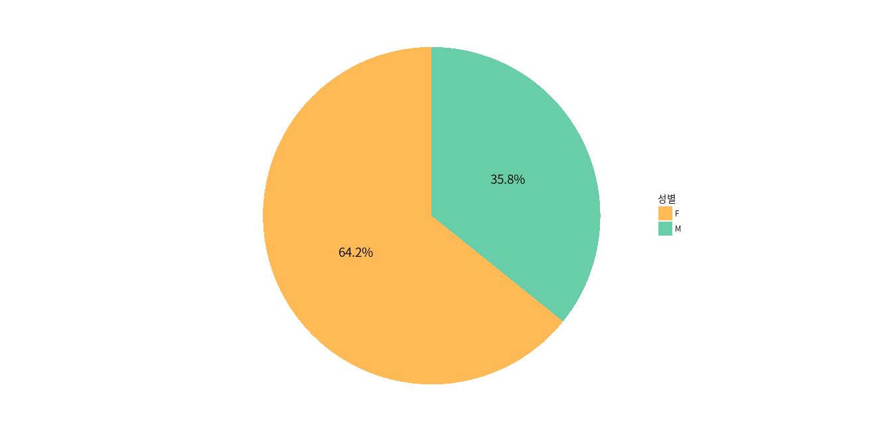

# R ggplot2에서 파이차트 그리기

기본적으로는 막대그래프에 좌표계를 polar coornidate로 설정해서 만든다

```r
data = gift_demo %>% 
  filter(!is.na(age_band), age_band > 0) %>% 
  group_by(gender) %>% 
    summarise(user_cnt = sum(user_cnt)) %>% 
  ungroup %>% 
  mutate(ratio = scales::percent(user_cnt / sum(user_cnt)))

data
#         A tibble: 2 x 3
#   gender user_cnt ratio
#   <chr>     <dbl> <chr>
# 1 F      2629599. 64.2%
# 2 M      1465150. 35.8%
```

```r
ggplot(data, aes(x = factor(1), y = user_cnt, fill = gender)) +
    geom_col(width = 1) +
    geom_text(aes(label = ratio), position = position_stack(vjust = 0.5),
              family = 'Noto Sans CJK KR', size = 5) +
    scale_fill_manual(values = c('#FFBA55', '#67CEA9')) +  
    xlab('') + ylab('') +
    labs(fill = '성별') +
    coord_polar(theta = 'y') +
    theme_minimal(base_family = 'Noto Sans CJK KR') +
    theme(panel.grid = element_blank(),
          axis.text = element_blank(),
          axis.ticks = element_blank())
```

결과물


