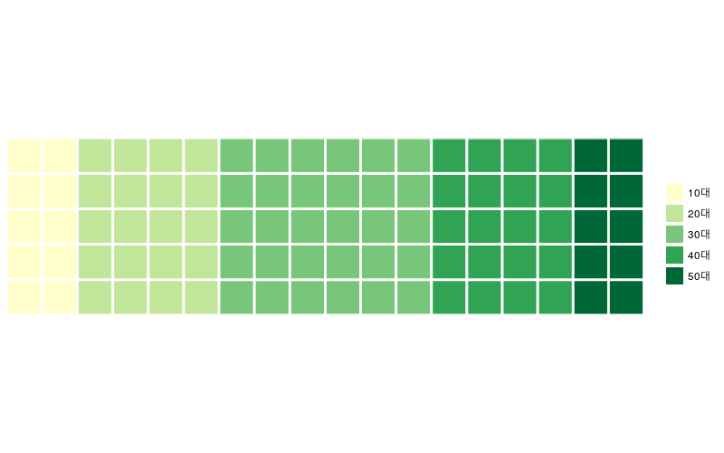

# 와플 차트

R에서 와플차트를 그리기 위한 라이브러리가 존재한다

<https://github.com/hrbrmstr/waffle>

```r
# 샘플 데이터
sample = c(`10대` = 10, `20대` = 20, `30대` = 30, `40대` = 20, `50대` = 10)

# 와플 차트
waffle::waffle(
    sample, 
    rows = 5, 
    size = 1,
    colors = RColorBrewer::brewer.pal(length(sample), 'YlGn')
)
```


